<div align="center">


<br>
Universidad Peruana de Ciencias Aplicadas
<br>
Facultad de Ingeniería
<br>
Carrera de Ingeniería de Software
<br>

**1ASI0729**
<br>
**Desarrollo de Aplicaciones Open Source**
<br>
NRC
<br>
**11896**
<br>
**Informe de Trabajo Final**
<br>
Docente
<br>
**Bautista Ubillús, Efraín Ricardo**
<br>
Equipo
<br>
**FiveTech**

<br>

Proyecto
<br>
**SafeRoute**

<br><br><br><br><br>

**Integrantes**

<table border="0" style="border-collapse: collapse; border: none; margin: 0 auto;">
  <tr style="border: none;">
    <td style="border: none; text-align: center; padding: 5px 15px;">U201717085</td>
    <td style="border: none; text-align: left; padding: 5px 15px;">Revilla Quispe, Renzo Zamir</td>
  </tr>
  <tr style="border: none;">
    <td style="border: none; text-align: center; padding: 5px 15px;">U20241D922</td>
    <td style="border: none; text-align: left; padding: 5px 15px;">Quispe Serrano, Julio Frank</td>
  </tr>
  <tr style="border: none;">
    <td style="border: none; text-align: center; padding: 5px 15px;">U202316852</td>
    <td style="border: none; text-align: left; padding: 5px 15px;">Ortega Quintana, José Zacarias</td>
  </tr>
  <tr style="border: none;">
    <td style="border: none; text-align: center; padding: 5px 15px;">U202424059</td>
    <td style="border: none; text-align: left; padding: 5px 15px;">De la Cruz De los Santos, Mathias Marcelo</td>
  </tr>

</table>

<br><br><br><br><br><br><br><br><br><br>

**Período 202610**
<br>

**Julio, 2026**
<br><br>

</div>


---

## Registro de Versiones del Informe

| Avance | Fecha | Autor | Descripción de Modificación |
|---|---|---|---|
| AV1 | 25/04/2026 | Revilla Quispe, Renzo Zamir; Quispe Serrano, Julio Frank; Ortega Quintana, José Zacarias; De La Cruz De Los Santos, Mathias Marcelo | Se desarrolló la primera versión del informe del proyecto SafeRoute, incorporando la carátula, tabla de contenidos, registro inicial de versiones, Project Report Collaboration Insights, Student Outcome y los capítulos correspondientes a introducción, Lean UX, segmentos objetivo, análisis de competidores, entrevistas, Needfinding, User Personas, User Task Matrix, User Journey Mapping, Empathy Mapping, Big Picture Event Storming, Ubiquitous Language, User Stories, Impact Mapping, Product Backlog, diseño visual, arquitectura de software, diagramas C4, diagramas de clases, diseño de base de datos, configuración de desarrollo y evidencias iniciales de implementación. Asimismo, se desarrolló y desplegó la primera versión del Landing Page, presentando el modelo de negocio, propuesta de valor y Call-To-Action de SafeRoute. |
| TB1 | 15/05/2026 | Revilla Quispe, Renzo Zamir; Quispe Serrano, Julio Frank; Ortega Quintana, José Zacarias; De La Cruz De Los Santos, Mathias Marcelo | Se levantaron observaciones recibidas en AV1. Se ajustó la redacción del Lean UX Problem Statement, Assumptions e Hypothesis Statements, evitando formulaciones condicionales y reforzando la relación entre usuarios, beneficios y resultados medibles. Se corrigió la nomenclatura de Technical Stories utilizando el prefijo TS, se mejoraron los artefactos de Needfinding y se reforzó la trazabilidad entre User Personas, User Stories, Product Backlog y alcance del producto. A nivel de arquitectura, se revisaron los modelos C4, bounded contexts, diagramas de clases, eventos del Event Storming en tiempo pasado y organización de dependencias. Asimismo, se documentó el Sprint 2, se integraron tareas transversales de despliegue y se fortalecieron las evidencias de colaboración mediante GitHub y herramientas de gestión ágil. |
| AV2 | 20/06/2026 | Revilla Quispe, Renzo Zamir; Quispe Serrano, Julio Frank; Ortega Quintana, José Zacarias; De La Cruz De Los Santos, Mathias Marcelo | Se desarrolló el Sprint Review correspondiente al Sprint 3, incorporando la implementación de Web Services RESTful para SafeRoute. A nivel técnico, el equipo avanzó en la construcción del backend con Spring Boot, aplicando una arquitectura modular basada en principios de Domain-Driven Design. Se implementaron aggregates, commands, repositories, servicios de aplicación, controladores REST y configuraciones de persistencia para los bounded contexts principales. También se documentó el API mediante Swagger UI, se mantuvo desplegada la Web Application y se incorporaron evidencias de ejecución, desarrollo, servicios y despliegue. Además, se elaboraron entrevistas de validación, evaluaciones heurísticas, About-the-Product y About-the-Team. Finalmente, se recibieron observaciones relacionadas con la carátula, el video de exposición, las entrevistas de validación y la comunicación escrita, las cuales fueron consideradas para la siguiente iteración. |
| TB2 | 05/07/2026 | Revilla Quispe, Renzo Zamir; Quispe Serrano, Julio Frank; Ortega Quintana, José Zacarias; De La Cruz De Los Santos, Mathias Marcelo | Se consolidó la versión final del informe y del producto SafeRoute. Se corrigieron las observaciones recibidas en AV2, incluyendo el nombre del equipo en la carátula, el uso correcto de “Período”, la actualización del video de exposición, la mejora del About-the-Product Video y el fortalecimiento de las evidencias de validación. A nivel técnico, se completó la implementación de los bounded contexts definidos para el sistema: Identity and Access Management, Subscription and Plan Management, Stakeholder Management, Fleet and Route Management, Trip Execution and Monitoring, Notifications y Organizations. Además, se eliminó por completo el uso de Mock API / JSON Server y se integró la Web Application con el RESTful API real desplegado en Azure. Se actualizó la documentación de servicios mediante Swagger UI, se registraron evidencias de despliegue del frontend en Azure Static Web Apps y del backend en Azure App Service, y se completaron las secciones de Sprint 4: Planning, Backlog, Development Evidence, Execution Evidence, Services Documentation Evidence, Software Deployment Evidence y Team Collaboration Insights. |

---


## Project Report Collaboration Insights

El equipo ha utilizado un flujo de trabajo en github: [https://github.com/FiveTech-NRC11896/SafeRoute-report](https://github.com/FiveTech-NRC11896/SafeRoute-report)

### Sprint 1


### Sprint 2

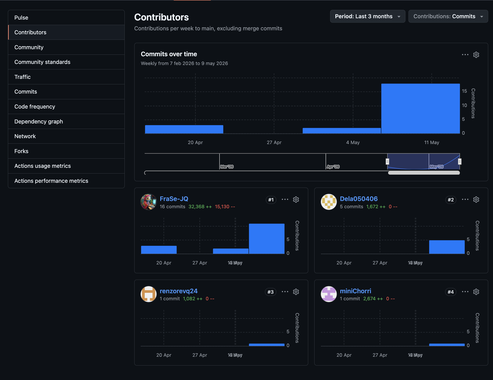

### Sprint 3

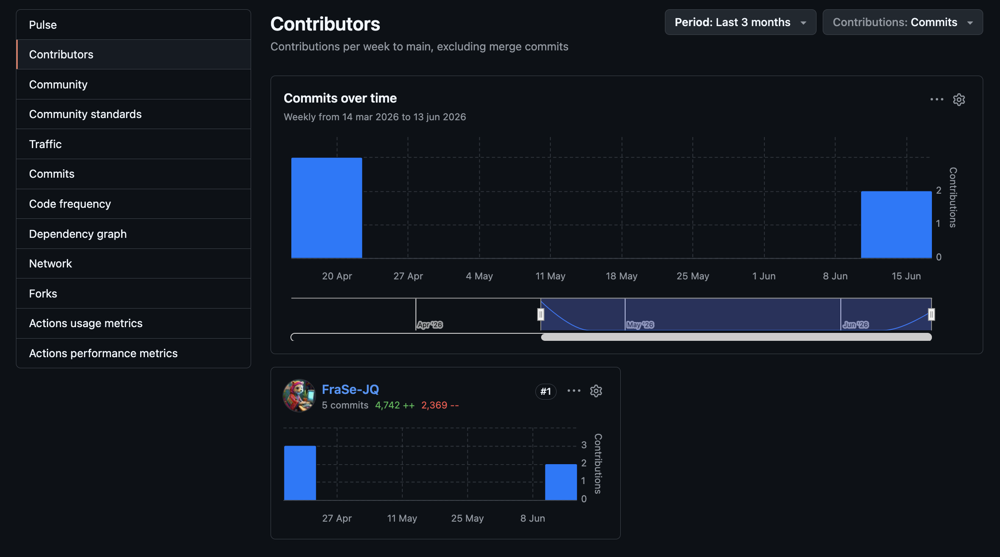

### Sprint 4


---

## Tabla de contenidos

- [Registro de Versiones del Informe](#registro-de-versiones-del-informe)
- [Student Outcome](#student-outcome)
- [Project Report Collaboration Insights](#project-report-collaboration-insights)
  - [Sprint 1](#sprint-1)
  - [Sprint 2](#sprint-2)
  - [Sprint 3](#sprint-3)
- [Capítulo I: Introducción](#capítulo-i-introducción)
  - [1.1. Startup Profile](#11-startup-profile)
    - [1.1.1. Descripción de la Startup](#111-descripción-de-la-startup)
    - [1.1.2. Perfiles de integrantes del equipo](#112-perfiles-de-integrantes-del-equipo)
  - [1.2. Solution Profile](#12-solution-profile)
    - [1.2.1 Antecedentes y problemática](#121-antecedentes-y-problemática)
    - [1.2.2 Lean UX Process](#122-lean-ux-process)
      - [1.2.2.1. Lean UX Problem Statements](#1221-lean-ux-problem-statements)
      - [1.2.2.2. Lean UX Assumptions](#1222-lean-ux-assumptions)
      - [1.2.2.3. Lean UX Hypothesis Statements](#1223-lean-ux-hypothesis-statements)
      - [1.2.2.4. Lean UX Canvas](#1224-lean-ux-canvas)
  - [1.3. Segmentos objetivo](#13-segmentos-objetivo)
- [Capítulo II: Requirements Elicitation & Analysis](#capítulo-ii-requirements-elicitation--analysis)
  - [2.1. Competidores](#21-competidores)
    - [Identificación de Competidores](#identificación-de-competidores)
      - [Life360](#life360)
      - [Find My Kids](#find-my-kids)
      - [OnTrack School](#ontrack-school)
    - [2.1.1 Análisis Competitivo - Landscape](#211-análisis-competitivo---landscape)
    - [2.1.2 Estrategias y tácticas frente a competidores](#212-estrategias-y-tácticas-frente-a-competidores)
  - [2.2. Entrevistas](#22-entrevistas)
    - [2.2.1. Diseño de entrevistas](#221-diseño-de-entrevistas)
    - [2.2.2. Registro de entrevistas](#222-registro-de-entrevistas)
    - [2.2.3. Análisis de entrevistas](#223-análisis-de-entrevistas)
  - [2.3. Needfinding](#23-needfinding)
    - [2.3.1. User Personas](#231-user-personas)
    - [2.3.2. User Task Matrix](#232-user-task-matrix)
    - [2.3.3. User Journey Mapping](#233-user-journey-mapping)
    - [2.3.4. Empathy Mapping](#234-empathy-mapping)
  - [2.4. Big Picture Event Storming](#24-big-picture-event-storming)
  - [2.5. Ubiquitous Language](#25-ubiquitous-language)
- [Capítulo III: Requirements Specification](#capítulo-iii-requirements-specification)
  - [3.1. User Stories](#31-user-stories)
  - [3.2. Impact Mapping](#32-impact-mapping)
  - [3.3. Product Backlog](#33-product-backlog)
- [Product Backlog - SafeRoute](#product-backlog-saferoute)
- [Capítulo IV: Product Design](#capítulo-iv-product-design)
  - [4.1. Style Guidelines](#41-style-guidelines)
    - [4.1.1. General Style Guidelines](#411-general-style-guidelines)
      - [Colores](#colores)
      - [Tipografía](#tipografía)
      - [Branding](#branding)
      - [Espaciado](#espaciado)
      - [Dimensiones para el tono de comunicación y lenguaje aplicado](#dimensiones-para-el-tono-de-comunicación-y-lenguaje-aplicado)
      - [Elementos de diseño](#elementos-de-diseño)
      - [Principios de diseño](#principios-de-diseño)
    - [4.1.2. Web Style Guidelines](#412-web-style-guidelines)
  - [4.2. Information Architecture](#42-information-architecture)
    - [4.2.1. Organization Systems](#421-organization-systems)
    - [4.2.2. Labeling Systems](#422-labeling-systems)
    - [4.2.3. SEO Tags and Meta Tags](#423-seo-tags-and-meta-tags)
    - [4.2.4. Searching Systems](#424-searching-systems)
    - [4.2.5. Navigation Systems](#425-navigation-systems)
  - [4.3. Landing Page UI Design](#43-landing-page-ui-design)
    - [4.3.1. Landing Page Wireframe](#431-landing-page-wireframe)
    - [4.3.2. Landing Page Mock-up](#432-landing-page-mock-up)
  - [4.4. Web Applications UX/UI Design](#44-web-applications-uxui-design)
    - [4.4.1. Web Applications Wireframes](#441-web-applications-wireframes)
    - [4.4.2. Web Applications Wireflow Diagrams](#442-web-applications-wireflow-diagrams)
    - [4.4.3. Web Applications Mock-ups](#443-web-applications-mock-ups)
    - [4.4.4. Web Applications User Flow Diagrams](#444-web-applications-user-flow-diagrams)
  - [4.5. Web Applications Prototyping](#45-web-applications-prototyping)
  - [4.6. Domain-Driven Software Architecture](#46-domain-driven-software-architecture)
    - [4.6.2. Software Architecture Context Diagram](#462-software-architecture-context-diagram)
    - [4.6.3. Software Architecture Container Diagrams](#463-software-architecture-container-diagrams)
    - [4.6.4. Software Architecture Components Diagrams](#464-software-architecture-components-diagrams)
  - [4.7. Software Object-Oriented Design](#47-software-object-oriented-design)
    - [4.7.1. Class Diagrams](#471-class-diagrams)
  - [4.8. Database Design](#48-database-design)
    - [4.8.1. Database Diagrams](#481-database-diagrams)
- [Capítulo V: Product Implementation, Validation & Deployment](#capítulo-v-product-implementation-validation--deployment)
  - [5.1. Software Configuration Management](#51-software-configuration-management)
    - [5.1.1. Software Development Environment Configuration](#511-software-development-environment-configuration)
    - [5.1.2. Source Code Management](#512-source-code-management)
    - [5.1.3. Source Code Style Guide & Conventions](#513-source-code-style-guide--conventions)
    - [5.1.4. Software Deployment Configuration](#514-software-deployment-configuration)
  - [5.2. Landing Page, Services & Applications Implementation](#52-landing-page-services--applications-implementation)
    - [5.2.1. Sprint 1](#521-sprint-1)
    - [5.2.2. Sprint 2](#522-sprint-2)
    - [5.2.3. Sprint 3](#523-sprint-3)
    - [5.2.4. Sprint 4](#524-sprint-4)
  - [5.3. Validation Interviews](#53-validation-interviews)
    - [5.3.1. Diseño de Entrevistas](#531-diseño-de-entrevistas)
    - [5.3.2. Registro de Entrevistas](#532-registro-de-entrevistas)
    - [5.3.3. Evaluaciones según heurísticas](#533-evaluaciones-segun-heuristicas)
  - [5.4. About-the-Product](#54-About-the-Product)
- [Conclusiones](#conclusiones)
  - [Conclusiones y recomendaciones](#conclusiones-y-recomendaciones)
  - [Video About-the-Team](#video-about-the-team)
- [Service Terms & Conditions and Privacy Protection](#Service Terms & Conditions and Privacy Protection)
- [Bibliografía](#bibliografía)
- [Anexos](#anexos)

---

## Student Outcome

**ABET - EAC - Student Outcome 3:** Capacidad de comunicarse efectivamente con un rango de audiencias.

| Criterio | Acciones realizadas | Conclusiones |
|---|---|---|
| **Criterio 1: Comunica oralmente con efectividad a diferentes rangos de audiencia.** | **Quispe Serrano, Julio Frank:**<br>**AV1:** Participé en el video de exposición explicando el Startup Profile, los antecedentes del problema y la arquitectura inicial del sistema, incluyendo diagramas C4, diagramas de clases y diseño de base de datos. Utilicé un vocabulario técnico adecuado para explicar las primeras decisiones de arquitectura del producto.<br>**TB1:** Sustenté la arquitectura base de la Web Application, explicando el rol del Shared Kernel y la forma en que los módulos del sistema se organizan mediante bounded contexts. Además, expliqué cómo la arquitectura permite mantener separación de responsabilidades entre las capas del proyecto.<br>**AV2:** Demostré la operatividad de los servicios desplegados, explicando la infraestructura utilizada para levantar frontend, backend y mock services. También sustenté la feature que desarrollé en el backend y participé en la explicación técnica de los Web Services.<br>**TB2:** Sustenté la integración final entre la Web Application y el RESTful API real desplegado en Azure. Expliqué la eliminación del Mock API, la validación de endpoints mediante Swagger UI y la consolidación de bounded contexts en la versión final del backend.<br><br>**Ortega Quintana, José Zacarias:**<br>**AV1:** Sustenté los hallazgos obtenidos durante el Needfinding, el análisis de entrevistas, el Big Picture Event Storming y la priorización inicial de User Stories. Expliqué cómo los hallazgos de investigación permitieron identificar necesidades reales de padres y transportistas.<br>**TB1:** Sustenté la interacción del módulo Stakeholder, explicando la gestión de perfiles, estudiantes, grupos y asignaciones, así como la relación entre estos elementos y la operación del servicio de transporte escolar.<br>**AV2:** Expliqué la metodología utilizada en las entrevistas de validación, el propósito de las sesiones y los escenarios planteados para evaluar la experiencia de usuario. Además, presenté la funcionalidad backend que desarrollé durante el sprint.<br>**TB2:** Participé en la sustentación de las correcciones aplicadas a las entrevistas de validación, explicando cómo se evitaron instrucciones demasiado guiadas y cómo los hallazgos fueron organizados mediante heurísticas, severidad y alternativas de solución.<br><br>**De La Cruz De Los Santos, Mathias Marcelo:**<br>**AV1:** Expuse las decisiones de UI/UX, arquitectura de información, style guidelines, wireframes y mockups del Landing Page, explicando cómo estas decisiones mantienen coherencia con la propuesta de valor de SafeRoute.<br>**TB1:** Presenté los flujos transversales relacionados con Identity and Access Management y Subscription and Plan Management, explicando su importancia para la seguridad, monetización y escalabilidad del producto.<br>**AV2:** Conduje una entrevista de validación con un usuario final, comunicando de forma clara el propósito de la sesión y registrando hallazgos relevantes para la mejora del producto. También presenté la feature backend que desarrollé.<br>**TB2:** Sustenté el video About-the-Product actualizado, explicando el propósito, beneficios, funcionalidades principales, demostración del producto y testimonios de usuarios. También apoyé en la presentación de las correcciones visuales y de comunicación solicitadas en AV2.<br><br>**Revilla Quispe, Renzo Zamir:**<br>**AV1:** Expliqué la organización del trabajo colaborativo, la planificación del Sprint 1 y la distribución de responsabilidades dentro del equipo. También sustenté las primeras evidencias de colaboración y gestión del proyecto.<br>**TB1:** Demostré la ejecución operativa del sistema, explicando flujos relacionados con Trip Execution and Monitoring, incluyendo monitoreo, asistencia y escáner de abordaje como parte de la propuesta funcional.<br>**AV2:** Expuse el progreso del Sprint 3, la gestión de actividades, métricas de colaboración y avances del backend. También participé en la sustentación de la feature desarrollada durante la implementación de Web Services.<br>**TB2:** Sustenté el cierre del Sprint 4, explicando la integración final del frontend desplegado con el backend real, el despliegue en Azure Static Web Apps, la validación de rutas públicas y las evidencias de colaboración del equipo durante la entrega final. | **AV1:** Durante la primera entrega, el equipo logró coordinar sus intervenciones para presentar la problemática, la propuesta de valor, el proceso Lean UX, los hallazgos de investigación y las primeras decisiones de diseño y arquitectura. La comunicación oral permitió explicar el proyecto tanto desde una perspectiva de negocio como desde una perspectiva técnica inicial.<br><br>**TB1:** En la segunda entrega, el equipo mejoró la claridad de la exposición técnica, unificando el discurso sobre los bounded contexts, la arquitectura de la Web Application, las correcciones aplicadas a Lean UX, Event Storming, User Stories y diagramas C4. Se evidenció una mejor capacidad para adaptar el nivel de detalle a una audiencia evaluadora con enfoque técnico y de producto.<br><br>**AV2:** Durante AV2, el equipo comunicó con mayor fluidez los avances de implementación backend, la documentación de servicios, la validación de la aplicación y el despliegue parcial de los componentes. También se fortaleció la interacción con usuarios durante entrevistas de validación, aunque se identificaron oportunidades de mejora en la forma de guiar las sesiones y registrar hallazgos.<br><br>**TB2:** En la entrega final, el equipo consolidó una comunicación oral más objetiva y completa, presentando el producto final desplegado, la integración real entre frontend y backend, la eliminación del Mock API, la documentación Swagger y las correcciones aplicadas a observaciones previas. La exposición final permitió demostrar tanto el proceso de ingeniería como el resultado funcional de SafeRoute en un entorno cloud. |
| **Criterio 2: Comunica por escrito con efectividad a diferentes rangos de audiencia.** | **Quispe Serrano, Julio Frank:**<br>**AV1:** Redacté secciones relacionadas con la introducción del proyecto, el perfil de la startup y la documentación inicial de arquitectura, incluyendo diagramas C4, diseño de objetos y diseño de base de datos.<br>**TB1:** Documenté correcciones relacionadas con el Shared Kernel, las dependencias entre capas y la nomenclatura de historias técnicas. También apoyé en la revisión de diagramas y consistencia técnica del informe.<br>**AV2:** Documenté el levantamiento de infraestructura para los servicios frontend, backend y mock, además de aportar en la redacción de evidencias de desarrollo y despliegue del backend.<br>**TB2:** Redacté y consolidé secciones del Sprint 4, incluyendo Development Evidence, Services Documentation Evidence, Software Deployment Evidence, eliminación del Mock API e integración del frontend con el RESTful API real.<br><br>**Ortega Quintana, José Zacarias:**<br>**AV1:** Elaboré documentación relacionada con entrevistas, análisis de requerimientos, Needfinding, Ubiquitous Language y Product Backlog, asegurando que los hallazgos de investigación sean comprensibles para el equipo.<br>**TB1:** Redacté la especificación de los CRUDs complejos del módulo Stakeholder, manteniendo coherencia entre los actores del dominio, las User Stories y el Ubiquitous Language.<br>**AV2:** Redacté el diseño, estructura y guion de entrevistas de validación, además de documentar hallazgos obtenidos durante la evaluación con usuarios.<br>**TB2:** Actualicé la documentación de validación, organizando los hallazgos por sesión, heurística, nivel de severidad y alternativa de solución. También apoyé en la corrección de observaciones relacionadas con AV2.<br><br>**De La Cruz De Los Santos, Mathias Marcelo:**<br>**AV1:** Documenté los Style Guidelines, Information Architecture, wireframes, mockups y lineamientos visuales del Landing Page, aplicando criterios de diseño visual y responsive web design.<br>**TB1:** Estructuré documentación relacionada con autenticación, planes y suscripciones, corrigiendo problemas de redacción, formato y consistencia observados previamente.<br>**AV2:** Registré, sistematicé y analicé hallazgos de entrevistas de validación dentro del informe formal. También participé en la documentación de About-the-Product y evidencias de backend.<br>**TB2:** Actualicé la documentación del About-the-Product Video, incorporando propósito, beneficios, funcionalidades principales, demostraciones de interacción, branding y testimonios de usuarios. También apoyé en la revisión de redacción final del informe.<br><br>**Revilla Quispe, Renzo Zamir:**<br>**AV1:** Redacté la documentación del Sprint 1, incluyendo Sprint Planning, Sprint Backlog, evidencias de desarrollo, despliegue y conclusiones iniciales, utilizando estructura Markdown.<br>**TB1:** Documenté el Sprint 2, incorporando tareas transversales, evidencias de Web Application, GitHub Insights y mejoras aplicadas respecto a la evaluación anterior.<br>**AV2:** Me encargué de la redacción y estructuración de la documentación del Sprint 3, incluyendo planificación, backlog, development evidence, execution evidence, services documentation, deployment evidence y collaboration insights.<br>**TB2:** Redacté y organicé la documentación final del Sprint 4, incluyendo Sprint Planning, Sprint Backlog, Execution Evidence, Team Collaboration Insights y conclusiones del cierre del producto. También apoyé en la verificación de URLs finales y evidencias visuales. | **AV1:** Durante la elaboración del primer informe, el equipo logró estructurar un documento técnico inicial con secciones de negocio, investigación, diseño, arquitectura e implementación. La comunicación escrita permitió organizar la propuesta SafeRoute de manera formal, aunque se identificaron oportunidades de mejora en redacción, nomenclatura y visualización de diagramas.<br><br>**TB1:** En TB1, el equipo mejoró significativamente la redacción técnica y la consistencia documental. Se corrigieron observaciones de AV1, se fortaleció la trazabilidad entre artefactos y se mejoró la presentación de diagramas, Sprint Backlog y evidencias de colaboración. Esto permitió una comunicación escrita más clara y alineada a las especificaciones del curso.<br><br>**AV2:** Durante AV2, el informe incorporó documentación más completa sobre implementación backend, servicios RESTful, despliegue, validación y colaboración. Sin embargo, se identificaron observaciones formales en la carátula, videos y entrevistas de validación, lo cual sirvió como base para aplicar mejora continua en la entrega final.<br><br>**TB2:** En la entrega final, el equipo consolidó un informe más completo, coherente y alineado con el producto implementado. Se corrigieron observaciones de AV2, se actualizó la documentación del Sprint 4, se evidenció la integración real con el RESTful API, se completaron las evidencias de despliegue y se reforzó la claridad de la comunicación escrita para una audiencia académica y técnica. |

---


### Sprint 4

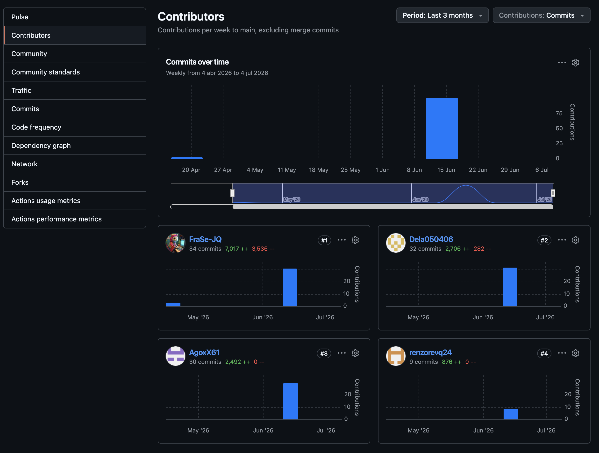

## Capítulo I: Introducción

### 1.1. Startup Profile

#### 1.1.1. Descripción de la Startup

FiveTech es una startup de tecnología conformada por estudiantes de Ingeniería de Software de la Universidad Peruana de Ciencias Aplicadas (UPC), orientada al desarrollo de soluciones digitales que resuelven problemas reales en sectores con baja penetración tecnológica. Nació con la convicción de que la seguridad de los niños durante su traslado escolar no debería depender de llamadas telefónicas, mensajes de WhatsApp o registros manuales en papel.
Nuestra propuesta de valor se materializa en SafeRoute, una plataforma web de movilidad institucional inteligente diseñada para digitalizar y optimizar la gestión del transporte escolar. SafeRoute permite a cualquier organización de transporte escolar ya sea un grupo de padres que se organizaron para compartir una movilidad, un conductor independiente o una pequeña empresa del rubro que busquen centralizar la administración de sus rutas, conductores, alumnos y la comunicación en un solo lugar.

#### 1.1.2. Perfiles de integrantes del equipo

|                         Foto                         | Apellidos y Nombres                       |    Código    | Carrera                | Resumen                                                                                                                                                                                                                                                                                                                                                                                                                                                                                                                |
| :--------------------------------------------------: | :---------------------------------------- | :----------: | :--------------------- | :--------------------------------------------------------------------------------------------------------------------------------------------------------------------------------------------------------------------------------------------------------------------------------------------------------------------------------------------------------------------------------------------------------------------------------------------------------------------------------------------------------------------- |
|  | Costa Morales, Christofer William         | [U202315968] | Ingeniería de Software | Estudiante de Ingeniería de Software de la UPC. Posee experiencia con los lenguajes de programación: C++, Python, JavaScript, HTML y CSS. En lo personal, capacitado para ayudar y contribuir activamente en el desarrollo técnico de este equipo.                                                                                                                                                                                                                                                                     |
|           | Revilla Quispe, Renzo Zamir               |  U201717085  | Ingeniería de Software | Soy Renzo Revilla, estudiante de Ingenieria de Software en la Universidad Peruana de Ciencias Aplicadas, con experiencia en desarrollo web y movil. Me destaco por mis habilidades en comunicacion efectiva y trabajo en equipo, lo que facilita la coordinación y el cumplimiento de objetivos dentro del grupo. Disfruto de la natacion y del aprendizaje continuo. Mi aporte al equipo se centra en el desarrollo tecnico y en la gestion del proyecto, contribuyendo a mantener un trabajo organizado y eficiente. |
|             | Quispe Serrano, Julio Frank               | [U20241D922] | Ingeniería de Software | Soy Julio Frank Quispe Serrano, alumno de 5to ciclo de Ingeniería de Software en la UPC. Cuento con una marcada inclinación hacia la programación y la gestión eficiente del tiempo. Mi aporte principal a este grupo de trabajo será la resolución de conflictos técnicos y operativos, aportando una visión pragmática que permita superar eventuales estancamientos en las fases de elaboración del proyecto.                                                                                                       |
|             | De la Cruz De los Santos, Mathias Marcelo | [U202424059] | Ingeniería de Software | Soy estudiante de la carrera de Ingeniería de Software y actualmente me encuentro cursando el 5to ciclo de la carrera en la Universidad Peruana de Ciencias Aplicadas. Me considero un fanático de la programación, del futbol y los videojuegos. Considero que puedo aportar al equipo y al proyecto mis conocimientos técnicos, además de considerarme una persona disciplinada, responsable y que valora el trabajo en equipo.                                                                                      |
|  | Ortega Quintana, Jose Zacarias            | [U202316852] | Ingeniería de Software | Soy Jose Ortega, estudiante de Ingenieria de Software en la Universidad Peruana de Ciencias Aplicadas. Actualmente con 21 años disfruto de los pequeños momentos de tranquilidad para aprovechra en meditar, dibujar o practicar. Deseo apoyar a mi equipo lo mejor posible para poder afrontar cualquier adversidad o contratiempo en este trabajo.                                                                                                                                                                   |

### 1.2. Solution Profile

#### 1.2.1 Antecedentes y problemática

Who (¿Quiénes son los afectados?)
Los afectados son dos grupos claramente identificables. En primer lugar, los padres de familia con hijos en nivel inicial, kínder y primaria que utilizan servicios de transporte escolar privado, quienes no cuentan con información en tiempo real sobre el estado del traslado de sus hijos. En segundo lugar, los conductores de transporte escolar independientes o pertenecientes a pequeñas empresas que gestionan múltiples alumnos y rutas sin herramientas digitales de apoyo.

What (¿Cuál es el problema?)
El transporte escolar privado en el Perú opera en su gran mayoría de forma tradicional y sin soporte tecnológico. La comunicación entre padres y conductores depende de canales no estructurados como llamadas telefónicas y grupos de WhatsApp, lo que genera desorganización, pérdida de información y una sensación constante de incertidumbre en los padres respecto a la seguridad de sus hijos. Por su parte, los conductores y administradores del servicio carecen de herramientas para registrar asistencia, gestionar rutas, reportar incidencias y llevar un historial ordenado de cada trayecto.

Where (¿Dónde ocurre?)
El problema se presenta principalmente en zonas urbanas de Lima Metropolitana, donde la demanda de transporte escolar privado es alta y la oferta opera de manera fragmentada e incluso a veces informal. Sin embargo, la problemática es extensible a cualquier ciudad del Perú con alta densidad de centros educativos privados y colegios que no cuentan con flota propia.

When (¿Cuándo ocurre?)
El problema se manifiesta de forma recurrente durante los horarios de entrada y salida escolar, típicamente entre las 6:00 a.m. y 8:30 a.m., y entre las 12:30 p.m. y 5:00 p.m. Es en estos momentos cuando la falta de información en tiempo real genera mayor ansiedad en los padres y mayor presión operativa en los conductores.

Why (¿Por qué es un problema?)
La ausencia de digitalización en este sector genera consecuencias concretas, por ejemplo los padres no saben si su hijo abordó la movilidad, si llegó al colegio o si ocurrió algún incidente en el camino. Los conductores cometen errores en las paradas, olvidan recoger alumnos o no tienen cómo comunicar retrasos de forma ordenada. Los administradores del servicio pierden tiempo valioso coordinando manualmente lo que podría automatizarse, y no cuentan con registros históricos que les permitan mejorar la operación.

How (¿Cómo se manifiesta?)
Se manifiesta en llamadas y mensajes constantes de padres al conductor durante el trayecto, listas de alumnos escritas en papel o en hojas de cálculo no compartidas, ausencia de registros de incidencias, imposibilidad de verificar el cumplimiento de las paradas, y falta de trazabilidad sobre qué alumnos abordaron o no en cada viaje.

How much (¿Cuál es la magnitud?)
Si bien no existen datos precisos y actualizados que cuantifiquen de forma específica el mercado del transporte escolar privado en el Perú, los indicadores educativos y de transporte disponibles permiten dimensionar la magnitud del problema.
Según el Censo Educativo 2022-2023 del Ministerio de Educación (MINEDU, 2023), en Lima Metropolitana existen aproximadamente 1.9 millones de estudiantes distribuidos en cerca de 7,602 instituciones educativas, de las cuales el 74% son de gestión privada. Esta alta concentración de colegios privados implica que muchas familias dependen de servicios externos de transporte escolar, dado que pocas instituciones cuentan con flotas propias.
Este panorama se ve agravado por una reducción en la oferta formal del servicio. Según la Autoridad de Transporte Urbano para Lima y Callao (ATU, 2024), la cantidad de movilidades escolares autorizadas disminuyó en un 25% en solo un año, lo que sugiere un incremento en la informalidad del sector y, con ello, una mayor ausencia de herramientas de control y monitoreo sobre el servicio que reciben los menores.
Respecto a la seguridad, la Superintendencia de Transporte Terrestre de Personas, Carga y Mercancías (SUTRAN, 2024) ejecutó campañas de sensibilización que alcanzaron a más de 47,000 escolares, evidenciando que la seguridad en el transporte escolar continúa siendo una preocupación activa para las autoridades. Sin embargo, no se dispone públicamente de cifras desagregadas de incidentes específicos en este sector entre 2022 y 2025.

**Figura 1** Distribución de estudiantes de Educación Inicial y Primaria en instituciones privadas y zonas urbanas en el Perú

_Nota._ Adaptado de Resultados del Censo Educativo 2022 (p. 12), por Ministerio de Educación, 2023.

#### 1.2.2 Lean UX Process

##### 1.2.2.1. Lean UX Problem Statements

El transporte escolar privado en el Perú opera mayoritariamente de forma informal, coordinándose mediante
llamadas telefónicas, mensajes de WhatsApp y registros manuales en hojas privadas. En este contexto, tanto
los padres de familia como los transportistas escolares enfrentan dificultades que comprometen la seguridad
y eficiencia del servicio. Hemos observado un factor crítico que afecta a este ecosistema, los padres de familia
no cuentan con visibilidad sobre el trayecto de sus hijos, mientras que los transportistas carecen de
herramientas digitales para gestionar rutas, alumnos e incidencias de forma estructurada. Estas dos
necesidades son interdependientes, mientras que por un lado los padres necesitan visibilidad, y por el otro los
transportistas no tienen los medios para proporcionársela. ¿Cómo podemos desarrollar una plataforma que
permita a los transportistas escolares gestionar su operación de forma digital, mientras ofrece
simultáneamente a los padres de familia la visibilidad y tranquilidad que necesitan sobre el traslado de sus
hijos?

##### 1.2.2.2. Lean UX Assumptions

**Business Assumptions**

- Creemos que existe demanda suficiente para digitalizar el transporte escolar privado en Lima Metropolitana, dado que opera mayoritariamente de forma tradicional y sin soporte tecnológico.
- Creemos que los padres de familia adoptarán la plataforma si el proceso de incorporación es simple y la información que reciben sobre el trayecto de sus hijos es clara y confiable.
- Creemos que los transportistas adoptarán la plataforma si la interfaz operativa durante el trayecto es simple, rápida y no distrae la conducción.
- Creemos que el modelo de suscripción por planes escalonados Básico, Intermedio y Completo permite capturar tanto a grupos pequeños de padres organizados como a empresas de transporte escolar con flotas más grandes.
- Creemos que SafeRoute transmite ahorro de tiempo, reduccion de errores y confianza al transporte de los escolares frente a los padres de familia, lo que justifica el costo de la suscripción.
- Sabremos que estamos equivocados si los administradores abandonan la plataforma en los primeros 60 días por considerar que la curva de aprendizaje es demasiado alta o que el valor percibido no justifica el costo.

**User Assumptions**

- ¿Quién es el usuario?
  Los padres de familia con hijos en nivel inicial, kínder y primaria que utilizan un servicio de transporte escolar ya contratado, y los transportistas escolares como por ejemplo los conductores independientes o responsables de pequeñas empresas que operan ese servicio. Dentro de la plataforma, cualquiera de estos segmentos puede asumir además el rol de Administrador.
- ¿Dónde encaja nuestro producto en su vida?
  Para el transportista, en su jornada laboral operativa diaria. Para el padre, en los momentos de entrada y salida escolar de sus hijos.
- ¿Qué problemas resuelve?
  Elimina la gestión manual y la comunicación no estructurada del transporte escolar, proporcionando al transportista herramientas operativas digitales y al padre visibilidad del trayecto de sus hijos.
- ¿Cuándo y cómo es usado?
  El transportista lo usa durante cada trayecto para gestionar abordajes, paradas e incidencias. El padre lo consulta en los horarios de traslado escolar para monitorear el estado del viaje de sus hijos.
- ¿Qué características son importantes?
  Registro de abordaje por alumno, visualización de ruta y paradas, reporte de incidencias, historial de trayectos y gestión centralizada de usuarios y rutas.
- ¿Cómo debe verse y comportarse?
  Interfaz limpia, responsiva, rápida y accesible (a11y), disponible en español e inglés (i18n), e intuitiva para usuarios con distintos niveles de familiaridad tecnológica.

##### 1.2.2.3. Lean UX Hypothesis Statements

- Hipótesis 1: "Creemos que los padres de familia reducirán su incertidumbre durante el traslado escolar mediante el uso de una vista del estado del trayecto con marcación de abordaje por alumno y visualización de paradas.
  Sabremos que esto es verdad cuando al menos el 70% de los padres activos consulten el estado del trayecto al menos una vez por día durante las primeras 4 semanas de uso."

- Hipótesis 2: "Creemos que los transportistas gestionarán el trayecto con menos errores y menor carga operativa mediante el uso de una interfaz operativa simple para marcar abordajes, seguir paradas y reportar incidencias durante el viaje.
  Sabremos que esto es verdad cuando el 80% de los trayectos registrados incluyan el check-list de abordaje completado durante las primeras 4 semanas de operación."

- Hipótesis 3: "Creemos que los administradores centralizarán la gestión de su servicio mediante el uso de un panel único para registrar usuarios, conductores, hijos, asignaciones y rutas.
  Sabremos que esto es verdad cuando al menos el 75% de los administradores registren la totalidad de sus usuarios y rutas dentro de los primeros 15 días tras el onboarding."

- Hipótesis 4: "Creemos que los administradores incrementarán su nivel de suscripción al percibir que las funcionalidades de los planes superiores reducen significativamente el tiempo de coordinación del servicio.
  Sabremos que esto es verdad cuando al menos el 20% de los administradores de los planes Básico o Intermedio actualicen a un plan superior dentro de los primeros 3 meses de uso."

##### 1.2.2.4. Lean UX Canvas

| Sección                                                                                  | Contenido                                                                                                                                                                                                                                                                                                                                                                                                                                                                                                                                                                                                               |
| :--------------------------------------------------------------------------------------- | :---------------------------------------------------------------------------------------------------------------------------------------------------------------------------------------------------------------------------------------------------------------------------------------------------------------------------------------------------------------------------------------------------------------------------------------------------------------------------------------------------------------------------------------------------------------------------------------------------------------------- |
| 1. Business Problem                                                                      | El transporte escolar privado en el Perú opera de forma tradicional y sin soporte tecnológico. Los padres no tienen visibilidad sobre el trayecto de sus hijos y los transportistas gestionan su operación con llamadas, WhatsApp y hojas privadas, lo que genera errores, ineficiencia y una experiencia de servicio poco confiable.                                                                                                                                                                                                                                                                                   |
| 2. Business Outcomes                                                                     | Lograr que el 75% de administradores completen el registro de su operación en los primeros 15 días. Retener al 80% de suscriptores activos durante los primeros 3 meses. Alcanzar una tasa de upgrade del plan Básico al Intermedio del 20% en los primeros 3 meses de uso.                                                                                                                                                                                                                                                                                                                                             |
| 3. Users                                                                                 | Los segmentos que interactúan con SafeRoute son los padres de familia con hijos en nivel inicial, kínder y primaria que utilizan un servicio de transporte escolar ya contratado, y los transportistas escolares conductores independientes o responsables de pequeñas empresas que operan ese servicio. Cualquiera de estos puede asumir además el rol de Administrador dentro de la plataforma.                                                                                                                                                                                                                       |
| 4. User Outcomes & Benefits                                                              | Los padres buscan reducir su incertidumbre sobre el trayecto de sus hijos, pudiendo monitorear el estado del viaje sin necesidad de interrumpir al conductor. Los transportistas buscan gestionar rutas, alumnos e incidencias de forma digital, reduciendo errores operativos y proyectando mayor profesionalismo frente a las familias. Quienes asumen el rol de administrador buscan centralizar toda la operación del servicio en un solo panel, eliminando la coordinación manual y el uso de herramientas desconectadas.                                                                                          |
| 5. Solution Ideas                                                                        | Ofrecemos un panel de administración de usuarios, conductores, hijos y rutas. Tambien, Check-list de abordaje digital por conductor. Vista de paradas y estado del trayecto para padres. Registro de incidencias por ruta. Historial de trayectos por comunidad de ruta. Seguimiento GPS en tiempo real (plan Completo). Apertura a integración IoT futura.                                                                                                                                                                                                                                                             |
| 6. Hypotheses                                                                            | Los padres consultan la vista del estado del trayecto al menos una vez al día en un 70% durante las primeras 4 semanas. <br> Los conductores completan el check-list de abordaje en el 80% de los trayectos durante las primeras 4 semanas mediante el uso de una interfaz operativa simple.<br>Los administradores completan el registro de su operación en un 75% dentro de los primeros 15 días mediante el uso de un panel único de gestión.<br>Los administradores de planes Básico o Intermedio realizan upgrade en un 20% dentro de los primeros 3 meses al percibir el valor de las funcionalidades superiores. |
| 7. What's the most important thing we need to learn first?                               | ¿El administrador del servicio percibe suficiente valor en SafeRoute como para abandonar los métodos informales actuales y pagar una suscripción mensual?                                                                                                                                                                                                                                                                                                                                                                                                                                                               |
| 8. What's the least amount of work we need to do to learn the next most important thing? | Realizar entrevistas con 3 a 5 administradores de servicios de transporte escolar (padres representantes o transportistas independientes) para validar su disposición al cambio y las funcionalidades que consideran imprescindibles antes de desarrollar el MVP.                                                                                                                                                                                                                                                                                                                                                       |

### 1.3. Segmentos objetivo

SafeRoute está dirigido a dos segmentos que forman parte del ecosistema del transporte escolar privado en Lima Metropolitana.

- **Segmento 1: Padres de Familia**
  El primer segmento está conformado por padres de familia o apoderados con hijos en nivel inicial, kínder y primaria que utilizan un servicio de transporte escolar privado ya contratado. Se trata de personas que han delegado el traslado de sus hijos a un tercero y que, durante el trayecto, no cuentan con información estructurada sobre el estado del viaje. Este segmento no está delimitado por un nivel socioeconómico específico, sino por la condición de tener hijos en edad escolar que usan transporte privado y de contar con acceso a internet desde un dispositivo con navegador web. Su principal motivación al usar SafeRoute es, precisamente, reducir la incertidumbre que genera no saber si sus hijos abordaron con seguridad, en qué parte del recorrido se encuentran o si ocurrió alguna novedad durante el viaje. Para dimensionar este segmento, según el Censo Educativo 2022-2023, en Lima Metropolitana existen aproximadamente 1.9 millones de estudiantes distribuidos en cerca de 7,602 instituciones educativas, de las cuales el 74% son de gestión privada (Ministerio de Educación, 2023). Esta alta proporción de colegios privados implica que una parte significativa de las familias limeñas depende de servicios externos de transporte escolar, dado que pocas instituciones cuentan con flotas propias.

- **Segmento 1: Transportistas Escolares**
  El segundo segmento está conformado por las personas o entidades que operan el servicio de transporte escolar privado. Dentro de este segmento conviven tres perfiles distintos. El primero corresponde a personas independientes que ofrecen el servicio de forma autónoma. El segundo agrupa a conductores que han sido asignados para operar una movilidad organizada por un conjunto de familias. El tercero engloba a los responsables de pequeñas empresas de transporte escolar que cuentan con una flota de vehículos y conductores a su cargo. A pesar de sus diferencias, todos comparten un factor común, pues operan sin herramientas digitales especializadas, apoyándose en métodos manuales e informales para gestionar una actividad que involucra directamente la seguridad de menores. La relevancia de este segmento se ve reflejada en que la cantidad de movilidades escolares autorizadas en Lima disminuyó en un 25% en solo un año, lo que evidencia un incremento en la informalidad del sector y, con ello, una mayor ausencia de mecanismos de control y monitoreo sobre el servicio que reciben los menores (Autoridad de Transporte Urbano para Lima y Callao, 2024). Adicionalmente, la Superintendencia de Transporte Terrestre de Personas, Carga y Mercancías ejecutó en 2024 campañas de sensibilización que alcanzaron a más de 47,000 escolares, lo que confirma que la seguridad en este sector continúa siendo una preocupación activa para las autoridades (SUTRAN, 2024). Por ello, la principal motivación de este segmento al usar SafeRoute es digitalizar y profesionalizar su operación, reducir los errores en la gestión de rutas y alumnos, y ofrecer a las familias que atienden una experiencia de servicio más confiable y transparente.

---

## Capítulo II: Requirements Elicitation & Analysis

### 2.1. Competidores

### Identificación de Competidores

En esta sección se describen los principales competidores (directos e indirectos) con modelos de negocio basados en productos digitales similares o servicios complementarios de monitoreo.

#### Life360

**Descripción:** Aplicación de rastreo familiar líder a nivel global que permite compartir la ubicación en tiempo real entre miembros de un grupo, así como recibir alertas de llegada y salida de lugares definidos. Está orientada a mejorar la seguridad y comunicación entre familias mediante funciones de geolocalización avanzada.

- **Enfoque:** Seguridad familiar general.
- **URL:** [https://www.life360.com/](https://www.life360.com/)

#### Find My Kids

**Descripción:** Aplicación de monitoreo parental diseñada para que los padres conozcan la ubicación en tiempo real de sus hijos mediante GPS. Permite revisar el historial de movimientos, escuchar el entorno en caso de emergencia y recibir alertas. Se destaca por su integración con relojes inteligentes (smartwatches) para niños.

- **Enfoque:** Monitoreo infantil y seguridad parental.
- **URL:** [https://findmykids.org/](https://findmykids.org/)

#### OnTrack School

**Descripción:** Sistema digital integral enfocado específicamente en la gestión y monitoreo del transporte escolar. Permite el seguimiento de vehículos en tiempo real, envío de notificaciones automáticas a los padres y control administrativo de rutas y conductores. Está orientado principalmente a instituciones educativas y flotas de transporte escolar.

- **Enfoque:** Gestión logística y transporte escolar corporativo.
- **URL:** [https://ontrack.global/school/](https://ontrack.global/school/)

---

### 2.1.1 Análisis Competitivo - Landscape


**¿Por qué llevar a cabo este análisis?**
El objetivo es contrastar SafeRoute con soluciones líderes de geolocalización familiar y gestión escolar, identificando oportunidades para posicionarnos como la herramienta preferida de los transportistas independientes en Lima que buscan profesionalizar su servicio.
| Categoría | Detalle | **SafeRoute** | **Life360** | **Find My Kids** | **OnTrack School** |
| :--- | :--- | :--- | :--- | :--- | :--- |
| **Perfil** | **Overview** | Gestión y monitoreo especializado en transporte escolar. | App de seguridad familiar y rastreo GPS general. | App de monitoreo infantil enfocada en smartwatches. | Plataforma integral de logística para transporte escolar. |
| **Perfil** | **Ventaja competitiva** | Roles específicos (Conductor/Padre) y flujo de abordaje manual. | Círculos familiares privados y detección de choques. | Escucha ambiental y compatibilidad con relojes GPS. | Optimización de rutas avanzada para flotas de colegios. |
| **Marketing** | **Mercado objetivo** | Padres y conductores independientes en Lima. | Familias con adolescentes y adultos mayores. | Padres con niños pequeños (5-12 años). | Colegios privados y empresas de transporte masivo. |
| **Marketing** | **Estrategias** | Seguridad digital y profesionalización del sector. | Marketing masivo de "Tranquilidad familiar". | Enfoque en seguridad infantil y prevención de extravíos. | Ventas corporativas (B2B) y eventos educativos. |
| **Producto** | **Productos & Servicios** | App, Dashboard Web, Alertas IoT y API para devs. | App móvil, asistencia en carretera y alertas de velocidad. | App móvil, rastreadores físicos y notificaciones SOS. | Software de logística, portal para padres y conductores. |
| **Producto** | **Precios & Costos** | Suscripción mensual ($9.99 - $49.99). | Freemium (Suscripciones Gold/Platinum desde $14.99). | Suscripción mensual o pago único de por vida. | Cotización personalizada por número de rutas/colegios. |
| **Producto** | **Canales de distribución**| Web (Landing Page) y tiendas de apps. | App Store, Play Store y web global. | App Store, Play Store y fabricantes de smartwatches. | Web corporativa y equipo de ventas directas. |
| **SWOT** | **Fortalezas** | Sistema especializado con control de abordaje y registro de incidencias para estructurar el servicio informal. | Alta precisión en rastreo en tiempo real . | Especialización en el segmento de niños pequeños. | Robustez técnica y algoritmos de optimización. |
| **SWOT** | **Debilidades** | Marca nueva en un mercado con desconfianza. | No está diseñada para el flujo de transporte escolar. | Funcionalidades limitadas si el niño no tiene reloj. | Costo elevado y difícil implementación para independientes. |
| **SWOT** | **Oportunidades** | Nicho desatendido de transportistas independientes en Perú que buscan organización y confianza. | Creciente preocupación por la seguridad familiar | Crecimiento del mercado de wearables infantiles. | Digitalización de colegios en mercados emergentes. |
| **SWOT** | **Amenazas** | Informalidad que prefiere usar solo WhatsApp. | Mejoras en los sistemas nativos de Google/Apple. | Regulaciones estrictas de privacidad infantil (COPPA). | Nuevas startups locales con precios de introducción bajos. |

---

### 2.1.2 Estrategias y tácticas frente a competidores

En base al análisis competitivo y SWOT realizado, SafeRoute plantea las siguientes estrategias y tácticas para diferenciarse aprovechando las debilidades de la competencia y el contexto local:

#### Enfoque en especialización del problema

- SafeRoute se posicionará como una solución especializada en transporte escolar, integrando funcionalidades específicas como control de abordaje, gestión de rutas y registro de incidencias.
- Esto permitirá cubrir necesidades logísticas que las soluciones genéricas de GPS ignoran.

#### Estrategia de digitalización del sector no estructurado

- Enfoque en transportistas independientes que actualmente dependen de WhatsApp y procesos manuales.
- Oferta de una plataforma simple e intuitiva para una transición digital sin fricciones técnicas.

#### Diferenciación por simplicidad y accesibilidad

- Priorización de facilidad de uso y costos accesibles frente a soluciones corporativas complejas como OnTrack School.
- Experiencia de usuario optimizada para minimizar la carga operativa del conductor durante el trayecto.

#### Estrategia de confianza y seguridad para padres

- Reducción de la incertidumbre mediante notificaciones automáticas de abordaje y alertas en tiempo real.
- Reemplazo de la comunicación informal por una estructura de datos confiable y profesional.

#### Estrategia de crecimiento progresivo (escalabilidad)

- Modelo de planes escalables (Básico, Intermedio, Completo) que acompaña el crecimiento de la flota del cliente.
- Facilita la adopción inicial con un ticket de entrada bajo.

#### Estrategia de posicionamiento local

- Adaptación a las dinámicas operativas y geográficas de Lima Metropolitana antes de escalar a otras ciudades del Perú.

#### Estrategia de preparación tecnológica futura

- Arquitectura preparada para la integración de sensores y cámaras IoT en etapas posteriores, garantizando competitividad a largo plazo.

### 2.2. Entrevistas

#### 2.2.1. Diseño de entrevistas

##### Guion de Entrevistas - Proyecto SafeRoute

###### **Segmento Objetivo 1: Conductor**

**Fase 1: Contexto del Usuario**

1. ¿Cuál es tu nombre?
2. ¿Cuál es tu edad?
3. ¿Podrías contarme un poco sobre tu entorno familiar? Por ejemplo, si vives con una familia o tienes hijos.
4. ¿En qué distrito o zona sueles trabajar?
5. ¿Podrías contarme un poco sobre tu trabajo como conductor de transporte escolar?
6. ¿Trabajas de manera independiente o en coordinación con otro grupo de personas o empresa?
7. En tu día a día, ¿qué herramientas o medios utilizas para organizar tu trabajo?

**Fase 2: Exploración del Problema**

8. Cuéntame cómo realizas normalmente el proceso de recoger y dejar a los alumnos.
9. Durante el recorrido, ¿cómo llevas el control de los alumnos?
10. ¿Qué suele pasar cuando ocurre algún cambio o imprevisto en la ruta?
11. ¿Cómo te comunicas con los padres durante el servicio?
12. ¿Qué partes de tu trabajo sientes que requieren más atención o te generan mayor carga?
13. ¿Qué tan organizado sientes que es tu proceso actual de trabajo?

**Fase 3: Exploración de Oportunidades**

> **Contexto:** Nuestro proyecto es una aplicación web que ayude a organizar y dar mayor visibilidad al servicio de transporte escolar, centralizando la información y comunicación.

14. Si pudieras mejorar algún aspecto de tu trabajo diario, ¿cuál sería y por qué?
15. ¿Qué tipo de información te ayudaría a sentir mayor control durante el recorrido?
16. ¿Qué preocupaciones tendrías al usar algún tipo de sistema durante el trayecto?
17. ¿Cómo te gustaría que fuera la comunicación con los padres para que no interfiera con tu conducción?
18. ¿Qué tendría que tener una herramienta así para que realmente la uses?
19. ¿Qué tan dispuesto estarías a usar una herramienta que te ayude a organizar y monitorear tu trabajo? ¿Por qué?

---

###### **Segmento Objetivo 2: Padre de Familia**

**Fase 1: Contexto del Usuario**

1. Para comenzar, ¿podrías indicarme tu nombre?
2. ¿Cuál es tu edad?
3. ¿En qué distrito o zona resides?
4. ¿Podrías contarme un poco sobre tu entorno familiar?
5. ¿Qué edades tienen tus hijos que utilizan transporte escolar?
6. ¿Qué rol cumple el transporte escolar dentro de tu día a día?
7. ¿Qué tan cómodo(a) te sientes utilizando tecnología en tu vida diaria?

**Fase 2: Exploración del Problema**

8. Cuéntame cómo haces actualmente para saber que tu hijo llegó bien a su destino.
9. ¿Qué es lo que más te preocupa cuando tu hijo está en el transporte escolar?
10. ¿Cómo te comunicas normalmente con el conductor o responsable del transporte?
11. ¿Recuerdas alguna situación en la que hayas sentido preocupación o falta de información? ¿Qué ocurrió?
12. ¿Qué tipo de información sientes que hoy no tienes y te gustaría tener?
13. ¿Qué aspectos del servicio de transporte actual te generan más desconfianza o incomodidad?

**Fase 3: Exploración de Oportunidades**

> **Contexto:** Nuestro proyecto es una aplicación web que ayude a organizar y dar mayor visibilidad al servicio de transporte escolar, centralizando la información y comunicación.

14. Si pudieras mejorar alguna parte del servicio de transporte escolar, ¿cuál sería y por qué?
15. ¿Qué opinas de una herramienta que te permita tener mayor visibilidad del transporte escolar de tu hijo?
16. ¿En qué aspectos crees que una solución así podría ayudarte en tu día a día?
17. ¿Qué preocupaciones tendrías al usar una herramienta digital para monitorear este servicio?
18. Para finalizar, ¿qué consideras indispensable para sentirte tranquilo(a) con el transporte de tu hijo?

#### 2.2.2. Registro de entrevistas

### Entrevista 1: Arturo Núñez

| Campo                      | Detalle                                                                                                                                                                                         |
| :------------------------- | :---------------------------------------------------------------------------------------------------------------------------------------------------------------------------------------------- |
| Nombre y Apellidos         | Arturo Núñez                                                                                                                                                                                    |
| Edad                       | 28 años                                                                                                                                                                                         |
| Distrito / Zona de trabajo | San Miguel y Miraflores, Lima                                                                                                                                                                   |
| Segmento                   | Conductor de Transporte Escolar                                                                                                                                                                 |
| Inicio en video            | 00:03                                                                                                                                                                                           |
| Final de video             | 07:43                                                                                                                                                                                           |
| Duracion de la entrevista  | 07:44                                                                                                                                                                                           |
| URL del video              | [https://1drv.ms/v/c/f647ccc757f760c7/IQD-qO_SLqQcTrx0ZrHSgroDAWuEWOzPV0a-d3AWZyaHxrY?e=0w6AKE](https://1drv.ms/v/c/f647ccc757f760c7/IQD-qO_SLqQcTrx0ZrHSgroDAWuEWOzPV0a-d3AWZyaHxrY?e=0w6AKE)] |

#### Screenshot


---

## Resumen Descriptivo de la Entrevista

### Características Objetivas y Entorno

Arturo Núñez es un conductor de transporte escolar independiente de 28 años, con aproximadamente seis años de experiencia en el rubro. Opera principalmente en los distritos de San Miguel y Miraflores, zonas urbanas con alto flujo vehicular. Gestiona su propia unidad móvil y administra directamente la captación de clientes, organización de rutas y comunicación con padres de familia.

Su rutina diaria consiste en recoger estudiantes en sus domicilios, trasladarlos al colegio y retornarlos posteriormente según el turno escolar.

### Herramientas, Tecnología y Canales de Interacción

Actualmente utiliza herramientas informales para operar:

- WhatsApp como canal principal de comunicación con padres
- Libreta física para horarios y direcciones
- Google Maps para navegación y rutas alternas
- Smartphone como dispositivo principal de trabajo

El uso del teléfono móvil es constante durante la jornada. Se evidencia familiaridad con aplicaciones digitales de uso cotidiano.

### Características Subjetivas y Personalidad

Arturo presenta un perfil pragmático, independiente y orientado a resultados. Busca mantener el orden operativo, aunque reconoce limitaciones de su sistema actual. Muestra preocupación por la seguridad vial y estrés cuando debe responder mensajes mientras conduce.

También demuestra apertura al cambio tecnológico siempre que la solución sea sencilla, rápida y útil.

### Pain Points Detectados

- Exceso de mensajes durante la conducción
- Distracción al responder consultas de padres
- Dependencia de memoria personal
- Falta de sistema formal de asistencia
- Cambios de ruta difíciles de comunicar
- Estrés operativo en horas punta

### Oportunidades Identificadas

El entrevistado valora altamente una plataforma que permita:

- Ubicación en tiempo real para padres
- Notificaciones automáticas
- Lista diaria de alumnos asistentes
- Registro rápido de abordaje
- Operación con pocos pasos
- Uso estable con señal limitada

### Validación del Arquetipo

La entrevista confirma que el segmento conductor necesita reducir carga operativa, profesionalizar su servicio y automatizar comunicaciones sin comprometer la seguridad al volante. Esto respalda directamente el User Persona definido para SafeRoute.

---

### Entrevista 2: Carla Peláez

| Campo                             | Detalle                                                                                                                                                                                         |
| :-------------------------------- | :---------------------------------------------------------------------------------------------------------------------------------------------------------------------------------------------- |
| **Nombre y Apellidos**            | Carla Peláez                                                                                                                                                                                    |
| **Edad**                          | 38 años                                                                                                                                                                                         |
| **Distrito / Zona de residencia** | Santiago de Surco, Lima                                                                                                                                                                         |
| **Segmento**                      | Padre de Familia                                                                                                                                                                                |
| **Inicio en video**               | 07:47                                                                                                                                                                                           |
| Final de video                    | 12:33                                                                                                                                                                                           |
| Duracion de la entrevista         | 04:45                                                                                                                                                                                           |
| **URL del video**                 | [https://1drv.ms/v/c/f647ccc757f760c7/IQD-qO_SLqQcTrx0ZrHSgroDAWuEWOzPV0a-d3AWZyaHxrY?e=0w6AKE](https://1drv.ms/v/c/f647ccc757f760c7/IQD-qO_SLqQcTrx0ZrHSgroDAWuEWOzPV0a-d3AWZyaHxrY?e=0w6AKE)] |

#### **Screenshot**


> _Captura de pantalla de la entrevista realizada al segmento Padre de Familia._

---

#### **Resumen Descriptivo de la Entrevista**

### **Características Objetivas y Entorno**

Carla Peláez es una madre de familia de 38 años residente en el distrito de Santiago de Surco. Vive con su esposo y sus cuatro hijos, de los cuales dos utilizan actualmente servicio de transporte escolar. Representa a familias urbanas con alta responsabilidad logística diaria, donde el traslado escolar cumple un rol clave para compatibilizar horarios familiares, laborales y educativos.

El transporte escolar forma parte importante de su rutina diaria, ya que permite asegurar la asistencia puntual de sus hijos al centro educativo.

### **Perfil Tecnológico y Hábitos Digitales**

La entrevistada demuestra una actitud positiva frente al uso de tecnología y asocia las herramientas digitales con mayor seguridad y tranquilidad. Está acostumbrada a recibir información mediante canales digitales institucionales y mensajería móvil.

Actualmente utiliza:

- Teléfono móvil como principal dispositivo de comunicación
- WhatsApp para contacto con responsables del transporte
- Sistema digital del colegio para validar asistencia diaria

Esto evidencia un perfil digital intermedio, con apertura a nuevas soluciones tecnológicas siempre que sean simples y confiables.

### **Proceso Actual y Canales de Interacción**

Para confirmar que sus hijos llegaron correctamente a destino, Carla depende de dos mecanismos externos:

- Confirmación verbal de la responsable de movilidad escolar
- Confirmación de asistencia enviada por el colegio mediante su sistema interno

Cuando existe demora o falta de confirmación, se comunica directamente con el colegio para validar la llegada de sus hijos.

Actualmente la comunicación con el conductor o responsable se realiza principalmente por:

- Llamadas telefónicas
- WhatsApp

### **Pain Points (Problemas Detectados)**

Durante la entrevista se identificaron preocupaciones relevantes:

- Angustia cuando la movilidad se retrasa
- Ansiedad cuando no llega la confirmación del colegio
- Falta de visibilidad en tiempo real durante el trayecto
- Dependencia de terceros para validar información
- Percepción de inseguridad en el contexto actual de transporte urbano
- Menor confianza cuando la movilidad no pertenece directamente al colegio

Estos puntos reflejan una necesidad clara de trazabilidad, confianza y comunicación inmediata.

### **Necesidades y Oportunidades Detectadas**

Carla mostró alta aceptación hacia una plataforma digital que le permita:

- Ver la ruta del vehículo en tiempo real
- Conocer si ocurrió algún inconveniente durante el trayecto
- Recibir confirmación automática de llegada
- Saber la ubicación permanente de sus hijos
- Reducir ansiedad e incertidumbre diaria
- Incrementar confianza en el servicio contratado

Para Carla, el atributo más importante para sentirse tranquila es:

“Saber en dónde está en todo momento”.

### **Características Subjetivas y Personalidad**

A partir de sus respuestas, se identifica un perfil:

- Protector y orientado al bienestar familiar
- Preventivo frente a riesgos externos
- Receptivo a herramientas digitales útiles
- Sensible a la falta de información
- Altamente motivado por la seguridad de sus hijos

### **Validación del Arquetipo**

Los datos recolectados en esta entrevista validan los supuestos definidos para el segmento Padre de Familia dentro del proyecto SafeRoute. Se confirma que este segmento prioriza:

- Seguridad del estudiante
- Monitoreo en tiempo real
- Alertas automáticas
- Comunicación confiable
- Reducción de ansiedad durante el traslado escolar

Asimismo, respalda los objetivos del Impact Mapping relacionados con generar tranquilidad, confianza y visibilidad operacional para las familias usuarias.

---

### Entrevista 3: Marío Villarreyes

| Campo                             | Detalle                                                                                                                                                                                         |
| :-------------------------------- | :---------------------------------------------------------------------------------------------------------------------------------------------------------------------------------------------- |
| **Nombre y Apellidos**            | Marío Villarreyes                                                                                                                                                                               |
| **Edad**                          | 49 años                                                                                                                                                                                         |
| **Distrito / Zona de residencia** | Pueblo Libre, Lima                                                                                                                                                                              |
| **Segmento**                      | Padre de Familia                                                                                                                                                                                |
| **Inicio en video**               | 12:35                                                                                                                                                                                           |
| **Final de video**                | 20:05                                                                                                                                                                                           |
| **Duración de la entrevista**     | 07:33                                                                                                                                                                                           |
| **URL del video**                 | [https://1drv.ms/v/c/f647ccc757f760c7/IQD-qO_SLqQcTrx0ZrHSgroDAWuEWOzPV0a-d3AWZyaHxrY?e=0w6AKE](https://1drv.ms/v/c/f647ccc757f760c7/IQD-qO_SLqQcTrx0ZrHSgroDAWuEWOzPV0a-d3AWZyaHxrY?e=0w6AKE)] |

#### **Screenshot**


## **Resumen Descriptivo de la Entrevista**

### **Características Objetivas y Entorno**

Mario Humberto Villarreyes Quinoza es un padre de familia de 49 años residente en Pueblo Libre, Lima. Vive con su esposa actual y dos de sus hijos: Ciara de 12 años y León de 7 años. Representa a familias urbanas que requieren apoyo logístico complementario para equilibrar responsabilidades familiares, laborales y escolares.

En su caso, el transporte escolar no se utiliza diariamente como servicio institucional fijo, sino principalmente para el recojo de su hija cuando tiene horarios extendidos o actividades adicionales en el colegio.

### **Perfil Tecnológico y Hábitos Digitales**

El entrevistado demuestra familiaridad funcional con herramientas digitales orientadas a resolver necesidades cotidianas. Utiliza tecnología principalmente para coordinar servicios y validar información relevante antes de contratar.

Actualmente utiliza:

- WhatsApp como principal canal de coordinación
- Teléfono móvil para contacto inmediato
- Búsqueda digital de antecedentes e información vehicular

Esto evidencia un perfil digital práctico, orientado a la utilidad, seguridad y rapidez de respuesta.

### **Proceso Actual y Canales de Interacción**

Actualmente contrata un servicio particular tipo taxi privado para recoger a su hija cuando lo necesita. La coordinación se realiza mediante una persona de confianza (señora Ana), quien contacta al conductor encargado del traslado.

La comunicación con el conductor o responsable del servicio se realiza principalmente por:

- WhatsApp
- Coordinación indirecta mediante tercero de confianza

Esto refleja un modelo operativo informal, altamente dependiente de referencias personales.

### **Pain Points (Problemas Detectados)**

Durante la entrevista se identificaron preocupaciones importantes:

- Falta de visibilidad previa sobre antecedentes del conductor
- Dificultad para validar papeletas, sanciones o historial de manejo
- Incertidumbre sobre propiedad y condiciones del vehículo
- Conducción imprudente o exceso de velocidad en movilidades escolares
- Uso inadecuado del claxon y presión por llegar a tiempo
- Sobrecarga de pasajeros por encima del aforo permitido
- Escasa capacitación percibida en algunos conductores

Estos hallazgos muestran que la principal preocupación no es solo la ubicación, sino la seguridad integral y calidad del operador.

### **Necesidades y Oportunidades Detectadas**

Mario mostró interés en una plataforma digital que permita:

- Ver antecedentes del conductor antes de contratar
- Consultar papeletas o faltas registradas
- Validar experiencia del conductor
- Revisar comentarios y reputación del servicio
- Conocer información completa del vehículo
- Confirmar cumplimiento de aforo permitido
- Elegir opciones confiables antes de contratar

Valora especialmente la transparencia previa a la contratación.

### **Características Subjetivas y Personalidad**

A partir de sus respuestas, se identifica un perfil:

- Preventivo y orientado a la seguridad familiar
- Analítico al momento de contratar servicios
- Exigente con estándares de conducción
- Crítico frente a informalidad del sector
- Receptivo a soluciones digitales con información verificable

### **Validación del Arquetipo**

Los datos recolectados validan los supuestos del segmento Padre de Familia dentro del proyecto SafeRoute. Se confirma que este segmento prioriza:

- Seguridad física de sus hijos
- Transparencia del conductor y vehículo
- Información verificable antes de contratar
- Buenas prácticas de conducción
- Confianza operativa del servicio

#### 2.2.3. Análisis de entrevistas

## Segmento Objetivo 1: Conductores de Transporte Escolar

El presente análisis corresponde a una muestra inicial de 1 entrevista válida del segmento conductor, por lo que los porcentajes reflejan únicamente los hallazgos preliminares del entrevistado y serán refinados con futuras entrevistas.

### Características Objetivas del Segmento

| Característica                         | Resultado | Sustento                                                       |
| -------------------------------------- | --------- | -------------------------------------------------------------- |
| Edad joven-adulta (25 a 35 años)       | 100%      | Arturo tiene 28 años                                           |
| Trabajo independiente                  | 100%      | Indica operar con unidad propia y captar clientes directamente |
| Experiencia en el rubro mayor a 5 años | 100%      | Señala 6 años trabajando en transporte escolar                 |
| Opera en zonas urbanas congestionadas  | 100%      | Trabaja en San Miguel y Miraflores                             |
| Manejo de ruta diaria fija             | 100%      | Realiza recojo, traslado al colegio y retorno                  |

### Hallazgo

El segmento conductor evaluado corresponde a microoperadores independientes que administran su propio servicio y requieren herramientas de gestión simples, móviles y rápidas.

### Uso de Tecnología y Herramientas Actuales

| Herramienta / Canal                                | Porcentaje |
| -------------------------------------------------- | ---------- |
| WhatsApp como canal principal con padres           | 100%       |
| Libreta física para horarios/direcciones           | 100%       |
| Google Maps para navegación                        | 100%       |
| Uso combinado de herramientas manuales + digitales | 100%       |

### Principales Problemas Detectados (Pain Points)

| Problema identificado                           | Porcentaje |
| ----------------------------------------------- | ---------- |
| Exceso de mensajes durante la conducción        | 100%       |
| Distracción por responder padres en ruta        | 100%       |
| Dependencia de memoria personal                 | 100%       |
| Estrés ante tráfico o cambios imprevistos       | 100%       |
| Falta de visibilidad para padres genera presión | 100%       |

### Necesidades Funcionales Prioritarias

| Necesidad mencionada                                    | Porcentaje |
| ------------------------------------------------------- | ---------- |
| Ubicación visible para padres sin escribir al conductor | 100%       |
| Notificaciones automáticas de abordaje/llegada          | 100%       |
| Lista digital de alumnos del día                        | 100%       |
| Confirmación previa de asistencia                       | 100%       |
| App sencilla e intuitiva                                | 100%       |
| Funcionamiento con señal limitada                       | 100%       |

### Características Subjetivas del Segmento

| Rasgo detectado                            | Porcentaje |
| ------------------------------------------ | ---------- |
| Alta disposición a adoptar tecnología útil | 100%       |
| Mentalidad pragmática                      | 100%       |
| Valora eficiencia y orden                  | 100%       |
| Sensible a distracciones durante manejo    | 100%       |
| Busca profesionalizar su servicio          | 100%       |

---

## Segmento Objetivo 2: Padres de Familia

El presente análisis corresponde a una muestra inicial de 1 entrevista válida del segmento padres de familia, por lo que los porcentajes reflejan únicamente los hallazgos preliminares de la entrevistada y serán refinados con futuras entrevistas.

### Características Objetivas del Segmento

| Característica                            | Resultado | Sustento                                                                |
| ----------------------------------------- | --------- | ----------------------------------------------------------------------- |
| Adulto responsable entre 35 y 45 años     | 100%      | Carla tiene 38 años                                                     |
| Reside en zona urbana consolidada         | 100%      | Vive en Surco, Lima                                                     |
| Hogar con hijos en etapa escolar          | 100%      | Indica tener cuatro hijos                                               |
| Uso recurrente de transporte escolar      | 100%      | Señala que el servicio es importante para asistir al centro de estudios |
| Necesidad diaria de coordinación familiar | 100%      | Gestiona traslado y seguimiento de varios hijos                         |

### Hallazgo

El segmento evaluado corresponde a padres de familia con alta responsabilidad logística diaria, que valoran la seguridad, la información oportuna y la tranquilidad emocional durante el traslado escolar.

### Uso de Tecnología y Herramientas Actuales

| Herramienta / Canal                                 | Porcentaje |
| --------------------------------------------------- | ---------- |
| WhatsApp / Teléfono para comunicación con movilidad | 100%       |
| Sistema del colegio para confirmar asistencia       | 100%       |
| Uso de smartphone como canal principal              | 100%       |
| Dependencia de terceros para recibir información    | 100%       |

### Principales Problemas Detectados (Pain Points)

| Problema identificado                                         | Porcentaje |
| ------------------------------------------------------------- | ---------- |
| Ansiedad cuando la movilidad demora                           | 100%       |
| Preocupación si no llega confirmación del colegio             | 100%       |
| Falta de ubicación en tiempo real                             | 100%       |
| Temor a accidentes o incidentes de seguridad                  | 100%       |
| Desconfianza hacia servicios externos no afiliados al colegio | 100%       |

### Necesidades Funcionales Prioritarias

| Necesidad mencionada                        | Porcentaje |
| ------------------------------------------- | ---------- |
| Ver ubicación en tiempo real del transporte | 100%       |
| Confirmación automática de llegada          | 100%       |
| Alertas ante retrasos o inconvenientes      | 100%       |
| Mayor visibilidad de la ruta diaria         | 100%       |
| Herramienta simple desde celular            | 100%       |
| Sentir tranquilidad y control del proceso   | 100%       |

### Características Subjetivas del Segmento

| Rasgo detectado                                     | Porcentaje |
| --------------------------------------------------- | ---------- |
| Alta preocupación por seguridad infantil            | 100%       |
| Alta receptividad hacia soluciones digitales útiles | 100%       |
| Busca reducir ansiedad diaria                       | 100%       |
| Valora confianza institucional                      | 100%       |
| Perfil práctico orientado a familia                 | 100%       |

### Conclusión del Segmento

El perfil preliminar evidencia que los padres no buscan solo tecnología, sino tranquilidad. Una solución digital será valorada si reduce incertidumbre, mejora la confianza y entrega información clara sin depender de llamadas o mensajes manuales.

### 2.3. Needfinding

#### 2.3.1. User Personas

En esta sección se presentan los arquetipos de usuario diseñados para representar los segmentos objetivo de SafeRoute: el conductor de transporte escolar independiente y el padre de familia.

La elaboración de estas fichas es el resultado de una síntesis detallada entre el análisis de la competencia y el proceso de Needfinding. Se han identificado características críticas como la alta dependencia de herramientas informales (WhatsApp/Llamadas), la ansiedad generada por la incertidumbre del tráfico en Lima y la necesidad de profesionalizar un sector mayoritariamente no estructurado.

###### **Segmento Objetivo 1: Conductor **


---

###### **Segmento Objetivo 2: Padre de Familia**


#### 2.3.2. User Task Matrix

En esta sección se presenta la matriz de tareas de usuario , la cual consolida las actividades fundamentales que tanto el conductor (Carlos Ramírez) como el padre de familia (Rosita Nery) ejecutan para asegurar un traslado escolar exitoso.

Es importante destacar que estas tareas representan necesidades y procesos intrínsecos del servicio que existen independientemente de la existencia de una solución de software; el objetivo de SafeRoute es optimizar y digitalizar estas interacciones para reducir la carga operativa y la incertidumbre.

#### Cuadro: User Task Matrix

| Tarea (User Task)                                  | Conductor - Frecuencia | Conductor - Importancia | Padre - Frecuencia | Padre - Importancia |
| :------------------------------------------------- | :--------------------: | :---------------------: | :----------------: | :-----------------: |
| Verificar lista de asistencia de alumnos           |          Alta          |          Alta           |        N/A         |         N/A         |
| Identificar alumnos en el punto de recojo          |          Alta          |          Alta           |        N/A         |         N/A         |
| Confirmar el abordaje seguro del alumno            |          Alta          |         Crítica         |        Alta        |       Crítica       |
| Gestionar comunicación entre conductores y padres  |          Alta          |          Alta           |        Alta        |        Alta         |
| Notificar retrasos o imprevistos en la ruta        |         Media          |          Alta           |        Alta        |       Crítica       |
| Monitorear el progreso del trayecto                |         Media          |          Media          |        Alta        |        Alta         |
| Confirmar llegada al destino final                 |          Alta          |         Crítica         |        Alta        |       Crítica       |
| Registrar la entrega del alumno al responsable     |          Alta          |         Crítica         |        Alta        |       Crítica       |
| Coordinar cambios de último momento en el servicio |          Baja          |          Media          |        Baja        |        Alta         |
| Reportar incidencias de seguridad o salud          |          Baja          |         Crítica         |        Baja        |       Crítica       |
| Consultar el estado actual del servicio            |         Media          |          Media          |        Alta        |        Alta         |
| Revisar historial de trayectos realizados          |          Baja          |          Media          |       Media        |        Media        |
| Organizar y optimizar rutas y paradas              |          Alta          |          Alta           |        N/A         |         N/A         |

---

#### Análisis y Explicación de la Matriz

Tras el análisis de la matriz, se desprenden las siguientes conclusiones clave sobre el comportamiento y necesidades de los segmentos:

- **Coincidencias en Tareas Críticas:** Existe una convergencia total en las tareas de "Confirmar abordaje", "Confirmar llegada" y "Registrar entrega". Para ambos segmentos, estas acciones representan la columna vertebral de la confianza en el servicio, manteniendo una importancia **Crítica** debido a que involucran la seguridad directa del menor.
- **Diferencias de Rol:** La carga operativa de planificación y ejecución (verificación de listas y organización de rutas) recae exclusivamente en el conductor. Por el contrario, el padre de familia se enfoca en tareas de supervisión pasiva como "Monitorear el progreso", que tiene una frecuencia alta debido a la ansiedad constante que genera el tráfico de la ciudad.
- **Gestión de Incidencias:** Se observa que tareas como "Reportar incidencias" tienen una frecuencia baja, pero su importancia es crítica. Esto valida la necesidad de que SafeRoute ofrezca canales de comunicación prioritarios que garanticen que, ante un imprevisto, la información fluya sin errores.
- **Fricción en la Comunicación:** La tarea de "Notificar retrasos" es de frecuencia media para el conductor pero de importancia crítica para el padre, lo que resalta el mayor punto de fricción actual: la necesidad de información en tiempo real para reducir el estrés parental.

#### 2.3.3. User Journey Mapping

En esta sección se presentan los User Journey Maps en versión As-Is correspondientes a los dos segmentos objetivo definidos previamente: conductor escolar y padre de familia. El propósito es comprender la experiencia actual del servicio de transporte escolar, identificando emociones, fricciones operativas, puntos críticos de comunicación y oportunidades de mejora antes de la implementación de SafeRoute.
A continuación, se presentan los diagramas detallados para cada User Persona, vinculando sus objetivos y puntos de dolor con las etapas del proceso actual.

User Journey Map: Carlos Ramírez (Conductor-Segmento Objetivo 1)


---

User Journey Map: Rosita Nery (Padre de Familia-Segmento Objetivo 2)


#### 2.3.4. Empathy Mapping

En esta sección se presenta el análisis de empatía realizado para nuestros segmentos objetivo buscando responder las preguntas ¿Con quién estamos empatizando? ¿Qué necesita hacer? ¿Qué está
diciendo? ¿Qué está viendo? ¿Qué está haciendo? ¿Qué está escuchando? ¿Cómo sesiente y qué piensa? E identificando sus Pains y Gains.

Segmento Objetivo 1: Conductor


---

Segmento Objetivo 2: Padre de familia


### 2.4. Big Picture Event Storming

En esta sección, se presenta el desarrollo y los resultados de la sesión de Big Picture Event Storming realizada por el equipo para el proyecto SafeRoute. Este proceso consistió en una sesión colaborativa de modelado dirigida al dominio, donde el equipo se enfocó en comprender el ecosistema del negocio de movilidad escolar de manera integral.

A través de esta dinámica, se logró plasmar los eventos significativos y sus interrelaciones, construyendo una primera aproximación visual de alto nivel que explora el landscape completo del negocio.

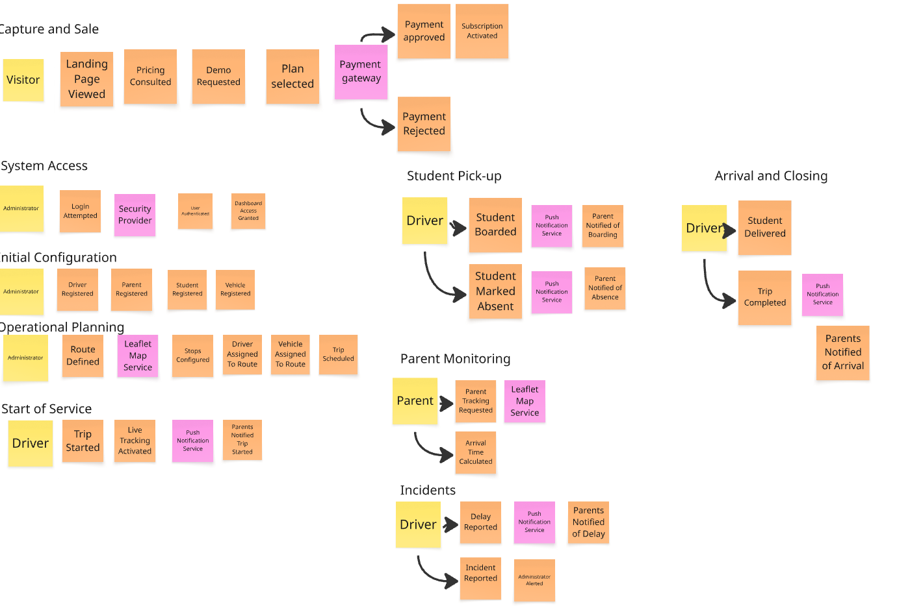

- **URL:** [https://miro.com/welcomeonboard/Q0xsbTlRVkpDQmlwdWJLUHl6dVBWSHQ4NnJQTVVCSUpTUWwzZHBncHAzM0taZWJDYngzTFYrQmdyY1crZS9mWWJ2K0NOTzlHbzd2V3BPdDB4SnpVR2owTTNCZkpZeDBCYWM1ZndITktNNjVhNWYvc1JESUkzenhtRE51ODV1cXdzVXVvMm53MW9OWFg5bkJoVXZxdFhRPT0hdjE=?share_link_id=806628004318](https://miro.com/welcomeonboard/Q0xsbTlRVkpDQmlwdWJLUHl6dVBWSHQ4NnJQTVVCSUpTUWwzZHBncHAzM0taZWJDYngzTFYrQmdyY1crZS9mWWJ2K0NOTzlHbzd2V3BPdDB4SnpVR2owTTNCZkpZeDBCYWM1ZndITktNNjVhNWYvc1JESUkzenhtRE51ODV1cXdzVXVvMm53MW9OWFg5bkJoVXZxdFhRPT0hdjE=?share_link_id=806628004318)]

### 2.5. Ubiquitous Language

En esta sección se presenta el glosario de términos de negocio utilizados dentro del dominio de SafeRoute.
| Term (English) | Equivalente en Español | Definición |
|---|---|---|
| Administrator | Administrador | Persona o entidad responsable de la gestión operativa del servicio de movilidad escolar. Administra usuarios, rutas, vehículos, estudiantes y suscripciones. |
| Driver | Conductor | Responsable de operar la unidad de transporte escolar y ejecutar el viaje diario. Registra eventos como inicio de trayecto, abordaje, incidencias y cierre de ruta. |
| Parent | Padre de familia / Tutor | Usuario final que monitorea el recorrido del estudiante, recibe notificaciones y valida la seguridad del servicio. |
| Student | Estudiante / Alumno | Beneficiario del servicio de transporte escolar. Su estado de abordaje, traslado y entrega representa el núcleo operativo del sistema. |
| Visitor | Visitante | Usuario no registrado que accede a la Landing Page para conocer el servicio, consultar precios o solicitar una demostración. |
| Subscription | Suscripción | Acuerdo comercial que habilita el acceso a la plataforma SafeRoute según un plan contratado y vigente. |
| Plan | Plan | Oferta comercial (Basic, Intermediate, Premium) que determina funcionalidades, límites operativos y capacidad de uso del sistema. |
| Billing Cycle | Ciclo de facturación | Periodo de tiempo en el que se cobra y renueva la suscripción del cliente (mensual o anual). |
| Payment | Pago | Transacción económica realizada por el Administrador para activar o renovar una suscripción. |
| Invoice | Factura / Comprobante | Documento emitido luego de un pago exitoso como constancia de la transacción realizada. |
| Route | Ruta | Definición logística que incluye origen, destino, paradas y secuencia del recorrido escolar. |
| Stop | Parada | Punto físico autorizado donde el vehículo recoge o entrega estudiantes. |
| Checkpoint | Punto de control | Referencia geográfica dentro de la ruta utilizada para validar avance y calcular tiempos estimados. |
| Trip | Viaje / Trayecto | Ejecución en tiempo real de una ruta programada en una fecha y horario determinados. |
| Scheduled Trip | Viaje programado | Viaje previamente configurado para una fecha, conductor, vehículo y ruta específica. |
| Boarding | Abordaje | Acción física y registro digital del momento en que el estudiante sube al vehículo. |
| Boarding Status | Estado de abordaje | Estado operativo del estudiante durante el viaje (Boarded, Absent, Delivered, Pending). |
| Absence | Ausencia | Evento registrado cuando el estudiante no aborda la unidad en la parada correspondiente. |
| Delivery | Entrega | Confirmación de que el estudiante fue dejado de forma segura en destino autorizado. |
| Vehicle | Vehículo / Unidad | Medio de transporte asignado a rutas específicas dentro de la operación escolar. |
| Fleet | Flota | Conjunto de vehículos administrados por una misma organización o administrador. |
| Driver Assignment | Asignación de conductor | Acción mediante la cual un conductor queda vinculado a una ruta o viaje programado. |
| Vehicle Assignment | Asignación de vehículo | Acción mediante la cual una unidad queda vinculada a una ruta o viaje programado. |
| Manifest | Manifiesto | Lista oficial de estudiantes asignados a una ruta o grupo para control operativo y asistencia. |
| Group | Grupo | Conjunto de estudiantes relacionados a una ruta, zona o servicio común. |
| Live Tracking | Monitoreo en tiempo real | Visualización dinámica de la ubicación actual del vehículo durante el viaje. |
| ETA (Estimated Time of Arrival) | Tiempo estimado de llegada | Predicción del tiempo restante para llegar a una parada o destino. |
| Incident | Incidente | Evento no planificado reportado durante el trayecto, como retrasos, tráfico, avería o emergencia. |
| Delay | Retraso | Desviación del horario esperado del viaje respecto a la planificación original. |
| Emergency Alert | Alerta de emergencia | Notificación prioritaria generada ante una situación crítica que requiere atención inmediata. |
| Notification | Notificación | Comunicación automática enviada al usuario sobre eventos relevantes del servicio. |
| Push Notification | Notificación push | Mensaje inmediato enviado al dispositivo móvil del usuario. |
| Announcement | Comunicado | Mensaje masivo emitido por la administración hacia padres o usuarios registrados. |
| Dashboard | Panel de control | Vista de gestión donde el Administrador monitorea operaciones, métricas y configuraciones. |
| Attendance | Asistencia | Registro histórico de abordajes y ausencias del estudiante. |
| Attendance Report | Reporte de asistencia | Resumen periódico del historial de presencia de estudiantes en el servicio. |
| Trip History | Historial de viajes | Registro consolidado de trayectos ejecutados anteriormente. |
| Security Validation | Validación de seguridad | Confirmación de identidad o permisos para acceder a funciones sensibles del servicio. |
| Account Provisioning | Habilitación de cuenta | Proceso de creación y activación de acceso para un usuario del sistema. |
| Role | Rol | Perfil funcional del usuario dentro del negocio (Administrator, Driver, Parent). |
| Capacity Limit | Límite de capacidad | Restricción operativa determinada por el plan contratado, como número de rutas o conductores permitidos. |
| Renewal | Renovación | Extensión de una suscripción al completar un nuevo pago. |
| Suspension | Suspensión | Estado en el que se restringe el acceso al sistema por falta de pago o incumplimiento. |
| Landing Page | Página informativa principal | Sitio web orientado a captación comercial donde se presenta la propuesta de valor del servicio. |
| Demo Request | Solicitud de demostración | Petición comercial realizada por un visitante interesado en conocer el producto. |
| Pricing | Precios / Tarifario | Información pública de costos y beneficios asociados a cada plan disponible. |
| Trust Signal | Señal de confianza | Elemento comercial que incrementa credibilidad, como testimonios, alianzas o certificaciones. |

---

## Capítulo III: Requirements Specification

### 3.1. User Stories

Las siguientes User Stories representan los requisitos detallados del sistema SafeRoute, cubriendo la operación completa, la Landing Page y la API técnica.

| Epic / ID | Título                            | Descripción                                                                            | Escenarios de Aceptación (Gherkin)                                                                                                                                                                                                                                                            | Relacionado con |
| :-------- | :-------------------------------- | :------------------------------------------------------------------------------------- | :-------------------------------------------------------------------------------------------------------------------------------------------------------------------------------------------------------------------------------------------------------------------------------------------- | :-------------- |
| **E5**    | **Technical Foundation**          | Infraestructura técnica y capacidades base del sistema                                 | N/A                                                                                                                                                                                                                                                                                           | N/A             |
| **TS1**   | Implementación JWT Authentication | Como sistema, deseo emitir tokens JWT para asegurar sesiones autenticadas.             | **S1:** Given credenciales válidas, When usuario inicia sesión, Then retorna JWT válido. <br> **S2:** Given token activo, When consume endpoint protegido, Then retorna 200 OK. <br> **S3:** Given token expirado, When consume endpoint, Then retorna 401 Unauthorized.                      | E5              |
| **TS2**   | Integración Leaflet Maps          | Como sistema, deseo integrar Leaflet para visualizar rutas dinámicas en tiempo real.   | **S1:** Given coordenadas válidas, When carga mapa, Then renderiza ruta correctamente. <br> **S2:** Given tracking activo, When recibe GPS, Then actualiza posición del vehículo. <br> **S3:** Given API de mapas caída, When carga mapa, Then muestra mensaje de error.                      | E5              |
| **TS3**   | Persistencia de Tracking GPS      | Como sistema, deseo almacenar coordenadas GPS para mantener historial de viajes.       | **S1:** Given viaje activo, When recibe coordenadas, Then almacena latitud y longitud. <br> **S2:** Given historial solicitado, When consulta viaje, Then retorna recorrido completo. <br> **S3:** Given coordenadas inválidas, When procesa request, Then rechaza registro.                  | E5              |
| **TS4**   | Configuración Swagger/OpenAPI     | Como developer, deseo acceder a documentación interactiva para probar endpoints REST.  | **S1:** Given acceso a `/swagger`, When carga interfaz, Then muestra endpoints documentados. <br> **S2:** Given endpoint válido, When ejecuta prueba, Then retorna respuesta esperada. <br> **S3:** Given API offline, When abre Swagger, Then muestra error de conexión.                     | E5              |
| **TS5**   | Soporte i18n Angular              | Como sistema, deseo soportar múltiples idiomas para internacionalizar la Landing Page. | **S1:** Given idioma inglés, When usuario cambia lenguaje, Then traduce componentes. <br> **S2:** Given idioma español, When recarga página, Then mantiene preferencia. <br> **S3:** Given traducción inexistente, When carga clave, Then usa fallback en español.                            | E5              |
| **TS6**   | Sistema de Push Notifications     | Como sistema, deseo enviar notificaciones push automáticas para eventos críticos.      | **S1:** Given alumno abordado, When se registra boarding, Then envía push al padre. <br> **S2:** Given incidente crítico, When conductor reporta emergencia, Then dispara alerta prioritaria. <br> **S3:** Given dispositivo desconectado, When intenta enviar push, Then almacena reintento. | E5              |
| **TS7**   | Implementación HTTPS/SSL          | Como sistema, deseo cifrar comunicaciones para proteger datos sensibles.               | **S1:** Given acceso web, When usuario navega, Then conexión usa HTTPS. <br> **S2:** Given envío de credenciales, When procesa request, Then información viaja cifrada. <br> **S3:** Given certificado expirado, When abre sitio, Then navegador alerta inseguridad.                          | E5              |
| **TS8**   | Soporte Offline para Conductores  | Como sistema, deseo almacenar eventos temporalmente cuando no exista conexión.         | **S1:** Given sin internet, When conductor registra boarding, Then guarda localmente. <br> **S2:** Given conexión restaurada, When sincroniza, Then envía eventos pendientes. <br> **S3:** Given conflicto de sincronización, When procesa datos, Then muestra advertencia.                   | E5              |
| **TS9**   | API: Obtener Alumnos              | Como developer, quiero listar alumnos por ruta, para integraciones externas.           | **S1:** Given GET `/students`, When token Admin, Then retorna JSON lista. <br> **S2:** Given filtro por ID, When consulta, Then retorna datos de 1 alumno. <br> **S3:** Given token expirado, When consulta, Then retorna 401 Unauthorized.                                                   | E5              |
| **TS10**  | API: Registro GPS                 | Como developer, quiero enviar coordenadas, para actualizar la posición del bus.        | **S1:** Given alta frecuencia, When envía 10 req/seg, Then el sistema procesa sin delay. <br> **S2:** Given coordenadas inválidas, When envía null, Then retorna 400 Bad Request.                                                                                                             | E5              |

| Epic / ID | Título                             | Descripción                                                                                          | Escenarios de Aceptación (Gherkin: 2 Positivos / 1 Negativo)                                                                                                                                                                                                                                          | Relacionado con |
| :-------- | :--------------------------------- | :--------------------------------------------------------------------------------------------------- | :---------------------------------------------------------------------------------------------------------------------------------------------------------------------------------------------------------------------------------------------------------------------------------------------------- | :-------------- |
| **E1**    | **Gestión Administrativa**         | Control de planes, usuarios y flota                                                                  |                                                                                                                                                                                                                                                                                                       |                 |
| US1       | Contratar Plan                     | Como administrador, quiero elegir un plan, para escalar mi operación.                                | **S1:** Given el admin elige "Plan Completo", When confirma pago, Then los límites de rutas se actualizan. <br> **S2:** Given un plan activo, When elige "Upgrade", Then se prorratea el pago. <br> **S3:** Given tarjeta sin fondos, When intenta contratar, Then se muestra "Error de transacción". | E1              |
| US2       | Registro de Conductores            | Como administrador, quiero crear cuentas de conductores, para asignar responsabilidades.             | **S1:** Given datos válidos, When guarda, Then perfil se crea. <br> **S2:** Given licencia subida, When sistema valida, Then estado cambia a "Verificado". <br> **S3:** Given DNI duplicado, When intenta guardar, Then muestra "Usuario ya existe".                                                  | E1              |
| US3       | Registro de Padres                 | Como administrador, quiero registrar a los padres, para habilitar el monitoreo.                      | **S1:** Given correo válido, When registra, Then envía invitación. <br> **S2:** Given vínculo con alumno, When confirma, Then habilita vista de mapa. <br> **S3:** Given correo inválido, When intenta enviar, Then muestra "Formato no soportado".                                                   | E1              |
| US4       | Alta de Alumnos                    | Como administrador, quiero registrar alumnos, para incluirlos en los recorridos.                     | **S1:** Given datos del menor, When guarda, Then aparece en lista de espera. <br> **S2:** Given foto subida, When guarda, Then se muestra en carné digital. <br> **S3:** Given campos vacíos, When intenta guardar, Then resalta campos obligatorios.                                                 | E1              |
| US5       | Creación de Rutas                  | Como administrador, quiero trazar rutas y paradas, para optimizar el tiempo.                         | **S1:** Given puntos A y B, When traza en mapa, Then calcula tiempo estimado. <br> **S2:** Given paradas nuevas, When agrega a ruta, Then recalcula orden óptimo. <br> **S3:** Given puntos inaccesibles, When intenta trazar, Then muestra "Ruta no transitable".                                    | E1              |
| US6       | Asignación de Roles                | Como administrador, quiero asignar conductores a rutas, para organizar la operación.                 | **S1:** Given conductor libre, When asigna a ruta X, Then conductor recibe alerta. <br> **S2:** Given cambio de unidad, When reasigna, Then se actualiza en tiempo real. <br> **S3:** Given conductor ya ocupado, When intenta asignar, Then muestra "No disponible".                                 | E1              |
| US7       | Analítica de Flota                 | Como administrador, quiero ver reportes de rendimiento, para evaluar eficiencia.                     | **S1:** Given Plan Completo, When abre dashboard, Then muestra consumo de combustible. <br> **S2:** Given periodo mensual, When filtra, Then genera PDF de rendimiento. <br> **S3:** Given Plan Básico, When intenta abrir analítica, Then pide "Upgrade".                                            | E1              |
| US8       | Gestión de Notificaciones          | Como administrador, quiero enviar avisos globales, para informar eventos del colegio.                | **S1:** Given evento imprevisto, When escribe mensaje global, Then todos los padres reciben push. <br> **S2:** Given aviso programado, When elige fecha, Then se envía automáticamente. <br> **S3:** Given mensaje vacío, When intenta enviar, Then el botón se bloquea.                              | E1              |
| US9       | Auditoría de Logs                  | Como administrador, quiero ver logs de sistema, para rastrear errores técnicos.                      | **S1:** Given fallo reportado, When busca en logs, Then identifica hora y usuario. <br> **S2:** Given exportar datos, When elige formato CSV, Then descarga el historial. <br> **S3:** Given usuario sin permisos, When intenta acceder, Then muestra "Acceso Denegado".                              | E1              |
| **E2**    | **Operación del Conductor**        | Herramientas para la ejecución del servicio                                                          |                                                                                                                                                                                                                                                                                                       |                 |
| US10      | Inicio de Trayecto                 | Como conductor, quiero activar la ruta, para notificar a los padres.                                 | **S1:** Given ruta lista, When pulsa "Iniciar", Then cambia estado a "En camino". <br> **S2:** Given GPS activo, When inicia, Then comienza transmisión de coordenadas. <br> **S3:** Given sin conexión, When intenta iniciar, Then muestra "Modo Offline: reconectando".                             | E2              |
| US11      | Marcación de Abordaje              | Como conductor, quiero registrar el abordaje, para confirmar asistencia.                             | **S1:** Given parada alcanzada, When marca check, Then notifica al padre. <br> **S2:** Given código QR, When escanea al alumno, Then registra abordaje automático. <br> **S3:** Given alumno equivocado, When intenta marcar, Then alerta "Alumno no pertenece a esta parada".                        | E2              |
| US12      | Reporte de Incidencias             | Como conductor, quiero informar problemas, para que el admin tome medidas.                           | **S1:** Given tráfico denso, When reporta retraso, Then actualiza ETA de todos los padres. <br> **S2:** Given falla mecánica, When selecciona tipo, Then avisa a central de auxilio. <br> **S3:** Given falta de GPS, When intenta reportar, Then pide ingreso manual de ubicación.                   | E2              |
| US13      | Botón de Pánico                    | Como conductor, quiero usar el SOS, para emergencias críticas.                                       | **S1:** Given peligro, When presiona 3 seg, Then envía alerta con ubicación GPS. <br> **S2:** Given alerta activa, When admin responde, Then abre canal de audio. <br> **S3:** Given presión accidental, When cancela en 2 seg, Then no envía la alerta.                                              | E2              |
| US14      | Finalización de Ruta               | Como conductor, quiero cerrar la sesión, para concluir el turno.                                     | **S1:** Given fin de recorrido, When pulsa "Cerrar", Then detiene GPS. <br> **S2:** Given alumnos pendientes, When intenta cerrar, Then advierte "Hay alumnos a bordo". <br> **S3:** Given error de servidor, When cierra, Then guarda datos localmente.                                              | E2              |
| US15      | Bitácora de Viajes                 | Como conductor, quiero ver mi historial, para revisar recorridos pasados.                            | **S1:** Given menú historial, When selecciona día, Then muestra mapa del recorrido. <br> **S2:** Given resumen semanal, When consulta, Then indica horas totales manejadas. <br> **S3:** Given sin historial previo, When abre pestaña, Then muestra "Sin viajes registrados".                        | E2              |
| US16      | Navegación Integrada               | Como conductor, quiero usar mapas externos, para ver la mejor ruta.                                  | **S1:** Given viaje iniciado, When pulsa "Navegar", Then abre app externa. <br> **S2:** Given cambio de tráfico, When mapas sugiere desvío, Then el sistema actualiza el ETA. <br> **S3:** Given app de mapas no instalada, When intenta abrir, Then sugiere descarga.                                | E2              |
| US17      | Check de Seguridad                 | Como conductor, quiero una lista de chequeo, para revisar la movilidad antes de salir.               | **S1:** Given inicio de día, When marca luces y frenos, Then habilita el inicio de ruta. <br> **S2:** Given falla detectada, When reporta en check, Then bloquea unidad por seguridad. <br> **S3:** Given check incompleto, When intenta iniciar viaje, Then recuerda "Revisión obligatoria".         | E2              |
| **E3**    | **Monitoreo y Seguridad (Padres)** | Visibilidad y tranquilidad para la familia                                                           |                                                                                                                                                                                                                                                                                                       |                 |
| US18      | Rastreo en Tiempo Real             | Como padre, quiero el vehículo en el mapa, para calcular la hora de llegada.                         | **S1:** Given viaje activo, When abre mapa, Then ve el icono moverse. <br> **S2:** Given parada propia, When toca icono, Then muestra distancia en KM. <br> **S3:** Given viaje finalizado, When abre mapa, Then muestra "Servicio concluido".                                                        | E3              |
| US19      | Alerta de Proximidad               | Como padre, quiero recibir un aviso previo, para bajar a la parada a tiempo(como acompañante).       | **S1:** Given vehículo a 500m, When entra a geovalla, Then recibe notificación push. <br> **S2:** Given vehículo a 2min, When tiempo se cumple, Then vibra el teléfono. <br> **S3:** Given notificaciones desactivadas, When vehículo llega, Then solo registra el evento en log.                     | E3              |
| US20      | Confirmación de Llegada            | Como padre, quiero saber si mi hijo llegó al colegio, para estar tranquilo.                          | **S1:** Given vehículo en colegio, When conductor cierra viaje, Then recibe notificación de éxito. <br> **S2:** Given viaje de retorno, When llega a casa, Then recibe "Hijo entregado". <br> **S3:** Given retraso mayor a 20min, When tiempo pasa, Then recibe alerta de demora.                    | E3              |
| US21      | Acceso a Cámara                    | Como padre, quiero ver el interior del vehículo, para verificar la seguridad.                        | **S1:** Given Plan Intermedio, When solicita video, Then carga cámara en vivo. <br> **S2:** Given modo nocturno, When poca luz, Then activa visión infrarroja. <br> **S3:** Given fallo de internet, When carga video, Then muestra "Señal débil".                                                    | E3              |
| US22      | Historial de Asistencia            | Como padre, quiero ver los días que mi hijo abordó, para control mensual.                            | **S1:** Given pestaña asistencia, When elige mes, Then muestra calendario con checks. <br> **S2:** Given falta justificada, When marca día, Then el sistema cambia icono a "Justificado". <br> **S3:** Given mes futuro, When intenta ver, Then la opción aparece bloqueada.                          | E3              |
| US23      | Perfil del Estudiante              | Como padre, quiero gestionar datos médicos, para informar alergias al conductor.                     | **S1:** Given editar perfil, When escribe "Alergia a maní", Then el conductor ve alerta en su panel. <br> **S2:** Given foto actualizada, When sube imagen, Then se actualiza en el panel del bus. <br> **S3:** Given campo vacío, When intenta guardar, Then mantiene datos anteriores.              | E3              |
| US24      | Chat con Soporte                   | Como padre, quiero un chat interno, para reportar ausencias.                                         | **S1:** Given ausencia programada, When escribe al chat, Then el admin recibe el aviso. <br> **S2:** Given respuesta de soporte, When llega mensaje, Then se muestra notificación. <br> **S3:** Given mensaje fuera de hora, When envía, Then recibe respuesta automática.                            | E3              |
| **E4**    | **Landing Page (Visitantes)**      | Captación de clientes e Internacionalización (i18n)                                                  |                                                                                                                                                                                                                                                                                                       |                 |
| US25      | Visualización de Hero              | Como visitante, quiero ver la propuesta de valor, para entender SafeRoute.                           | **S1:** Given carga de URL, When ve sección principal, Then lee "Seguridad en cada ruta". <br> **S2:** Given botón CTA, When hace clic, Then lo lleva a Registro. <br> **S3:** Given fallo de carga, When URL es errónea, Then muestra página 404 personalizada.                                      | E4              |
| US26      | Navegación de Funciones            | Como visitante, quiero ver las funcionalidades, para conocer el alcance técnico.                     | **S1:** Given sección funciones, When hace scroll, Then ve iconos de monitoreo. <br> **S2:** Given tarjetas de info, When pasa el mouse, Then se expande la descripción. <br> **S3:** Given pantalla pequeña, When usa móvil, Then las funciones se apilan verticalmente.                             | E4              |
| US27      | Detalle de Roles                   | Como visitante, quiero conocer las vistas por perfil, para ver los beneficios.                       | **S1:** Given sección roles, When elige "Padre", Then muestra capturas de la App de padres. <br> **S2:** Given rol "Conductor", When elige, Then muestra gestión de rutas. <br> **S3:** Given opción no seleccionada, When ve la sección, Then muestra el rol "Admin" por defecto.                    | E4              |
| US28      | Consulta de Precios                | Como visitante, quiero ver los costos, para evaluar mi presupuesto.                                  | **S1:** Given tabla de precios, When elige "Anual", Then aplica 20% de descuento. <br> **S2:** Given moneda local, When cambia región, Then muestra precios en Soles (PEN). <br> **S3:** Given plan no disponible, When intenta ver, Then aparece etiqueta "Próximamente".                            | E4              |
| US29      | Sección "¿Cómo funciona?"          | Como visitante, quiero ver los pasos iniciales, para saber cómo empezar.                             | **S1:** Given infografía, When sigue los pasos 1-5, Then entiende el flujo de contrato. <br> **S2:** Given video demo, When pulsa play, Then visualiza el funcionamiento real. <br> **S3:** Given navegador antiguo, When carga video, Then muestra imagen estática.                                  | E4              |
| US30      | Implementación i18n                | Como visitante, quiero cambiar el idioma (ES/EN), para navegar cómodamente.                          | **S1:** Given selector de idioma, When marca "English", Then todo el texto cambia a inglés. <br> **S2:** Given navegador en inglés, When carga sitio, Then se muestra en inglés por defecto. <br> **S3:** Given idioma no soportado, When detecta región, Then carga español por defecto.             | E4              |
| US31      | Testimonios Reales                 | Como visitante, quiero leer reseñas, para confiar en la marca.                                       | **S1:** Given sección testimonios, When desliza, Then ve fotos y opiniones de colegios. <br> **S2:** Given estrellas de calificación, When ve promedio, Then nota 4.8/5 de satisfacción. <br> **S3:** Given sin internet, When carga sección, Then muestra testimonios cacheados.                     | E4              |
| US32      | Formulario de Contacto             | Como visitante, quiero enviar dudas, para recibir una cotización.                                    | **S1:** Given formulario completo, When envía, Then recibe mensaje "Enviado con éxito". <br> **S2:** Given campos obligatorios, When intenta enviar vacío, Then marca errores en rojo. <br> **S3:** Given bot detectado, When envía spam, Then el Captcha bloquea el envío.                           | E4              |
| US33      | Suscripción al Newsletter          | Como visitante, quiero dejar mi correo, para recibir tips de seguridad.                              | **S1:** Given campo de email, When ingresa dato, Then recibe correo de bienvenida. <br> **S2:** Given checkbox de privacidad, When marca "Acepto", Then habilita botón Suscribir. <br> **S3:** Given correo duplicado, When intenta registrar, Then dice "Ya estás suscrito".                         | E4              |
| US34      | Visualización de Partners          | Como visitante, quiero ver marcas aliadas o agentes externos, para validar la seriedad del servicio. | **S1:** Given sección agentes, When carga logos, Then se ven marcas de seguros y seguridad. <br> **S2:** Given enlace en logo, When hace clic, Then abre web del partner. <br> **S3:** Given logo roto, When no carga imagen, Then muestra el nombre en texto.                                        | E4              |
| US35      | Preguntas Frecuentes (FAQ)         | Como visitante, quiero ver dudas comunes, para evitar llamadas de soporte.                           | **S1:** Given lista de FAQs, When toca una pregunta, Then se despliega la respuesta. <br> **S2:** Given buscador de FAQs, When escribe "precio", Then filtra preguntas relacionadas. <br> **S3:** Given duda no resuelta, When baja al final, Then ve botón de contacto directo.                      | E4              |
| US36      | Responsive Design i18n             | Como visitante, quiero que el texto se ajuste en móvil, para evitar cortes por traducción.           | **S1:** Given idioma Ingles (texto largo), When ve en móvil, Then el contenedor se expande. <br> **S2:** Given modo horizontal, When gira teléfono, Then el menú se ajusta al idioma. <br> **S3:** Given fuente muy grande, When el texto desborda, Then aplica elipsis automáticamente.              | E4              |
| US37      | Blog de Seguridad                  | Como visitante, quiero leer artículos, para aprender sobre movilidad escolar.                        | **S1:** Given lista de posts, When elige uno, Then abre lectura completa. <br> **S2:** Given botones sociales, When comparte post, Then abre ventana de RRSS. <br> **S3:** Given post sin imagen, When carga, Then usa una imagen corporativa por defecto.                                            | E4              |
| US38      | Demo Interactiva                   | Como visitante, quiero probar un simulador de mapa, para ver la experiencia real.                    | **S1:** Given mapa demo, When pulsa "Play", Then ve un bus moviéndose ficticiamente. <br> **S2:** Given alertas demo, When bus llega a punto, Then suena un aviso de prueba. <br> **S3:** Given navegador sin JS, When intenta ver demo, Then pide activar JavaScript.                                | E4              |
| US39      | SEO & Meta Tags i18n               | Como visitante, quiero encontrar la web en buscadores, según mi idioma local.                        | **S1:** Given búsqueda en Google (ES), When escribe "Transporte Seguro", Then aparece SafeRoute. <br> **S2:** Given búsqueda en Google (EN), When escribe "Safe School Bus", Then aparece SafeRoute. <br> **S3:** Given link compartido, When pega URL, Then muestra preview con título traducido.    | E4              |
| US40      | Verificación de SSL                | Como visitante, quiero ver el candado de seguridad, para confiar mis datos.                          | **S1:** Given acceso a la web, When ve la barra de direcciones, Then aparece el prefijo HTTPS. <br> **S2:** Given envío de datos, When procesa formulario, Then viajan cifrados. <br> **S3:** Given certificado vencido, When entra, Then el navegador muestra aviso de "Sitio no seguro".            | E4              |
| US41      | Política de Cookies i18n           | Como visitante, quiero aceptar cookies, para cumplir con normativas legales.                         | **S1:** Given primera visita, When aparece el banner, Then puede elegir "Aceptar todas". <br> **S2:** Given idioma inglés, When ve el banner, Then los términos están en inglés. <br> **S3:** Given rechazo de cookies, When navega, Then solo carga las técnicas esenciales.                         | E4              |
| US42      | Soporte Multimoneda                | Como visitante, quiero ver precios en mi moneda, para facilitar la comparación.                      | **S1:** Given geolocalización Perú, When ve precios, Then muestra en Soles (PEN). <br> **S2:** Given cambio manual a USA, When selecciona, Then muestra precios en Dólares (USD). <br> **S3:** Given moneda desconocida, When carga sitio, Then muestra precios en USD por defecto.                   | E4              |

### 3.2. Impact Mapping

Segmento Objetivo 1: Carlos Ramirez, conductor


---

Segmento Objetivo 2: Rosita Nery, padre de familia


### 3.3. Product Backlog

# Product Backlog - SafeRoute

El equipo gestionó el Product Backlog mediante una herramienta Scrum digital, organizando User Stories y Technical Stories
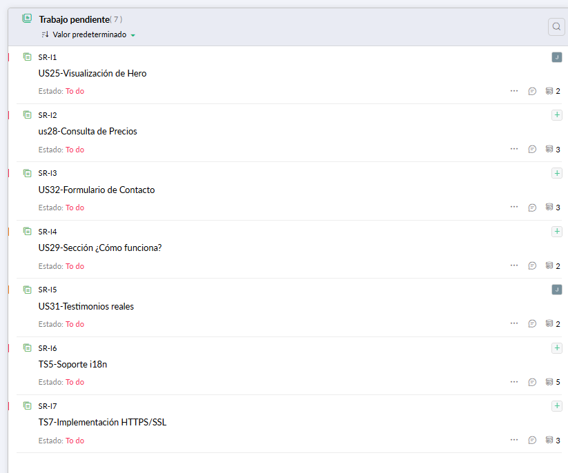

| Orden | Tipo | ID   | Título                           | Descripción                                                                                         | Story Points |
| ----: | ---- | ---- | -------------------------------- | --------------------------------------------------------------------------------------------------- | ------------ |
|     1 | US   | US25 | Visualización de Hero            | Como visitante, deseo ver la propuesta de valor de SafeRoute para entender rápidamente el servicio. | 2            |
|     2 | US   | US28 | Consulta de Precios              | Como visitante, deseo ver los planes y precios para evaluar mi presupuesto.                         | 3            |
|     3 | US   | US32 | Formulario de Contacto           | Como visitante, deseo enviar mis datos para solicitar información o una demo comercial.             | 3            |
|     4 | US   | US29 | Sección ¿Cómo funciona?          | Como visitante, deseo entender el proceso del servicio antes de contratar.                          | 2            |
|     5 | US   | US31 | Testimonios Reales               | Como visitante, deseo leer reseñas para confiar en la marca.                                        | 2            |
|     6 | TS   | TS5  | Soporte i18n                     | Como sistema, deseo soportar múltiples idiomas para internacionalizar la Landing Page.              | 5            |
|     7 | TS   | TS7  | Implementación HTTPS/SSL         | Como sistema, deseo cifrar comunicaciones para proteger datos sensibles.                            | 3            |
|     8 | TS   | TS2  | Integración Leaflet Maps         | Como sistema, deseo integrar Leaflet para visualizar rutas dinámicas en tiempo real.                | 5            |
|     9 | US   | US1  | Contratar Plan                   | Como administrador, deseo elegir un plan para digitalizar y escalar mi operación.                   | 5            |
|    10 | US   | US2  | Registro de Conductores          | Como administrador, deseo crear cuentas de conductores para asignar responsabilidades.              | 3            |
|    11 | US   | US4  | Alta de Alumnos                  | Como administrador, deseo registrar alumnos para incluirlos en rutas.                               | 5            |
|    12 | US   | US3  | Registro de Padres               | Como administrador, deseo registrar padres para habilitar monitoreo.                                | 3            |
|    13 | TS   | TS1  | JWT Authentication               | Como sistema, deseo emitir tokens JWT para asegurar sesiones autenticadas.                          | 5            |
|    14 | US   | US5  | Creación de Rutas                | Como administrador, deseo crear rutas y paradas para optimizar tiempos.                             | 8            |
|    15 | US   | US6  | Asignación de Roles              | Como administrador, deseo asignar conductores a rutas para organizar operaciones.                   | 3            |
|    16 | TS   | TS3  | Persistencia de Tracking GPS     | Como sistema, deseo almacenar coordenadas GPS para mantener historial de viajes.                    | 5            |
|    17 | US   | US10 | Inicio de Trayecto               | Como conductor, deseo iniciar la ruta para notificar que estoy en camino.                           | 3            |
|    18 | US   | US11 | Marcación de Abordaje            | Como conductor, deseo registrar el abordaje para confirmar asistencia.                              | 5            |
|    19 | US   | US18 | Rastreo en Tiempo Real           | Como padre, deseo ver la movilidad en el mapa para calcular hora de llegada.                        | 8            |
|    20 | US   | US19 | Alerta de Proximidad             | Como padre, deseo recibir aviso cuando el vehículo esté cerca.                                      | 5            |
|    21 | TS   | TS6  | Sistema de Push Notifications    | Como sistema, deseo enviar notificaciones push automáticas para eventos críticos.                   | 5            |
|    22 | US   | US20 | Confirmación de Llegada          | Como padre, deseo saber si mi hijo llegó al colegio para estar tranquilo.                           | 3            |
|    23 | US   | US14 | Finalización de Ruta             | Como conductor, deseo cerrar la ruta para concluir el servicio.                                     | 2            |
|    24 | US   | US12 | Reporte de Incidencias           | Como conductor, deseo informar retrasos o problemas durante la ruta.                                | 5            |
|    25 | US   | US16 | Navegación Integrada             | Como conductor, deseo abrir mapas externos para usar la mejor ruta disponible.                      | 3            |
|    26 | TS   | TS8  | Soporte Offline para Conductores | Como sistema, deseo almacenar eventos temporalmente cuando no exista conexión.                      | 5            |
|    27 | US   | US7  | Analítica de Flota               | Como administrador, deseo revisar métricas de rendimiento operativo.                                | 8            |
|    28 | US   | US22 | Historial de Asistencia          | Como padre, deseo revisar asistencia mensual de mi hijo.                                            | 5            |
|    29 | US   | US15 | Bitácora de Viajes               | Como conductor, deseo consultar historial de viajes realizados.                                     | 3            |
|    30 | US   | US23 | Perfil del Estudiante            | Como padre, deseo registrar alergias o datos médicos relevantes.                                    | 5            |
|    31 | US   | US24 | Chat con Soporte                 | Como padre, deseo reportar ausencias o dudas desde la app.                                          | 5            |
|    32 | US   | US13 | Botón de Pánico                  | Como conductor, deseo activar SOS en emergencias críticas.                                          | 8            |
|    33 | TS   | TS4  | Configuración Swagger/OpenAPI    | Como developer, deseo acceder a documentación interactiva para probar endpoints REST.               | 3            |

---

## Capítulo IV: Product Design

## 4.1. Style Guidelines

### 4.1.1. General Style Guidelines

El diseño de SafeRoute se fundamenta en decisiones visuales estratégicas destinadas a proyectar seguridad, fiabilidad y modernidad. El objetivo principal es construir una experiencia de usuario que genere confianza inmediata, tanto en los padres de familia que buscan tranquilidad como en los transportistas que necesitan eficiencia.

#### Colores

La selección cromática de SafeRoute no es meramente estética; responde a una psicología del color aplicada a la seguridad y el entorno escolar, garantizando accesibilidad y jerarquía visual. Cada tono desempeña una función específica en la interfaz:


- Azul Noche Profundo - #1A1A2E: Este color transmite autoridad, seriedad máxima y seguridad corporativa. En SafeRoute, se utiliza estratégicamente en el texto principal del logotipo y como fondo en secciones críticas de cierre, como el CTA final y el footer, para anclar la percepción de una plataforma robusta y confiable.

- Azul Marino - #1D3F6E y #16305a:Esta gama de azules medios y oscuros refuerza la percepción de una herramienta tecnológica, profesional y estable. Se emplean principalmente en títulos secundarios y elementos estructurales clave, estableciendo la jerarquía visual y la formalidad que el servicio requiere.

- Naranja Ámbar - #FFB74D: Este color funciona como el punto focal de acento y acción principal en SafeRoute, aportando vitalidad, energía y una conexión visual amigable con el entorno escolar. Se reserva exclusivamente para incentivar la acción en los botones de llamado a la acción principales y elementos destacados.

- Verde Éxito - #22C55E: Este color se asocia directamente con estados positivos, confirmación y seguridad. Se emplea de forma sutil en indicadores de estado (como el check en el mockup del teléfono) para validar acciones exitosas y reforzar la tranquilidad del usuario.

- Gris Neutro - #6B7280: Se ha seleccionado para el texto de cuerpo y párrafos largos. Ofrece una legibilidad excelente sobre fondos claros, reduciendo la fatiga visual y aportando un acabado limpio y moderno.

- Gris Claro y Neutral - #F8F9FB y #F4F7FA: Estos tonos muy claros se utilizan como fondos alternos para delimitar secciones (como el Hero, Planes o ¿Cómo funciona?). Su función es estructurar la página, proporcionando descansos visuales y una sensación de limpieza tecnológica y amplitud.

#### Tipografía

Se seleccionó la tipografía “Plus Jakarta Sans” como fuente principal para los títulos de la plataforma de SafeRoute por su estilo geométrico moderno y su capacidad para captar la atención del usuario con un toque tecnológico pero amigable. Se utiliza en pesos altos para asegurar que los encabezados sean visualmente impactantes, sólidos y de fácil lectura.


Asimismo, optamos por la tipografía “DM Sans” como fuente secundaria para los textos de cuerpo y navegación por su diseño extremadamente legible, limpio y neutro. Su apariencia estética y claridad garantizan una experiencia de uso accesible y agradable, reduciendo la fatiga visual del usuario al leer información detallada sobre funciones o planes.


En cuanto al tamaño, se utiliza jerárquicamente en toda la página para resaltar títulos principales, botones de acción y texto de soporte. Los tamaños más grandes en los encabezados guían al usuario rápidamente por los puntos clave del mensaje, mientras que los más pequeños en los párrafos aseguran la comprensión y la eficiencia en la lectura de detalles secundarios.

#### Branding

El branding de SafeRoute está diseñado para reflejar simplicidad, confianza y profesionalismo. El logo y los íconos adoptan un enfoque minimalista, con líneas claras y formas simples que comunican el propósito de seguridad de la plataforma. El diseño incluye un símbolo que combina un escudo y un marcador de posición, representado de tal manera que simboliza protección y monitoreo con una apariencia limpia que es fácilmente reconocible, tanto en entornos web como móviles.


#### Espaciado

El diseño de SafeRoute utiliza una estrategia de espacios en blanco diseñada para transmitir orden y claridad, factores críticos en una herramienta de seguridad escolar. En lugar de saturar la vista, aprovechamos márgenes amplios en los laterales de cada sección para que el usuario pueda diferenciar rápidamente entre los beneficios para padres, conductores y colegios. El contenido se mantiene estructurado mediante el uso de Flexbox y CSS Grid, lo que evita que la información se disperse y mantiene una jerarquía visual equilibrada que facilita la lectura de las características del servicio. Además, los rellenos (padding) en elementos como las tarjetas de planes y funciones garantizan una distribución adecuada del contenido.

#### Dimensiones para el tono de comunicación y lenguaje aplicado

En SafeRoute, definimos cuidadosamente el tono de nuestra comunicación para alinearlo con la misión de la plataforma: garantizar la seguridad y la tranquilidad en el transporte escolar para padres, conductores e instituciones educativas. Nuestro tono de voz busca proyectar confianza y control, combinando una comunicación clara, directa y altamente profesional.

Optamos por un tono formal pero empático, que permita a los padres de familia sentirse seguros al interactuar con funciones críticas como el monitoreo en vivo o las notificaciones de abordaje. Queremos que cada interacción refleje eficiencia para fomentar la puntualidad y el orden, pero también serenidad, asegurando que los usuarios sientan que el bienestar de los estudiantes es nuestra prioridad absoluta. Este equilibrio nos permite inspirar autoridad en la gestión logística, al tiempo que proyectamos cercanía y compromiso con la comunidad escolar.

Además, se han considerado los siguientes aspectos clave en el diseño de SafeRoute:

- Consistencia: La coherencia visual y textual es fundamental para brindar una experiencia confiable. Todos los elementos, desde los mensajes de estado hasta las etiquetas de los botones, mantienen una línea comunicativa uniforme. Esto facilita que los usuarios se familiaricen rápido con el sistema, algo vital en una operación diaria que requiere precisión.
- Navegación: La estructura ha sido pensada para ser lógica y sin fricciones. Los usuarios pueden acceder rápidamente a la información relevante según su rol, ya sea para verificar una ruta o reportar una incidencia. Los menús son minimalistas para evitar confusiones y optimizar el tiempo de respuesta en entornos dinámicos.
- Accesibilidad: La plataforma está optimizada para ser inclusiva y funcional en diversos contextos. Mediante el uso de etiquetas claras y un diseño responsivo, aseguramos que la información sea legible tanto para un administrador en una oficina como para un padre que revisa el celular en movimiento, garantizando una experiencia de uso fluida para todos.

#### Elementos de diseño

Además de los lineamientos generales sobre colores, tipografía y branding, en el diseño visual de SafeRoute se han aplicado de manera consciente diversos elementos fundamentales del diseño gráfico que enriquecen la experiencia del usuario y refuerzan la identidad de seguridad de la plataforma.

Uno de los elementos clave es la **línea**, utilizada sutilmente para separar secciones y delimitar las tarjetas de planes y roles, lo que organiza visualmente la interfaz y guía la lectura sin saturar al usuario. El **color** cumple un rol fundamental no solo en la identidad, sino en la comunicación funcional; la paleta incluye el azul noche para la autoridad, el naranja ámbar para la acción y el verde para confirmaciones, seleccionados por su capacidad para transmitir estados de seguridad y éxito.

En cuanto al **tamaño**, se utiliza jerárquicamente para resaltar títulos, botones y texto de soporte. Los tamaños más grandes en los encabezados captan la atención en puntos clave como el Hero, mientras que los más pequeños se emplean para detalles secundarios en las tarjetas de características, mejorando la comprensión y la eficiencia. Por su parte, la **textura** es limpia y moderna, gracias al uso de fondos suaves y superficies blancas que aportan una sensación de amplitud tecnológica sin distraer de las funciones de monitoreo.

El **espacio** es uno de los elementos más destacados del diseño de SafeRoute. Se han implementado márgenes amplios y rellenos generosos entre secciones, lo que permite una interfaz despejada y cómoda para padres y conductores. A nivel de **brillo** (value), se aplican contrastes claros que diferencian los botones de acción del fondo, guiando al usuario de forma intuitiva hacia la conversión.

Respecto a las **formas**, se ha optado por geometrías amigables con bordes redondeados en botones y tarjetas. Estos acabados suavizados no solo mejoran la estética profesional, sino que también transmiten una imagen de accesibilidad y cercanía, alineándose con una herramienta diseñada para el cuidado y protección escolar.

#### Principios de diseño

En cuanto a los principios de diseño, el **contraste** se emplea para asegurar que los elementos críticos, como los llamados a la acción (CTA) de "Ver planes" o las etiquetas de "Sistema en vivo", sean claramente visibles y resalten sobre los fondos neutros. Este principio es fundamental para la accesibilidad visual, permitiendo que tanto padres como conductores identifiquen los puntos de interacción más importantes de la plataforma de manera inmediata.

La **repetición** de colores como el azul noche y el naranja ámbar, junto con una iconografía coherente de escudos y mapas, refuerza la familiaridad y la consistencia del sistema visual. Al utilizar componentes visuales recurrentes en toda la landing, los usuarios comprenden rápidamente la función de cada sección, lo que reduce la curva de aprendizaje al interactuar con las herramientas de monitoreo.

La **alineación** contribuye a la profesionalidad y solidez del diseño: la estructura de la página, los listados de roles y las tarjetas de precios mantienen una disposición coherente lograda mediante el uso de Flexbox y CSS Grid. Esta organización clara y alineada facilita una navegación intuitiva, transmitiendo el orden necesario para una plataforma de gestión logística.

Por último, el principio de **proximidad** agrupa de manera lógica los elementos relacionados, como los iconos de las funciones con sus respectivas descripciones o los beneficios específicos para cada rol. Al mantener los elementos vinculados cerca entre sí, se mejora significativamente la lectura y la comprensión de cada bloque de información, permitiendo que el usuario asocie rápidamente las soluciones de SafeRoute con sus necesidades específicas.

Estos elementos y principios no se aplican de forma aislada, sino como parte integral de un sistema visual que busca ser funcional, estético y coherente con la misión de SafeRoute: digitalizar y dar seguridad al transporte escolar a través de una experiencia clara, confiable y eficiente.

### 4.1.2. Web Style Guidelines

El diseño web de SafeRoute está optimizado para proporcionar una experiencia de usuario fluida y profesional, centrada en la legibilidad y la facilidad de navegación. Se emplean estructuras de contenedores flexibles que permiten que el contenido se organice de manera clara, utilizando amplios espacios en blanco para evitar la saturación visual y garantizar la accesibilidad de la información crítica sobre seguridad. Los elementos visuales, como tarjetas de planes y secciones de roles, mantienen proporciones equilibradas para guiar la vista del usuario de forma jerárquica.

En cuanto a la interactividad, la plataforma utiliza una lógica de componentes claramente identificables. Los botones de acción (CTAs) emplean colores contrastantes y estados visuales (como hover y active) que ofrecen una retroalimentación inmediata, reforzando la confianza del usuario al interactuar con el sistema. La navegación se apoya en transiciones suaves y menús persistentes que aseguran que las herramientas principales, como el sistema de internacionalización (i18n), estén siempre al alcance del usuario, facilitando un flujo de trabajo intuitivo y eficiente dentro de la landing page.


_Nota_: Elaboración propia.

## 4.2. Information Architecture

### 4.2.1. Organization Systems

En el sistema SafeRoute, se emplea la organización jerárquica (visual hierarchy) para destacar información crítica, como el mapa de monitoreo en tiempo real, las alertas de emergencia y las notificaciones de abordaje de los alumnos en los dashboards principales. Esta jerarquía visual permite que tanto padres como conductores identifiquen de forma inmediata los datos más relevantes según el contexto operativo, relegando datos secundarios del perfil a niveles inferiores.

Asimismo, se aplica una organización secuencial (step-by-step) en procesos que requieren una guía estructurada. En la landing page, este sistema se evidencia en la sección "¿Cómo funciona?", donde se orienta al visitante a través de 5 pasos para la adopción del servicio. En la Web Application, este esquema se utilizará para el flujo de registro de paradas y asistencia que el conductor debe seguir durante su ruta, asegurando una progresión lógica que minimice errores de registro.

Respecto a los esquemas de categorización, no se utilizan organizaciones alfabéticas o matriciales complejas. En su lugar, se emplea una organización cronológica para la visualización de datos históricos, permitiendo que los padres de familia revisen los registros pasados de asistencias y llegadas de sus hijos de manera ordenada por fecha y hora. Además, el contenido se clasifica según audiencia, segmentando las interfaces y funcionalidades de acuerdo con los dos User Personas identificados: Conductores, enfocados en la gestión de ruta y paradas, y Padres de Familia, orientados al monitoreo y recepción de avisos de seguridad.

### 4.2.2. Labeling Systems

El sistema de etiquetado de SafeRoute ha sido desarrollado bajo un criterio de funcionalidad operativa, buscando que cada término actúe como una señal clara que reduzca el esfuerzo cognitivo de los usuarios. Se han seleccionado etiquetas descriptivas que permiten una navegación intuitiva tanto en el proceso de descubrimiento (Landing Page) como en el uso crítico de la aplicación (Web Application).

**Landing Page**

- **Funciones**: Agrupa las capacidades técnicas y herramientas de gestión de la plataforma.
- **Roles**: Define los accesos y beneficios específicos para los dos perfiles del sistema.
- **Planes**: Estructura la oferta comercial basándose en la escala de la flota de transporte.
- **¿Cómo funciona?**: Etiqueta de apoyo que resuelve dudas sobre la implementación del servicio.
- **Comenzar**: Botón de acción principal diseñado para motivar la conversión inmediata.

**Aplicación Web – Conductores**

- **Mis Rutas**: Vista principal donde se gestionan los trayectos diarios asignados.
- **Lista de Alumnos**: Relación detallada de estudiantes por paradas, optimizando el tiempo de recogida.
- **Estado de Abordaje**: Sistema de etiquetas rápidas ("Abordado", "Ausente", "En espera") que permite al conductor registrar la asistencia con un solo toque.
- **Iniciar Ruta**: Etiqueta de alta visibilidad que dispara el envío de alertas GPS a los padres.
- **Botón de Incidencia**: Acceso directo para reportar eventos imprevistos (tráfico, accidentes) de forma estandarizada.

**Aplicación Web – Padres de Familia**

- **Monitoreo**: Sección central que integra el mapa en tiempo real y la ubicación de la unidad.
- **Historial de Viajes**: Registro cronológico de las horas de recogida y entrega de sus hijos.
- **Alertas**: Centro de notificaciones sobre la proximidad del bus o confirmaciones de llegada.
- **Datos del Bus**: Información transparente sobre el vehículo y el conductor asignado para generar confianza.

### 4.2.3. SEO Tags and Meta Tags

1. **Landing Page**

**Charset**

`<meta charset="UTF-8" />`

Esta línea establece la codificación universal de caracteres. Su función es garantizar que el navegador interprete correctamente los textos del sistema i18n, asegurando que tildes, la letra "ñ" y símbolos especiales se visualicen sin errores en español e inglés, evitando una mala experiencia de lectura.

**Viewport (Responsive)**

`<meta name="viewport" content="width=device-width, initial-scale=1.0"/>`

Controla el escalado de la página en diferentes dispositivos. Su función es hacer que la landing sea responsiva, ajustando el ancho del contenido al tamaño de la pantalla. Esto es vital para que los padres de familia visualicen la información de manera legible desde sus smartphones.

**Title (SEO)**

`<title>SafeRoute — Transporte Escolar Seguro</title>`

Define el título que aparece en la pestaña del navegador y en los resultados de búsqueda. Su función es proporcionar una identificación inmediata de la marca y su propósito principal, siendo un factor crítico para el posicionamiento orgánico.

**Meta Description (SEO)**

`<meta name="description" content="Plataforma integral para el monitoreo en tiempo real, control de asistencia y comunicación segura entre conductores y padres de familia.">`

Provee un resumen conciso del contenido del sitio. Su función es aparecer como el fragmento de texto (snippet) en Google, atrayendo a los usuarios al explicar claramente cómo SafeRoute resuelve la inseguridad en el transporte escolar.

**Meta Keywords (SEO)**

`<meta name="keywords" content="transporte escolar, monitoreo GPS, seguridad, SafeRoute, logística escolar, app bilingüe">`

Especifica palabras clave relevantes para la temática de la página. Su función es ayudar a los algoritmos de indexación a clasificar el sitio dentro del nicho de tecnología de transporte y seguridad educativa.

**Meta Author**

`<meta name="author" content="FiveTech Team">`
Identifica formalmente a los creadores de la plataforma. Su función es atribuir la autoría del proyecto al equipo de FiveTech, vinculando el desarrollo técnico con el startup responsable.

**Meta Copyright**

`<meta name="copyright" content="FiveTech 2026">`

Esta línea establece legalmente la propiedad intelectual de la página. Su función es indicar la titularidad de los derechos de autor y el año de vigencia, protegiendo el contenido y diseño del sitio.

**Meta Robots**

`<meta name="robots" content="index, follow">`

Instruye a los motores de búsqueda sobre cómo tratar el sitio. Su función es permitir que los "robots" incluyan la página en sus índices y sigan los enlaces internos, lo cual es fundamental para el crecimiento del tráfico hacia la plataforma.

**Meta Language**

`<html lang="en">`

Declara el idioma principal de la estructura del sitio. Su función es informar a los navegadores y buscadores que el texto base está en ingles, mejorando la segmentación del público objetivo internacionalmente.

### 4.2.4. Searching Systems

En esta sección se describen los mecanismos de asistencia y recuperación de información diseñados para SafeRoute. El objetivo primordial es evitar la desorientación del usuario ante el flujo constante de datos logísticos, garantizando que la información sobre rutas y alumnos sea accesible de manera inmediata.

**Vista del Conductor / Dueño de Unidad**

**1. Medios de ayuda para la búsqueda de datos**

- Barra de búsqueda operativa: Ubicada en los módulos de "Rutas" y "Lista de Alumnos" para acceso rápido.
- Autocompletado inteligente: Sugiere nombres de alumnos o puntos de parada conforme el conductor escribe, facilitando la operación en dispositivos móviles.
- Mensajes contextuales: En caso de no hallar un registro, el sistema ofrece opciones como "¿Desea registrar un nuevo alumno en esta parada?".
- Búsqueda por proximidad: Sugerencia automática de la siguiente parada basada en la ubicación GPS actual.

**2. Filtros y opciones**

- Por Nombre del Alumno: Localización directa de la ficha de contacto y datos de emergencia.
- Por Estado de Asistencia: Filtrado rápido de alumnos "Abordados", "Pendientes" o "Ausentes".
- Por Punto de Parada: Visualización de todos los estudiantes vinculados a un hito específico de la ruta.
- Por Turno: Filtrado entre rutas de "Recojo" (mañana) y "Retorno" (tarde).

**3. Visualización de resultados**

- Tarjetas de Alumno (Cards): Incluyen foto, nombre, grado y una etiqueta de estado de alta visibilidad.
- Indicadores de Color:
  - Amarillo: Alumno en espera.
  - Verde: Alumno ya abordó la unidad.
  - Rojo: Alumno reportado como ausente.
- Acciones rápidas: Botones directos para "Marcar Asistencia", "Llamar a Apoderado" o "Reportar Incidencia".

**Vista del Padre de Familia**

**1. Medios de ayuda para la búsqueda de datos**

- Buscador de historial: Permite localizar eventos específicos dentro de la bitácora de viajes del alumno.
- Sugerencias por fecha: Calendario interactivo para seleccionar días específicos de consulta.
- Acceso directo a Unidad: Buscador para identificar los datos del bus asignado mediante la placa o nombre del conductor.

**2. Filtros y opciones**

- Por Fecha: Consulta de registros de asistencia de días o meses anteriores.
- Por Tipo de Evento: Filtrado entre "Notificaciones de Proximidad", "Confirmación de Abordaje" y "Llegada al Destino".
- Por Estado del Viaje: Filtrado entre rutas "Completadas", "En curso" o "Canceladas".

**3. Visualización de resultados**

- Timeline de Eventos: Lista cronológica detallada con la hora exacta de cada suceso.
- Mapa de Resultados: Al buscar un historial, se muestra el trazado que siguió la unidad en esa fecha específica.
- Colores de Estado:
  - Check Verde: Evento completado con éxito.
  - Reloj Naranja: Retraso reportado en el punto de entrega.
  - Círculo Rojo: Registro de inasistencia justificada.

### 4.2.5. Navigation Systems

La navegación en SafeRoute ha sido diseñada para ser intuitiva y guiada mediante componentes de interfaz que permiten a los usuarios gestionar la seguridad del transporte de forma fluida y sin fricciones. En la landing page, se utiliza un sistema de desplazamiento vertical (smooth scroll) que permite explorar de forma narrativa los beneficios, los roles de usuario y los planes de suscripción, guiando al visitante estratégicamente hacia los llamados a la acción (CTAs) para el contacto. Esta navegación se apoya en una barra superior persistente (Sticky Nav) que incluye un selector de idioma (i18n), permitiendo cambiar el contexto lingüístico en cualquier punto del recorrido.

Dentro de la aplicación web, la navegación principal se organiza mediante una barra lateral fija (Sidebar) que otorga acceso inmediato a las secciones críticas: Monitoreo en Tiempo Real, Lista de Alumnos, Historial de Rutas, Alertas de Seguridad y Configuración de Perfil. Este diseño permite que, por ejemplo, un conductor pueda alternar entre su hoja de ruta y el reporte de incidencias con un solo toque, manteniendo siempre la visibilidad del estado del viaje.

La experiencia de navegación también se adapta dinámicamente según el tipo de usuario. Los Padres de Familia acceden a una vista simplificada centrada en el mapa y las notificaciones de sus hijos, mientras que los Conductores disponen de controles operativos más robustos. El uso de pestañas (tabs) y botones de acción rápida dentro de cada módulo asegura que el usuario pueda ejecutar tareas específicas, como marcar la asistencia o llamar a un apoderado, sin perder el contexto de la ruta activa, garantizando un flujo de trabajo coherente con la naturaleza crítica del servicio.

## 4.3. Landing Page UI Design

### 4.3.1. Landing Page Wireframe

A continuación, se presentan los wireframes de las principales secciones de la landing page. Cada imagen ilustra el diseño propuesto para las diferentes funcionalidades, flujos de navegación y elementos de interacción de la plataforma.

**Principios Aplicados**

- **Jerarquía visual clara:** Los contenidos se ordenan priorizando la información de confianza en el Hero Section (Seguridad y Gestión). Se guía al usuario progresivamente a través de las estadísticas de impacto, los beneficios específicos para padres y conductores, la tabla comparativa de planes y, finalmente, el tutorial operativo.

- **Consistencia visual:** Se mantuvieron patrones uniformes utilizando la tipografía Plus Jakarta Sans para títulos impactantes y DM Sans para la legibilidad del cuerpo. Se aplicó la paleta institucional (azul marino para seguridad y ámbar para alertas) de manera coherente en todos los componentes.

- **Contraste y accesibilidad:** Se garantizó un contraste elevado entre el texto y los fondos para facilitar la lectura en condiciones de luz exterior (común para conductores y padres en ruta). Los botones de acción cuentan con estados visuales claros para confirmar la interacción del usuario.

- **Optimización para dispositivos móviles:** Los wireframes y el diseño final contemplan una navegación móvil dedicada. Se implementó un menú lateral (sidebar) activado por un botón hamburguesa para ahorrar espacio, se ajustaron las cuadrículas (grids) a una sola columna para evitar el desplazamiento horizontal y se optimizaron las áreas de contacto en botones para una interacción táctil precisa.

- **Diseño inclusivo:** La estructura es totalmente compatible con el sistema i18n, permitiendo que el diseño se adapte dinámicamente al largo de las palabras en español e inglés. Además, se aseguró que la navegación sea lógica y accesible mediante teclado y lectores de pantalla, facilitando el uso para cualquier tipo de usuario.

##### Versión Desktop Web Browser:

En esta primera sección se presenta la pantalla Home de la landing page, donde se observa el encabezado principal con la propuesta de valor y el acceso al sistema de internacionalización (i18n). Se aprecia un botón call-to-action principal diseñado para captar el interés de los padres de familia y conductores independientes.


A continuación, se muestra la Sección de Características, donde se detallan los pilares y eficiencia que sustentan la plataforma SafeRoute, utilizando iconos y textos breves para una lectura rápida.


Se presenta la sección de Funcionalidades, la cual profundiza en las capacidades tecnológicas del sistema, como el monitoreo en tiempo real y las notificaciones automáticas.


El siguiente frame corresponde a los Roles del Sistema, donde se segmentan los beneficios específicos para cada usuario objetivo: los padres de familia, enfocados en la tranquilidad y el seguimiento, y los conductores, enfocados en la gestión operativa de la ruta.


Se presenta la sección de Planes, donde se muestra la estructura de precios y niveles de servicio, diseñada de forma escaneable para facilitar la toma de decisiones.


A continuación, se detalla el flujo de uso del sistema en la sección "¿Cómo funciona?". Este tutorial visual guía al nuevo usuario a través de los pasos necesarios para implementar la plataforma con éxito.


Finalmente, se presenta la sección de Footer, la cual incluye el cierre de la página con los créditos correspondientes al equipo de desarrollo de FiveTech.


#### Versión Mobile Web Browser

A continuación, se presenta la adaptación responsiva de SafeRoute para dispositivos móviles. En estas vistas se observa la reorganización de los elementos en una estructura vertical y el uso de componentes optimizados para la interacción táctil.

Pantalla Home y Menú Lateral (Sidebar):
Se muestra la adaptación del Hero Section y el funcionamiento del menú hamburguesa, el cual despliega una barra lateral para facilitar la navegación en pantallas pequeñas sin obstruir el contenido.


Secciones de Características y Funcionalidades en Móvil:
Los pilares de seguridad y las capacidades tecnológicas del sistema se reorganizan en una sola columna. Esto permite que los iconos y textos descriptivos mantengan un tamaño adecuado para la lectura táctil, evitando que el usuario deba realizar zoom para comprender las funciones de monitoreo y alertas.


Sección de Roles del Sistema en Móvil:
Se adapta la segmentación de beneficios para padres y conductores mediante un flujo vertical. Cada rol se presenta de forma independiente para asegurar que el impacto visual de los beneficios específicos no se pierda en pantallas de dimensiones reducidas.


Planes, Tutorial y Footer Móvil:
La tabla de precios se transforma en tarjetas individuales desplazables de arriba hacia abajo, seguida del flujo paso a paso del tutorial. El cierre de página se optimiza para mostrar los créditos de FiveTech de manera compacta al final del recorrido del usuario.


### 4.3.2. Landing Page Mock-up

A continuación, se presentan los mock-ups de las principales secciones de la landing page. Cada imagen ilustra el diseño propuesto para las diferentes funcionalidades, flujos de navegación y elementos de interacción de la plataforma.

En esta primera sección se presenta la pantalla Home de la landing page, donde se observa el encabezado principal con la propuesta de valor y el acceso al sistema de internacionalización (i18n). Se aprecia un botón call-to-action principal diseñado para captar el interés de los padres de familia y conductores independientes.


A continuación, se muestra la Sección de Características, donde se detallan los pilares y eficiencia que sustentan la plataforma SafeRoute, utilizando iconos y textos breves para una lectura rápida.


Se presenta la sección de Funcionalidades, la cual profundiza en las capacidades tecnológicas del sistema, como el monitoreo en tiempo real y las notificaciones automáticas.


El siguiente frame corresponde a los Roles del Sistema, donde se segmentan los beneficios específicos para cada usuario objetivo: los padres de familia, enfocados en la tranquilidad y el seguimiento, y los conductores, enfocados en la gestión operativa de la ruta.


Se presenta la sección de Planes, donde se muestra la estructura de precios y niveles de servicio, diseñada de forma escaneable para facilitar la toma de decisiones comerciales.


A continuación, se detalla el flujo de uso del sistema en la sección "¿Cómo funciona?". Este tutorial visual guía al nuevo usuario a través de los pasos necesarios para implementar la plataforma con éxito.


Finalmente, se presenta la sección de Footer, la cual incluye el cierre de la página con los créditos correspondientes al equipo de desarrollo de FiveTech.


#### Versión Mobile Web Browser

A continuación, se presentan los mock-ups de la versión móvil de la aplicación. Cada imagen muestra la adaptación responsiva de las principales funcionalidades y secciones diseñadas para ofrecer una experiencia de usuario optimizada en dispositivos móviles.

Pantalla Home y Menú Lateral (Sidebar):
Se muestra la adaptación del Hero Section y el funcionamiento del menú hamburguesa, el cual despliega una barra lateral para facilitar la navegación en pantallas pequeñas sin obstruir el contenido.


Secciones de Características y Funcionalidades en Móvil:
Los pilares de seguridad y las capacidades tecnológicas del sistema se reorganizan en una sola columna. Esto permite que los iconos y textos descriptivos mantengan un tamaño adecuado para la lectura táctil, evitando que el usuario deba realizar zoom para comprender las funciones de monitoreo y alertas.


Sección de Roles del Sistema en Móvil:
Se adapta la segmentación de beneficios para padres y conductores mediante un flujo vertical. Cada rol se presenta de forma independiente para asegurar que el impacto visual de los beneficios específicos no se pierda en pantallas de dimensiones reducidas.


Planes, Tutorial y Footer Móvil:
La tabla de precios se transforma en tarjetas individuales desplazables de arriba hacia abajo, seguida del flujo paso a paso del tutorial. El cierre de página se optimiza para mostrar los botones de contacto y los créditos de FiveTech de manera compacta y accesible al final del recorrido del usuario.


## 4.4. Web Applications UX/UI Design

### 4.4.1. Web Applications Wireframes

Los siguientes wireframes representan la arquitectura visual de la aplicación web de SafeRoute, diseñada para centralizar la gestión de seguridad y logística del transporte escolar.

#### Principios aplicados

- Jerarquía funcional clara: El flujo de navegación prioriza las acciones críticas para la seguridad, como el acceso al mapa de rastreo en vivo y la gestión de alertas de pánico.

- Consistencia y patrones de diseño: Se mantiene la uniformidad visual en componentes de formularios y tablas de datos, asegurando una curva de aprendizaje mínima para todos los usuarios.

- Accesibilidad en interfaces: Se implementaron contrastes elevados y fuentes legibles (Plus Jakarta Sans), facilitando el uso en dispositivos móviles y de escritorio.

- Diseño adaptativo: El diseño es responsivo, permitiendo que la plataforma sea funcional tanto en estaciones de monitoreo (Desktop) como en tablets de conductores.

#### Versión Desktop Wireframes - Acceso y Configuración (Universal)

##### Autenticación y Acceso

Registro de Cuenta
Pantalla unificada de registro donde el usuario selecciona su rol (Padre, Conductor o Administrador) y completa sus datos básicos. Es el punto de partida para que cualquier actor del sistema pueda interactuar con la plataforma.


Inicio de Sesión (Login) Interfaz de acceso donde los usuarios ingresan sus credenciales. El sistema valida el rol del usuario y lo redirige automáticamente a su panel de control correspondiente.


Cambio de Contraseña Formulario de seguridad que permite restablecer el acceso mediante la verificación de identidad tras un código, garantizando que solo el propietario de la cuenta pueda modificar sus credenciales.


#### Versión Desktop Wireframes - Administradores

##### Configuración y Gestión Administrativa

Panel de Inicio y Navegación (US26)

Dashboard central que organiza todos los módulos del sistema a través de un sidebar lateral, facilitando el salto entre la gestión de rutas, alumnos y reportes.


Asignación de Roles (US6)

Módulo exclusivo para el administrador donde se definen los permisos específicos de cada usuario registrado, garantizando la integridad de los datos.


##### Gestión Comercial y Planes

Contratación de Planes (US1)

Vista comercial que permite al dueño de la unidad o institución seleccionar y contratar el nivel de servicio adecuado según la cantidad de buses y alumnos.


Consulta de Precios y Tarifas (US28)

Sección informativa donde se detallan los costos operativos y las tarifas vigentes para la gestión del transporte escolar.


##### Gestión de Logística y Alumnos

Alta y Gestión de Alumnos (US4, US23)

Interfaz conectada a la API que permite visualizar la lista completa de estudiantes, agregar nuevos registros o actualizar la información de los existentes.


Registro de Conductores (US2)

Formulario dedicado a la creación del perfil del conductor, donde se almacenan sus datos personales, licencias y contacto de emergencia.


Registro de Padres (US3)

Formulario dedicado a la creación del perfil del padre de familia, donde se almacenan sus datos personales y estudiante del cual es apoderado.


Creación y Edición de Rutas (US5)

Herramienta de diseño logístico donde el administrador traza los recorridos, define paradas clave y asigna los tiempos estimados de viaje.


#### Versión Desktop Wireframes - Conductores

##### Operación de Viaje

Inicio de Trayecto (US10)

Pantalla de activación donde el conductor confirma que está listo para empezar el recorrido. Al hacer clic en "Iniciar Viaje", se dispara el rastreo GPS para los padres.


Marcación de Abordaje (US11)

Lista interactiva de alumnos por parada. El conductor marca con un solo toque quién ha subido al bus, actualizando el estado de asistencia en tiempo real.


Finalización de Ruta (US14)

Vista de cierre donde el conductor reporta el término del trayecto, asegurando que todos los alumnos hayan descendido en sus destinos correspondientes.


Bitácora de Viajes Histórica (US15)

Resumen diario de los trayectos realizados, permitiendo al conductor revisar las horas de inicio, fin e incidencias ocurridas durante sus turnos.


##### Seguridad y Alertas

Reporte de Incidencias en Ruta (US12)

Módulo para notificar eventos imprevistos como tráfico pesado, accidentes o fallas mecánicas, enviando una alerta automática a la central y a los padres.


Botón de Pánico (US13)

Funcionalidad de emergencia de un solo clic que envía una señal de auxilio inmediata a los administradores con la ubicación exacta del vehículo.


#### Versión Desktop Wireframes - Padres de Familia

##### Monitoreo y Supervisión

Rastreo en Tiempo Real (US18)

Vista de mapa interactivo que permite al padre seguir el movimiento del bus y ver el tiempo estimado para que llegue a su parada.


Acceso a Cámara Interna (US21)

Funcionalidad que permite visualizar el interior de la unidad mediante streaming de video, proporcionando una capa adicional de tranquilidad sobre la seguridad del niño.


Alerta de Proximidad (US19)

Interfaz de notificación que avisa visualmente cuando el bus entra en un radio cercano al hogar (ej. 500 metros), indicando que es momento de salir a la parada.


Confirmación de Llegada (US20)

Aviso automático que recibe el padre cuando la unidad llega satisfactoriamente al colegio o al punto de destino final.


Historial de Asistencia (US22)

Calendario detallado donde el padre puede revisar los días asistidos, las horas de abordaje y cualquier incidencia registrada en viajes pasados.


#### Versión Mobile Wireframes - Acceso y Configuración (Universal)

##### Autenticación y Acceso

Registro de Cuenta
Pantalla unificada de registro donde el usuario selecciona su rol (Padre, Conductor o Administrador) y completa sus datos básicos. Es el punto de partida para que cualquier actor del sistema pueda interactuar con la plataforma.


Inicio de Sesión (Login) Interfaz de acceso donde los usuarios ingresan sus credenciales. El sistema valida el rol del usuario y lo redirige automáticamente a su panel de control correspondiente.


Cambio de Contraseña Formulario de seguridad que permite restablecer el acceso mediante la verificación de identidad tras un código, garantizando que solo el propietario de la cuenta pueda modificar sus credenciales.


#### Versión Mobile Wireframes - Administradores

##### Configuración y Gestión Administrativa

Panel de Inicio y Navegación (US26)

Dashboard central que organiza todos los módulos del sistema a través de un sidebar lateral, facilitando el salto entre la gestión de rutas, alumnos y reportes.


Asignación de Roles (US6)

Módulo exclusivo para el administrador donde se definen los permisos específicos de cada usuario registrado, garantizando la integridad de los datos.


##### Gestión Comercial y Planes

Contratación de Planes (US1)

Vista comercial que permite al dueño de la unidad o institución seleccionar y contratar el nivel de servicio adecuado según la cantidad de buses y alumnos.


Consulta de Precios y Tarifas (US28)

Sección informativa donde se detallan los costos operativos y las tarifas vigentes para la gestión del transporte escolar.


##### Gestión de Logística y Alumnos

Alta y Gestión de Alumnos (US4, US24)

Interfaz conectada a la API que permite visualizar la lista completa de estudiantes, agregar nuevos registros o actualizar la información de los existentes.


Registro de Conductores (US2)

Formulario dedicado a la creación del perfil del conductor, donde se almacenan sus datos personales, licencias y contacto de emergencia.


Registro de Padres (US3)

Formulario dedicado a la creación del perfil del padre de familia, donde se almacenan sus datos personales y estudiante del cual es apoderado.


Creación y Edición de Rutas (US5)

Herramienta de diseño logístico donde el administrador traza los recorridos, define paradas clave y asigna los tiempos estimados de viaje.


#### Versión Mobile Wireframes - Conductores

##### Operación de Viaje

Inicio de Trayecto (US10)

Pantalla de activación donde el conductor confirma que está listo para empezar el recorrido. Al hacer clic en "Iniciar Viaje", se dispara el rastreo GPS para los padres.


Marcación de Abordaje (US11)

Lista interactiva de alumnos por parada. El conductor marca con un solo toque quién ha subido al bus, actualizando el estado de asistencia en tiempo real.


Finalización de Ruta (US14)

Vista de cierre donde el conductor reporta el término del trayecto, asegurando que todos los alumnos hayan descendido en sus destinos correspondientes.


Bitácora de Viajes Histórica (US15)

Resumen diario de los trayectos realizados, permitiendo al conductor revisar las horas de inicio, fin e incidencias ocurridas durante sus turnos.


##### Seguridad y Alertas

Reporte de Incidencias en Ruta (US12)

Módulo para notificar eventos imprevistos como tráfico pesado, accidentes o fallas mecánicas, enviando una alerta automática a la central y a los padres.


Botón de Pánico (US13)

Funcionalidad de emergencia de un solo clic que envía una señal de auxilio inmediata a los administradores con la ubicación exacta del vehículo.


#### Versión Mobile Wireframes - Padres de Familia

##### Monitoreo y Supervisión

Rastreo en Tiempo Real (US18)

Vista de mapa interactivo que permite al padre seguir el movimiento del bus y ver el tiempo estimado para que llegue a su parada.


Acceso a Cámara Interna (US21)

Funcionalidad que permite visualizar el interior de la unidad mediante streaming de video, proporcionando una capa adicional de tranquilidad sobre la seguridad del niño.


Alerta de Proximidad (US19)

Interfaz de notificación que avisa visualmente cuando el bus entra en un radio cercano al hogar (ej. 500 metros), indicando que es momento de salir a la parada.


Confirmación de Llegada (US20)

Aviso automático que recibe el padre cuando la unidad llega satisfactoriamente al colegio o al punto de destino final.


Historial de Asistencia (US22)

Calendario detallado donde el padre puede revisar los días asistidos, las horas de abordaje y cualquier incidencia registrada en viajes pasados.


### 4.4.2. Web Applications Wireflow Diagrams

#### Task Flow 1: Administrar cuenta

Objetivo del usuario: Gestionar la información de su cuenta y suscripción para mantener el acceso y los beneficios de la plataforma.

#### Pasos del Task Flow:

1. Crear una nueva cuenta en la sección de "Registrar usuario"

2. Guardar los campos registrados para el nuevo usuario

3. Ingresar a la aplicación con la cuenta creada en la sección "Ingresar con usuario"

4. Cambiar a la sección de "Cambio de Contraseña", en caso no se pueda acceder

5. Registrar la nueva contraseña

6. Ingresar a la aplicación con su cuenta y contraseña

7. Se muestra la sección de "Inicio" y el menú lateral

##### User Goal 1: Como suscriptor, quiero poder acceder a mi cuenta de la aplicación


##### User Goal 2: Como suscriptor, quiero poder cambiar mi contraseña para mantener mi cuenta asegurada.


#### Task Flow 2: Setup Logístico y Financiero del Servicio

Objetivo: Configurar la infraestructura operativa y los niveles de acceso para la gestión de la unidad.

#### Pasos del Task Flow:

1. Seleccionar y confirmar la "Contratación del Plan" (US1) según su flota.

2. Acceder a la "Asignación de Roles" (US6) para dar permisos de edición del equipo.

3. Registrar los datos del personal operativo en "Registro de Conductor" (US2).

4. Trazar los puntos de parada y tiempos en "Creación de Rutas" (US5).

5. El sistema genera el balance de costos visibles en "Consulta de Precios" (US28).

##### User Goal 3: Como administrador, quiero ingresar nuevos conductores y crear sus nuevas rutas.


##### User Goal 4: Como administrador, quiero organizar los roles y rutas de manera centralizada.


##### User Goal 5: Como administrador, quiero mejorar las características de la aplicación con un nuevo plan.


#### A. Segmento: Conductores

#### Task Flow 3: Gestión de Abordaje y Control de Alumnos

Objetivo: Registrar el inicio de la ruta y validar la subida de los estudiantes a la unidad mediante sincronización en la nube.

#### Pasos del Task Flow:

1. El conductor ingresa al sistema y selecciona la ruta asignada en su panel principal.

2. Acciona el control "Iniciar Trayecto" (US10), habilitando la transmisión de coordenadas GPS.

3. El sistema realiza una petición GET a la API (US43) para listar a los alumnos de esa ruta específica.

4. En cada parada, el conductor localiza al estudiante en la lista y pulsa "Marcación de Abordaje" (US11).

5. El sistema genera un registro de tiempo (timestamp) y actualiza el estado del pasajero a "En ruta".

6. Al llegar al destino institucional, el conductor pulsa "Finalización de Ruta" (US14).

##### User Goal 6: Como Conductor, quiero tener un control claro de los alumnos durante la ruta.


##### User Goal 7: Cómo conductor, quiero brindar un servicio más profesional y confiable.


### Task Flow 4: Seguridad Crítica e Incidencias en Ruta

Objetivo: Notificar imprevistos logísticos y activar protocolos de auxilio inmediato ante situaciones de riesgo.

### Pasos del Task Flow:

1. Durante la navegación activa, el conductor identifica un obstáculo o emergencia.

2. Ingresa al módulo de seguridad del Dashboard.

3. Selecciona una categoría predefinida en "Reporte de Incidencias" (US12) para informar retrasos.

4. En caso de peligro inminente, presiona el "Botón de Pánico" (US13) durante 2 segundos.

5. El sistema dispara una alerta roja a emergencias y notificaciones a los padres y administrador.

6. Tras la resolución, el conductor revisa el registro en su "Bitácora de Viajes" (US15).

##### User Goal 8: Como conductor, quiero comunicar alguna incidencia u avance de la ruta durante el viaje.


##### User Goal 9: Como conductor, quiero una manera inmediata de informar una emergencia.


### B. Segmento: Padres de Familia

### Task Flow 5: Monitoreo Parental y Supervisión Visual

Objetivo: Supervisar la ubicación geográfica y el estado interno de la unidad escolar durante el trayecto.

### Pasos del Task Flow:

1. El padre inicia sesión y accede al seguimiento del bus asignado a su hijo.

2. El sistema renderiza el mapa con la "Ubicación en Tiempo Real" (US18) del vehículo.

3.El usuario activa el switch de "Acceso a la Cámara" (US21) para abrir la transmisión de video.

4. El sistema valida los permisos y muestra el video en vivo.

5. Al entrar en el radio de 500m, el sistema proyecta la "Alerta de Proximidad" (US19).

#### User Goal 10: Cómo padre de familia, quiero estar informado de ubicación y situación en tiempo real del vehiculo.


#### User Goal 11: Cómo padre de familia, quiero recibir notificaciones sin tener que preguntar.


### Task Flow 6: Auditoría de Asistencia y Verificación de Entrega

Objetivo: Validar el cumplimiento del servicio y consultar el historial de seguridad del estudiante.

### Pasos del Task Flow:

1. El padre recibe en pantalla la "Confirmación de Llegada" (US20) del bus al destino.

2. El sistema registra el cierre del viaje en el perfil del alumno.

3. El usuario se dirige al módulo de "Historial de Asistencia" (US22).

4. Selecciona el rango de fechas para auditar los horarios de recogida y entrega.

5. El sistema genera un reporte visual de la puntualidad del servicio.

#### User Goal 12: Cómo padre de familia, quiero saber si mi hijo abordó el transporte y quedo registrado.


### 4.4.3. Web Applications Mock-ups

#### Versión Desktop Mockups - Acceso y Configuración (Universal)

##### Autenticación y Acceso

Registro de Cuenta
Pantalla unificada de registro donde el usuario selecciona su rol (Padre, Conductor o Administrador) y completa sus datos básicos. Es el punto de partida para que cualquier actor del sistema pueda interactuar con la plataforma.


Inicio de Sesión (Login) Interfaz de acceso donde los usuarios ingresan sus credenciales. El sistema valida el rol del usuario y lo redirige automáticamente a su panel de control correspondiente.


Cambio de Contraseña Formulario de seguridad que permite restablecer el acceso mediante la verificación de identidad tras un código, garantizando que solo el propietario de la cuenta pueda modificar sus credenciales.


#### Versión Desktop Mockups - Administradores

##### Configuración y Gestión Administrativa

Panel de Inicio y Navegación (US26)

Dashboard central que organiza todos los módulos del sistema a través de un sidebar lateral, facilitando el salto entre la gestión de rutas, alumnos y reportes.


Asignación de Roles (US6)

Módulo exclusivo para el administrador donde se definen los permisos específicos de cada usuario registrado, garantizando la integridad de los datos.


##### Gestión Comercial y Planes

Contratación de Planes (US1)

Vista comercial que permite al dueño de la unidad o institución seleccionar y contratar el nivel de servicio adecuado según la cantidad de buses y alumnos.


Consulta de Precios y Tarifas (US28)

Sección informativa donde se detallan los costos operativos y las tarifas vigentes para la gestión del transporte escolar.


##### Gestión de Logística y Alumnos

Alta y Gestión de Alumnos (US4, US23)

Interfaz conectada a la API que permite visualizar la lista completa de estudiantes, agregar nuevos registros o actualizar la información de los existentes.


Registro de Conductores (US2)

Formulario dedicado a la creación del perfil del conductor, donde se almacenan sus datos personales, licencias y contacto de emergencia.


Registro de Padres (US3)

Formulario dedicado a la creación del perfil del padre de familia, donde se almacenan sus datos personales y estudiante del cual es apoderado.


Creación y Edición de Rutas (US5)

Herramienta de diseño logístico donde el administrador traza los recorridos, define paradas clave y asigna los tiempos estimados de viaje.


#### Versión Desktop Mockups - Conductores

##### Operación de Viaje

Inicio de Trayecto (US10)

Pantalla de activación donde el conductor confirma que está listo para empezar el recorrido. Al hacer clic en "Iniciar Viaje", se dispara el rastreo GPS para los padres.


Marcación de Abordaje (US11)

Lista interactiva de alumnos por parada. El conductor marca con un solo toque quién ha subido al bus, actualizando el estado de asistencia en tiempo real.


Finalización de Ruta (US14)

Vista de cierre donde el conductor reporta el término del trayecto, asegurando que todos los alumnos hayan descendido en sus destinos correspondientes.


Bitácora de Viajes Histórica (US15)

Resumen diario de los trayectos realizados, permitiendo al conductor revisar las horas de inicio, fin e incidencias ocurridas durante sus turnos.


##### Seguridad y Alertas

Reporte de Incidencias en Ruta (US12)

Módulo para notificar eventos imprevistos como tráfico pesado, accidentes o fallas mecánicas, enviando una alerta automática a la central y a los padres.


Botón de Pánico (US13)

Funcionalidad de emergencia de un solo clic que envía una señal de auxilio inmediata a los administradores con la ubicación exacta del vehículo.


#### Versión Desktop Wireframes - Padres de Familia

##### Monitoreo y Supervisión

Rastreo en Tiempo Real (US18)

Vista de mapa interactivo que permite al padre seguir el movimiento del bus y ver el tiempo estimado para que llegue a su parada.


Acceso a Cámara Interna (US21)

Funcionalidad que permite visualizar el interior de la unidad mediante streaming de video, proporcionando una capa adicional de tranquilidad sobre la seguridad del niño.


Alerta de Proximidad (US19)

Interfaz de notificación que avisa visualmente cuando el bus entra en un radio cercano al hogar (ej. 500 metros), indicando que es momento de salir a la parada.


Confirmación de Llegada (US20)

Aviso automático que recibe el padre cuando la unidad llega satisfactoriamente al colegio o al punto de destino final.


Historial de Asistencia (US22)

Calendario detallado donde el padre puede revisar los días asistidos, las horas de abordaje y cualquier incidencia registrada en viajes pasados.


#### Versión Mobile Mockups - Acceso y Configuración (Universal)

##### Autenticación y Acceso

Registro de Cuenta
Pantalla unificada de registro donde el usuario selecciona su rol (Padre, Conductor o Administrador) y completa sus datos básicos. Es el punto de partida para que cualquier actor del sistema pueda interactuar con la plataforma.


Inicio de Sesión (Login) Interfaz de acceso donde los usuarios ingresan sus credenciales. El sistema valida el rol del usuario y lo redirige automáticamente a su panel de control correspondiente.


Cambio de Contraseña Formulario de seguridad que permite restablecer el acceso mediante la verificación de identidad tras un código, garantizando que solo el propietario de la cuenta pueda modificar sus credenciales.


#### Versión Mobile Mockups - Administradores

##### Configuración y Gestión Administrativa

Panel de Inicio y Navegación (US26)

Dashboard central que organiza todos los módulos del sistema a través de un sidebar lateral, facilitando el salto entre la gestión de rutas, alumnos y reportes.


Asignación de Roles (US6)

Módulo exclusivo para el administrador donde se definen los permisos específicos de cada usuario registrado, garantizando la integridad de los datos.


##### Gestión Comercial y Planes

Contratación de Planes (US1)

Vista comercial que permite al dueño de la unidad o institución seleccionar y contratar el nivel de servicio adecuado según la cantidad de buses y alumnos.


Consulta de Precios y Tarifas (US22)

Sección informativa donde se detallan los costos operativos y las tarifas vigentes para la gestión del transporte escolar.


##### Gestión de Logística y Alumnos

Alta y Gestión de Alumnos (US4, US23)

Interfaz conectada a la API que permite visualizar la lista completa de estudiantes, agregar nuevos registros o actualizar la información de los existentes.


Registro de Conductores (US2)

Formulario dedicado a la creación del perfil del conductor, donde se almacenan sus datos personales, licencias y contacto de emergencia.


Registro de Padres (US3)

Formulario dedicado a la creación del perfil del padre de familia, donde se almacenan sus datos personales y estudiante del cual es apoderado.


Creación y Edición de Rutas (US5)

Herramienta de diseño logístico donde el administrador traza los recorridos, define paradas clave y asigna los tiempos estimados de viaje.


#### Versión Mobile Mockups - Conductores

##### Operación de Viaje

Inicio de Trayecto (US10)

Pantalla de activación donde el conductor confirma que está listo para empezar el recorrido. Al hacer clic en "Iniciar Viaje", se dispara el rastreo GPS para los padres.


Marcación de Abordaje (US11)

Lista interactiva de alumnos por parada. El conductor marca con un solo toque quién ha subido al bus, actualizando el estado de asistencia en tiempo real.


Finalización de Ruta (US14)

Vista de cierre donde el conductor reporta el término del trayecto, asegurando que todos los alumnos hayan descendido en sus destinos correspondientes.


Bitácora de Viajes Histórica (US15)

Resumen diario de los trayectos realizados, permitiendo al conductor revisar las horas de inicio, fin e incidencias ocurridas durante sus turnos.


##### Seguridad y Alertas

Reporte de Incidencias en Ruta (US12)

Módulo para notificar eventos imprevistos como tráfico pesado, accidentes o fallas mecánicas, enviando una alerta automática a la central y a los padres.


Botón de Pánico (US13)

Funcionalidad de emergencia de un solo clic que envía una señal de auxilio inmediata a los administradores con la ubicación exacta del vehículo.


#### Versión Mobile Mockups - Padres de Familia

##### Monitoreo y Supervisión

Rastreo en Tiempo Real (US18)

Vista de mapa interactivo que permite al padre seguir el movimiento del bus y ver el tiempo estimado para que llegue a su parada.


Acceso a Cámara Interna (US21)

Funcionalidad que permite visualizar el interior de la unidad mediante streaming de video, proporcionando una capa adicional de tranquilidad sobre la seguridad del niño.


Alerta de Proximidad (US19)

Interfaz de notificación que avisa visualmente cuando el bus entra en un radio cercano al hogar (ej. 500 metros), indicando que es momento de salir a la parada.


Confirmación de Llegada (US20)

Aviso automático que recibe el padre cuando la unidad llega satisfactoriamente al colegio o al punto de destino final.


Historial de Asistencia (US22)

Calendario detallado donde el padre puede revisar los días asistidos, las horas de abordaje y cualquier incidencia registrada en viajes pasados.


### 4.4.4. Web Applications User Flow Diagrams

### User Flows Desktop

#### Desktop User Flow 1:

Relacionado con User Goal 1:
Como suscriptor, quiero poder acceder a mi cuenta de la aplicación.

El usuario ingresa a la pantalla de inicio de sesión e introduce sus credenciales (correo y contraseña). Si los datos son correctos, el sistema valida la información y redirige al usuario a la sección principal "Inicio" junto con el menú lateral habilitado. En caso de no contar con una cuenta, el usuario puede dirigirse a la sección de registro, completar el formulario con sus datos personales y guardar el nuevo usuario para luego iniciar sesión.


#### Desktop User Flow 2:

Relacionado con User Goal 2:
Como suscriptor, quiero poder cambiar mi contraseña para mantener mi cuenta asegurada.

Desde la pantalla de inicio de sesión, el usuario selecciona la opción "Cambio de Contraseña". El sistema muestra un formulario donde el usuario ingresa su correo registrado y la nueva contraseña. Al confirmar, el sistema actualiza las credenciales y permite al usuario ingresar nuevamente con la nueva contraseña. Esto garantiza el acceso continuo incluso si se olvidó la contraseña anterior.


#### Desktop User Flow 3:

Relacionado con User Goal 3:
Como administrador, quiero ingresar nuevos conductores y crear sus nuevas rutas.

Tras iniciar sesión, el administrador accede al módulo de "Registro de Conductor" e ingresa los datos del personal operativo. Luego navega a la sección "Creación de Rutas", donde traza los puntos de parada, asigna tiempos estimados y vincula la ruta al conductor registrado. El sistema confirma el guardado y refleja los cambios en el panel de gestión.


#### Desktop User Flow 4:

Relacionado con User Goal 4:
Como administrador, quiero organizar los roles y rutas de manera centralizada.

Desde el panel principal, el administrador accede a "Asignación de Roles" para configurar los permisos de cada miembro del equipo, habilitando accesos de edición o solo lectura según corresponda. Posteriormente, puede revisar y reasignar rutas desde la vista centralizada, asegurando que cada conductor tenga su ruta correctamente vinculada.


#### Desktop User Flow 5:

Relacionado con User Goal 5:
Como administrador, quiero mejorar las características de la aplicación con un nuevo plan.

El administrador navega a la sección de "Contratación del Plan" y visualiza las opciones de suscripción disponibles según el tamaño de su flota. Al seleccionar un plan, es redirigido a la pasarela de pagos donde ingresa su información financiera y confirma la contratación. Una vez procesado el pago, el sistema actualiza los beneficios disponibles y el administrador puede consultar el balance de costos en "Consulta de Precios".


#### Desktop User Flow 6:

Relacionado con User Goal 6:
Como conductor, quiero tener un control claro de los alumnos durante la ruta.

El conductor inicia sesión y desde su panel principal selecciona la ruta asignada. Presiona "Iniciar Trayecto" para activar la transmisión GPS. El sistema carga automáticamente la lista de alumnos correspondiente a esa ruta. En cada parada, el conductor localiza al estudiante y registra su abordaje pulsando "Marcación de Abordaje". Al llegar al destino, presiona "Finalización de Ruta" para cerrar el trayecto.


#### Desktop User Flow 7:

Relacionado con User Goal 7:
Como conductor, quiero brindar un servicio más profesional y confiable.

El conductor accede a su "Bitácora de Viajes" para revisar el historial completo de sus trayectos anteriores, incluyendo horarios, estudiantes transportados e incidencias registradas. Esta información le permite identificar patrones, mejorar su puntualidad y contar con un registro formal de su desempeño ante el administrador.


#### Desktop User Flow 8:

Relacionado con User Goal 8:
Como conductor, quiero comunicar alguna incidencia u avance de la ruta durante el viaje.

Durante una ruta activa, el conductor detecta un imprevisto y accede al módulo de seguridad del Dashboard. Selecciona una categoría predefinida dentro de "Reporte de Incidencias" (retraso, desvío, obstáculo, etc.) y envía la notificación. El sistema propaga el aviso al administrador y a los padres afectados en tiempo real.


#### Desktop User Flow 9:

Relacionado con User Goal 9: Como conductor, quiero una manera inmediata de informar una emergencia.

Ante una situación de peligro inminente durante la ruta, el conductor mantiene presionado el "Botón de Pánico" por 2 segundos. El sistema dispara de forma automática una alerta roja hacia los servicios de emergencia, el administrador y los padres de familia de todos los alumnos a bordo. Tras la resolución del incidente, el conductor puede revisar el evento registrado en su Bitácora de Viajes.


#### Desktop User Flow 10:

Relacionado con User Goal 10:
Como padre de familia, quiero estar informado de la ubicación y situación en tiempo real del vehículo.

El padre inicia sesión y accede al seguimiento del bus asignado a su hijo. El sistema renderiza el mapa con la ubicación en tiempo real del vehículo. El usuario puede activar el switch de "Acceso a la Cámara" para visualizar la transmisión de video en vivo del interior de la unidad. Al acercarse al radio de 500 metros del destino, el sistema emite automáticamente una "Alerta de Proximidad".


#### Desktop User Flow 11:

Relacionado con User Goal 11: Como padre de familia, quiero recibir notificaciones sin tener que preguntar.

El padre recibe notificaciones automáticas del sistema en distintos momentos del trayecto: cuando el bus inicia la ruta, cuando se aproxima a su parada y ante cualquier incidencia reportada por el conductor. Estas alertas llegan sin necesidad de que el padre esté activamente consultando la aplicación, manteniéndolo informado de forma pasiva y continua.


#### Desktop User Flow 12:

Relacionado con User Goal 12:
Como padre de familia, quiero saber si mi hijo abordó el transporte y quedó registrado.

Una vez que el conductor marca el abordaje del estudiante, el padre recibe en pantalla una "Confirmación de Llegada" con la hora exacta del registro. El sistema almacena este evento en el "Historial de Asistencia", donde el padre puede seleccionar un rango de fechas para auditar los horarios de recogida y entrega, generando un reporte visual de la puntualidad del servicio.


### User Flows Mobile

#### Mobile User Flow 1:

Relacionado con User Goal 1:
Como suscriptor, quiero poder acceder a mi cuenta de la aplicación.

El usuario ingresa a la pantalla de inicio de sesión e introduce sus credenciales (correo y contraseña). Si los datos son correctos, el sistema valida la información y redirige al usuario a la sección principal "Inicio" junto con el menú lateral habilitado. En caso de no contar con una cuenta, el usuario puede dirigirse a la sección de registro, completar el formulario con sus datos personales y guardar el nuevo usuario para luego iniciar sesión.


#### Mobile User Flow 2:

Relacionado con User Goal 2:
Como suscriptor, quiero poder cambiar mi contraseña para mantener mi cuenta asegurada.

Desde la pantalla de inicio de sesión, el usuario selecciona la opción "Cambio de Contraseña". El sistema muestra un formulario donde el usuario ingresa su correo registrado y la nueva contraseña. Al confirmar, el sistema actualiza las credenciales y permite al usuario ingresar nuevamente con la nueva contraseña. Esto garantiza el acceso continuo incluso si se olvidó la contraseña anterior.


#### Mobile User Flow 3:

Relacionado con User Goal 3:
Como administrador, quiero ingresar nuevos conductores y crear sus nuevas rutas.

Tras iniciar sesión, el administrador accede al módulo de "Registro de Conductor" e ingresa los datos del personal operativo. Luego navega a la sección "Creación de Rutas", donde traza los puntos de parada, asigna tiempos estimados y vincula la ruta al conductor registrado. El sistema confirma el guardado y refleja los cambios en el panel de gestión.


#### Mobile User Flow 4:

Relacionado con User Goal 4:
Como administrador, quiero organizar los roles y rutas de manera centralizada.

Desde el panel principal, el administrador accede a "Asignación de Roles" para configurar los permisos de cada miembro del equipo, habilitando accesos de edición o solo lectura según corresponda. Posteriormente, puede revisar y reasignar rutas desde la vista centralizada, asegurando que cada conductor tenga su ruta correctamente vinculada.


#### Mobile User Flow 5:

Relacionado con User Goal 5:
Como administrador, quiero mejorar las características de la aplicación con un nuevo plan.

El administrador navega a la sección de "Contratación del Plan" y visualiza las opciones de suscripción disponibles según el tamaño de su flota. Al seleccionar un plan, es redirigido a la pasarela de pagos donde ingresa su información financiera y confirma la contratación. Una vez procesado el pago, el sistema actualiza los beneficios disponibles y el administrador puede consultar el balance de costos en "Consulta de Precios".


#### Mobile User Flow 6:

Relacionado con User Goal 6:
Como conductor, quiero tener un control claro de los alumnos durante la ruta.

El conductor inicia sesión y desde su panel principal selecciona la ruta asignada. Presiona "Iniciar Trayecto" para activar la transmisión GPS. El sistema carga automáticamente la lista de alumnos correspondiente a esa ruta. En cada parada, el conductor localiza al estudiante y registra su abordaje pulsando "Marcación de Abordaje". Al llegar al destino, presiona "Finalización de Ruta" para cerrar el trayecto.


#### Mobile User Flow 7:

Relacionado con User Goal 7:
Como conductor, quiero brindar un servicio más profesional y confiable.

El conductor accede a su "Bitácora de Viajes" para revisar el historial completo de sus trayectos anteriores, incluyendo horarios, estudiantes transportados e incidencias registradas. Esta información le permite identificar patrones, mejorar su puntualidad y contar con un registro formal de su desempeño ante el administrador.


#### Mobile User Flow 8:

Relacionado con User Goal 8:
Como conductor, quiero comunicar alguna incidencia u avance de la ruta durante el viaje.

Durante una ruta activa, el conductor detecta un imprevisto y accede al módulo de seguridad del Dashboard. Selecciona una categoría predefinida dentro de "Reporte de Incidencias" (retraso, desvío, obstáculo, etc.) y envía la notificación. El sistema propaga el aviso al administrador y a los padres afectados en tiempo real.


#### Mobile User Flow 9:

Relacionado con User Goal 9:
Como conductor, quiero una manera inmediata de informar una emergencia.

Ante una situación de peligro inminente durante la ruta, el conductor mantiene presionado el "Botón de Pánico" por 2 segundos. El sistema dispara de forma automática una alerta roja hacia los servicios de emergencia, el administrador y los padres de familia de todos los alumnos a bordo. Tras la resolución del incidente, el conductor puede revisar el evento registrado en su Bitácora de Viajes.


#### Mobile User Flow 10:

Relacionado con User Goal 10:
Como padre de familia, quiero estar informado de la ubicación y situación en tiempo real del vehículo.

El padre inicia sesión y accede al seguimiento del bus asignado a su hijo. El sistema renderiza el mapa con la ubicación en tiempo real del vehículo. El usuario puede activar el switch de "Acceso a la Cámara" para visualizar la transmisión de video en vivo del interior de la unidad. Al acercarse al radio de 500 metros del destino, el sistema emite automáticamente una "Alerta de Proximidad".


#### Mobile User Flow 11:

Relacionado con User Goal 11:
Como padre de familia, quiero recibir notificaciones sin tener que preguntar.

El padre recibe notificaciones automáticas del sistema en distintos momentos del trayecto: cuando el bus inicia la ruta, cuando se aproxima a su parada y ante cualquier incidencia reportada por el conductor. Estas alertas llegan sin necesidad de que el padre esté activamente consultando la aplicación, manteniéndolo informado de forma pasiva y continua.


#### Mobile User Flow 12:

Relacionado con User Goal 12:
Como padre de familia, quiero saber si mi hijo abordó el transporte y quedó registrado.

Una vez que el conductor marca el abordaje del estudiante, el padre recibe en pantalla una "Confirmación de Llegada" con la hora exacta del registro. El sistema almacena este evento en el "Historial de Asistencia", donde el padre puede seleccionar un rango de fechas para auditar los horarios de recogida y entrega, generando un reporte visual de la puntualidad del servicio.


## 4.5. Web Applications Prototyping

Las decisiones de interacción se basaron en principios fundamentales de diseño como el contraste para resaltar elementos críticos como el Botón de Pánico y las alertas de proximidad, la repetición para garantizar consistencia visual en los paneles de conductores, administradores y padres de familia, la alineación para lograr una navegación clara y profesional, y la proximidad para mejorar la agrupación lógica de contenidos relacionados como la lista de alumnos y sus estados de abordaje. Estos principios se aplicaron de forma integral en todo el sistema, priorizando una experiencia de usuario funcional, accesible y alineada a la misión de facilitar la gestión segura del transporte escolar.

Desde el punto de vista de arquitectura de información, SafeRoute utiliza un sistema de navegación jerárquica en su dashboard, combinado con organizadores secuenciales en flujos de acciones clave como el inicio de trayecto, la marcación de abordaje y el reporte de incidencias. Además, se establecieron sistemas de etiquetado claros, categorizaciones específicas por tipo de usuario, y herramientas de seguimiento y notificación en tiempo real que permiten una interacción eficiente y dirigida.

En cada caso, se han implementado interacciones responsivas (hover, active), validaciones visuales en formularios, retroalimentaciones de acción, y patrones de navegación adaptados al perfil de usuario (Administrador, Conductor o Padre de Familia). Esto garantiza que tanto el acceso a la información como la ejecución de tareas sea coherente, accesible y orientada a la seguridad y tranquilidad de todos los involucrados en el servicio de transporte escolar.
A continuación, se incluirá un screenshot extraído de un video por cada tipo de aplicación(Desktop y Mobile), en donde se demuestran y explican los principales flujos de interacción que cubren los prototipos desarrollados.

#### Web Applications Mobile:

[Mobile Prototype](https://upcedupe-my.sharepoint.com/:v:/g/personal/u202424059_upc_edu_pe/IQCDqzq68kRMRogrt6F6iHPZAZkNB9gRKAXanMCpVvneuY0?nav=eyJyZWZlcnJhbEluZm8iOnsicmVmZXJyYWxBcHAiOiJPbmVEcml2ZUZvckJ1c2luZXNzIiwicmVmZXJyYWxBcHBQbGF0Zm9ybSI6IldlYiIsInJlZmVycmFsTW9kZSI6InZpZXciLCJyZWZlcnJhbFZpZXciOiJNeUZpbGVzTGlua0NvcHkifX0&e=hMciwr)

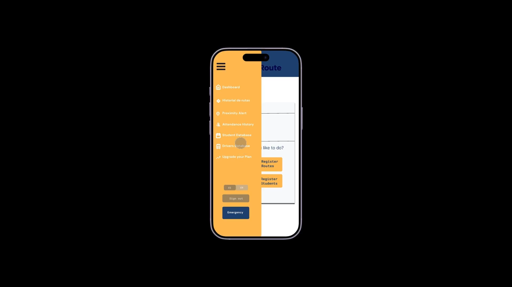

#### Web Applications Desktop:

[Desktop Prototype](https://upcedupe-my.sharepoint.com/:v:/g/personal/u202424059_upc_edu_pe/IQDD8jX45qD1TLdrlv1viH8AAe4MI-VfTCxWpwzvXAHEW78?nav=eyJyZWZlcnJhbEluZm8iOnsicmVmZXJyYWxBcHAiOiJPbmVEcml2ZUZvckJ1c2luZXNzIiwicmVmZXJyYWxBcHBQbGF0Zm9ybSI6IldlYiIsInJlZmVycmFsTW9kZSI6InZpZXciLCJyZWZlcnJhbFZpZXciOiJNeUZpbGVzTGlua0NvcHkifX0&e=AMYnCI)

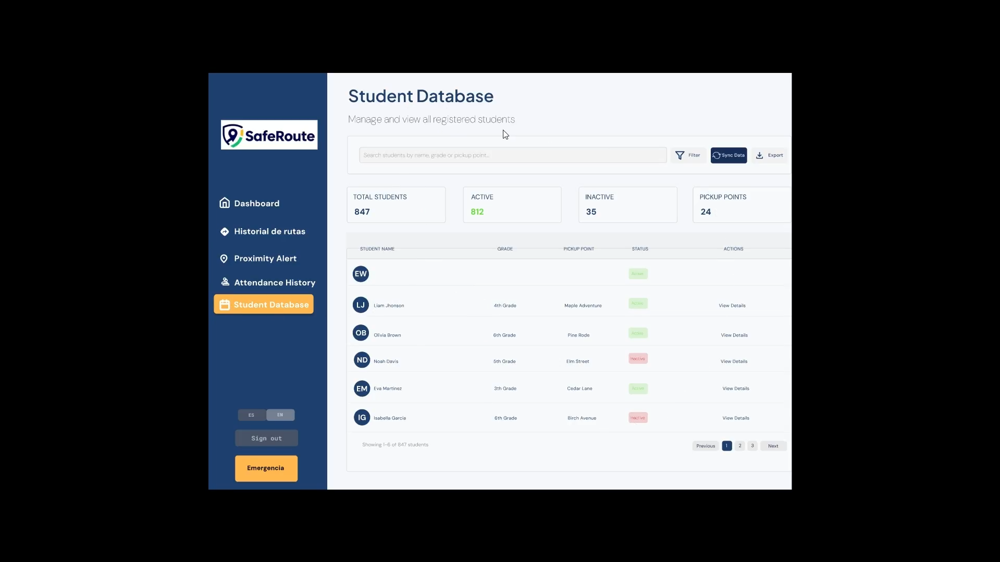

## 4.6. Domain-Driven Software Architecture

Plantilla de colores:
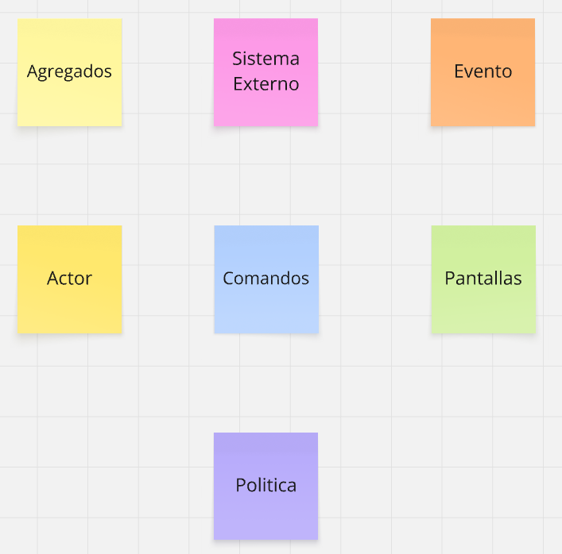

1. Unstructured Exploration
   

En esta fase inicial, identificamos los eventos de dominio fundamentales para la movilidad escolar. El objetivo es capturar los hitos de negocio que permiten la interacción segura entre padres, conductores y administradores sin priorizar aún la cronología. Los eventos se organizan en seis ejes principales:

- Identidad y Gestión de Accesos (IAM): Maneja la seguridad y autenticación de la plataforma. Incluye eventos como el inicio de sesión (Login), autenticación de usuarios (Authenticate User), emisión de tokens JWT para sesiones seguras y el registro de administradores.

- Gestión de Suscripciones y Planes: Controla el acceso comercial a las funcionalidades de la plataforma. Abarca la selección de planes, el procesamiento de pagos a través de pasarelas externas y la activación de funciones de gestión de rutas según el plan elegido (básico, intermedio o completo).

- Gestión de Stakeholders y Activos: Administra los perfiles de los actores involucrados y sus relaciones. Incluye el registro de conductores, padres y estudiantes, así como la creación de grupos y la vinculación de hijos a sus respectivos padres para el seguimiento personalizado.

- Planificación de Flota y Rutas: Define la logística previa al viaje. Comprende la creación de geocercas para las rutas (RouteGeofenceCreated), la selección de puntos de parada (Pick Waypoints), la asignación de estudiantes a vehículos y la definición de horarios de salida.

- Ejecución y Monitoreo de Viajes: Es el núcleo operativo en tiempo real. Captura el inicio del trayecto por el conductor (TripStarted), el registro del estado de abordaje de cada estudiante (StudentStatus) y la consulta activa de la información de la ruta durante el recorrido.

2. Timelines
   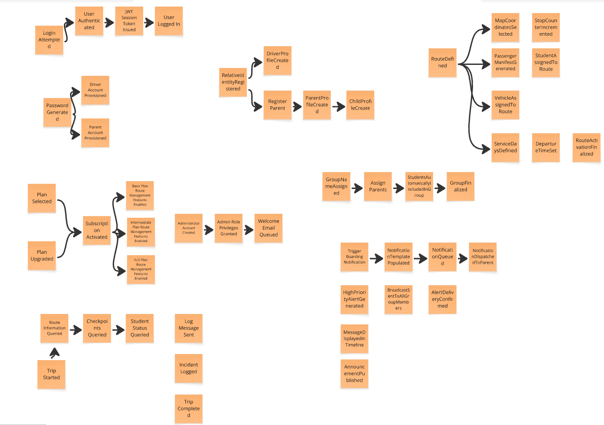

En este paso, los eventos se organizan en secuencias cronológicas para comprender el flujo natural de los procesos de negocio. Las líneas de tiempo clave incluyen:

- Flujo de Incorporación y Suscripción: Registro de administrador → Creación de organización → Selección de plan de suscripción → Procesamiento de pago → Activación de cuotas de servicios.

- Gestión de Stakeholders y Activos: Registro de conductores y padres → Vinculación de estudiante a padre → Creación de grupos de transporte → Registro de vehículos → Asignación de conductor a vehículo.

- Planificación de Rutas Institucionales: Definición de geocerca de la ruta → Selección de puntos de parada (waypoints) → Asignación de estudiantes a la ruta → Establecimiento de horarios de salida → Finalización de la activación de ruta.

- Ejecución de Viajes y Monitoreo: Inicio de viaje por el conductor → Consulta de información de ruta → Registro de abordaje del estudiante → Notificación automática al padre → Seguimiento de progreso en tiempo real.

- Gestión de Comunicaciones e Incidentes: Detección de anomalía → Generación de alerta de pánico de alta prioridad → Despacho de alerta a administradores/padres → Difusión de mensajes de estado (broadcast) → Visualización en línea de tiempo.

- Cierre de Operación: Llegada al destino final → Confirmación de descenso total de estudiantes → Finalización de viaje → Archivamiento de datos de ejecución → Liberación de recursos de flota.

Estas líneas de tiempo revelan las dependencias temporales y la naturaleza secuencial de las operaciones dentro del sistema, asegurando que el flujo de información viaje correctamente desde la base de datos hasta las notificaciones en el dispositivo del padre.

3. Pain Points
   

En esta etapa, se identifican las situaiciones en las que se generan los puntos de fricción, cuellos de botella y ciertos problemas que surgen durante los procesos operativos y administrativos. Los pain points detectados incluyen:

- Sincronización de Notificaciones: Retrasos en la entrega de alertas push al padre cuando el estudiante aborda el vehículo, generando incertidumbre innecesaria.

- Gestión de Errores en Abordaje: Fallos manuales del conductor al registrar el estado del estudiante (StudentStatus), lo que puede resultar en registros de asistencia incorrectos.

- Validaciones de Seguridad: Bloqueos o fallos en la generación de alertas de pánico de alta prioridad durante emergencias debido a pérdida de conectividad o errores del sistema.

- Asignación de Recursos: Errores en la vinculación manual de conductores a vehículos o rutas, impidiendo el inicio correcto del viaje en la plataforma.

- Fricción en el Pago y Suscripción: Interrupciones en el procesamiento de pagos que inhabilitan las cuotas de rutas y bloquean la operación diaria de la institución.

- Precisión de Geolocalización: Problemas de precisión en el GPS que confunden la ubicacion de checkpoints.

Identificar estos puntos críticos permite al equipo de SafeRoute priorizar el desarrollo de mecanismos de redundancia y mejorar la experiencia de usuario, asegurando que la comunicación entre el transporte y el hogar sea infalible.

4. Pivotal Points
   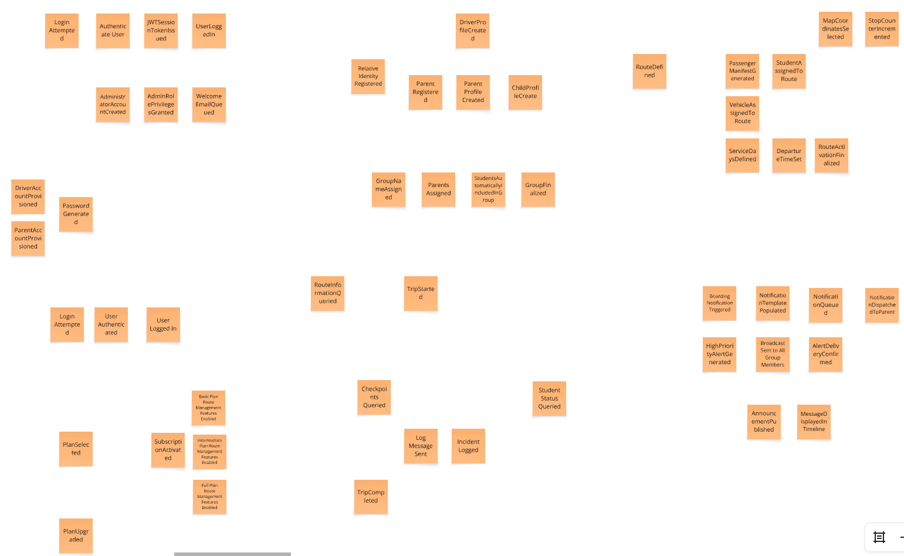

Los puntos pivotales son eventos determinantes que marcan transiciones críticas en el ciclo de vida del servicio. Estos incluyen:

Activación de Suscripción: Este hito marca la transición de un estado de configuración restringida a uno operativo, habilitando las cuotas de rutas y conductores necesarias para funcionar.

Finalización de Definición de Ruta: Es el punto donde la planificación técnica termina y la ruta queda lista para ser asignada a un vehículo y un conductor.

Inicio de Viaje: Este evento activa el monitoreo en tiempo real y permite que los padres comiencen a visualizar el progreso del transporte en sus aplicaciones.

Registro de Abordaje (Student Boarded): Es el evento pivotal de comunicación; confirma la seguridad del estudiante y dispara automáticamente la notificación push hacia el tutor legal.

Generación de Alerta de Pánico: Cambia el estado del viaje de "Normal" a "Emergencia", activando protocolos de respuesta inmediata y priorizando la comunicación de red de seguridad.

Completación de Viaje: Marca el fin de la responsabilidad operativa del conductor sobre los estudiantes y archiva el registro para liberar los recursos de la flota.

Estos puntos son determinantes para la continuidad y el éxito de la movilidad escolar, ya que aseguran que cada fase del proceso se cumpla antes de pasar a la siguiente.

5. Commands
   

Los comandos representan las acciones o intenciones de los usuarios que desencadenan eventos en el sistema. Los principales comandos identificados son:

- Gestión de Identidad y Acceso (IAM): Registrar administrador, iniciar sesión, autenticar usuario, asignar rol, revocar privilegios.

- Gestión de Suscripciones y Planes: Seleccionar plan, iniciar proceso de pago, activar funciones de gestión, actualizar cuotas de conductores, cancelar servicio.

- Gestión de Stakeholders y Activos: Registrar conductor, registrar padre, vincular estudiante a pariente, registrar vehículo, crear grupo de transporte, asignar miembros al grupo.

- Gestión de Flota y Rutas: Definir geocerca, seleccionar puntos de parada (waypoints), asignar estudiantes a ruta, asignar vehículo a ruta, establecer horario de salida, finalizar activación de ruta.

- Ejecución de Viajes y Monitoreo: Iniciar viaje, consultar información de ruta, registrar estado de abordaje del estudiante, reportar incidente (botón de pánico), finalizar viaje.

- Comunicación y Notificaciones: Preparar notificación push, despachar alerta a padres, publicar mensaje de difusión (broadcast), mostrar mensaje en línea de tiempo.

6. Policies
   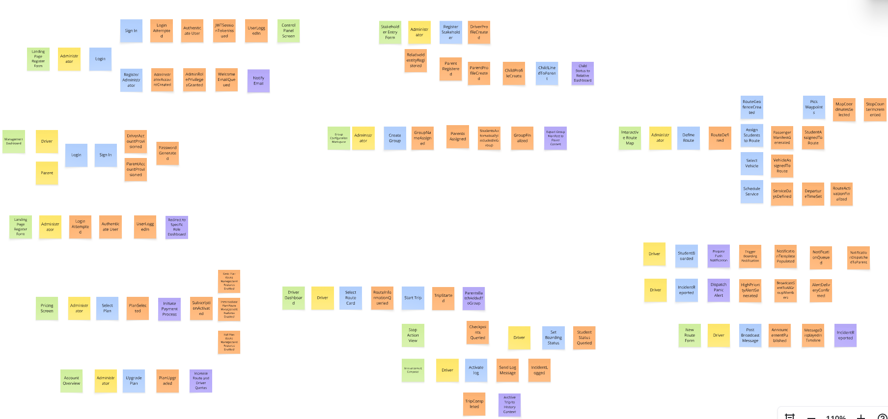

Las políticas automatizan la lógica de negocio y aseguran la coherencia del sistema ante eventos críticos. Las políticas clave incluyen:

- Cuando el pago es exitoso → Activar suscripción y habilitar cuotas de rutas/conductores automáticamente.

- Cuando el conductor inicia un viaje → Notificar a todos los padres vinculados a esa ruta sobre el inicio del monitoreo en tiempo real.

- Cuando se registra el abordaje del estudiante → Despachar notificación push inmediata al dispositivo del padre correspondiente.

- Cuando se reporta un incidente (pánico) → Generar alerta de alta prioridad y transmitirla instantáneamente a los administradores y padres del grupo.

- Cuando se publica un mensaje de difusión → Mostrar el mensaje en la línea de tiempo de todos los miembros del grupo seleccionado.

- Cuando se confirma el descenso total de estudiantes → Marcar el viaje como completado y archivar los datos de ejecución.

- Cuando falla el registro de un stakeholder → Enviar una notificación de error con los detalles de validación al administrador.

7. Read Models
   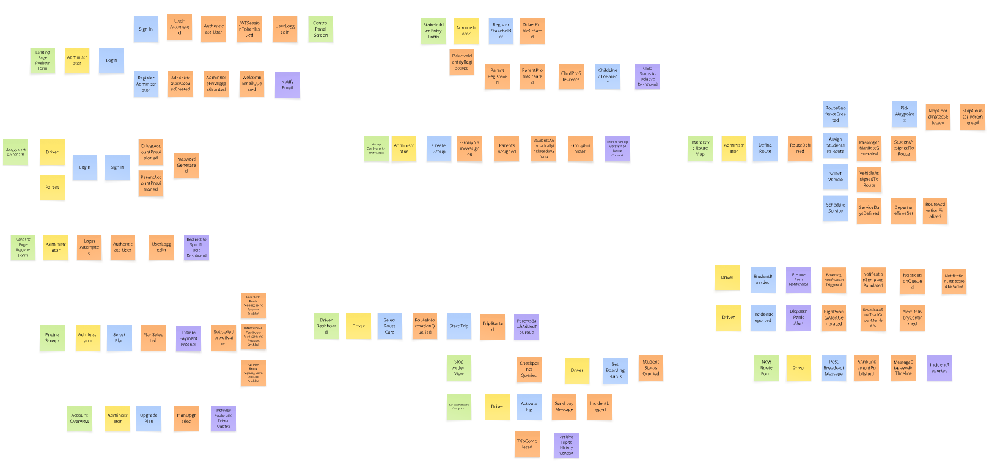

Los principales modelos de lectura identificados para garantizar la visibilidad del sistema son:

- Dashboard del Conductor: Vista detallada de la ruta asignada, lista de estudiantes por recoger, puntos de parada (waypoints) y estado de abordaje en tiempo real.

- Panel de Monitoreo para Padres: Visualización en tiempo real de la ubicación del vehículo, estado de seguridad del estudiante y línea de tiempo de eventos del viaje.

- Vista de Gestión de Grupos: Listado de estudiantes agrupados por ruta, vinculación con sus respectivos padres y estado de asistencia mensual.

- Estado de la Flota: Registro de vehículos activos, conductores asignados a cada unidad y disponibilidad de recursos para nuevas rutas.

- Historial de Incidentes: Registro cronológico de alertas de pánico, mensajes de difusión enviados y resoluciones de eventos de seguridad.

- Panel de Suscripción y Cuotas: Información sobre el plan activo, estado de los pagos y uso de las cuotas de rutas y conductores contratados.

- Directorio de Stakeholders: Lista completa de perfiles de usuarios (padres, conductores y administradores) con sus respectivos roles y privilegios de acceso.

8. External Systems
   

Las integraciones identificadas para la solución incluyen:

- Leaflet (Proveedor de Mapas): Se encarga de la visualización interactiva de las rutas, el trazado de geocercas (geofencing) y la gestión de coordenadas geográficas para el monitoreo en tiempo real.

- Resend (Servicio de Email): Utilizado para el envío de notificaciones transaccionales y correos electrónicos automáticos, como mensajes de bienvenida, confirmaciones de registro y alertas administrativas.

- PayPal (Pasarela de Pago): Servicio encargado de procesar de forma segura las transacciones financieras para la activación, renovación y actualización de los planes de suscripción institucional.

- MySQL (Gestión de Base de Datos): Actúa como el sistema externo de persistencia relacional encargado de almacenar y organizar toda la estructura de usuarios, rutas, vehículos y registros operativos.

9. Aggregates
   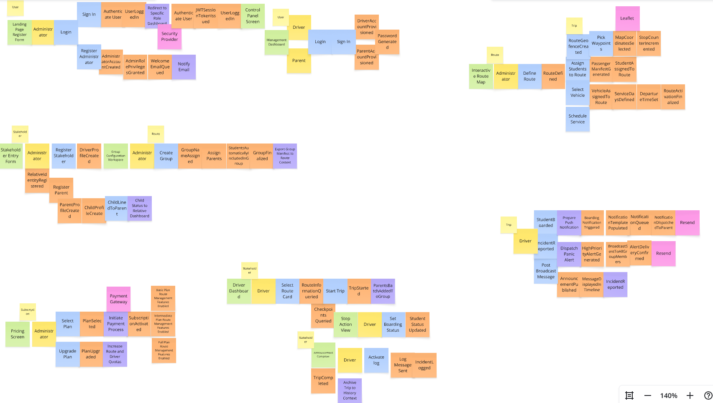

Basado en los dominios operativos identificados, los agregados son:

User (Raíz): Gestiona la identidad del usuario, incluyendo credenciales de autenticación, roles asignados (Administrador, Padre, Conductor) y privilegios de acceso al panel de control.

Organization (Raíz): Controla la configuración de la institución, la gestión de miembros y la vinculación de la cuenta con los parámetros base del sistema institucional.

Subscription (Raíz): Administra el ciclo de vida del plan de servicios, integrando el procesamiento de pagos a través de PayPal para habilitar o restringir las cuotas de rutas y conductores disponibles.

Stakeholder (Raíz): Encapsula la información de padres y conductores, gestionando la vinculación crítica entre el tutor (padre) y el estudiante para asegurar el flujo de notificaciones.

Vehicle (Raíz): Maneja el registro de las unidades de transporte, sus especificaciones técnicas y los cambios de estado (activo/inactivo) dentro de la flota.

Route (Raíz): Coordina la definición logística del recorrido, incluyendo la creación de geocercas, la selección de paraderos (waypoints) y la asignación previa de estudiantes a la ruta.

Trip (Raíz): Controla la ejecución operativa en tiempo real, registrando el inicio del trayecto, los cambios en el estado de abordaje de los estudiantes y el log de incidentes generados durante el viaje.

10. Bounded Contexts
    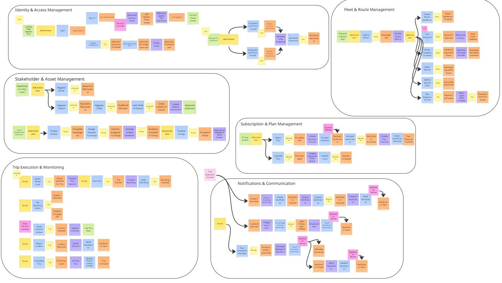

Los contextos delimitados organizan los agregados en dominios de negocio independientes, permitiendo que cada uno evolucione de manera autónoma para facilitar la escalabilidad del sistema:

- Identity & Access Management: Este contexto gestiona la seguridad perimetral, incluyendo la autenticación de usuarios, la creación de organizaciones, y la asignación de roles y privilegios para administradores, padres y conductores. Agregados: User, Organization.

- Subscription & Plan Management: Administra el ciclo de vida comercial del servicio. Se encarga de la selección de planes, el procesamiento de pagos mediante la integración con PayPal y la activación de las cuotas operativas de rutas y conductores contratados. Agregados: Subscription.

- Stakeholder & Asset Management: Maneja los perfiles de los actores críticos y los recursos físicos de la institución. Incluye el registro de conductores y padres, la vinculación esencial entre padres e hijos (estudiantes), y la gestión de la flota de vehículos. Agregados: Stakeholder, Vehicle.

- Route Planning & Execution: Coordina la logística integral, desde la planificación técnica hasta la operación en tiempo real. Cubre la definición de geocercas, la selección de paraderos, el monitoreo del abordaje de estudiantes y la gestión de incidentes durante el trayecto. Agregados: Route, Trip.

- Notifications & Communication: Actúa como el eje de interacción inmediata entre el transporte y el hogar. Orquesta el envío de notificaciones push (como el estado de abordaje del estudiante), alertas de pánico y mensajes de difusión general para mantener informados a los padres y administradores.

#### 4.6.2. Software Architecture Context Diagram

El diagrama de contexto presenta a SafeRoute como el sistema central, rodeado por sus tres tipos de usuarios y los sistemas externos con los que interactúa. El Administrador gestiona la plataforma configurando rutas, registrando actores y administrando suscripciones. El Conductor accede para ejecutar viajes, registrar el abordaje de estudiantes y emitir alertas de pánico. El Padre/Tutor monitorea en tiempo real el estado de la ruta de su hijo y recibe notificaciones. SafeRoute se integra con PayPal para el procesamiento de pagos, Leaflet + OpenRouteService para la visualización de mapas y cálculo de rutas escolares, y Resend como proveedor de correo transaccional para el despacho de alertas y notificaciones.


#### 4.6.3. Software Architecture Container Diagrams

Aquí se detallan las unidades de despliegue principales del sistema. El diagrama muestra cómo SafeRoute se divide en una Landing Page estática (HTML5, CSS3, JavaScript), una aplicación web interactiva en el cliente desarrollada en Angular con Angular Material, una API backend modularizada construida con Spring Boot y Java, un Shared Kernel como librería Java de tipos compartidos entre contextos, y un repositorio persistente central en MySQL.

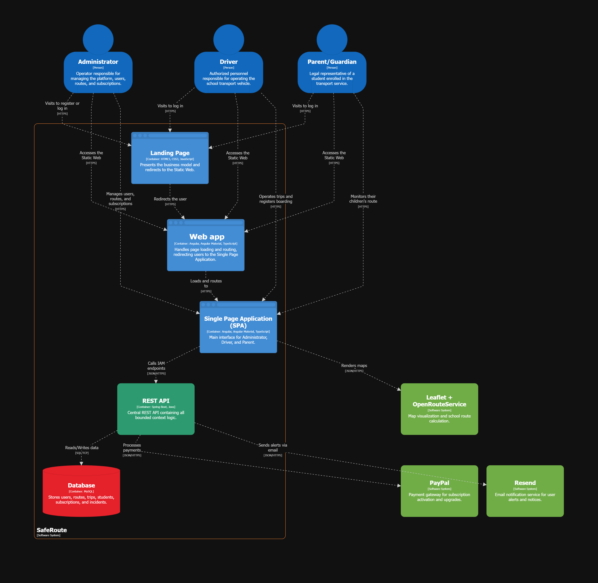

### 4.6.4. Software Architecture Components Diagrams

**FrontEnd**

- Single Page

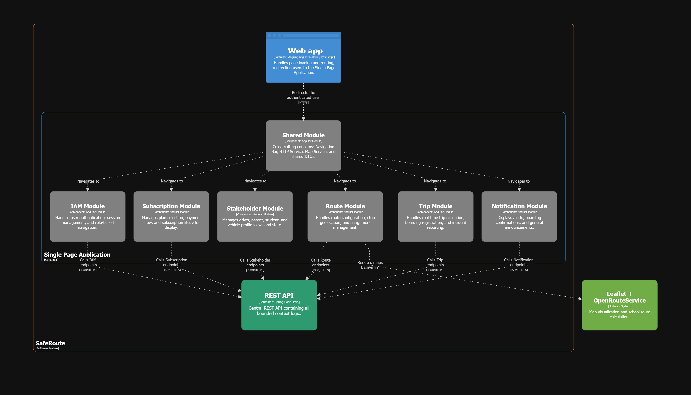
La SPA está desarrollada con Angular, Angular Material y TypeScript, organizada en módulos por bounded context. Cada módulo sigue una estructura interna de cuatro capas: Model (resources del dominio), Assembler (transforma respuestas del API), API Service (consume el backend vía HttpClient), y Store (estado reactivo con Angular Signals). La navegación entre módulos es gestionada por la Navigation Bar del módulo Shared, mientras que el HTTP Service centraliza todas las llamadas REST y el Map Service gestiona la integración con Leaflet.

- Trip Execution & Monitoring:
  Ilustra el núcleo operativo del frontend en sus 4 capas. Muestra cómo la Trip View procesa la ejecución del viaje en tiempo real, el Signal Store mantiene el estado de abordajes e incidentes activos, y el Trip Service registra cada evento hacia el Web Service, que a su vez dispara las notificaciones correspondientes.
  .png>)

  Presentation trip:

  .png>)

- Route Planning & Execution:
  Detalla las 4 capas del módulo encargado de la logística previa al viaje en el cliente. Maneja la configuración visual de rutas y paraderos con coordenadas GPS, la asignación de vehículos y conductores, y la definición de horarios, con el Route Signal Store sincronizando el estado de configuración hacia el Web Service.
  .png>)

  Presentation Route:

  .png>)

- Stakeholder & Asset Management:
  Representa las 4 capas del módulo que administra la información core del negocio en el frontend. Gestiona las vistas de creación y vinculación de perfiles para conductores, padres, estudiantes y vehículos, con un Signal Store que centraliza el estado de los grupos y asignaciones por organización.
  .png>)

  Presentation stakeholder:

  .png>)
  - Notifications & Communication:
    Describe el módulo dedicado a la comunicación hacia el usuario en sus 4 capas. La Notifications View presenta alertas, confirmaciones de abordaje y anuncios en tiempo real, mientras el Signal Store administra el conteo de no leídos y el Notification Service consulta periódicamente el Web Service para mantener el estado actualizado.
    .png>)

  Presentation trip:

  .png>)

- Shared Kernel:
  Detalla las 4 capas transversales del frontend que fundamentan todos los bounded context modules. Expone el Navigation Bar en la capa de presentación, el HTTP Service centralizado con interceptores JWT en la capa de aplicación, los resources e interfaces base en dominio, y el Map Service que integra Leaflet y OpenRouteService en la capa de infraestructura.
  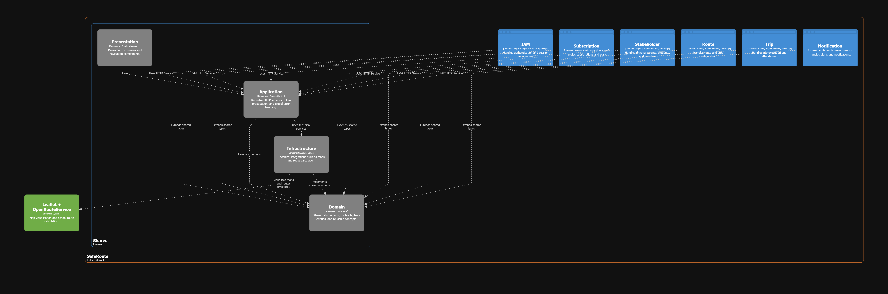

  Presentation shared:

  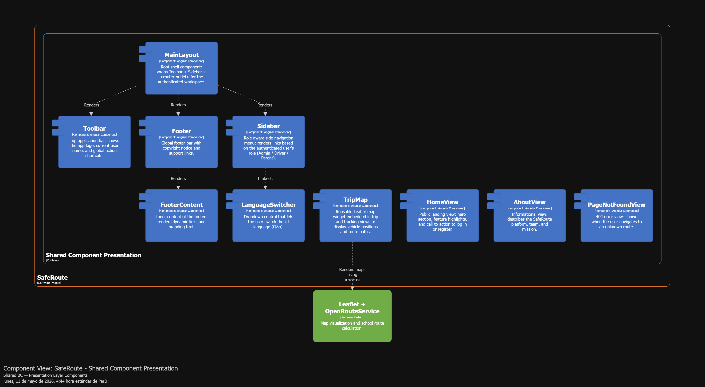
  - Identity & Access Management:
    Desglosa el módulo de identidad del frontend en sus 4 capas internas. Ilustra cómo la Identity View gestiona los formularios de login y registro, el Signal Store administra el estado de sesión y rol del usuario activo, y el IAM Service despacha las peticiones de autenticación hacia el Web Service adjuntando y almacenando el token JWT.
    .png>)

  Presentation IAM:

  .png>)

- Subscription & Plan Management:
  Muestra la arquitectura interna de 4 capas del módulo encargado de la monetización en el cliente. Detalla el flujo desde la Subscriptions View que presenta los planes disponibles, el Signal Store que mantiene el estado del plan activo y sus cuotas, hasta el Subscription Service que se comunica con el Web Service para gestionar el ciclo de vida del pago
  .png>)

  Presentation subscription:

  .png>)

**BackEnd**

- Web Services:
  
  Este diagrama ofrece la visión macro del backend. Demuestra cómo el monolito de Spring Boot está organizado lógicamente en seis Bounded Contexts independientes y un Shared Kernel (núcleo compartido de Value Objects), asegurando una separación clara de responsabilidades a nivel de dominio.

- Trip Execution & Monitoring:
  Ilustra el núcleo operativo del sistema en sus 4 capas. Muestra cómo se procesa la lógica en tiempo real durante la ejecución del viaje, gestionando el registro de abordajes por estudiante, el log de incidentes y la emisión de eventos de dominio internos que activan el contexto de Notificaciones.
  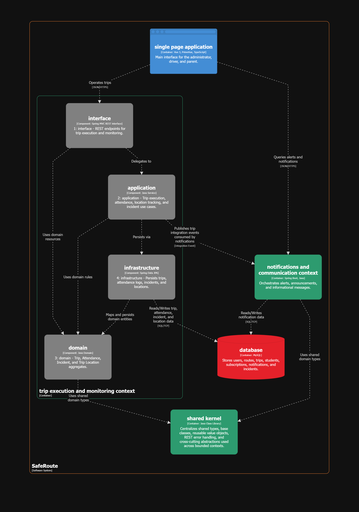

- Route Planning & Execution:
  Detalla la arquitectura modular (Controller, Service, Domain, Repository) encargada de la logística previa al viaje. Maneja la definición de paraderos con coordenadas GPS de alta precisión, la asignación de vehículos y conductores, y la configuración de horarios y días de servicio por ruta.
  

- Stakeholder & Asset Management:
  Representa las capas internas del dominio que administra la información core del negocio: la creación y vinculación de perfiles para conductores, padres de familia, estudiantes y la gestión de la flota de vehículos disponibles por organización.
  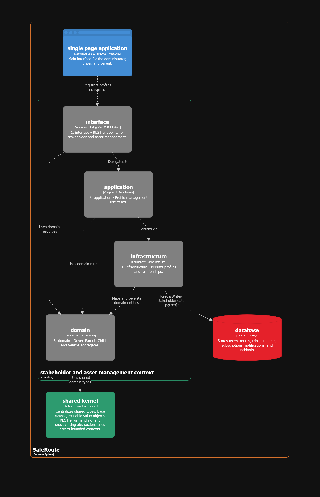

- Notifications & Communication:
  Describe el módulo dedicado a la comunicación asíncrona en sus 4 capas. Orquesta la recepción de eventos internos emitidos por el contexto de Trip y utiliza su capa de infraestructura para despachar alertas de pánico, notificaciones de abordaje y comunicados de difusión general mediante el proveedor externo Resend.
  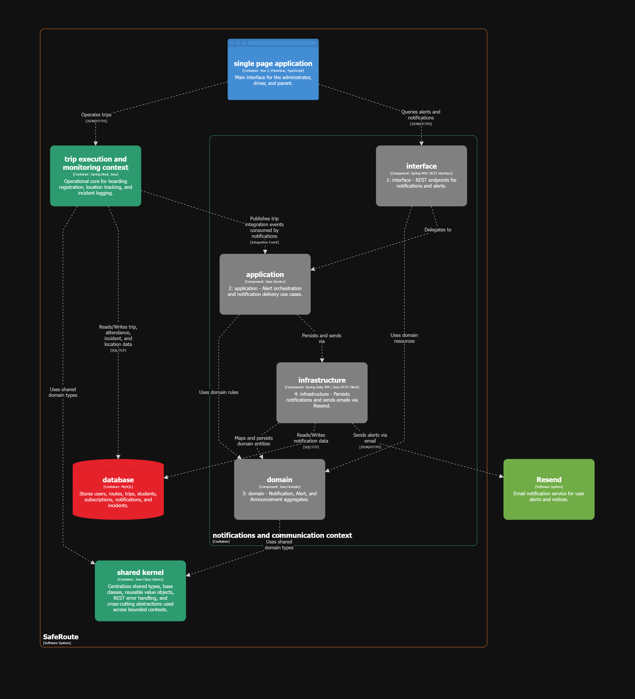

- Shared Kernel:
  Este diagrama expone las 4 capas transversales (Building Blocks) que fundamentan la arquitectura limpia del monolito. Detalla cómo se proveen clases base y utilidades compartidas: Middlewares en la capa API, interfaces y resources base en Application, Value Objects globales (TripId, StudentId) en Domain, y repositorios genéricos en Infrastructure, evitando la duplicidad de código en el resto de los Bounded Contexts.
  .png>)
  - Identity & Access Management:
    Desglosa el módulo de identidad en su arquitectura interna de 4 capas (API, Application, Domain, Infrastructure). Ilustra cómo se maneja la autenticación de usuarios, la provisión de cuentas y la asignación de roles de forma aislada, con Spring Security gestionando la emisión de tokens JWT en la capa de infraestructura.
    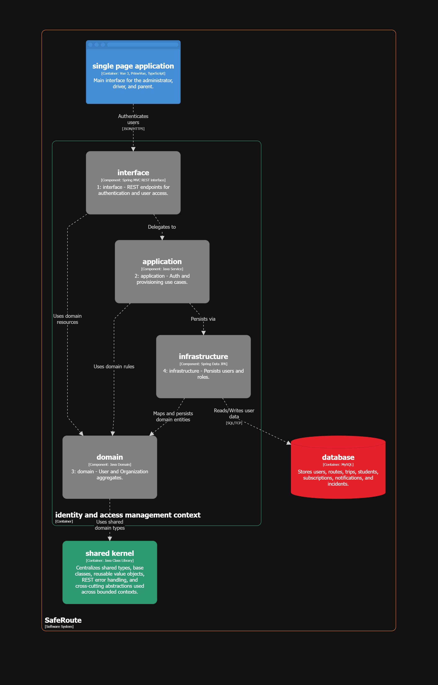

- Subscription & Plan Management:
  Muestra la estructura interna de 4 capas del contexto encargado de la monetización. Detalla el flujo desde el controlador REST hasta la infraestructura que se integra con PayPal para gestionar el ciclo de vida de los planes y pagos de suscripción.
  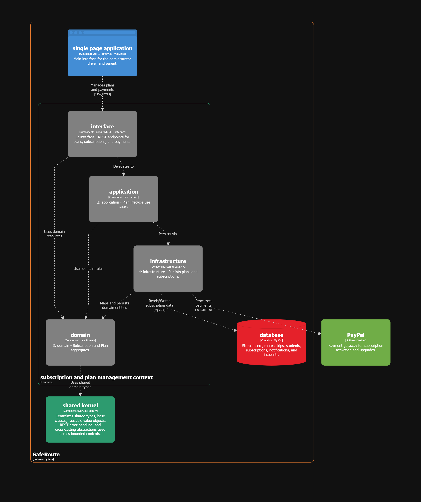

#### 4.7.1. Class Diagrams

**FrontEnd**

En todos los diagramas, el componente raíz App actúa como contenedor principal: tiene composición (composes) con los componentes de cada bounded context. El manejo del estado se realiza mediante clases *Store (usando Signal<T>), las cuales se comunican con clases *Api para las peticiones HTTP. Las clases *Assembler transforman los recursos (*Resource) de la API en modelos de dominio puro.


- Trip Execution & Monitoring:


Pantallas operativas para el control en tiempo real de los viajes.

Presentation & Domain: App compone TripDashboard (controla inicio y fin del viaje), AttendanceChecklist (gestiona el estado de abordaje de cada niño) e IncidentForm (permite reportar incidentes). Estos componentes consumen los modelos centrales del dominio (Trip, Attendance, Incident) para reflejar de forma fidedigna el estado real de la operación.

Application & Infrastructure: TripStore centraliza el viaje actual, las asistencias y los incidentes. Delega las acciones a TripApi (ej. startTrip(), updateBoardingStatus()), apoyándose en TripAssembler, AttendanceAssembler e IncidentAssembler.

- Fleet & Route Planning:


Interfaz para armar la logística de rutas, vehículos y asignaciones.

Presentation & Domain: App compone RouteForm (creación de rutas), StopList (gestión de paradas), VehicleList (visualización de vehículos) y AssignmentForm (asignación de conductores y niños). La interfaz gráfica se alimenta estrictamente de las entidades del dominio (Route, Stop, Vehicle, Assignment) para garantizar que la vista esté alineada con las reglas del negocio logístico.

Application & Infrastructure: FleetStore orquesta el estado de rutas, paradas, vehículos y asignaciones. FleetApi maneja las peticiones HTTP y usa Assemblers para convertir, por ejemplo, RouteResource en la entidad del dominio Route.


- Notifications & Communication:


Centraliza la visualización y envío de notificaciones y alertas.

Presentation & Domain: App compone NotificationList (para filtrar y marcar notificaciones como leídas), AlertPanel (gestiona alertas activas y pánico) y AnnouncementForm (creación de comunicados). Las vistas dependen exclusivamente de los modelos de dominio (Notification, Alert, Announcement) para renderizar los mensajes y alertas operativas a los usuarios finales.

Application & Infrastructure: NotificationsStore maneja el estado de notificaciones, alertas y anuncios. NotificationsApi realiza las peticiones (ej. dispatchNotification(), triggerAlert()) y los Assemblers transforman los recursos recibidos en modelos limpios del dominio.

- Stakeholder & Asset Management:


Controla las vistas de listado y gestión de los actores del sistema.

Presentation & Domain: App compone componentes de lista (ParentList, DriverList, ChildList, StudentGroupList) que permiten filtrar (searchQuery), seleccionar y eliminar registros utilizando los modelos del dominio (Parent, Driver, Child, StudentGroup) como la fuente de verdad para la visualización unificada de los actores.

Application & Infrastructure: StakeholderStore maneja el estado de estas listas mediante Signals. StakeholderApi ejecuta operaciones CRUD hacia el backend, y las respuestas (ej. ParentResource) son transformadas a modelos de dominio mediante clases como ParentAssembler.

- Identity and Access Management:


Gestiona la autenticación de usuarios y la configuración de la organización.

Presentation & Domain: App compone formularios de inicio de sesión (AdminLoginForm, UserLoginForm), registro (AdminRegisterForm) y gestión de organización (OrganizationForm, OrganizationProfile). Estos componentes interactúan con IamStore y consumen directamente los modelos de dominio puros (User, Organization) para reflejar y gestionar los datos de la sesión actual en la interfaz.

Application & Infrastructure: IamStore centraliza el estado con currentUserSignal y organizationSignal. Utiliza IamApi para operaciones como signIn() o createOrganization(), y UserAssembler/OrganizationAssembler para mapear las respuestas de la API (UserResource, OrganizationResource) a los modelos del dominio.

- Subscription & Plan Management:


Maneja la visualización y selección de planes para la organización.

Presentation & Domain: App compone PlanSelector (para elegir un plan) y SubscriptionStatus. Estos componentes utilizan directamente los modelos de dominio (Subscription y Plan) como inputs para renderizar la información de negocio (como los días restantes o límites de cuota) en la UI sin depender de estructuras externas.

Application & Infrastructure: SubscriptionStore maneja subscriptionSignal y plansSignal. Se comunica con SubscriptionApi para cargar planes (getAllPlans()) o modificar la suscripción (upgradeSubscription(), cancelSubscription()), usando sus respectivos Assemblers.


**BackEnd**

- Fleet & Route Planning:

Encargado de la planificación logística y operativa del transporte.

- Route Aggregate

Define el recorrido y su programación utilizando Value Objects como DepartureTime y ServiceDays. Compone una secuencia de paradas (Stop).


- Vehicle Aggregate

Controla la capacidad y disponibilidad de la unidad.


- Assignment Aggregate

Vincula operativamente a un conductor con un grupo específico de niños y una ruta para un viaje determinado.


- Trip Execution & Monitoring:

Ejecución y seguimiento de viajes.

- Trip Aggregate

Controla el ciclo de vida del recorrido (métodos start(), complete()) vinculando una ruta, un conductor y una organización, y además las asistencias (Attendance) e incidentes (Incident).


- TripLocation Aggregate

Rastrea y maneja la ubicación en tiempo real del vehículo durante el recorrido.


- Notifications & Communication:

Centraliza el envío de información y alertas hacia los padres de familia.

- Notification Aggregate

Organiza el envío de mensajes, gestionando la categoría y el estado de entrega hacia un apoderado, incluyendo alertas y comunicados.


- Stakeholder & Asset Management:

Modela a los actores humanos y sus agrupaciones dentro del sistema.

- Parent Aggregate

Representa a los apoderados e incluye a los estudiantes a su cargo, gestionando la adición o remoción de hijos.


- Driver Aggregate

Define a los conductores y atributos de su labor como la licencia.


- StudentGroup Aggregate

Permite agrupar referencias a múltiples niños para facilitar su asignación.


- Identity and Access Management (IAM):

Gestiona organizaciones, usuarios y roles en el entorno de la aplicación.

- Organization Aggregate

Maneja el ciclo de vida de la institución (métodos create(), suspend(), activate()). Se relaciona mediante Value Objects para su identificador, nombre y estado.


- User Aggregate

Gestiona la autenticación y la asignación de roles de los usuarios (métodos register(), authenticate(), changeRole()). Pertenece a una organización a través del OrganizationId compartido y utiliza Value Objects de seguridad como PasswordHash.


- Subscription & Plan Management:

Controla el modelo de negocio, definiendo los planes y suscripciones de cada organización.

- Plan Aggregate

Establece los límites operativos y económicos mediante los Value Objects RouteQuota y DriverQuota, los cuales validan que no se exceda la capacidad contratada de rutas y conductores.


- Subscription Aggregate

Controla el estado y la vigencia de una suscripción (métodos activate(), upgrade(), cancel()). Se vincula directamente a una organización y a un plan específico mediante sus identificadores.


- Payment Aggregate

Gestiona los pagos realizados para las suscripciones.


- Shared:

Actúa como el Shared Kernel transversal de toda la solución en Spring Boot.

- Shared Bounded Context

Contiene exclusivamente Value Objects inmutables que sirven como identificadores globales y conceptos comunes (ej. OrganizationId, RouteId, ChildId, FullName, Coordinates). Esto asegura la consistencia de tipos en la comunicación entre los distintos contextos.


### 4.8. Database Design

**- Identity & Access Management (IAM)**

Este bounded context gestiona la seguridad perimetral del sistema y la identidad de los usuarios. La tabla `users` centraliza las credenciales de acceso y mantiene el identificador `organization_id`, permitiendo asociar cada usuario a una organización dentro del modelo multi-tenant. La tabla `roles` funciona como catálogo de permisos del sistema, mientras que `user_roles` resuelve la relación muchos a muchos entre usuarios y roles, permitiendo implementar un esquema RBAC flexible para administrar los niveles de acceso dentro de la plataforma.

**Tabla: users**
| Atributo | Tipo |
|-----------------|--------------|
| id | BIGINT (PK) |
| organization_id | VARCHAR(64) |
| username | VARCHAR(50) |
| password | VARCHAR(120) |
| created_at | DATETIME(6) |
| updated_at | DATETIME(6) |

**Métodos (API REST)**
| Método | Descripción |
|-----------------------------|------------------------------------------|
| RegisterUser() | Registra un nuevo usuario en la plataforma. |
| AuthenticateUser() | Autentica al usuario con sus credenciales. |
| GetUserById() | Retorna los detalles de un usuario. |

---

**Tabla: roles**
| Atributo | Tipo |
|----------|-------------|
| id | BIGINT (PK) |
| name | ENUM |

**Métodos (API REST)**
| Método | Descripción |
|----------------|------------------------------------|
| GetAllRoles() | Retorna la lista de roles del sistema. |

---

**Tabla: user_roles**
| Atributo | Tipo |
|----------|-------------|
| user_id | BIGINT (PK, FK) |
| role_id | BIGINT (PK, FK) |

**Métodos (API REST)**
| Método | Descripción |
|----------------|------------------------------------|
| AssignRoleToUser() | Asigna un rol específico a un usuario. |

---

**- Subscription & Plan Management**

Este bounded context administra el ciclo de vida comercial del servicio. La tabla `plans` actúa como catálogo de planes disponibles, definiendo los tiers comerciales, límites operativos y precio asociado. La tabla `subscriptions` vincula una organización con un plan específico y registra el estado de la suscripción, junto con sus fechas de inicio y fin. La tabla `payments` registra las transacciones asociadas a una suscripción, incluyendo proveedor externo, moneda, monto, estado del pago, identificador de transacción externa y posibles razones de falla.

**Tabla: plans**
| Atributo | Tipo |
|-------------|---------------|
| id | INT (PK) |
| plan_tier | VARCHAR(20) |
| max_routes | INT |
| max_drivers | INT |
| price | DECIMAL(10,2) |

**Métodos (API REST)**
| Método | Descripción |
|---------------------------|----------------------------------------------|
| GetAllPlans() | Retorna todos los planes disponibles. |
| GetPlanById() | Retorna el detalle de un plan. |

---

**Tabla: subscriptions**
| Atributo | Tipo |
|-----------------|-------------|
| id | CHAR(36) (PK) |
| organization_id | CHAR(36) (FK) |
| plan_id | INT (FK) |
| state | VARCHAR(20) |
| start_date | DATETIME |
| end_date | DATETIME |

**Métodos (API REST)**
| Método | Descripción |
|-------------------|----------------------------------------------|
| CreateSubscription() | Crea una nueva suscripción para una organización. |
| CancelSubscription() | Cancela la suscripción activa. |

---

**Tabla: payments**
| Atributo | Tipo |
|-----------------|-------------|
| id | VARCHAR(36) (PK) |
| amount | DECIMAL(12,2) |
| confirmed_at | DATETIME(6) |
| created_at | DATETIME(6) |
| currency | VARCHAR(3) |
| external_transaction_id | VARCHAR(255) |
| failure_reason | VARCHAR(500) |
| provider | ENUM |
| status | ENUM |
| subscription_id | VARCHAR(36) (FK) |

**Métodos (API REST)**
| Método | Descripción |
|-------------------|----------------------------------------------|
| ProcessPayment() | Procesa un nuevo pago para una suscripción. |
| GetPaymentStatus() | Consulta el estado de un pago. |

---

**- Fleet Management**

Este bounded context modela la infraestructura operativa de transporte. La tabla `routes` representa las rutas configuradas para una organización, incluyendo el vehículo asignado, horario de salida, días de servicio, tipo de ruta y estado operativo. La tabla `stops` almacena los paraderos georreferenciados de cada ruta, manteniendo su orden dentro del recorrido mediante `stop_order`. Esta estructura permite planificar rutas, asociarlas a vehículos y consultar la secuencia completa de paraderos.

**Tabla: routes**
| Atributo | Tipo |
|-----------------|--------------|
| id | BIGINT (PK) |
| created_at | DATETIME(6) |
| updated_at | DATETIME(6) |
| departure_time | TIME |
| name | VARCHAR(255) |
| organization_id | VARCHAR(64) (FK) |
| route_state | ENUM |
| route_type | ENUM |
| service_days | VARCHAR(255) |
| vehicle_id | BIGINT (FK) |

**Métodos (API REST)**
| Método | Descripción |
|---------------------|----------------------------------------------|
| CreateRoute() | Crea una nueva ruta de transporte. |
| UpdateRoute() | Actualiza los datos de la ruta. |
| GetRoutesByOrgId() | Retorna las rutas de una organización. |

---

**Tabla: stops**
| Atributo | Tipo |
|------------|---------------|
| id | BIGINT (PK) |
| created_at | DATETIME(6) |
| updated_at | DATETIME(6) |
| latitude | DOUBLE |
| longitude | DOUBLE |
| name | VARCHAR(255) |
| stop_order | INT |
| route_id | BIGINT (FK) |

**Métodos (API REST)**
| Método | Descripción |
|------------------------------|----------------------------------------------|
| AddStopToRoute() | Agrega un paradero a la ruta. |
| GetStopsByRouteId() | Retorna la secuencia ordenada de paraderos de una ruta. |

---

**- Trip Execution & Monitoring**

Este bounded context representa el núcleo operativo del servicio. La tabla `trips` registra cada ejecución real de una ruta, asociando organización, ruta y conductor, además de controlar el estado del viaje mediante `trip_state`, `start_time` y `end_time`. La tabla `attendances` captura la asistencia o estado de abordaje de cada estudiante durante el viaje. `incidents` permite registrar eventos anómalos reportados durante la operación, mientras que `trip_locations` almacena la trazabilidad GPS del vehículo, incluyendo coordenadas, velocidad, dirección y fecha de registro.

**Tabla: trips**
| Atributo | Tipo |
|-----------------|--------------|
| id | BIGINT (PK) |
| created_at | DATETIME(6) |
| updated_at | DATETIME(6) |
| driver_id | BIGINT |
| end_time | DATETIME(6) |
| organization_id | VARCHAR(64) (FK) |
| route_id | BIGINT (FK) |
| start_time | DATETIME(6) |
| trip_state | ENUM |

**Métodos (API REST)**
| Método | Descripción |
|---------------------------------|---------------------------------------------------|
| StartTrip() | Inicia el viaje. |
| CompleteTrip() | Completa el viaje. |
| DeleteTrip() | Elimina un viaje. |
| GetAllTrips() / GetTripById() | Consultas sobre viajes de una organización. |

---

**Tabla: attendances**
| Atributo | Tipo |
|----------------|--------------|
| id | BIGINT (PK) |
| created_at | DATETIME(6) |
| updated_at | DATETIME(6) |
| boarded_at | DATETIME(6) |
| boarding_state | ENUM |
| child_id | BIGINT |
| trip_id | BIGINT (FK) |

**Métodos (API REST)**
| Método | Descripción |
|------------------------------|-------------------------------------------------|
| UpdateBoardingStatus() | Actualiza el estado de abordaje del estudiante. |
| GetAttendancesByTrip() | Obtiene la lista de asistencia de un viaje. |

---

**Tabla: incidents**
| Atributo | Tipo |
|-------------|--------------|
| id | BIGINT (PK) |
| created_at | DATETIME(6) |
| updated_at | DATETIME(6) |
| description | VARCHAR(1000) |
| reported_at | DATETIME(6) |
| trip_id | BIGINT (FK) |

**Métodos (API REST)**
| Método | Descripción |
|--------------------|-----------------------------------------|
| ReportIncident() | Registra un incidente durante el viaje. |
| GetIncidentsByTrip() | Retorna los incidentes de un viaje. |

---

**Tabla: trip_locations**
| Atributo | Tipo |
|-------------|--------------|
| id | BIGINT (PK) |
| created_at | DATETIME(6) |
| updated_at | DATETIME(6) |
| heading | DOUBLE |
| latitude | DOUBLE |
| longitude | DOUBLE |
| recorded_at | DATETIME(6) |
| speed | DOUBLE |
| trip_id | BIGINT (FK) |

**Métodos (API REST)**
| Método | Descripción |
|--------------------|-----------------------------------------|
| SendLocation() | Envía la ubicación en tiempo real del vehículo. |
| GetLatestLocation() | Retorna la última ubicación reportada. |
| GetLocationHistory() | Retorna el historial de ubicaciones del viaje. |

---

**- Notifications & Communication**

Este bounded context gestiona la comunicación del sistema hacia los usuarios. La tabla `notifications` almacena cada mensaje generado por la plataforma, asociándolo con una organización, usuario, viaje o destinatario según corresponda. Además, registra la categoría de la notificación, su estado de entrega, fecha de entrega, número de reintentos, fecha del último intento, próxima fecha de reintento y posibles razones de falla. Esta estructura permite mantener trazabilidad sobre las comunicaciones enviadas y controlar escenarios donde el envío requiera reintentos.

**Tabla: notifications**
| Atributo | Tipo |
|-----------------|--------------|
| id | VARCHAR(36) (PK) |
| category | ENUM |
| delivered_at | DATETIME(6) |
| delivery_state | ENUM |
| failure_reason | VARCHAR(500) |
| last_attempt_at | DATETIME(6) |
| max_retries | INT |
| message | VARCHAR(1000) |
| next_retry_at | DATETIME(6) |
| recipient_id | VARCHAR(64) |
| retry_count | INT |
| organization_id | VARCHAR(64) (FK) |
| trip_id | VARCHAR(36) |
| user_id | VARCHAR(36) |

**Métodos (API REST)**
| Método | Descripción |
|------------------|----------------------------------------------------|
| SendNotification() | Envía una nueva notificación. |
| GetNotificationsByUser() | Retorna el historial de notificaciones de un usuario. |

---

**- Stakeholder Management**

Este bounded context modela los actores operativos y recursos asociados al servicio de transporte. La tabla `vehicles` registra los vehículos disponibles por organización, incluyendo placa, modelo, capacidad y estado operativo. La tabla `assignments` vincula un conductor con una ruta específica, permitiendo definir la responsabilidad operativa sobre un recorrido. Finalmente, `assignment_children` resuelve la asociación entre asignaciones y estudiantes, permitiendo identificar qué niños pertenecen a una ruta asignada.

**Tabla: assignments**
| Atributo | Tipo |
|-----------|--------------|
| id | BIGINT (PK) |
| created_at | DATETIME(6) |
| updated_at | DATETIME(6) |
| driver_id | BIGINT |
| route_id | BIGINT (FK) |

**Métodos (API REST)**
| Método | Descripción |
|-------------------------|-----------------------------------------------|
| CreateAssignment() | Crea una asignación de conductor a ruta. |

---

**Tabla: assignment_children**
| Atributo | Tipo |
|---------------|--------------|
| assignment_id | BIGINT (FK) |
| child_id | BIGINT |

**Métodos (API REST)**
| Método | Descripción |
|----------------|------------------------------------------------------|
| AddChilresourceAssignment() | Asocia un estudiante a una asignación de ruta. |
| RemoveChildFromAssignment() | Desvincula un estudiante de una asignación. |

---

**Tabla: vehicles**
| Atributo | Tipo |
|-----------------|--------------|
| id | BIGINT (PK) |
| created_at | DATETIME(6) |
| updated_at | DATETIME(6) |
| capacity | INT |
| model | VARCHAR(255) |
| organization_id | VARCHAR(64) |
| plate | VARCHAR(255) |
| status | ENUM |

**Métodos (API REST)**
| Método | Descripción |
|-------------------------------|------------------------------------------|
| RegisterVehicle() | Registra un nuevo vehículo. |
| GetVehiclesByOrganization() | Retorna los vehículos de una organización. |

#### 4.8.1. Database Diagrams

Esta sección presenta y explica los Database Diagrams para cada bounded context de SafeRoute, alineados al esquema actualizado de la base de datos y al API REST implementado. Los diagramas representan la persistencia relacional del sistema, especificando tablas, columnas, tipos de dato, claves primarias, claves foráneas y relaciones entre entidades. Además, permiten visualizar cómo cada bounded context mantiene su propia responsabilidad funcional, mientras comparte referencias mediante identificadores como `organization_id`, `route_id`, `trip_id`, `user_id` y otros IDs de relación.

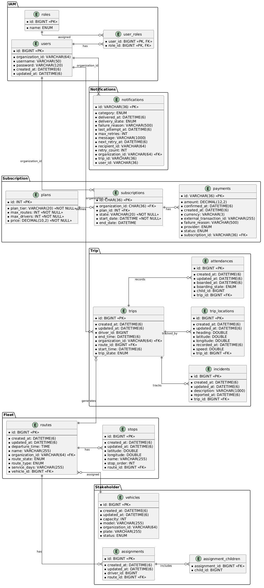

**Identity and Access Management (IAM)**

El diagrama de IAM representa la estructura de identidad y autorización del sistema. La tabla `users` almacena las credenciales y datos base de autenticación, asociando cada usuario a una organización mediante `organization_id`. La tabla `roles` define los perfiles de acceso disponibles en la plataforma, mientras que `user_roles` permite asignar uno o más roles a cada usuario mediante una relación muchos a muchos. Esta estructura facilita la gestión de permisos y separación de responsabilidades dentro del sistema.

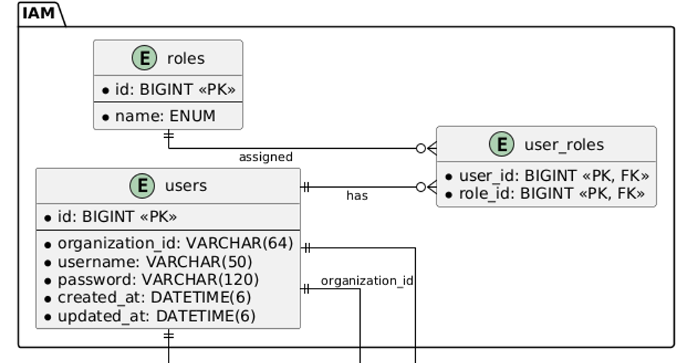

---

**Subscription**

El diagrama de Subscription representa la gestión comercial del servicio. La tabla `plans` funciona como catálogo de planes disponibles, definiendo los límites operativos y el precio de cada tier. `subscriptions` relaciona una organización con un plan específico, registrando el estado de la suscripción y sus fechas de vigencia. La tabla `payments` complementa este flujo registrando los pagos asociados a una suscripción, incluyendo información del proveedor externo, estado de la transacción, monto, moneda y posibles errores de procesamiento.

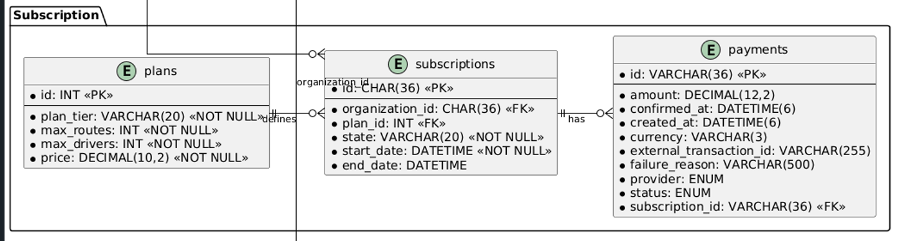

---

**Fleet**

El diagrama de Fleet modela la planificación base del transporte. La tabla `routes` almacena las rutas creadas para una organización, incluyendo su estado, tipo, horario de salida, días de servicio y vehículo asignado. La tabla `stops` depende directamente de `routes` y registra los paraderos de cada ruta con sus coordenadas geográficas y orden dentro del recorrido. Esta relación permite representar la composición de una ruta a partir de una secuencia ordenada de puntos de parada.

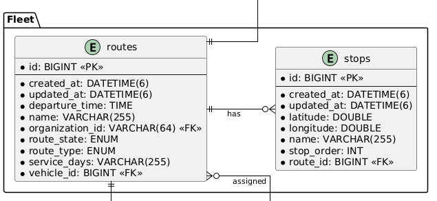

---

**Trip**

El diagrama de Trip representa la ejecución real de las rutas planificadas. La tabla `trips` registra cada viaje operativo, vinculándolo con una organización, una ruta y un conductor. A partir de esta entidad se relacionan `attendances`, que controla el abordaje de los estudiantes; `incidents`, que registra eventos reportados durante el viaje; y `trip_locations`, que almacena las posiciones GPS reportadas durante la ejecución. Esta estructura permite dar seguimiento al viaje en tiempo real y mantener trazabilidad histórica de la operación.

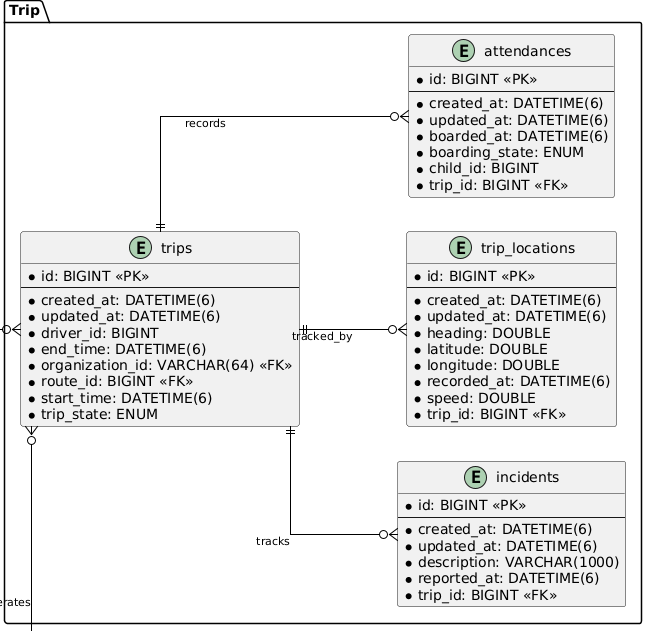

---

**Notifications**

El diagrama de Notifications representa la comunicación generada por la plataforma. La tabla `notifications` almacena los mensajes enviados a los usuarios o destinatarios del sistema, asociándolos con una organización y, cuando corresponde, con un viaje específico. Además, registra el estado de entrega, categoría del mensaje, número de reintentos, fechas de intento y posibles errores. Esta estructura permite controlar la trazabilidad de las notificaciones y gestionar escenarios donde el envío no se completa correctamente en el primer intento.

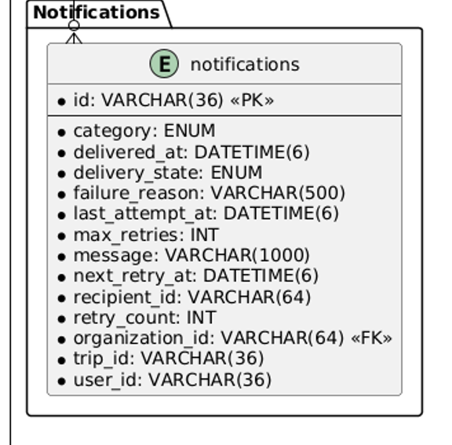

---

**Stakeholder**

El diagrama de Stakeholder representa la gestión de recursos y asignaciones operativas. La tabla `vehicles` almacena los vehículos registrados por organización, incluyendo capacidad, placa, modelo y estado. La tabla `assignments` vincula una ruta con un conductor, permitiendo establecer responsabilidades operativas sobre una ruta específica. Finalmente, `assignment_children` permite asociar estudiantes a una asignación determinada, funcionando como tabla de relación entre asignaciones y niños transportados.

## 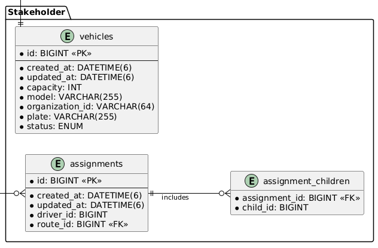

## Capítulo V: Product Implementation, Validation & Deployment

### 5.1. Software Configuration Management

#### 5.1.1. Software Development Environment Configuration

En esta sección se describen las herramientas y tecnologías utilizadas para el desarrollo del Proyecto

##### UX/UI Design

###### Figma:

Herramienta de diseño colaborativo utilizada para la creación de wireframes, mockups, prototipos y diseño de interfaces. Permite trabajar en equipos en tiempo real, lo cual facilita la validación temprana de la experiencia futura del usuario.

##### Software Development

###### JetBrains Intelli J IDEA

Entorno de desarrollo integrado (IDEA) utilizado para el desarrollo del BackEnd que utiliza el idioma java.

###### GitHub

Plataforma de control de versiones utilizada para la gestión del código fuente y colaboración del equipo, implementando la metodología GitFlow para la organización del desarrollo.

###### HTML

Legnuaje de marcado para el desarrollo de las interfaces web del Frontend.

###### CSS

Lenguaje de estilos utilizados para la presentación visual de la aplicación, en el apartado del .

###### Typescript

Lenguaje utilizado para el frontend para poder hacer interfaces dinámicas e interactivas.

###### Java

Lenguaje de programación que se utilizara en el desarrollo del backend de la aplicación.

##### Software Deployment

###### GitHub Pages

Servicio utilizado para el despliegue de la landing page del proyecto.

###### Azure

Plataforma utilizada para el despliegue del frontend desarrollado en Angular, permitiendo una integración continua y despliegue automatizado.

###### Swagger

Plataforma utilizada para el despliegue de servicios backend y APIs, facilitando la conexión entre frontend y backend en un entorno accesible.

#### 5.1.2. Source Code Management

Para el manejo del código fuente, utilizamos Github para colaborar entre miembros de equipo en multiples repositorios. A continuación, se listan los enlaces de cada repositorio:

Organización:

Repositorio de Landing Page: https://github.com/upc-pre-202610-1asi0729-11896-fivetech/saferoute-website.git

Repositorio del informe: https://github.com/upc-pre-202610-1asi0729-11896-fivetech/saferoute-report.git

Repositorio del frontend: https://github.com/upc-pre-202610-1asi0729-11896-fivetech/saferoute-webapp.git

Repositorio del backend: https://github.com/upc-pre-202610-1asi0729-11896-fivetech/saferoute-platform.git

En el repositorio del informe, se implementa un esquema de trabajo basado en Gitflow. La rama main almacena la versión estable del informe correspondiente a cada entregable del trabajo, mientras que la rama develop concentra la integración de avances validados por cada integrante antes de su consolidación final. A partir de develop, cada integrante creará ramas feature de trabajo para las secciones asignadas. Las ramas feature seguirán una nomenclatura asociada al capítulo o bloque trabajado, por ejemplo: feature/chapter-1-introduction-and-lean-ux, o feature/chapter-5-software-configuration-management. Esta convención permite identificar con claridad qué parte del informe está siendo desarrollada y reduce el riesgo de conflictos entre los miembros del equipo.

En los repositorios del Landing Page, Frontend y Backend también se utilizará GitFlow. En cada uno de ellos, la rama main contendrá las versiones estables del producto y la rama develop servirá como rama de integración del trabajo colaborativo. A partir de develop, se crearán ramas feature/... para el desarrollo de funcionalidades específicas. A diferencia del informe, en estos repositorios las ramas no estarán organizadas por capítulos, sino por funcionalidades o componentes del sistema. Algunos ejemplos de nomenclatura son: feature/home-page, feature/dashboard o feature/route-management. Esta convención nos permite que las ramas reflejen de manera directa el alcance funcional del producto en desarrollo.

No se realizarán cambios directos sobre la rama main, ya que esta representará únicamente versiones estables y listas para consolidarse como parte de un entregable. Del mismo modo, se evitará que los integrantes trabajen de forma continua directamente sobre la rama develop, ya que el flujo previsto consiste en desarrollar primero en ramas feature, integrar luego en develop y finalmente consolidar en main cuando el avance haya sido revisado y validado. Por tanto, el flujo general de trabajo será de la siguiente forma: feature → develop → main. Este esquema se alinea con la exigencia del curso de explicar la implementación de GitFlow mediante ramas principales, ramas de features, y convenciones para releases y hotfixes.

Asimismo, si se requiere corregir errores críticos sobre una versión estable, se podrán crear ramas hotfix/..., y si se decide preparar una versión de cierre antes de una entrega, se utilizarán ramas release/... de acuerdo con el flujo definido por GitFlow.

En relación con los mensajes de cada commit, el equipo aplicará Conventional Commits para mantener un historial más legible, consistente y profesional. Esta convención facilitará la revisión de avances y permitirá identificar rápidamente el propósito de cada uno de los cambios. Algunos prefijos que se utilizarán son:

1. feat: incorporación de una nueva funcionalidad
2. fix: corrección de errores
3. docs: cambios en documentación
4. style: cambios de formato o estilo sin alterar lógica
5. refactor: reorganización interna sin agregar funcionalidad nueva
6. test: incorporación o ajuste de pruebas
7. chore: tareas de mantenimiento o configuración

Para el repositorio del informe se emplearán mensajes como docs(report): add project cover page o docs: add startup profile and lean ux process for chapter 1. Para los repositorios de software se utilizarán mensajes como feat: add school route registration, feat: implement student assignment to route o fix: correct login validation. Esta práctica contribuye a que la evidencia de commits sea coherente con el trabajo realizado por cada miembro.

#### 5.1.3. Source Code Style Guide & Conventions

#### Frontend (Landing Page - HTML, CSS, JavaScript)

##### Convenciones generales:

- **Idioma**: Todo el código, incluyendo nombres de variables, funciones y clases está escrito en inglés.
- **Formato de archivos**: `.html`, `.css`, `.js`
- **Estilo de código adoptado**:
  - [W3Schools HTML Style Guide](https://www.w3schools.com/html/html5_syntax.asp)
  - [Google HTML/CSS Style Guide](https://google.github.io/styleguide/htmlcssguide.html)

##### Nomenclatura:

- **Clases CSS**: `kebab-case` (ej. `main-container`)
- **IDs HTML**: `camelCase` (ej. `mainContent`)
- **Variables JS**: `camelCase` (ej. `userName`)
- **Funciones JS**: `camelCase` (ej. `handleClick()`)

#### Frontend Web App (Angular + TypeScript)

##### Convenciones generales:

- **Idioma**: Código y los comentarios son completamente en ingles.
- **Estructura de carpetas**: Segregación por módulos y componentes.
- **Formato de archivos**: `.ts`, `.html`, `.css`

##### Estilo de código adoptado:

- [Angular Style Guide (Oficial)](https://angular.io/guide/styleguide)
- [Google TypeScript Style Guide](https://google.github.io/styleguide/tsguide.html)

##### Nomenclatura:

- **Componentes**: `PascalCase` (ej. `UserProfileComponent`)
- **Servicios**: `camelCase` + sufijo `Service` (ej. `authService`)
- **Interfaces**: `PascalCase`, prefijo `I` opcional (ej. `User`, `IUser`)
- **Archivos**: `kebab-case` (ej. `user-profile.component.ts`)
- **Variables y funciones**: `camelCase`

#### Backend (Java + Spring Boot)

##### Convenciones generales:

- **Idioma**: Código y documentación interna es en ingles.
- **Formato de archivos**: `.java`

##### Estilo de código adoptado:

- [Google Java Style Guide](https://google.github.io/styleguide/javaguide.html)
- [Spring Boot Features &amp; Best Practices](https://docs.spring.io/spring-boot/docs/current/reference/html/features.html)

##### Nomenclatura:

- **Clases**: `PascalCase` (ej. `UserService`)
- **Variables**: `camelCase` (ej. `userRepository`)
- **Constantes**: `UPPER_SNAKE_CASE` (ej. `MAX_USERS`)
- **Endpoints**: `kebab-case` para URLs (ej. `/api/user-profile`)
- **Paquetes**: Todo en minúsculas y separados por punto (ej. `com.project.backend.controller`)

#### 5.1.4. Software Deployment Configuration

En esta sección se describe la configuración necesaria para el despliegue de los principales componentes del proyecto: Landing Page, Frontend Web Application y Backend.

#### Despliegue de Landing Page

La Landing Page fue desarrollada utilizando HTML, CSS y JavaScript, y será desplegada mediante GitHub Pages, un servicio de hosting para sitios estáticos.

##### Pasos de despliegue

Crear un repositorio en GitHub destinado a la landing page.
Subir el código fuente (HTML, CSS, JS y recursos estáticos) al repositorio.
Asegurar que el archivo principal se denomine index.html y se encuentre en la raíz del proyecto.
Acceder a la sección Settings > Pages del repositorio.
Seleccionar la rama main (o master) y la carpeta raíz (/) como fuente.
GitHub generará automáticamente una URL pública para acceder a la landing page.
URL desplegada: [Landing Page](https://upc-pre-202610-1asi0729-11896-fivetech.github.io/saferoute-website/)

##### Despliegue de Frontend Web Application

El frontend de la aplicación, desarrollado con Angular.ts, será desplegado utilizando la plataforma Azure, la cual permite integración continua y despliegue automatizado.

Pasos de despliegue
Crear o seleccionar el repositorio del frontend en GitHub.
Vincular el repositorio con la plataforma Azure.
Configurar el entorno de despliegue (framework Angular.ts).
Ejecutar el despliegue automático desde Azure.
Obtener la URL pública generada para el acceso a la aplicación.
URL desplegada: Pendiente

##### Despliegue de Backend Services

El backend del sistema, desarrollado en C#, será desplegado utilizando Swagger, una plataforma que permite exponer servicios y APIs en la nube.
Pasos de despliegue:
Crear el repositorio del backend en GitHub.
Vincular el repositorio con Swagger.
Configurar las variables de entorno necesarias para la ejecución del backend.
Configurar el servicio para exponer endpoints API.
Desplegar el servicio y obtener la URL pública del backend.
URL desplegada: Pendiente

### 5.2. Landing Page, Services & Applications Implementation

#### 5.2.1. Sprint 1

##### 5.2.1.1. Sprint Planning 1

| Sprint #                        | Sprint 1                                                                                                                                                                                                                                                                                                                                                                                                                                                                                                                                |
| ------------------------------- | --------------------------------------------------------------------------------------------------------------------------------------------------------------------------------------------------------------------------------------------------------------------------------------------------------------------------------------------------------------------------------------------------------------------------------------------------------------------------------------------------------------------------------------- |
| **Sprint Planning Background**  |
| Date                            | 2026-04-24                                                                                                                                                                                                                                                                                                                                                                                                                                                                                                                              |
| Time                            | 07:00 PM                                                                                                                                                                                                                                                                                                                                                                                                                                                                                                                                |
| Location                        | Microsoft Teams                                                                                                                                                                                                                                                                                                                                                                                                                                                                                                                         |
| Prepared By                     | Renzo Revilla                                                                                                                                                                                                                                                                                                                                                                                                                                                                                                                           |
| Attendees (to planning meeting) | Todo el equipo                                                                                                                                                                                                                                                                                                                                                                                                                                                                                                                          |
| **Sprint Goal & User Stories**  |                                                                                                                                                                                                                                                                                                                                                                                                                                                                                                                                         |
| Sprint 1 Goal                   | Nuestro enfoque es permitir que los potenciales usuarios de SafeRoute comprendan cómo la plataforma mejora la seguridad y organización del transporte escolar mediante una experiencia web clara e informativa. Creemos que esto aporta mayor confianza y visibilidad tanto a padres de familia como a transportistas escolares que buscan un servicio más organizado y seguro. Esto se validará cuando los usuarios puedan identificar claramente las funcionalidades principales y beneficios de SafeRoute a través del Landing Page. |
| Sprint 1 Velocity               | 15 Story Points                                                                                                                                                                                                                                                                                                                                                                                                                                                                                                                         |
| Sum of Story Points             | 13 Story Points                                                                                                                                                                                                                                                                                                                                                                                                                                                                                                                         |

##### 5.2.1.2. Aspect Leaders and Collaborators

| Team Member (Last Name, First Name)       | GitHub Username Leader (L) / Collaborator (C) | Landing Page Leader (L) / Collaborator (C) | UI Design Leader (L) / Collaborator (C) | Deployment Leader (L) / Collaborator (C) | Repo Management Leader (L) / Collaborator (C) |
| ----------------------------------------- | --------------------------------------------- | ------------------------------------------ | --------------------------------------- | ---------------------------------------- | --------------------------------------------- |
| Revilla Quispe, Renzo Zamir               | renzorevq24                                   | L                                          | C                                       | C                                        | C                                             |
| Quispe Serrano, Julio Frank               | FraSe-JQ                                      | C                                          | C                                       | C                                        | L                                             |
| Costa Morales, Christofer William         | miniChorri                                    | C                                          | C                                       | L                                        | C                                             |
| De La Cruz De Los Santos, Mathias Marcelo | Dela050406                                    | L                                          | C                                       | C                                        | C                                             |
| Ortega Quintana, José Zacarías            | AgoxX61                                       | C                                          | L                                       | C                                        | C                                             |

##### 5.2.1.3. Sprint Backlog 1

| User Story ID | User Story Title          | Task ID | Task Title                                   | Description                                                        | Estimation (Hours) | Assigned To | Status |
| ------------- | ------------------------- | ------- | -------------------------------------------- | ------------------------------------------------------------------ | ------------------ | ----------- | ------ |
| US25          | Visualización de Hero     | T01     | Diseñar estructura Hero                      | Diseño inicial de la sección principal del Landing Page            | 2                  | Julio       | Done   |
| US25          | Visualización de Hero     | T02     | Implementar contenido Hero                   | Desarrollo del mensaje principal y propuesta de valor de SafeRoute | 2                  | Julio       | Done   |
| US25          | Visualización de Hero     | T03     | Implementar botones CTA                      | Desarrollo de botones de llamada a la acción y navegación          | 1                  | José        | Done   |
| US25          | Visualización de Hero     | T04     | Aplicar estilos Hero                         | Desarrollo de estilos visuales y adaptación responsive             | 2                  | José        | Done   |
| US26          | Navegación de Funciones   | T05     | Diseñar Navbar                               | Diseño de estructura de navegación y secciones principales         | 1                  | José        | Done   |
| US26          | Navegación de Funciones   | T06     | Implementar Navbar                           | Desarrollo funcional de barra de navegación                        | 2                  | José        | Done   |
| US26          | Navegación de Funciones   | T07     | Configurar navegación entre secciones        | Implementación de scroll y navegación interna del sitio            | 2                  | José        | Done   |
| US26          | Navegación de Funciones   | T08     | Implementar Features Section                 | Desarrollo de sección de funcionalidades principales del sistema   | 3                  | Mathias     | Done   |
| US26          | Navegación de Funciones   | T09     | Validar experiencia responsive Features      | Validación visual y responsive de sección de funcionalidades       | 2                  | Mathias     | Done   |
| US27          | Detalle de Roles          | T10     | Diseñar sección Roles                        | Diseño visual de perfiles de usuario del sistema                   | 1                  | Mathias     | Done   |
| US27          | Detalle de Roles          | T11     | Implementar Roles Section                    | Desarrollo de sección de Administrador, Conductor y Padre          | 3                  | Mathias     | Done   |
| US27          | Detalle de Roles          | T12     | Implementar interacción visual Roles         | Configuración de interacción y distribución visual de roles        | 2                  | Christofer  | Done   |
| US28          | Consulta de Precios       | T13     | Diseñar sección Plans                        | Diseño de estructura comparativa de planes                         | 1                  | Julio       | Done   |
| US28          | Consulta de Precios       | T14     | Implementar Plans Section                    | Desarrollo de sección de planes y precios                          | 3                  | Julio       | Done   |
| US28          | Consulta de Precios       | T15     | Configurar tarjetas comparativas             | Implementación de comparación visual de beneficios entre planes    | 2                  | Julio       | Done   |
| US28          | Consulta de Precios       | T16     | Adaptar sección Plans a dispositivos móviles | Optimización responsive de la sección de precios                   | 2                  | Christofer  | Done   |
| US29          | Sección "¿Cómo funciona?" | T17     | Diseñar flujo explicativo                    | Diseño visual del flujo de funcionamiento del sistema              | 1                  | Christofer  | Done   |
| US29          | Sección "¿Cómo funciona?" | T18     | Implementar How it Works Section             | Desarrollo de sección explicativa del servicio                     | 2                  | Christofer  | Done   |
| US29          | Sección "¿Cómo funciona?" | T19     | Aplicar estilos y animaciones                | Implementación visual y animaciones de apoyo para el flujo         | 2                  | Christofer  | Done   |
| US30          | Implementación i18n       | T20     | Configurar archivos de traducción            | Creación de archivos de idioma español e inglés                    | 2                  | Christofer  | Done   |
| US30          | Implementación i18n       | T21     | Implementar selector de idioma               | Desarrollo de funcionalidad de cambio de idioma                    | 2                  | Christofer  | Done   |
| US30          | Implementación i18n       | T22     | Traducir contenido Landing Page              | Adaptación del contenido textual a ambos idiomas                   | 3                  | Christofer  | Done   |
| US30          | Implementación i18n       | T23     | Ajustar responsive para textos largos        | Optimización visual para textos traducidos en móvil                | 2                  | Christofer  | Done   |
| US30          | Implementación i18n       | T24     | Validar consistencia multilenguaje           | Verificación funcional y visual del sistema i18n                   | 1                  | José        | Done   |
| TRANSVERSAL   | Deployment & Publication  | CT01    | Configurar GitHub Pages                      | Configuración de entorno de despliegue y publicación               | 4                  | Renzo       | Done   |
| TRANSVERSAL   | Deployment & Publication  | CT02    | Configurar assets y rutas                    | Validación de rutas relativas y estructura web                     | 4                  | Christofer  | Done   |
| TRANSVERSAL   | Deployment & Publication  | CT03    | Validar despliegue responsive                | Pruebas de visualización responsive en producción                  | 4                  | Mathias     | Done   |
| TRANSVERSAL   | Deployment & Publication  | CT04    | Configurar acceso público                    | Verificación de disponibilidad pública del Landing Page            | 4                  | Julio       | Done   |
| TRANSVERSAL   | Deployment & Publication  | CT05    | Validar compatibilidad de navegadores        | Validación del funcionamiento en navegadores modernos              | 4                  | José        | Done   |

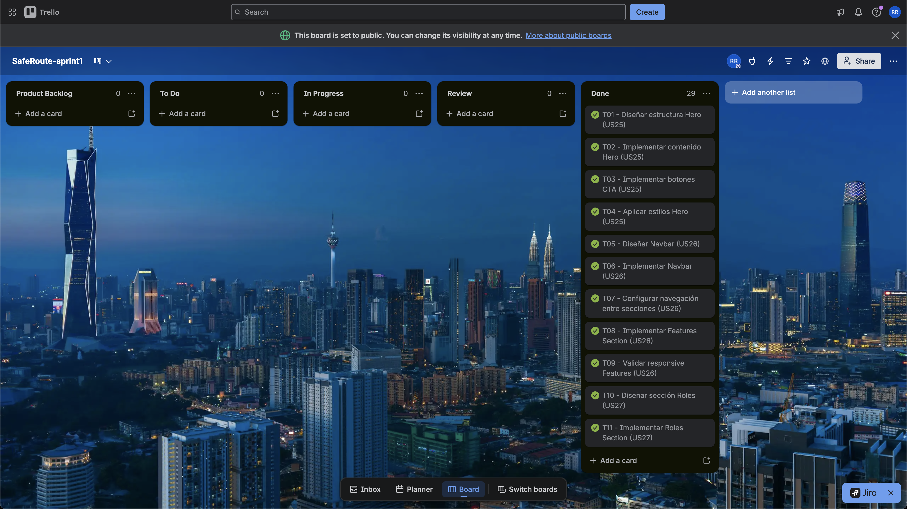

_Nota. Sprint Board del Sprint 1 utilizado para la gestión colaborativa de tareas y seguimiento del desarrollo del Landing Page de SafeRoute mediante Trello. Elaboración propia._

**URL del Board:**
https://trello.com/b/NcRCOOzt/saferoute-sprint1

##### 5.2.1.4. Development Evidence for Sprint Review

| Repository             | Branch             | Commit Id | Commit Message                                                       | Commit Message Body                 | Commited on (Date) |
| ---------------------- | ------------------ | --------- | -------------------------------------------------------------------- | ----------------------------------- | ------------------ |
| saferoute-landing-page | develop            | d7f8ce0   | docs: add README content                                             | Documentation update                | 2026-04-19         |
| saferoute-landing-page | develop            | 9b9fa84   | chore: update meta tags                                              | SEO improvements                    | 2026-04-19         |
| saferoute-landing-page | develop            | a66ef43   | docs: add images to README for landing page section                  | Documentation images added          | 2026-04-19         |
| saferoute-landing-page | develop            | 1832739   | feat: add roles and features sections                                | Roles and features added            | 2026-04-19         |
| saferoute-landing-page | develop            | 293e76c   | Merge branch 'feature/responsive' into develop                       | Integration of responsive features  | 2026-04-19         |
| saferoute-landing-page | develop            | 655723b   | Merge branch 'feature/footer' into develop                           | Integration of footer section       | 2026-04-19         |
| saferoute-landing-page | develop            | 916d89c   | Merge branch 'feature/howworks' into develop                         | Integration of how it works section | 2026-04-19         |
| saferoute-landing-page | develop            | 61be65c   | Merge branch 'feature/plans' into develop                            | Integration of plans feature        | 2026-04-19         |
| saferoute-landing-page | develop            | f5c00dc   | Merge branch 'feature/hero' into develop                             | Integration of hero feature         | 2026-04-19         |
| saferoute-landing-page | feature/responsive | 0393e68   | feat: added script.js file for translation and responsive            | Script integration                  | 2026-04-19         |
| saferoute-landing-page | feature/responsive | 96623f1   | feat: Added all the json for the translation                         | Translation files added             | 2026-04-19         |
| saferoute-landing-page | feature/responsive | ca60a34   | feat: Added .js file for responsive and button for changing language | Responsive behavior added           | 2026-04-19         |
| saferoute-landing-page | feature/footer     | 25c96ca   | feat: add footer section with links and contact info                 | Footer section created              | 2026-04-19         |
| saferoute-landing-page | feature/navbar     | 7311e9d   | feat: implement landing navigation section                           | Navbar implementation               | 2026-04-19         |
| saferoute-landing-page | feature/howworks   | 9d7047d   | feat: Added the styles to the "How It Works" section                 | Styling applied                     | 2026-04-18         |
| saferoute-landing-page | feature/howworks   | 8d7f3d6   | feat: Added How it Works section to index.html                       | Section structure added             | 2026-04-18         |
| saferoute-landing-page | feature/plans      | d294def   | feat: add pricing plans section                                      | Pricing section added               | 2026-04-18         |
| saferoute-landing-page | feature/hero       | e0c7125   | feat: add hero section with main headline and call to action         | Hero section implementation         | 2026-04-18         |
| saferoute-landing-page | develop            | bc93887   | chore: initialize project structure for landing page                 | Initial setup of project structure  | 2026-04-18         |

##### 5.2.1.5. Execution Evidence for Sprint Review

El desarrollo abarcó la implementación de las principales secciones del sitio, incluyendo la sección de roles de usuario, la sección de planes de suscripción, la sección ¿Como funciona?, así como componentes complementarios como el footer. Estas secciones permiten al usuario comprender el propósito del sistema, sus beneficios y las principales funcionalidades disponibles.

Asimismo, se implementó diseño responsivo, garantizando que la experiencia de usuario sea consistente y accesible desde distintos dispositivos.

A continuación, se presentan capturas de las principales vistas implementadas durante el Sprint:


_Nota. Captura de pantalla de la sección Hero del Landing Page de SafeRoute, donde se presenta la propuesta de valor principal. Elaboración propia._


_Nota. Captura de pantalla de la sección de funcionalidades (Features) del Landing Page de SafeRoute, donde se describen las principales capacidades del sistema. Elaboración propia._


_Nota. Captura de pantalla de la sección de roles de usuario del Landing Page de SafeRoute, donde se explican los perfiles de Administrador, Conductor y Padre. Elaboración propia._


_Nota. Captura de pantalla de la sección de planes de suscripción del Landing Page de SafeRoute, donde se presentan las opciones disponibles para los usuarios. Elaboración propia._


_Nota. Captura de pantalla del diseño responsivo del Landing Page de SafeRoute en dispositivos móviles, evidenciando la adaptabilidad de la interfaz. Elaboración propia._

Link de video: https://drive.google.com/file/d/1iM0EYDQwLNf45i2Ez_Ht90l8w68aF1lp/view?usp=sharing

##### 5.2.1.6. Services Documentation Evidence for Sprint Review

En este Sprint no se desarrollaron servicios RESTful, ya que el enfoque estuvo centrado en la implementación del Landing Page de SafeRoute.

La construcción de APIs será abordada en los siguientes Sprints, donde se integrará la lógica del sistema y la comunicación con la base de datos.

##### 5.2.1.7. Software Deployment Evidence for Sprint Review

El proceso de despliegue consistió en la configuración del repositorio en GitHub, habilitando la opción de GitHub Pages y estableciendo la rama principal como fuente de publicación. Esto permitió que cada cambio realizado en el repositorio se refleje automáticamente en el entorno de producción.

Como resultado, el Landing Page se encuentra disponible para su acceso y validación por parte de los usuarios, cumpliendo con el objetivo de presentar la propuesta de valor del producto en un entorno real.

A continuación, se presentan capturas del proceso y resultado del despliegue:


_Nota. Captura de la configuración de GitHub Pages en el repositorio del proyecto. Elaboración propia._

El Landing Page desplegado se encuentra disponible en el siguiente enlace:

https://upc-pre-202610-1asi0729-11896-fivetech.github.io/saferoute-website/

##### 5.2.1.8. Team Collaboration Insights during Sprint

Durante el desarrollo del Sprint 1, el equipo implementó un flujo de trabajo basado en GitFlow, el cual permitió organizar de manera eficiente el desarrollo colaborativo del Landing Page del proyecto SafeRoute.

El proceso de desarrollo se estructuró de la siguiente manera:

- Cada integrante trabajó de forma independiente en una rama específica de tipo **feature**, destinada a una funcionalidad concreta del sistema (por ejemplo: `feature/hero`, `feature/navbar`, `feature/plans`, `feature/howworks`, `feature/responsive`).
- Una vez finalizado el desarrollo de cada funcionalidad, estas ramas fueron integradas en la rama **develop**, la cual actúa como rama de consolidación del proyecto.
- Posteriormente, la rama **develop** fue utilizada como base para la integración final hacia la rama **main**, donde se mantiene la versión estable del Landing Page.

Este flujo permitió:

- Trabajar en paralelo sin conflictos entre integrantes
- Mantener control sobre los cambios realizados
- Garantizar la estabilidad del producto antes de su versión final

A continuación, se presentan capturas que evidencian la actividad del equipo durante el Sprint:


_Nota. Panel de analíticos del repositorio. Elaboración propia._


_Nota. Gráfico de red que evidencia el flujo de trabajo basado en ramas feature integradas en develop y posteriormente fusionadas en main durante el Sprint. Elaboración propia._


_Nota. Analíticos de contribución por integrante del repositorio durante el Sprint 1. Elaboración propia._


_Nota. Historial de commits del repositorio evidenciando la participación de los integrantes del equipo. Elaboración propia._

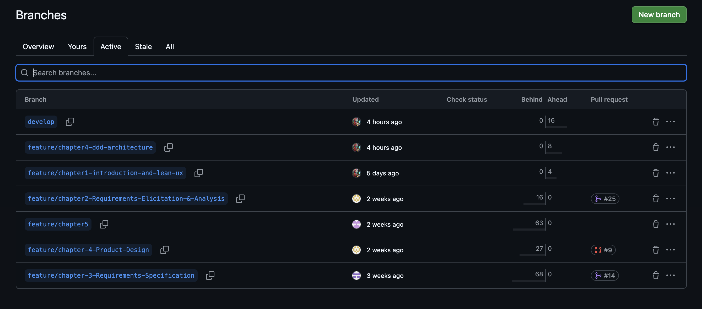

_Nota. Evidencia del uso de ramas feature dentro del flujo de trabajo GitFlow, mostrando el desarrollo independiente de funcionalidades. Elaboración propia._

#### 5.2.2. Sprint 2

##### 5.2.2.1. Sprint Planning 2

| Sprint #                        | Sprint 2                                                                                                                                                                                                                                                                                                                                                                                                                                                                                                                                                                                                                   |
| ------------------------------- | -------------------------------------------------------------------------------------------------------------------------------------------------------------------------------------------------------------------------------------------------------------------------------------------------------------------------------------------------------------------------------------------------------------------------------------------------------------------------------------------------------------------------------------------------------------------------------------------------------------------------- |
| **Sprint Planning Background**  |                                                                                                                                                                                                                                                                                                                                                                                                                                                                                                                                                                                                                            |
| Date                            | 2026-05-13                                                                                                                                                                                                                                                                                                                                                                                                                                                                                                                                                                                                                 |
| Time                            | 07:00 PM                                                                                                                                                                                                                                                                                                                                                                                                                                                                                                                                                                                                                   |
| Location                        | Microsoft Teams                                                                                                                                                                                                                                                                                                                                                                                                                                                                                                                                                                                                            |
| Prepared By                     | Renzo Revilla                                                                                                                                                                                                                                                                                                                                                                                                                                                                                                                                                                                                              |
| Attendees (to planning meeting) | Todo el equipo                                                                                                                                                                                                                                                                                                                                                                                                                                                                                                                                                                                                             |
| Sprint 1 Review Summary         | Durante el Sprint 1 se logró desarrollar y desplegar la primera versión funcional del Landing Page de SafeRoute. Se implementaron las principales secciones informativas del producto, incluyendo Hero, precios, testimonios, formulario de contacto y explicación general del servicio. Además, se configuró el entorno de desarrollo, repositorio GitHub y flujo de trabajo colaborativo mediante ramas feature y develop.                                                                                                                                                                                               |
| Sprint 1 Retrospective Summary  | El equipo identificó mejoras necesarias en la organización de tareas y trazabilidad entre User Stories, Product Backlog y Sprint Backlog. Asimismo, se concluyó que el uso de ramas feature permitió reducir conflictos de integración y mejorar el trabajo colaborativo. Como oportunidad de mejora, se acordó optimizar la estimación de tareas y fortalecer la validación responsive antes del despliegue.                                                                                                                                                                                                              |
| **Sprint Goal & User Stories**  |                                                                                                                                                                                                                                                                                                                                                                                                                                                                                                                                                                                                                            |
| Sprint 2 Goal                   | Nuestro enfoque es permitir que administradores, conductores y padres de familia experimenten las funcionalidades esenciales de gestión y monitoreo del transporte escolar de SafeRoute mediante flujos operativos básicos de la plataforma. Creemos que esto aporta una mejor organización, mayor visibilidad del servicio y una comunicación más eficiente entre los usuarios involucrados en el traslado escolar. Esto se validará cuando los usuarios puedan interactuar correctamente con las principales funcionalidades relacionadas con rutas, alumnos y monitoreo del servicio durante las pruebas de usabilidad. |
| Sprint 2 Velocity               | 25 Story Points                                                                                                                                                                                                                                                                                                                                                                                                                                                                                                                                                                                                            |
| Sum of Story Points             | 24 Story Points                                                                                                                                                                                                                                                                                                                                                                                                                                                                                                                                                                                                            |

##### 5.2.2.2. Aspect Leaders and Collaborators

| Team Member (Last Name, First Name)       | GitHub Username | Frontend Architecture Leader (L) / Collaborator (C) | UI Components Leader (L) / Collaborator (C) | Responsive Design Leader (L) / Collaborator (C) | Routing & Navigation Leader (L) / Collaborator (C) | Deployment Leader (L) / Collaborator (C) |
| ----------------------------------------- | --------------- | --------------------------------------------------- | ------------------------------------------- | ----------------------------------------------- | -------------------------------------------------- | ---------------------------------------- |
| Revilla Quispe, Renzo Zamir               | renzorevq24     | L                                                   | C                                           | C                                               | L                                                  | L                                        |
| Quispe Serrano, Julio Frank               | FraSe-JQ        | C                                                   | L                                           | L                                               | C                                                  | C                                        |
| Costa Morales, Christofer William         | miniChorri      | C                                                   | C                                           | L                                               | C                                                  | C                                        |
| De La Cruz De Los Santos, Mathias Marcelo | Dela050406      | C                                                   | C                                           | C                                               | L                                                  | C                                        |
| Ortega Quintana, José Zacarías            | AgoxX61         | C                                                   | C                                           | L                                               | C                                                  | C                                        |

##### 5.2.2.3. Sprint Backlog 2

| User Story ID | User Story Title         | Task ID | Task Title                              | Description                                                    | Estimation (Hours) | Assigned To | Status |
| ------------- | ------------------------ | ------- | --------------------------------------- | -------------------------------------------------------------- | ------------------ | ----------- | ------ |
| US02          | Registro de Conductores  | T01     | Diseñar formulario de conductores       | Diseño visual del formulario de registro de conductores        | 2                  | Renzo       | Done   |
| US02          | Registro de Conductores  | T02     | Implementar Driver Form                 | Desarrollo funcional del formulario de registro de conductores | 4                  | Renzo       | Done   |
| US02          | Registro de Conductores  | T03     | Implementar validaciones de conductores | Desarrollo de validaciones visuales y mensajes de error        | 2                  | José        | Done   |
| US02          | Registro de Conductores  | T04     | Adaptar formulario responsive           | Optimización responsive del módulo de conductores              | 2                  | José        | Done   |
| US04          | Alta de Alumnos          | T05     | Diseñar módulo de alumnos               | Diseño visual del módulo de gestión de alumnos                 | 2                  | Julio       | Done   |
| US04          | Alta de Alumnos          | T06     | Implementar tabla de alumnos            | Desarrollo de tabla de visualización de estudiantes            | 3                  | Julio       | Done   |
| US04          | Alta de Alumnos          | T07     | Implementar formulario de alumnos       | Desarrollo de formulario de registro de alumnos                | 3                  | Julio       | Done   |
| US04          | Alta de Alumnos          | T08     | Implementar validaciones de alumnos     | Desarrollo de validaciones y mensajes de error                 | 2                  | Julio       | Done   |
| US05          | Creación de Rutas        | T09     | Diseñar interfaz de rutas               | Diseño de interfaz de gestión y visualización de rutas         | 2                  | Christofer  | Done   |
| US05          | Creación de Rutas        | T10     | Implementar gestión de rutas            | Desarrollo funcional del módulo de rutas                       | 4                  | Christofer  | Done   |
| US05          | Creación de Rutas        | T11     | Implementar visualización de rutas      | Desarrollo visual de rutas y paradas en interfaz               | 3                  | Christofer  | Done   |
| US05          | Creación de Rutas        | T12     | Implementar Sidebar Navigation          | Desarrollo de sidebar y navegación entre módulos               | 3                  | Christofer  | Done   |
| US10          | Inicio de Trayecto       | T13     | Diseñar flujo de inicio de trayecto     | Diseño del flujo operativo de inicio de recorrido              | 1                  | Mathias     | Done   |
| US10          | Inicio de Trayecto       | T14     | Implementar Trip Start Flow             | Desarrollo del flujo de inicio y cambio de estado del trayecto | 4                  | Mathias     | Done   |
| US10          | Inicio de Trayecto       | T15     | Validar estados de recorrido            | Verificación visual y funcional de estados del trayecto        | 2                  | Mathias     | Done   |
| US11          | Marcación de Abordaje    | T16     | Diseñar checklist de abordaje           | Diseño visual de lista de control de abordaje                  | 1                  | José        | Done   |
| US11          | Marcación de Abordaje    | T17     | Implementar Boarding Checklist          | Desarrollo funcional de control de abordaje de estudiantes     | 4                  | José        | Done   |
| US11          | Marcación de Abordaje    | T18     | Implementar validaciones de abordaje    | Desarrollo de validaciones de estudiantes y paradas            | 2                  | José        | Done   |
| US14          | Finalización de Ruta     | T19     | Diseñar flujo de finalización           | Diseño del flujo de cierre de trayecto                         | 1                  | Mathias     | Done   |
| US14          | Finalización de Ruta     | T20     | Implementar Trip End Flow               | Desarrollo funcional de finalización de recorrido              | 3                  | Mathias     | Done   |
| US14          | Finalización de Ruta     | T21     | Validar cierre de trayecto              | Verificación funcional de estados de cierre de ruta            | 2                  | Mathias     | Done   |
| US18          | Rastreo en Tiempo Real   | T22     | Diseñar interfaz de tracking            | Diseño visual del mapa y seguimiento de unidades               | 2                  | Renzo       | Done   |
| US18          | Rastreo en Tiempo Real   | T23     | Implementar Tracking Map                | Desarrollo de integración visual de mapa mock                  | 4                  | Renzo       | Done   |
| US18          | Rastreo en Tiempo Real   | T24     | Implementar Dashboard Components        | Desarrollo visual de widgets y dashboard de monitoreo          | 3                  | Renzo       | Done   |
| US18          | Rastreo en Tiempo Real   | T25     | Validar experiencia de tracking         | Verificación visual y responsive del módulo de rastreo         | 2                  | Renzo       | Done   |
| US20          | Confirmación de Llegada  | T26     | Diseñar alertas de llegada              | Diseño visual de alertas y confirmaciones                      | 1                  | Julio       | Done   |
| US20          | Confirmación de Llegada  | T27     | Implementar Arrival Notifications       | Desarrollo funcional de notificaciones de llegada              | 3                  | Julio       | Done   |
| US20          | Confirmación de Llegada  | T28     | Validar flujo de confirmación           | Verificación funcional de alertas y mensajes visuales          | 2                  | Julio       | Done   |
| TRANSVERSAL   | Deployment & Integration | CT01    | Configurar Frontend Deployment          | Configuración y publicación del frontend en entorno público    | 6                  | Renzo       | Done   |
| TRANSVERSAL   | Deployment & Integration | CT02    | Configurar JSON Server                  | Configuración de mock API mediante JSON Server                 | 5                  | Christofer  | Done   |
| TRANSVERSAL   | Deployment & Integration | CT03    | Validar navegación y rutas              | Verificación de navegación y rutas entre módulos               | 4                  | Mathias     | Done   |
| TRANSVERSAL   | Deployment & Integration | CT04    | Validar despliegue responsive           | Pruebas responsive en distintos dispositivos                   | 4                  | José        | Done   |
| TRANSVERSAL   | Deployment & Integration | CT05    | Validar compatibilidad frontend         | Validación del frontend en navegadores modernos                | 4                  | Julio       | Done   |

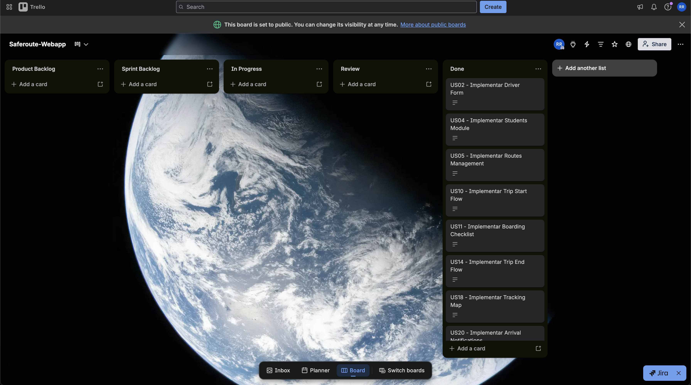
_Nota. Sprint Board del Sprint 2 utilizado para la gestión colaborativa de tareas y seguimiento del desarrollo del frontend web de SafeRoute mediante Trello. Elaboración propia._

**URL del Board:**  
https://trello.com/b/6aNk32RV/saferoute-webapp

##### 5.2.2.4. Development Evidence for Sprint Review

Durante el Sprint 2, el equipo desarrolló la primera versión funcional del frontend web de SafeRoute utilizando Angular y una arquitectura modular basada en bounded contexts. Se implementaron módulos relacionados con autenticación, gestión de comunidad, rutas, monitoreo de viajes, suscripciones, alertas y perfil de usuario. Asimismo, se realizaron configuraciones de infraestructura frontend, integración de mock APIs mediante JSON Server y validaciones de navegación y despliegue responsive.

A continuación, se presentan los principales commits relacionados con el desarrollo e implementación del Sprint 2.

| Repository       | Branch                   | Commit Id | Commit Message                             | Commit Message Body                                                         | Commited on (Date) |
| ---------------- | ------------------------ | --------- | ------------------------------------------ | --------------------------------------------------------------------------- | ------------------ |
| saferoute-webapp | main                     | 962ce21   | Initial commit                             | Initial repository creation and base configuration                          | 2026-04-20         |
| saferoute-webapp | feature/documentation    | 213c1be   | Add: Object-Oriented Design                | Added object-oriented design documentation and diagrams                     | 2026-04-20         |
| saferoute-webapp | feature/documentation    | d960327   | change: Diagrams                           | Updated system diagrams and project documentation                           | 2026-04-21         |
| saferoute-webapp | feature/webapp-structure | 97f2855   | feat: initial repository                   | Initial repository setup and Angular project initialization                 | 2026-05-07         |
| saferoute-webapp | feature/webapp-structure | eaf2cdb   | chore: initial struct webapp               | Initial frontend web application structure using Angular                    | 2026-05-08         |
| saferoute-webapp | feature/shared           | c098027   | chore: initial project                     | Base project configuration and shared module setup                          | 2026-05-13         |
| saferoute-webapp | feature/shared           | 5d6b074   | chore: add infrastructure and presentation | Added infrastructure and presentation layers following modular architecture | 2026-05-13         |
| saferoute-webapp | feature/notifications    | 1ef7f26   | chore: add bounded notifications           | Added notifications bounded context and routing configuration               | 2026-05-13         |
| saferoute-webapp | feature/deployment       | 2ca7475   | fix: remove deploy yml                     | Removed conflicting deployment workflow configuration                       | 2026-05-13         |
| saferoute-webapp | feature/stakeholder      | f58288a   | feat: add feature stakeholder              | Added stakeholder bounded context and related frontend modules              | 2026-05-13         |

##### 5.2.2.5. Execution Evidence for Sprint Review

Durante el Sprint 2, el equipo logró desarrollar la primera versión funcional del frontend web de SafeRoute utilizando Angular y una arquitectura modular basada en bounded contexts. Se implementaron las principales interfaces relacionadas con la gestión de rutas, estudiantes, conductores, notificaciones y monitoreo del sistema, permitiendo validar la navegación y experiencia de usuario dentro de la plataforma.

Asimismo, se integraron funcionalidades relacionadas con routing, lazy loading, diseño responsive y mock APIs mediante JSON Server para simular el comportamiento inicial del backend durante las pruebas del frontend.

A continuación, se presentan evidencias de las principales vistas implementadas durante el Sprint 2:

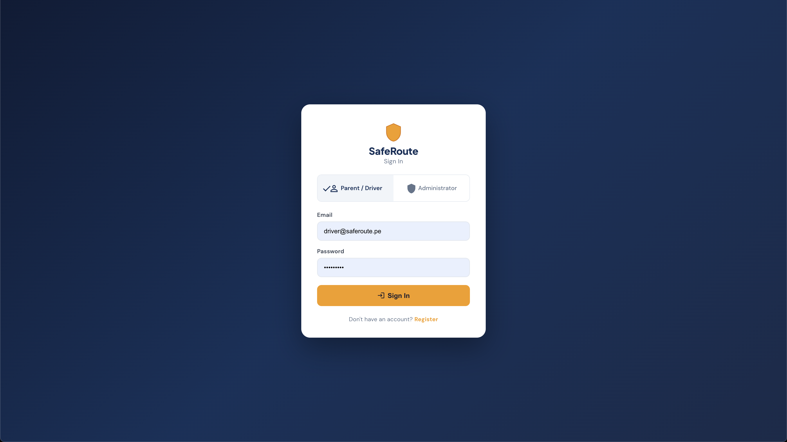

_Nota. Vista de autenticación implementada para el acceso de padres, conductores y administradores dentro del frontend web de SafeRoute. Elaboración propia._

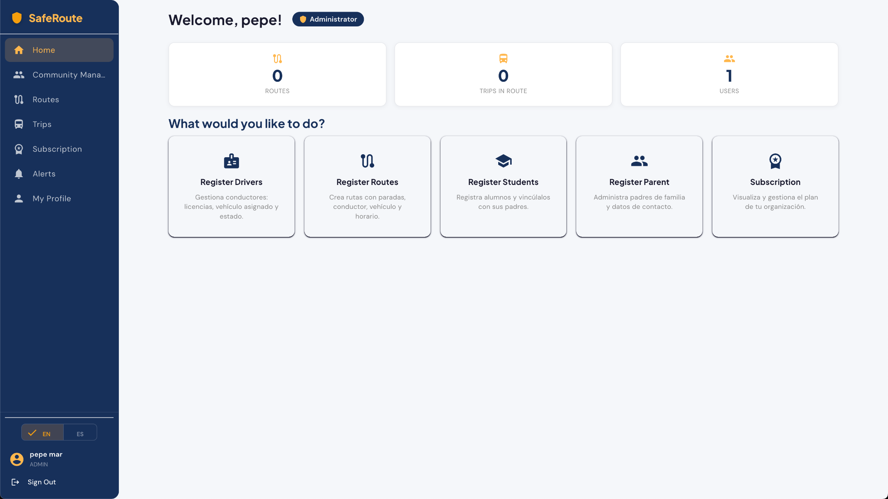

_Nota. Dashboard principal del frontend web desarrollado para mostrar métricas generales y accesos rápidos a los principales módulos del sistema. Elaboración propia._

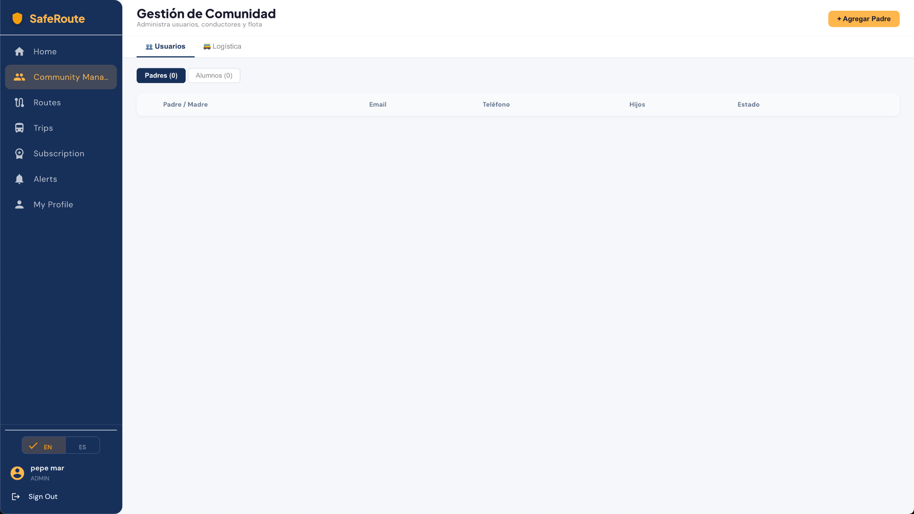

_Nota. Vista de gestión de comunidad implementada para la administración de padres, alumnos y logística escolar. Elaboración propia._

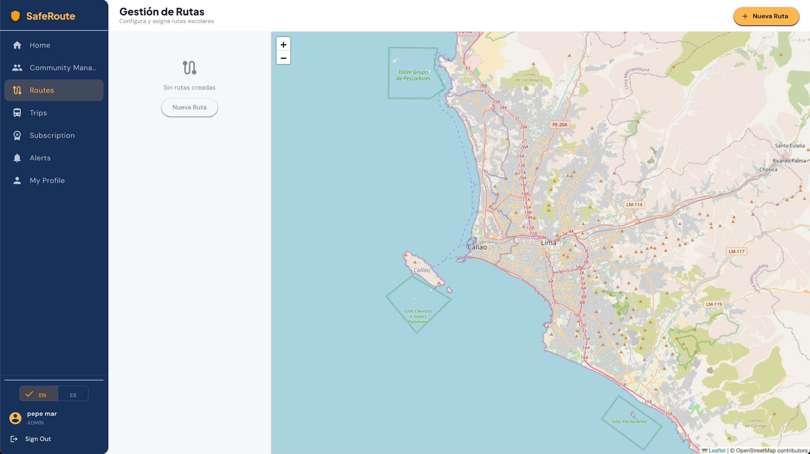

_Nota. Módulo de gestión de rutas desarrollado para la administración y configuración de trayectos escolares mediante visualización en mapa. Elaboración propia._

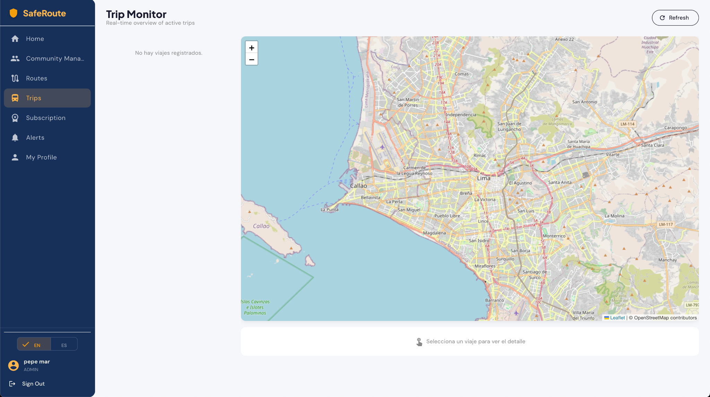

_Nota. Vista de monitoreo de viajes implementada para el seguimiento visual y supervisión de rutas activas en tiempo real. Elaboración propia._

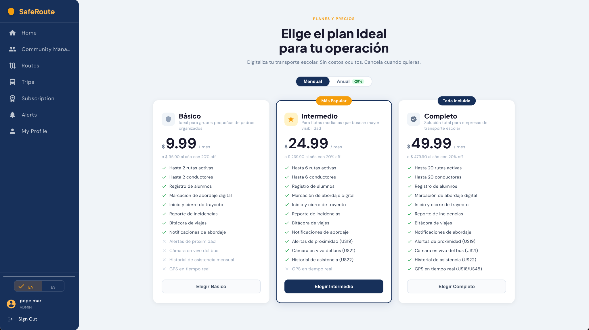

_Nota. Módulo de suscripciones implementado para la visualización y selección de planes del sistema SafeRoute. Elaboración propia._

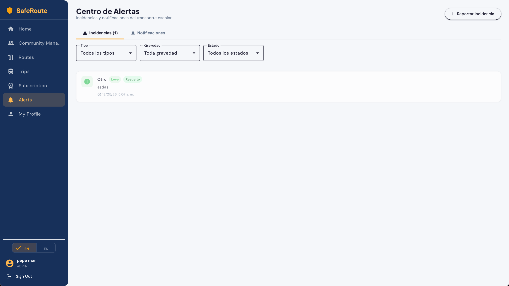

_Nota. Centro de alertas desarrollado para la gestión y visualización de incidencias y notificaciones relacionadas al transporte escolar. Elaboración propia._

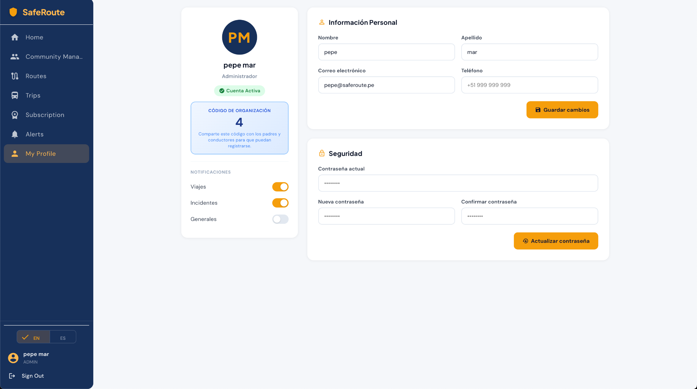

_Nota. Vista de perfil de usuario implementada para la gestión de información personal, configuración y seguridad de la cuenta. Elaboración propia._

Link de video: https://drive.google.com/file/d/1iRpfAo1zkURxUDPMhxPrdXcRv_aauN3-/view?usp=sharing

##### 5.2.2.6. Services Documentation Evidence for Sprint Review

Durante el Sprint 2, el equipo realizó la documentación inicial de servicios y estructuras mock utilizadas para las pruebas del frontend web de SafeRoute. Debido a que el enfoque principal del Sprint estuvo orientado al desarrollo de la Web Application y validación de interfaces frontend, se utilizaron servicios simulados mediante JSON Server para representar el comportamiento inicial de los endpoints REST.

La documentación permitió validar la integración de módulos frontend relacionados con autenticación, rutas, comunidad, monitoreo de viajes, suscripciones y alertas. Asimismo, se realizaron pruebas locales de navegación y consumo de datos mock utilizando peticiones HTTP tipo GET.

A continuación, se presentan algunos de los endpoints mock utilizados durante el Sprint 2.

| Endpoint         | HTTP Method | Description                                                        | Parameters             | Example Response                              |
| ---------------- | ----------- | ------------------------------------------------------------------ | ---------------------- | --------------------------------------------- |
| `/plans`         | GET         | Obtiene la lista de planes de suscripción disponibles en SafeRoute | No requiere parámetros | Lista de planes con precios y características |
| `/routes`        | GET         | Obtiene las rutas registradas en el sistema                        | No requiere parámetros | Lista de rutas escolares                      |
| `/notifications` | GET         | Obtiene notificaciones e incidencias registradas                   | No requiere parámetros | Lista de alertas y eventos                    |
| `/stakeholders`  | GET         | Obtiene usuarios registrados en la plataforma                      | No requiere parámetros | Lista de padres, alumnos y conductores        |
| `/trips`         | GET         | Obtiene información de viajes activos o registrados                | No requiere parámetros | Lista de trayectos monitoreados               |

**Endpoints:**  
https://saferoute-os.azurewebsites.net/swagger-ui/index.html

**Herramienta utilizada para Mock APIs:**  
JSON Server

**Ejemplo de URL local utilizada durante pruebas:**

```javascript
http://localhost:3000/plans
http://localhost:3000/routes
http://localhost:3000/notifications
http://localhost:3000/stakeholders
http://localhost:3000/trips
```

##### 5.2.2.7. Software Deployment Evidence for Sprint Review

El proceso de despliegue consistió en la configuración del repositorio en GitHub, habilitando la opción de GitHub Pages y estableciendo la rama principal como fuente de publicación. Esto permitió que cada cambio realizado en el repositorio se refleje automáticamente en el entorno de producción.

Como resultado, el Landing Page se encuentra disponible para su acceso y validación por parte de los usuarios, cumpliendo con el objetivo de presentar la propuesta de valor del producto en un entorno real.

A continuación, se presentan capturas del proceso y resultado del despliegue:


_Nota. Panel de actividad y analíticos del repositorio SafeRoute WebApp durante el Sprint 2. Elaboración propia._


_Nota. Gráfico de red que evidencia el flujo de trabajo colaborativo basado en ramas feature integradas en develop para la Web Application. Elaboración propia._


_Nota. Analíticos de contribución por integrante dentro del repositorio SafeRoute WebApp durante el Sprint 2. Elaboración propia._


_Nota. Historial de commits realizados por los integrantes del equipo durante el desarrollo del Sprint 2. Elaboración propia._


_Nota. Evidencia de ramas feature utilizadas para el desarrollo modular de funcionalidades dentro de la Web Application. Elaboración propia._

El Landing Page desplegado se encuentra disponible en el siguiente enlace:

https://upc-pre-202610-1asi0729-11896-fivetech.github.io/saferoute-website/

##### 5.2.2.8. Team Collaboration Insights during Sprint

Durante el desarrollo del Sprint 2, el equipo implementó un flujo de trabajo colaborativo basado en GitFlow para organizar el desarrollo de la Web Application del proyecto SafeRoute. Este enfoque permitió distribuir responsabilidades entre los integrantes y mantener un control adecuado sobre la integración de funcionalidades desarrolladas en paralelo.

El proceso de colaboración se estructuró de la siguiente manera:

- Cada integrante trabajó sobre ramas independientes de tipo **feature**, enfocadas en módulos específicos del sistema como autenticación, gestión de comunidad, rutas, monitoreo de viajes, suscripciones, alertas y perfil de usuario.
- Las funcionalidades desarrolladas fueron integradas progresivamente en la rama **develop**, utilizada como entorno de consolidación y pruebas del frontend.
- Finalmente, las implementaciones validadas fueron preparadas para su integración hacia la rama **main**, manteniendo una versión estable del proyecto.

Este flujo de trabajo permitió:

- Desarrollar módulos de manera paralela sin afectar el trabajo de otros integrantes
- Mantener trazabilidad sobre los cambios implementados
- Facilitar la integración continua de funcionalidades frontend
- Organizar la colaboración del equipo mediante commits y ramas específicas

A continuación, se presentan capturas que evidencian la colaboración del equipo durante el Sprint 2:

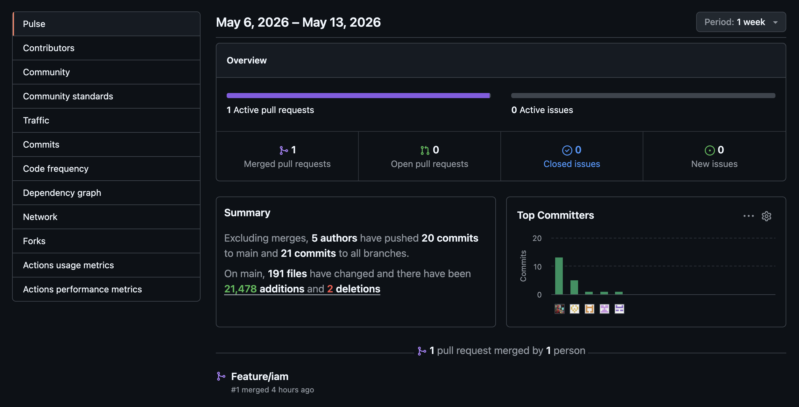

_Nota. Panel de actividad y analíticos del repositorio SafeRoute WebApp durante el Sprint 2. Elaboración propia._

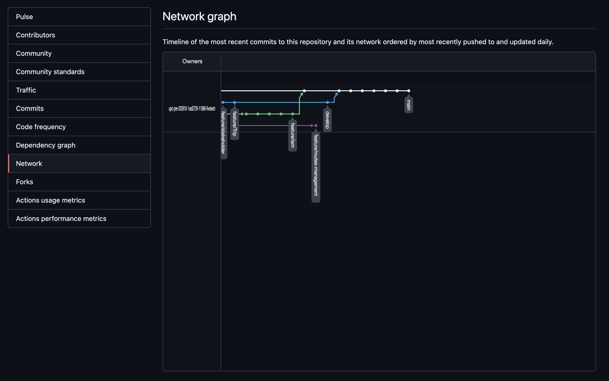

_Nota. Gráfico de red que evidencia el flujo de trabajo colaborativo basado en ramas feature integradas en develop para la Web Application. Elaboración propia._


_Nota. Analíticos de contribución por integrante dentro del repositorio SafeRoute WebApp durante el Sprint 2. Elaboración propia._

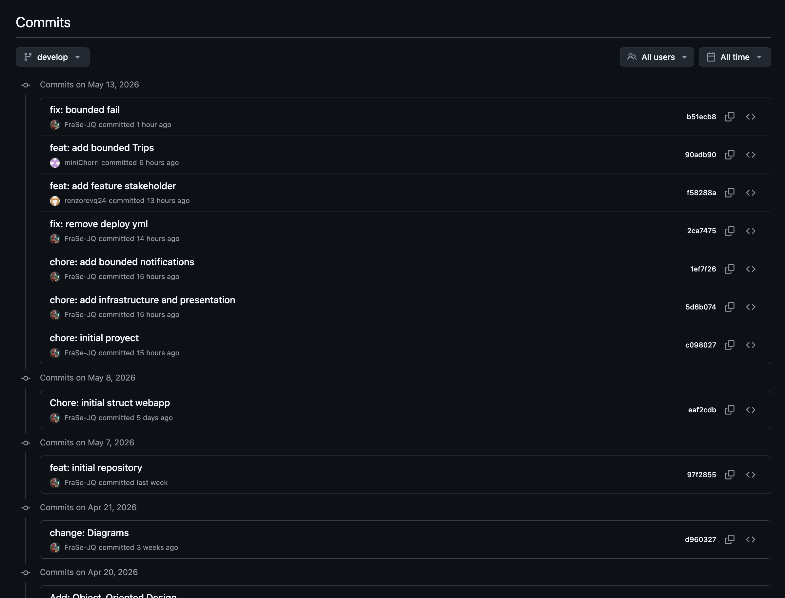

_Nota. Historial de commits realizados por los integrantes del equipo durante el desarrollo del Sprint 2. Elaboración propia._

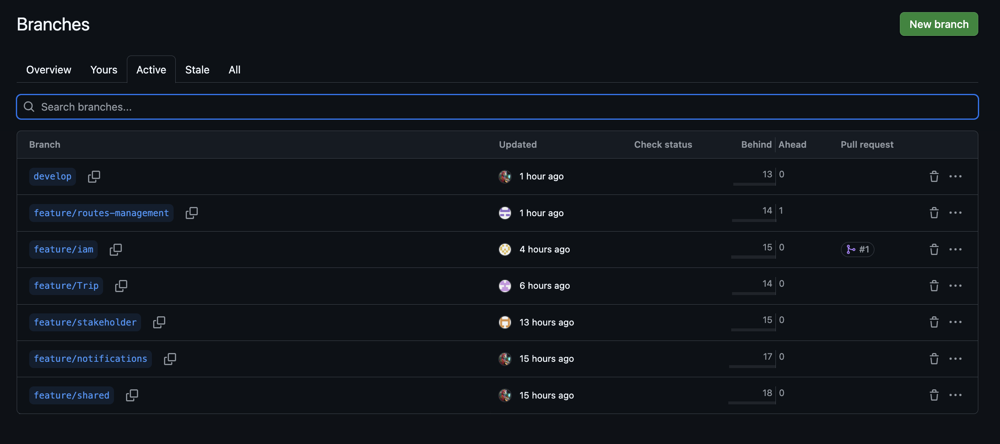

_Nota. Evidencia de ramas feature utilizadas para el desarrollo modular de funcionalidades dentro de la Web Application. Elaboración propia._

#### 5.2.3. Sprint 3

##### 5.2.3.1. Sprint Planning 3

| Sprint #                        | Sprint 3                                                                                                                                                                                                                                                                                                                                                                                                                                                                                                                                                                                                                                                                               |
| ------------------------------- | -------------------------------------------------------------------------------------------------------------------------------------------------------------------------------------------------------------------------------------------------------------------------------------------------------------------------------------------------------------------------------------------------------------------------------------------------------------------------------------------------------------------------------------------------------------------------------------------------------------------------------------------------------------------------------------- |
| **Sprint Planning Background**  |                                                                                                                                                                                                                                                                                                                                                                                                                                                                                                                                                                                                                                                                                        |
| Date                            | 2026-06-14                                                                                                                                                                                                                                                                                                                                                                                                                                                                                                                                                                                                                                                                             |
| Time                            | 11:00 PM                                                                                                                                                                                                                                                                                                                                                                                                                                                                                                                                                                                                                                                                               |
| Location                        | Microsoft Teams                                                                                                                                                                                                                                                                                                                                                                                                                                                                                                                                                                                                                                                                        |
| Prepared By                     | Renzo Revilla                                                                                                                                                                                                                                                                                                                                                                                                                                                                                                                                                                                                                                                                          |
| Attendees (to planning meeting) | Todo el equipo                                                                                                                                                                                                                                                                                                                                                                                                                                                                                                                                                                                                                                                                         |
| Sprint 2 Review Summary         | Durante el Sprint 2 se logró desarrollar la primera versión funcional del frontend web de SafeRoute utilizando Angular y una arquitectura modular basada en bounded contexts. Se implementaron módulos de gestión de conductores, alumnos, rutas, monitoreo de trayectos y notificaciones, además de validar la navegación responsive e integración mediante mock APIs usando JSON Server.                                                                                                                                                                                                                                                                                             |
| Sprint 2 Retrospective Summary  | El equipo concluyó que la modularización frontend y el uso de GitFlow facilitaron el trabajo colaborativo y redujeron conflictos de integración. Como mejora, se acordó fortalecer la integración real con backend y documentar adecuadamente los servicios REST para facilitar pruebas y despliegue.                                                                                                                                                                                                                                                                                                                                                                                  |
| **Sprint Goal & User Stories**  |                                                                                                                                                                                                                                                                                                                                                                                                                                                                                                                                                                                                                                                                                        |
| Sprint 3 Goal                   | Nuestro enfoque es fortalecer la confianza de los padres de familia y mejorar el control operativo de los transportistas escolares mediante una experiencia que permita comunicar incidencias, confirmar estados del trayecto y mantener informados a los usuarios durante el servicio. Creemos que esto aporta valor al negocio porque reduce la incertidumbre de las familias, mejora la percepción de seguridad del transporte escolar y ayuda a que los administradores profesionalicen su operación. Esto se validará cuando los usuarios puedan reconocer que SafeRoute les brinda mayor tranquilidad, orden y visibilidad sobre el traslado escolar durante las pruebas de uso. |
| Sprint 3 Velocity               | 28 Story Points                                                                                                                                                                                                                                                                                                                                                                                                                                                                                                                                                                                                                                                                        |
| Sum of Story Points             | 27 Story Points                                                                                                                                                                                                                                                                                                                                                                                                                                                                                                                                                                                                                                                                        |

##### 5.2.3.2. Aspect Leaders and Collaborators

| Team Member (Last Name, First Name)       | GitHub Username | Backend Architecture Leader (L) / Collaborator (C) | API Documentation Leader (L) / Collaborator (C) | Database Design Leader (L) / Collaborator (C) | Integration Testing Leader (L) / Collaborator (C) | Deployment Leader (L) / Collaborator (C) |
| ----------------------------------------- | --------------- | -------------------------------------------------- | ----------------------------------------------- | --------------------------------------------- | ------------------------------------------------- | ---------------------------------------- |
| Revilla Quispe, Renzo Zamir               | renzorevq24     | L                                                  | C                                               | C                                             | L                                                 | L                                        |
| Quispe Serrano, Julio Frank               | FraSe-JQ        | C                                                  | L                                               | C                                             | C                                                 | C                                        |
| De La Cruz De Los Santos, Mathias Marcelo | Dela050406      | C                                                  | C                                               | L                                             | L                                                 | C                                        |
| Ortega Quintana, José Zacarías            | AgoxX61         | C                                                  | C                                               | L                                             | C                                                 | C                                        |

##### 5.2.3.3. Sprint Backlog 3

| US ID | User Story  | Task ID | Task Title       | Description                           | Hrs | Assigned | Status |
| ----- | ----------- | ------- | ---------------- | ------------------------------------- | --: | -------- | ------ |
| US12  | Incidencias | T01     | Analizar flujo   | Flujo de incidencias                  |   1 | Renzo    | Done   |
| US12  | Incidencias | T02     | Aggregate        | Modelado del aggregate de incidencias |   2 | Renzo    | Done   |
| US12  | Incidencias | T03     | Commands         | Comandos para incidencias             |   2 | Renzo    | Done   |
| US12  | Incidencias | T04     | Events           | Eventos de dominio                    |   2 | Renzo    | Done   |
| US12  | Incidencias | T05     | Repository       | Persistencia de incidencias           |   2 | José     | Done   |
| US12  | Incidencias | T06     | Persistence      | Configuración persistence layer       |   2 | José     | Done   |
| US12  | Incidencias | T07     | Service          | Lógica de negocio                     |   3 | Renzo    | Done   |
| US12  | Incidencias | T08     | Controller       | Endpoint REST                         |   3 | Renzo    | Done   |
| US12  | Incidencias | T09     | Validaciones     | Campos obligatorios                   |   2 | José     | Done   |
| US12  | Incidencias | T10     | Exceptions       | Manejo de errores                     |   2 | José     | Done   |
| US12  | Incidencias | T11     | Testing POST     | Prueba endpoint POST                  |   2 | José     | Done   |
| US18  | Tracking    | T12     | Analizar flujo   | Flujo GPS                             |   1 | Mathias  | Done   |
| US18  | Tracking    | T13     | Aggregate        | Aggregate tracking                    |   2 | Mathias  | Done   |
| US18  | Tracking    | T14     | Commands         | Comandos tracking                     |   2 | Mathias  | Done   |
| US18  | Tracking    | T15     | Events           | Eventos tracking                      |   2 | Mathias  | Done   |
| US18  | Tracking    | T16     | Repository       | Persistencia GPS                      |   2 | Mathias  | Done   |
| US18  | Tracking    | T17     | Persistence      | Guardado de coordenadas               |   2 | José     | Done   |
| US18  | Tracking    | T18     | Service          | Servicio GPS                          |   3 | Mathias  | Done   |
| US18  | Tracking    | T19     | Update Location  | Actualizar coordenadas                |   3 | Mathias  | Done   |
| US18  | Tracking    | T20     | Link Trip        | Asociar con viaje                     |   2 | Mathias  | Done   |
| US18  | Tracking    | T21     | Controller       | Endpoint GPS                          |   3 | Mathias  | Done   |
| US18  | Tracking    | T22     | Validaciones     | Validar lat/lng                       |   2 | José     | Done   |
| US18  | Tracking    | T23     | Testing GPS      | Test API                              |   2 | José     | Done   |
| US19  | Proximidad  | T24     | Analizar lógica  | Reglas de proximidad                  |   1 | Julio    | Done   |
| US19  | Proximidad  | T25     | Aggregate        | Aggregate alertas                     |   2 | Julio    | Done   |
| US19  | Proximidad  | T26     | Commands         | Comandos alertas                      |   2 | Julio    | Done   |
| US19  | Proximidad  | T27     | Events           | Eventos alertas                       |   2 | Julio    | Done   |
| US19  | Proximidad  | T28     | Repository       | Persistencia alertas                  |   2 | Julio    | Done   |
| US19  | Proximidad  | T29     | Persistence      | Guardado de alertas                   |   2 | Julio    | Done   |
| US19  | Proximidad  | T30     | Service          | Lógica alertas                        |   3 | Julio    | Done   |
| US19  | Proximidad  | T31     | Distance Calc    | Calcular distancia                    |   4 | Julio    | Done   |
| US19  | Proximidad  | T32     | Threshold        | Radio de proximidad                   |   2 | Julio    | Done   |
| US19  | Proximidad  | T33     | Controller       | Endpoint alertas                      |   3 | Julio    | Done   |
| US19  | Proximidad  | T34     | Anti Spam        | Evitar duplicados                     |   2 | José     | Done   |
| US19  | Proximidad  | T35     | Testing          | Test alertas                          |   2 | José     | Done   |
| US20  | Llegada     | T36     | Analizar flujo   | Flujo de llegada                      |   1 | Julio    | Done   |
| US20  | Llegada     | T37     | Aggregate        | Aggregate llegada                     |   2 | Julio    | Done   |
| US20  | Llegada     | T38     | Commands         | Comandos llegada                      |   2 | Julio    | Done   |
| US20  | Llegada     | T39     | Service          | Servicio llegada                      |   3 | Julio    | Done   |
| US20  | Llegada     | T40     | Controller       | Endpoint llegada                      |   3 | Julio    | Done   |
| US20  | Llegada     | T41     | Delivered Status | Estado delivered                      |   2 | Mathias  | Done   |
| US20  | Llegada     | T42     | Update Trip      | Actualizar viaje                      |   2 | Mathias  | Done   |
| US20  | Llegada     | T43     | Notify Parent    | Avisar padres                         |   2 | Julio    | Done   |
| US20  | Llegada     | T44     | Testing          | Test endpoint                         |   2 | José     | Done   |
| TRANS | Backend     | CT01    | Init Project     | Setup inicial                         |   3 | Renzo    | Done   |
| TRANS | Backend     | CT02    | Packages         | Arquitectura modular                  |   3 | Renzo    | Done   |
| TRANS | Backend     | CT03    | application.yml  | Configuración base                    |   2 | Renzo    | Done   |
| TRANS | Backend     | CT04    | DB Connection    | Conectar base de datos                |   3 | José     | Done   |
| TRANS | Backend     | CT05    | JPA              | Configuración ORM                     |   3 | José     | Done   |
| TRANS | Backend     | CT06    | CORS             | Configuración CORS                    |   2 | Renzo    | Done   |
| TRANS | Security    | CT07    | Error Handler    | Responses de error                    |   2 | José     | Done   |
| TRANS | Security    | CT08    | HTTP Codes       | Status correctos                      |   2 | José     | Done   |
| TRANS | Docs        | CT09    | Swagger          | Configuración OpenAPI                 |   3 | Julio    | Done   |
| TRANS | Docs        | CT10    | Docs GET         | Documentar endpoints GET              |   2 | Julio    | Done   |
| TRANS | Docs        | CT11    | Docs POST        | Documentar endpoints POST             |   2 | Julio    | Done   |
| TRANS | Docs        | CT12    | Test Swagger     | Validar documentación                 |   2 | Julio    | Done   |
| TRANS | Deploy      | CT13    | Env Vars         | Variables de entorno                  |   2 | Renzo    | Done   |
| TRANS | Deploy      | CT14    | Cloud Deploy     | Publicación backend                   |   4 | Renzo    | Done   |
| TRANS | Deploy      | CT15    | Health Check     | Validación final                      |   2 | Renzo    | Done   |

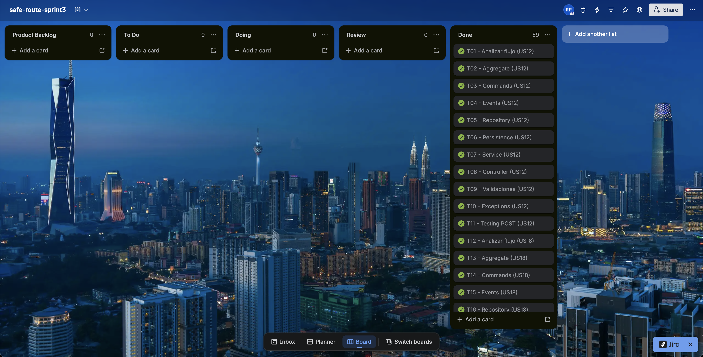

_Nota. Sprint Board del Sprint 3 utilizado para la gestión colaborativa de tareas y seguimiento del desarrollo de los Web Services de SafeRoute mediante Trello. Elaboración propia._

**URL del Board:**
https://trello.com/b/RjHbTl9e

##### 5.2.3.4. Development Evidence for Sprint Review

Durante el Sprint 3, el equipo avanzó significativamente en la implementación de los Web Services de SafeRoute, desarrollando componentes fundamentales de la capa backend para soportar la lógica de negocio del sistema. El desarrollo se enfocó en la construcción de módulos relacionados con la gestión de flota (_fleet management_), asignación de vehículos y administración de viajes (_trip management_), permitiendo consolidar la arquitectura base de servicios del producto.

Asimismo, se trabajó en la configuración del entorno backend utilizando **Spring Boot** como framework principal, junto con una arquitectura modular inspirada en principios de **Domain-Driven Design (DDD)** y **RESTful Services**. Durante este Sprint se implementaron aggregates, commands, repositories, capas de persistencia, servicios de aplicación y controladores REST, permitiendo estructurar adecuadamente el dominio del sistema y preparar la futura integración con la Web Application desarrollada en el Sprint anterior.

Estos avances permitieron consolidar una base backend escalable, mantenible y alineada con los objetivos del negocio, especialmente en funcionalidades relacionadas con el control de unidades de transporte, asignación operativa y monitoreo de trayectos escolares.

A continuación, se presentan los principales commits relacionados con el desarrollo del Sprint 3.

| Repository         | Branch  | Commit Id | Commit Message                                     | Commit Message Body                                              | Commited on (Date) |
| ------------------ | ------- | --------- | -------------------------------------------------- | ---------------------------------------------------------------- | ------------------ |
| saferoute-platform | develop | f542765   | init: add dependencies and config                  | Added backend dependencies and initial Spring Boot configuration | 2026-06-14         |
| saferoute-platform | develop | 8195b6e   | feat(fleet): add vehicle status enum               | Added vehicle status enumeration for fleet domain                | 2026-06-16         |
| saferoute-platform | develop | d006de0   | feat(fleet): add vehicle repository contract       | Added repository contract for vehicle persistence                | 2026-06-16         |
| saferoute-platform | develop | 54fbc4b   | feat(fleet): add vehicle repository implementation | Implemented persistence layer for vehicle management             | 2026-06-16         |
| saferoute-platform | develop | b297a6b   | feat(fleet): add vehicles controller               | Added REST controller for vehicle endpoints                      | 2026-06-16         |
| saferoute-platform | develop | 7762369   | feat(fleet): add assignment aggregate              | Added aggregate root for assignment domain                       | 2026-06-17         |
| saferoute-platform | develop | bf28a67   | feat(fleet): add assignment commands               | Added command definitions for assignment operations              | 2026-06-17         |
| saferoute-platform | develop | 5233376   | feat(fleet): add assignment services               | Added service layer for assignment management                    | 2026-06-17         |
| saferoute-platform | develop | 3190884   | feat(fleet): add assignment rest handling          | Added REST request handling for assignments                      | 2026-06-17         |
| saferoute-platform | develop | dea7fab   | Add Trip aggregate                                 | Added aggregate root for trip management                         | 2026-06-18         |

##### 5.2.3.5. Execution Evidence for Sprint Review

Durante el Sprint 3, el equipo logró implementar los principales componentes funcionales del backend de SafeRoute utilizando Spring Boot y una arquitectura modular basada en Domain-Driven Design. Se desarrollaron funcionalidades relacionadas con la gestión de flota, vehículos, asignación de unidades y modelado de viajes, permitiendo validar la lógica de negocio y la comunicación entre las distintas capas del sistema mediante pruebas funcionales de los servicios REST.

A continuación, se presentan evidencias de las principales funcionalidades implementadas durante el Sprint 3:

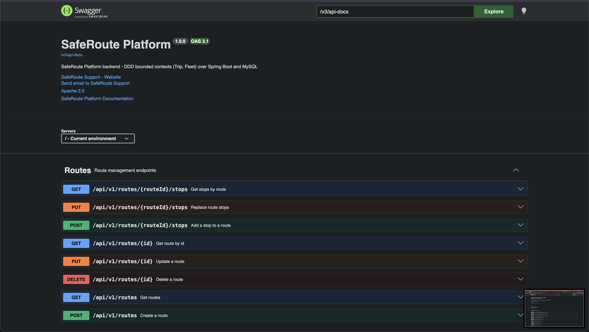

_Nota. Interfaz de Swagger UI utilizada para visualizar y probar los endpoints REST implementados durante el Sprint 3. Elaboración propia._

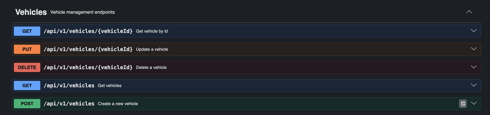

_Nota. Evidencia de los endpoints implementados para la gestión de vehículos dentro del módulo Fleet de SafeRoute. Elaboración propia._

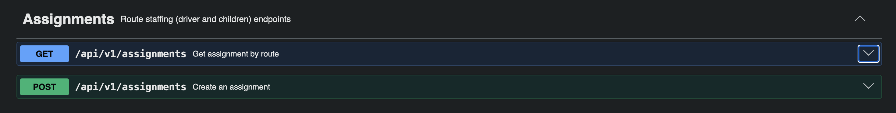

_Nota. Evidencia de los endpoints implementados para la asignación de unidades de transporte dentro del sistema. Elaboración propia._

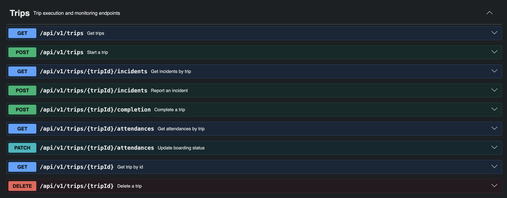

_Nota. Evidencia del modelado y ejecución inicial del módulo Trip para la gestión de viajes escolares. Elaboración propia._

Link de video:  
https://drive.google.com/file/d/1a4F71lyzgjrDwvvhvDDbBhgDxlXq-Oun/view?usp=sharing

##### 5.2.3.6. Services Documentation Evidence for Sprint Review

Durante el Sprint 3, el equipo documentó formalmente los Web Services implementados mediante OpenAPI/Swagger. Esta documentación permitió validar el comportamiento de los endpoints REST, incluyendo parámetros, body requests, responses y códigos HTTP asociados.

A continuación, se presentan algunos de los principales endpoints implementados durante el Sprint 3.

| Endpoint                   | HTTP Method | Description                | Parameters        | Example Response     |
| -------------------------- | ----------- | -------------------------- | ----------------- | -------------------- |
| `/api/v1/trips`               | GET         | Obtiene viajes registrados | No requiere       | Lista de trayectos   |
| `/api/v1/trips/{id}/tracking` | POST        | Registra coordenadas GPS   | tripId, lat, lng  | Tracking actualizado |
| `/api/v1/incidents`           | POST        | Registra incidencia        | Tipo, descripción | Incidencia creada    |
| `/api/v1/notifications`       | GET         | Obtiene notificaciones     | No requiere       | Lista de alertas     |
| `/api/v1/trips/{id}/arrival`  | PATCH       | Confirma llegada           | tripId            | Llegada confirmada   |

##### 5.2.3.7. Software Deployment Evidence for Sprint Review

Durante el Sprint 3 se realizó el despliegue del backend de SafeRoute en un entorno cloud, configurando variables de entorno, base de datos, containerización con Docker y publicación mediante Microsoft Azure. Este proceso permitió que los Web Services estuvieran disponibles en un entorno externo para su posterior consumo por parte de la Web Application.

A continuación, se presentan evidencias del despliegue realizado:

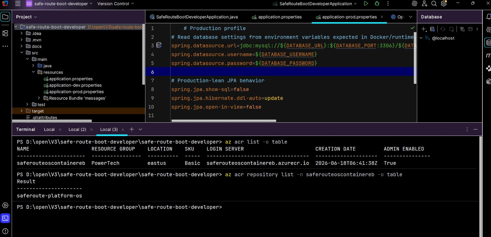

_Nota. Configuración del perfil de producción del backend SafeRoute mediante variables de entorno. Elaboración propia._

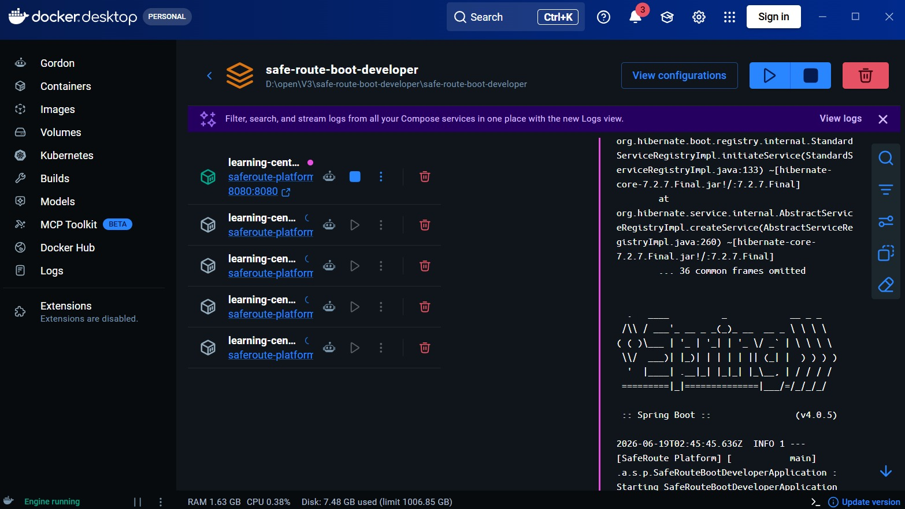

_Nota. Ejecución local del contenedor Docker del backend SafeRoute antes del despliegue en cloud. Elaboración propia._

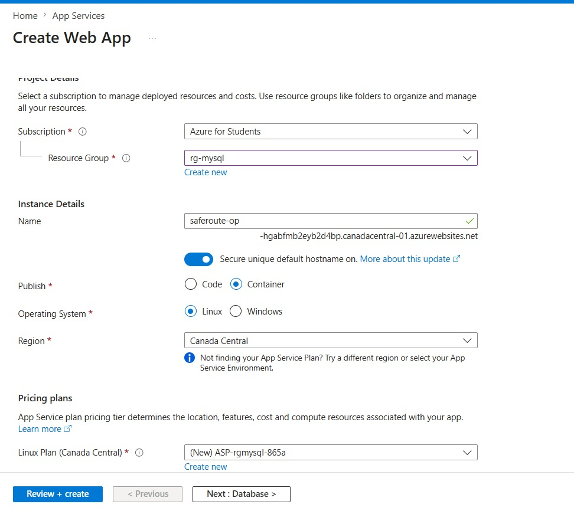

_Nota. Configuración inicial del Azure App Service utilizando contenedores Linux. Elaboración propia._

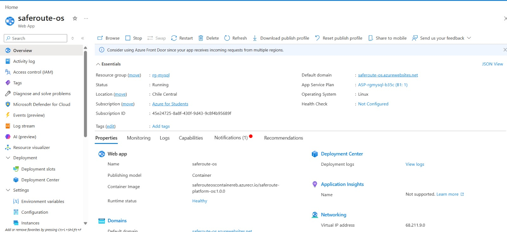

_Nota. Evidencia del backend SafeRoute desplegado en Azure App Service con estado operativo saludable. Elaboración propia._

**Backend Deployment URL:**
https://saferoute-os.azurewebsites.net/swagger-ui/index.html

##### 5.2.3.8. Team Collaboration Insights during Sprint

Durante el desarrollo del Sprint 3, el equipo mantuvo un flujo de trabajo colaborativo basado en GitFlow para organizar el desarrollo de los Web Services del proyecto SafeRoute. Este enfoque permitió trabajar de forma paralela sobre distintos bounded contexts del backend, minimizando conflictos y facilitando la integración continua.

El proceso de colaboración se estructuró de la siguiente manera:

- Cada integrante trabajó en ramas **feature** asociadas a módulos backend específicos.
- Las implementaciones fueron integradas progresivamente en **develop**.
- Las funcionalidades validadas fueron fusionadas hacia **main** para despliegue.

Este flujo de trabajo permitió:

- Mantener modularidad en backend
- Facilitar integración continua
- Reducir conflictos de merge
- Mejorar trazabilidad de cambios

A continuación, se presentan evidencias de la colaboración del equipo durante el Sprint 3:

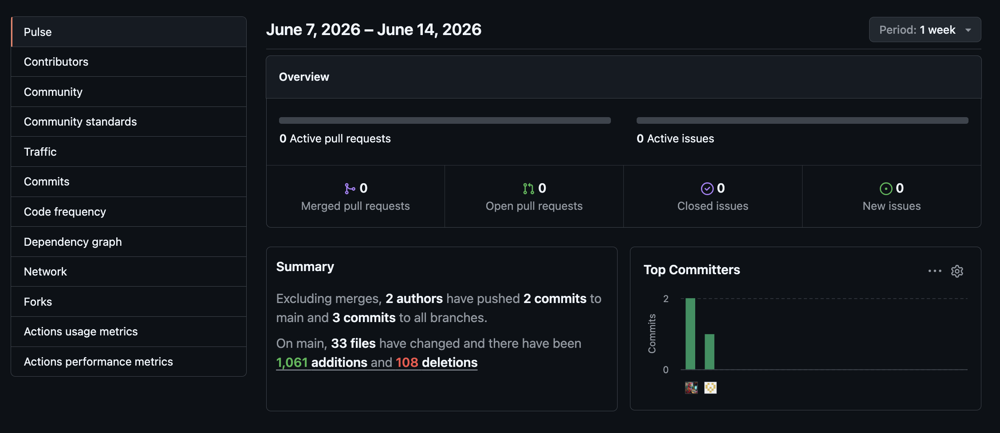

_Nota. Analíticos de actividad del repositorio backend durante el Sprint 3. Elaboración propia._

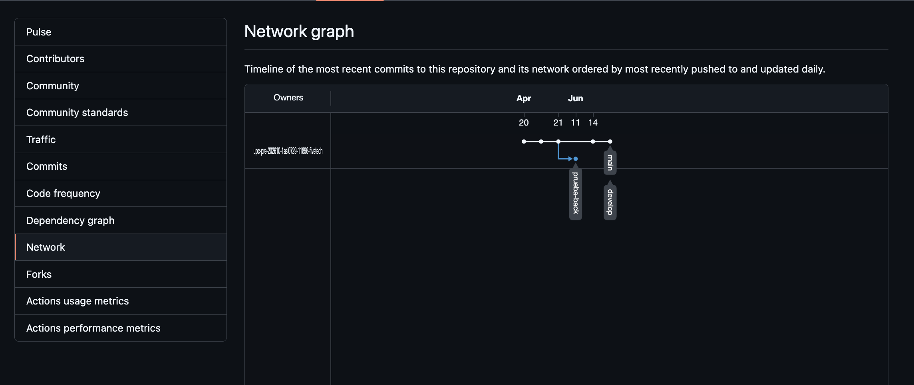

_Nota. Flujo de ramas feature y merges hacia develop/main durante el Sprint 3. Elaboración propia._


_Nota. Contribuciones por integrante durante el Sprint 3. Elaboración propia._

### 5.2.4. Sprint 4

Durante el Sprint 4, el equipo FiveTech concentró sus esfuerzos en consolidar la versión final de SafeRoute, completando la implementación de los bounded contexts definidos para el sistema y eliminando por completo la dependencia del Mock API utilizado en entregas anteriores. A diferencia de los sprints previos, en esta etapa la Web Application fue integrada directamente con el RESTful API desplegado en Azure, asegurando que las funcionalidades principales consuman servicios reales del backend.

El objetivo principal de este sprint fue cerrar el ciclo de desarrollo del producto, asegurar la integración entre frontend y backend, completar los módulos pendientes de los bounded contexts **Identity and Access Management**, **Subscription and Plan Management**, **Stakeholder Management**, **Fleet and Route Management**, **Trip Execution and Monitoring** y **Notifications**, además de corregir las observaciones realizadas en AV2 relacionadas con documentación, carátula, videos, validación, despliegue e integración técnica.

#### 5.2.4.1. Sprint Planning 4

| Sprint #                        | Sprint 4                                                                                                                                                                                                                                                                                                                                                                                                                                                                                                                                                                                                                                                                                      |
| ------------------------------- | --------------------------------------------------------------------------------------------------------------------------------------------------------------------------------------------------------------------------------------------------------------------------------------------------------------------------------------------------------------------------------------------------------------------------------------------------------------------------------------------------------------------------------------------------------------------------------------------------------------------------------------------------------------------------------------------- |
| **Sprint Planning Background**  |                                                                                                                                                                                                                                                                                                                                                                                                                                                                                                                                                                                                                                                                                               |
| Date                            | 2026-07-05                                                                                                                                                                                                                                                                                                                                                                                                                                                                                                                                                                                                                                                                                    |
| Time                            | 07:00 PM                                                                                                                                                                                                                                                                                                                                                                                                                                                                                                                                                                                                                                                                                      |
| Location                        | Reunión virtual mediante Discord y coordinación complementaria por WhatsApp.                                                                                                                                                                                                                                                                                                                                                                                                                                                                                                                                                                                                                  |
| Prepared By                     | Quispe Serrano, Julio Frank                                                                                                                                                                                                                                                                                                                                                                                                                                                                                                                                                                                                                                                                   |
| Attendees (to planning meeting) | Revilla Quispe, Renzo Zamir / Quispe Serrano, Julio Frank / Ortega Quintana, José Zacarias / De La Cruz De Los Santos, Mathias Marcelo                                                                                                                                                                                                                                                                                                                                                                                                                                                                                                                                                        |
| Sprint 3 Review Summary         | Durante el Sprint 3 se logró desplegar una primera versión funcional de los Web Services desarrollados para SafeRoute y se documentaron sus endpoints mediante Swagger UI. También se mantuvo desplegada la Web Application y se avanzó en la integración parcial de funcionalidades principales. Sin embargo, aún existía dependencia del Mock API para ciertos flujos del frontend, por lo que el producto todavía no operaba completamente con el RESTful API real. Además, se recibieron observaciones relacionadas con la actualización del video de exposición, la corrección de la carátula, la mejora de las entrevistas de validación y la consolidación de evidencias del producto. |
| Sprint 3 Retrospective Summary  | El equipo identificó como principales oportunidades de mejora la necesidad de asegurar una integración completa entre frontend y backend, evitar dependencias de datos simulados, corregir observaciones formales del informe y reforzar las evidencias de despliegue. Asimismo, se concluyó que para el cierre del proyecto era necesario priorizar la estabilidad de los flujos principales, completar los bounded contexts implementados y retirar funcionalidades que no tuvieran evidencia suficiente o que no formaran parte del alcance final validado.                                                                                                                                |
| **Sprint Goal & User Stories**  |                                                                                                                                                                                                                                                                                                                                                                                                                                                                                                                                                                                                                                                                                               |
| Sprint 4 Goal                   | Completar la versión final de SafeRoute integrando todos los bounded contexts con el RESTful API real, eliminando por completo el uso del Mock API y dejando desplegados los productos digitales finales. La meta de cumplimiento del sprint es que el frontend desplegado consuma únicamente el backend real, que el backend se encuentre documentado en Swagger UI y que las observaciones de AV2 se encuentren corregidas en el informe final.                                                                                                                                                                                                                                             |
| Sprint 4 Velocity               | 34 Story Points                                                                                                                                                                                                                                                                                                                                                                                                                                                                                                                                                                                                                                                                               |
| Sum of Story Points             | 34 Story Points                                                                                                                                                                                                                                                                                                                                                                                                                                                                                                                                                                                                                                                                               |

#### 5.2.4.2. Aspect Leaders and Collaborators

| Team Member (Last Name, First Name)       | GitHub Username | Backend Final Integration Leader (L) / Collaborator (C) | Frontend API Consumption Leader (L) / Collaborator (C) | Bounded Context Completion Leader (L) / Collaborator (C) | Deployment Leader (L) / Collaborator (C) | Documentation & Continuous Improvement Leader (L) / Collaborator (C) |
| ----------------------------------------- | --------------- | ------------------------------------------------------- | ------------------------------------------------------ | -------------------------------------------------------- | ---------------------------------------- | -------------------------------------------------------------------- |
| Revilla Quispe, Renzo Zamir               | renzorevq24     | C                                                       | L                                                      | L                                                        | L                                        | C                                                                    |
| Quispe Serrano, Julio Frank               | FraSe-JQ        | L                                                       | C                                                      | C                                                        | C                                        | L                                                                    |
| De La Cruz De Los Santos, Mathias Marcelo | Dela050406      | C                                                       | C                                                      | L                                                        | C                                        | C                                                                    |
| Ortega Quintana, José Zacarías            | AgoxX61         | C                                                       | C                                                      | L                                                        | C                                        | C                                                                    |

##### 5.2.4.3. Sprint Backlog 4

| US ID | User Story                      | Task ID | Task Title                                | Description                                                                                                                                        | Hrs | Assigned                                  | Status |
| ----- | ------------------------------- | ------- | ----------------------------------------- | -------------------------------------------------------------------------------------------------------------------------------------------------- | --: | ----------------------------------------- | ------ |
| TS1   | JWT Authentication              | T01     | Validar autenticación final               | Revisar que el flujo de autenticación funcione correctamente con el backend desplegado y permita proteger las vistas principales de la aplicación. |   6 | Quispe Serrano, Julio Frank               | Done   |
| TS1   | JWT Authentication              | T02     | Integrar token en frontend                | Configurar el consumo del token de autenticación en los servicios HTTP del frontend para enviar credenciales válidas al RESTful API.               |   5 | Revilla Quispe, Renzo Zamir               | Done   |
| US6   | Asignación de Roles             | T03     | Validar roles de usuario                  | Verificar que los roles de administrador, conductor y padre se encuentren correctamente gestionados desde el backend.                              |   5 | Quispe Serrano, Julio Frank               | Done   |
| US6   | Asignación de Roles             | T04     | Ajustar navegación por rol                | Asegurar que cada usuario acceda únicamente a las vistas correspondientes según su rol dentro de la Web Application.                               |   5 | Revilla Quispe, Renzo Zamir               | Done   |
| US1   | Contratar Plan                  | T05     | Integrar planes con API                   | Conectar la vista de planes con los servicios reales del bounded context Subscription and Plan Management.                                         |   6 | De La Cruz De Los Santos, Mathias Marcelo | Done   |
| US1   | Contratar Plan                  | T06     | Validar flujo de suscripción              | Comprobar que los planes disponibles puedan consultarse desde el backend y visualizarse correctamente en el frontend.                              |   5 | De La Cruz De Los Santos, Mathias Marcelo | Done   |
| US2   | Registro de Conductores         | T07     | Conectar registro de conductores          | Integrar el formulario de registro de conductores con los endpoints reales del backend.                                                            |   6 | Ortega Quintana, José Zacarias            | Done   |
| US2   | Registro de Conductores         | T08     | Validar listado de conductores            | Verificar que los conductores registrados se muestren correctamente desde los datos obtenidos del RESTful API.                                     |   5 | Ortega Quintana, José Zacarias            | Done   |
| US3   | Registro de Padres              | T09     | Conectar registro de padres               | Integrar el formulario de padres o apoderados con los servicios reales del bounded context Stakeholder Management.                                 |   5 | Ortega Quintana, José Zacarias            | Done   |
| US3   | Registro de Padres              | T10     | Validar consulta de padres                | Comprobar que los padres registrados puedan consultarse y visualizarse correctamente desde el frontend desplegado.                                 |   5 | Revilla Quispe, Renzo Zamir               | Done   |
| US4   | Alta y Gestión de Alumnos       | T11     | Integrar gestión de alumnos               | Conectar la creación, visualización y edición de alumnos con el RESTful API desplegado.                                                            |   6 | Ortega Quintana, José Zacarias            | Done   |
| US4   | Alta y Gestión de Alumnos       | T12     | Validar asignación de alumnos             | Verificar que los alumnos puedan asociarse correctamente a padres, rutas o asignaciones según el flujo definido.                                   |   6 | Quispe Serrano, Julio Frank               | Done   |
| US5   | Creación de Rutas               | T13     | Integrar rutas con API                    | Conectar la creación y consulta de rutas con los endpoints reales del bounded context Fleet and Route Management.                                  |   7 | Revilla Quispe, Renzo Zamir               | Done   |
| US5   | Creación de Rutas               | T14     | Integrar paradas de ruta                  | Validar que las paradas puedan registrarse y visualizarse correctamente dentro de una ruta.                                                        |   6 | Revilla Quispe, Renzo Zamir               | Done   |
| US5   | Creación de Rutas               | T15     | Validar asignaciones operativas           | Comprobar que las rutas puedan vincularse con conductores, vehículos y alumnos según el alcance final.                                             |   6 | Ortega Quintana, José Zacarias            | Done   |
| TS2   | Integración Leaflet Maps        | T16     | Validar mapa con datos reales             | Verificar que las vistas de rutas y monitoreo utilicen datos provenientes del backend real y no de datos simulados.                                |   6 | Revilla Quispe, Renzo Zamir               | Done   |
| TS2   | Integración Leaflet Maps        | T17     | Ajustar visualización de rutas            | Revisar la visualización de rutas, ubicaciones y puntos de parada en el mapa de la Web Application.                                                |   5 | Revilla Quispe, Renzo Zamir               | Done   |
| US10  | Inicio de Trayecto              | T18     | Integrar inicio de viaje                  | Conectar la acción de iniciar viaje con los endpoints reales del bounded context Trip Execution and Monitoring.                                    |   5 | Quispe Serrano, Julio Frank               | Done   |
| US10  | Inicio de Trayecto              | T19     | Validar estado inicial del viaje          | Comprobar que el viaje cambie correctamente de estado al iniciarse desde la aplicación.                                                            |   5 | Revilla Quispe, Renzo Zamir               | Done   |
| US11  | Marcación de Abordaje           | T20     | Conectar asistencia de alumnos            | Integrar el checklist de abordaje con los servicios reales de asistencia del backend.                                                              |   6 | Revilla Quispe, Renzo Zamir               | Done   |
| US11  | Marcación de Abordaje           | T21     | Validar registro de abordaje              | Verificar que la marcación de alumnos abordados quede registrada correctamente en el sistema.                                                      |   5 | Quispe Serrano, Julio Frank               | Done   |
| US12  | Reporte de Incidencias          | T22     | Integrar reporte de incidencias           | Conectar el formulario de incidencias con el backend para registrar eventos ocurridos durante la ruta.                                             |   6 | Quispe Serrano, Julio Frank               | Done   |
| US12  | Reporte de Incidencias          | T23     | Vincular incidencias con notificaciones   | Validar que una incidencia registrada genere o se relacione con una notificación para los usuarios correspondientes.                               |   6 | Quispe Serrano, Julio Frank               | Done   |
| US13  | Botón de Pánico                 | T24     | Integrar alerta de emergencia             | Conectar la alerta de emergencia con los módulos de incidencias y notificaciones del sistema.                                                      |   5 | Quispe Serrano, Julio Frank               | Done   |
| US13  | Botón de Pánico                 | T25     | Validar respuesta del backend             | Comprobar que el backend registre correctamente la alerta y retorne una respuesta exitosa.                                                         |   4 | De La Cruz De Los Santos, Mathias Marcelo | Done   |
| US14  | Finalización de Ruta            | T26     | Integrar cierre de viaje                  | Conectar la finalización de ruta con la actualización de estado del viaje en el backend.                                                           |   5 | Revilla Quispe, Renzo Zamir               | Done   |
| US14  | Finalización de Ruta            | T27     | Validar cierre del trayecto               | Verificar que el trayecto finalizado no permanezca activo y pueda consultarse como parte del historial.                                            |   5 | Revilla Quispe, Renzo Zamir               | Done   |
| US15  | Bitácora de Viajes Histórica    | T28     | Consumir historial de viajes              | Mostrar el historial de viajes utilizando datos reales obtenidos desde el RESTful API.                                                             |   5 | Revilla Quispe, Renzo Zamir               | Done   |
| US15  | Bitácora de Viajes Histórica    | T29     | Validar filtros o consulta histórica      | Comprobar que la bitácora permita revisar viajes realizados de forma clara y ordenada.                                                             |   5 | Ortega Quintana, José Zacarias            | Done   |
| US18  | Rastreo en Tiempo Real          | T30     | Integrar vista de tracking                | Conectar la vista de rastreo con datos reales del bounded context Trip Execution and Monitoring.                                                   |   7 | Revilla Quispe, Renzo Zamir               | Done   |
| US18  | Rastreo en Tiempo Real          | T31     | Validar actualización de ubicación        | Verificar que las ubicaciones registradas puedan consultarse desde el frontend y representarse en el flujo de monitoreo.                           |   6 | Quispe Serrano, Julio Frank               | Done   |
| US16  | Confirmación de Llegada         | T32     | Integrar confirmación de llegada          | Conectar la confirmación de llegada con los endpoints de viaje y notificaciones.                                                                   |   5 | Quispe Serrano, Julio Frank               | Done   |
| US16  | Confirmación de Llegada         | T33     | Validar notificación de llegada           | Comprobar que la llegada del estudiante pueda registrarse y comunicarse correctamente dentro del sistema.                                          |   5 | De La Cruz De Los Santos, Mathias Marcelo | Done   |
| TS7   | Implementación HTTPS/SSL        | T34     | Validar despliegues seguros               | Verificar acceso HTTPS al frontend y backend desplegados en Azure.                                                                                 |   4 | Revilla Quispe, Renzo Zamir               | Done   |
| TS8   | Eliminación de Mock API         | T35     | Retirar JSON Server                       | Eliminar configuración, rutas y dependencias relacionadas con Mock API / JSON Server.                                                              |   6 | Revilla Quispe, Renzo Zamir               | Done   |
| TS8   | Eliminación de Mock API         | T36     | Actualizar environments                   | Configurar las variables de entorno del frontend para apuntar al RESTful API desplegado en Azure.                                                  |   5 | Revilla Quispe, Renzo Zamir               | Done   |
| TS8   | Eliminación de Mock API         | T37     | Validar consumo exclusivo del RESTful API | Comprobar que las vistas principales ya no dependan de datos simulados y consuman únicamente servicios reales.                                     |   6 | Quispe Serrano, Julio Frank               | Done   |
| TS9   | Swagger API Documentation       | T38     | Validar documentación Swagger             | Revisar la documentación final de endpoints del backend mediante Swagger UI.                                                                       |   4 | Quispe Serrano, Julio Frank               | Done   |
| TS9   | Swagger API Documentation       | T39     | Probar endpoints documentados             | Ejecutar pruebas manuales desde Swagger UI para validar respuestas exitosas de los endpoints principales.                                          |   5 | De La Cruz De Los Santos, Mathias Marcelo | Done   |
| TS10  | Azure Final Deployment          | T40     | Desplegar frontend final                  | Publicar la versión final de la Web Application en Azure Static Web Apps.                                                                          |   6 | Revilla Quispe, Renzo Zamir               | Done   |
| TS10  | Azure Final Deployment          | T41     | Desplegar backend final                   | Publicar la versión final del RESTful API en Azure App Service.                                                                                    |   6 | Quispe Serrano, Julio Frank               | Done   |
| TS10  | Azure Final Deployment          | T42     | Validar comunicación frontend-backend     | Verificar desde el navegador que el frontend desplegado realice peticiones exitosas al backend desplegado.                                         |   5 | Revilla Quispe, Renzo Zamir               | Done   |
| TS11  | Corrección de observaciones AV2 | T43     | Corregir carátula del informe             | Actualizar nombre del equipo, período académico y datos formales observados en AV2.                                                                |   4 | Quispe Serrano, Julio Frank               | Done   |
| TS11  | Corrección de observaciones AV2 | T44     | Actualizar evidencias de validación       | Mejorar la documentación de entrevistas, hallazgos, heurísticas, severidad y alternativas de solución.                                             |   6 | Ortega Quintana, José Zacarias            | Done   |
| TS11  | Corrección de observaciones AV2 | T45     | Actualizar videos finales                 | Actualizar el video de exposición y completar el contenido del About-the-Product Video.                                                            |   6 | De La Cruz De Los Santos, Mathias Marcelo | Done   |
| TS11  | Corrección de observaciones AV2 | T46     | Consolidar documentación Sprint 4         | Redactar las secciones de Sprint Planning, Sprint Backlog, evidencias de desarrollo, ejecución, servicios, despliegue y colaboración.              |   6 | Quispe Serrano, Julio Frank               | Done   |

<<<<<<< HEAD
=======
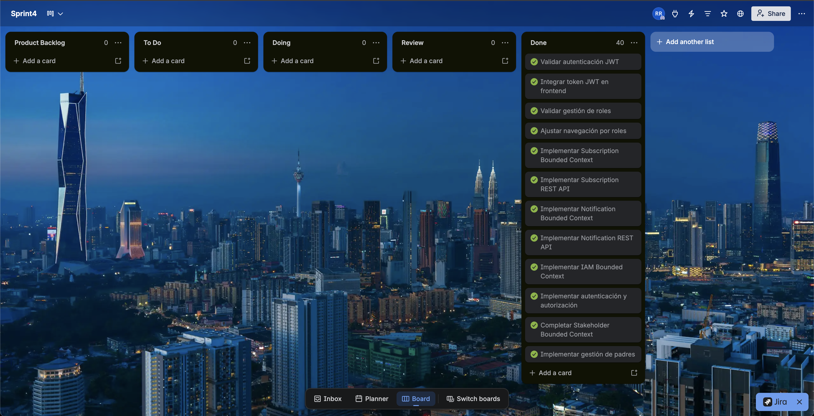
>>>>>>> 8958c72cd2a4c6ba5be425688f36bfaff82fef29

_Nota. Sprint Board del Sprint 4 utilizado para la gestión colaborativa de tareas y seguimiento del desarrollo de los Web Services de SafeRoute mediante Trello. Elaboración propia._


URL del Board: https://trello.com/b/eVLKHZQ7/sprint4

##### 5.2.4.4. Development Evidence for Sprint Review

Durante el Sprint 4, el equipo completó la implementación de los bounded contexts restantes de SafeRoute, consolidando la versión final del backend y asegurando que la Web Application consuma únicamente el RESTful API desplegado. A diferencia de los sprints anteriores, en esta etapa se eliminó por completo el uso del Mock API / JSON Server, reemplazándolo por servicios reales desarrollados en Spring Boot y desplegados en Azure App Service.

El desarrollo se enfocó en completar los módulos pendientes relacionados con **Identity and Access Management**, **Subscription and Plan Management**, **Stakeholder Management**, **Fleet and Route Management**, **Trip Execution and Monitoring** y **Notifications**. Para ello, se implementaron aggregates, value objects, commands, queries, repositories, services, controllers REST y configuraciones de persistencia necesarias para soportar los principales flujos del producto.

Asimismo, se realizaron ajustes en el frontend para reemplazar los servicios simulados por clientes HTTP conectados al backend real. Esto permitió validar el funcionamiento de los módulos principales desde la Web Application desplegada, incluyendo gestión de perfiles, usuarios, conductores, padres, estudiantes, rutas, vehículos, viajes, asistencias, incidencias, notificaciones y suscripciones.

Estos avances permitieron consolidar una versión final funcional, desplegada y alineada con la arquitectura definida para SafeRoute, asegurando coherencia entre los bounded contexts modelados, los endpoints documentados en Swagger UI y las funcionalidades disponibles en la Web Application.

A continuación, se presentan los principales commits relacionados con el desarrollo del Sprint 4.

| Repository         | Branch  | Commit Id | Commit Message                                         | Commit Message Body                                                                        | Commited on (Date) |
| ------------------ | ------- | --------- | ------------------------------------------------------ | ------------------------------------------------------------------------------------------ | ------------------ |
| saferoute-platform | develop | 3b08603   | feature: add subscription bounded context              | Added Subscription bounded context including domain and infrastructure components.         | 2026-07-04         |
| saferoute-platform | develop | 0e5e12d   | feat(stakeholder): add StudentGroup aggregate          | Added aggregate root for StudentGroup entity.                                              | 2026-07-05         |
| saferoute-platform | develop | 1cc520f   | feat(stakeholder): add Driver aggregate                | Added aggregate root for Driver entity.                                                    | 2026-07-05         |
| saferoute-platform | develop | 26482fa   | feat(stakeholder): add Parent aggregate                | Added aggregate root for Parent entity.                                                    | 2026-07-05         |
| saferoute-platform | develop | e9bb923   | Create AddChildToGroupCommand.java                     | Added command to associate children with student groups.                                   | 2026-07-05         |
| saferoute-platform | develop | 18f8c7b   | Create CreateStudentGroupCommand.java                  | Added command for creating Student Groups.                                                 | 2026-07-05         |
| saferoute-platform | develop | 6ec1c53   | Create AddChildToParentCommand.java                    | Added command for associating children with parents.                                       | 2026-07-05         |
| saferoute-platform | develop | 768bd39   | Create CreateParentCommand.java                        | Added command for creating Parent entities.                                                | 2026-07-05         |
| saferoute-platform | develop | 58777db   | Create CreateDriverCommand.java                        | Added command for creating Driver entities.                                                | 2026-07-05         |
| saferoute-platform | develop | 74fb5d6   | Create Child.java                                      | Added Child domain entity.                                                                 | 2026-07-05         |
| saferoute-platform | develop | da76ea3   | feat(iam): add hashingservice                          | Added password hashing service for user authentication.                                    | 2026-07-05         |
| saferoute-platform | develop | 279eeeb   | feat(iam): add adapters                                | Added adapters for IAM bounded context integration.                                        | 2026-07-05         |
| saferoute-platform | develop | 4142828   | feat(iam): add rolepersistenceassembler                | Added persistence assembler for Role entity.                                               | 2026-07-05         |
| saferoute-platform | develop | 5786ce1   | feat(iam): add userpersistenceassembler                | Added persistence assembler for User entity.                                               | 2026-07-05         |
| saferoute-platform | develop | 79bae46   | feat(iam): add rolepersistenceentity                   | Added Role persistence entity implementation.                                              | 2026-07-05         |
| saferoute-platform | develop | 44dcb54   | feat(iam): add userpersistenceentity                   | Added User persistence entity implementation.                                              | 2026-07-05         |
| saferoute-platform | develop | 92a125a   | feat(iam): add userpersistencerepository               | Added User persistence repository implementation.                                          | 2026-07-05         |
| saferoute-platform | develop | f740370   | feat(iam): add rolepersistencerepository               | Added Role persistence repository implementation.                                          | 2026-07-05         |
| saferoute-platform | develop | 32fca34   | feat(iam): add bearertokenservice                      | Added Bearer Token service for JWT authentication.                                         | 2026-07-05         |
| saferoute-platform | develop | e74241d   | feat(iam): add tokenservice                            | Added token generation and validation service.                                             | 2026-07-05         |
| saferoute-platform | develop | 1e95735   | feat(iam): add iamcontextfacade                        | Added IAM Context Facade to centralize authentication services.                            | 2026-07-05         |
| saferoute-platform | develop | 5f77002   | feat(iam): add rest                                    | Added REST endpoints for IAM services.                                                     | 2026-07-05         |
| saferoute-platform | develop | ccb9f14   | feat(iam): add resources                               | Added REST resources for IAM bounded context.                                              | 2026-07-05         |
| saferoute-platform | develop | da1a84d   | feat(iam): add transform                               | Added DTO transformations between application and REST layers.                             | 2026-07-05         |
| saferoute-platform | develop | e43da23   | Merge pull request #6 from feature/iam                 | Merged IAM bounded context implementation into the develop branch.                         | 2026-07-05         |
| saferoute-platform | develop | 9114678   | chore: add uml diagrams                                | Added UML diagrams documenting the final backend architecture.                             | 2026-07-04         |
| saferoute-platform | develop | 24f1b38   | Merge pull request #4 from feature/trip                | Merged Trip bounded context implementation into the develop branch.                        | 2026-07-04         |

#### 5.2.4.5. Execution Evidence for Sprint Review

Durante la ejecución del Sprint 4, el equipo validó los principales flujos funcionales de SafeRoute en un entorno desplegado. La Web Application dejó de consumir datos simulados y pasó a utilizar directamente el backend real, permitiendo comprobar el comportamiento del sistema de extremo a extremo.

Esta validación permitió confirmar que los principales módulos del sistema se encuentran conectados con el RESTful API desplegado en Azure, eliminando la dependencia del Mock API / JSON Server utilizada en entregas anteriores.

**Frontend Web Application**

**Deployment URL:**  
https://polite-hill-08013890f.7.azurestaticapps.net/iam/sign-in

Desde esta versión desplegada se validaron los módulos principales de la aplicación:

| Module               | Validated Flow                                                                              |
| -------------------- | ------------------------------------------------------------------------------------------- |
| Stakeholder Profiles | Visualización y gestión de perfiles de usuarios vinculados al servicio.                     |
| Driver Management    | Registro y consulta de conductores.                                                         |
| Parent Management    | Registro y consulta de padres o apoderados.                                                 |
| Student Management   | Registro y gestión de alumnos.                                                              |
| Student Groups       | Gestión de grupos de estudiantes y asignación de hijos a grupos.                            |
| Fleet / Routes       | Gestión de rutas, paradas, vehículos y asignaciones operativas.                             |
| Trip Monitoring      | Seguimiento de viajes, asistencia, incidencias, ubicación y estados de trayecto.            |
| Notifications        | Consulta y gestión de alertas, anuncios y notificaciones generadas por eventos del sistema. |
| Subscription         | Visualización y gestión de planes, suscripciones y pagos asociados al servicio.             |
| IAM                  | Validación de flujos de autenticación, usuarios y roles.                                    |

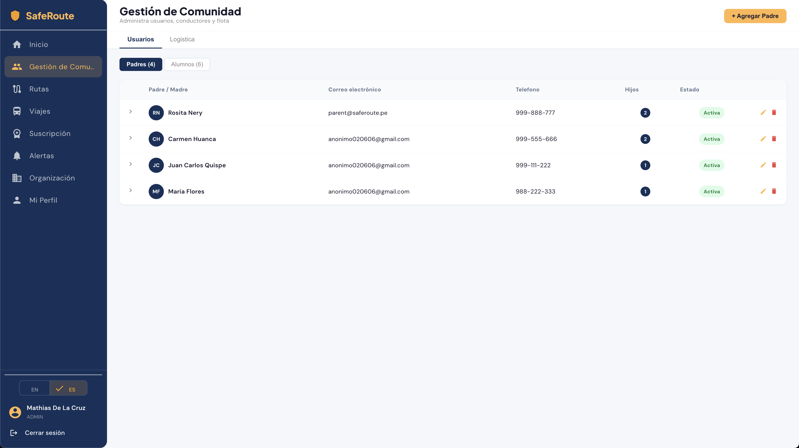

_Nota._ Captura del frontend mostrando una lista de perfiles, padres, alumnos o conductores cargados desde el backend real. Esta evidencia permite comprobar que la Web Application consume datos desde el RESTful API desplegado y ya no desde el Mock API.

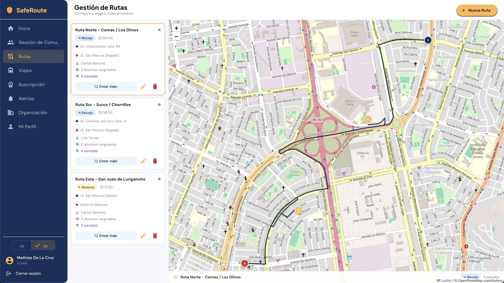

_Nota._ Captura del frontend mostrando el módulo de rutas, paradas, vehículos o asignaciones operativas. Esta evidencia permite validar el consumo de datos del bounded context Fleet and Route Management desde el RESTful API.

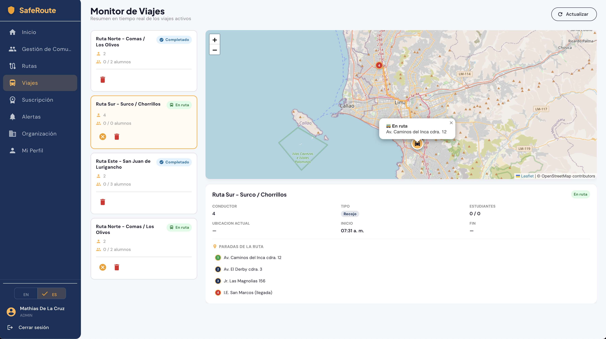

_Nota._ Captura del frontend mostrando el módulo de viajes o monitoreo de trayectos. Esta vista evidencia la integración con los servicios de Trip Execution and Monitoring para consultar viajes, asistencias, incidencias o actualizaciones de ubicación.

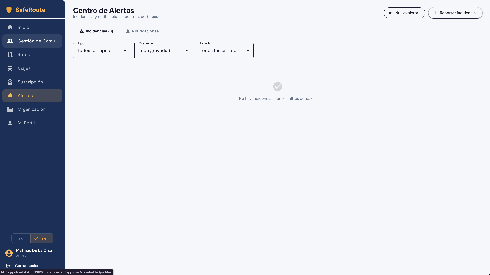

_Nota._ Captura del frontend mostrando el módulo de notificaciones, alertas o anuncios. Esta evidencia permite comprobar la integración con los endpoints del bounded context Notifications.

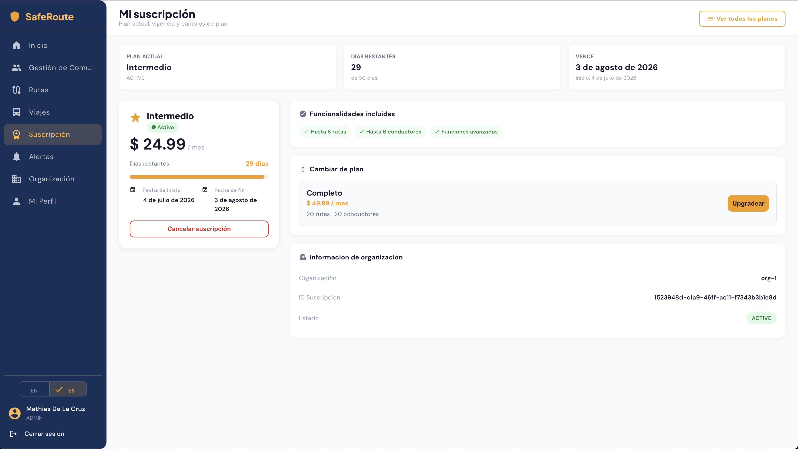

_Nota._ Captura del frontend mostrando el módulo de planes, suscripciones o pagos. Esta evidencia permite validar la integración con los servicios de Subscription and Plan Management.

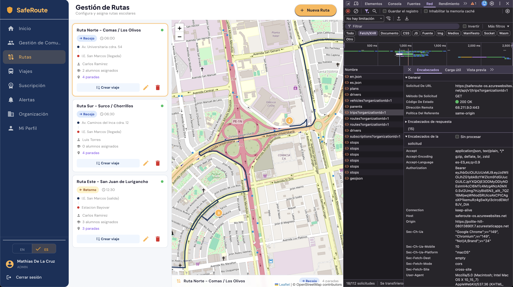

_Nota._ Captura del navegador mostrando la pestaña Network con una petición exitosa desde el frontend desplegado hacia el backend real. Esta evidencia permite comprobar la comunicación efectiva entre la Web Application y el RESTful API desplegado en Azure.

**Backend RESTful API**

**Deployment URL:**  
https://saferoute-os.azurewebsites.net/swagger-ui/index.html

Se validó la disponibilidad del backend mediante Swagger UI, comprobando que los endpoints principales se encuentren documentados y disponibles para pruebas manuales. Esta validación permitió verificar la existencia de servicios REST para los bounded contexts de SafeRoute, incluyendo autenticación, usuarios, roles, planes, suscripciones, pagos, perfiles, padres, conductores, grupos de estudiantes, rutas, vehículos, asignaciones, viajes, asistencias, incidencias, ubicaciones y notificaciones.

| Backend Module                | Validated Evidence                                                                                                         |
| ----------------------------- | -------------------------------------------------------------------------------------------------------------------------- |
| Authentication                | Disponibilidad de endpoints para registro e inicio de sesión.                                                              |
| Users and Roles               | Disponibilidad de endpoints para consulta de usuarios, credenciales iniciales, actualización de contraseña y roles.        |
| Plans and Subscriptions       | Disponibilidad de endpoints para gestión de planes, suscripciones, activación, upgrade, cancelación y pagos.               |
| Stakeholder Management        | Disponibilidad de endpoints para perfiles, padres, hijos, conductores y grupos de estudiantes.                             |
| Fleet and Route Management    | Disponibilidad de endpoints para vehículos, rutas, paradas y asignaciones.                                                 |
| Trip Execution and Monitoring | Disponibilidad de endpoints para viajes, asistencias, incidencias, finalización, cancelación y actualización de ubicación. |
| Notifications                 | Disponibilidad de endpoints para notificaciones, alertas, anuncios, despacho, entrega, fallos y reintentos.                |
| Organizations                 | Disponibilidad de endpoints para creación, consulta y actualización de organizaciones.                                     |

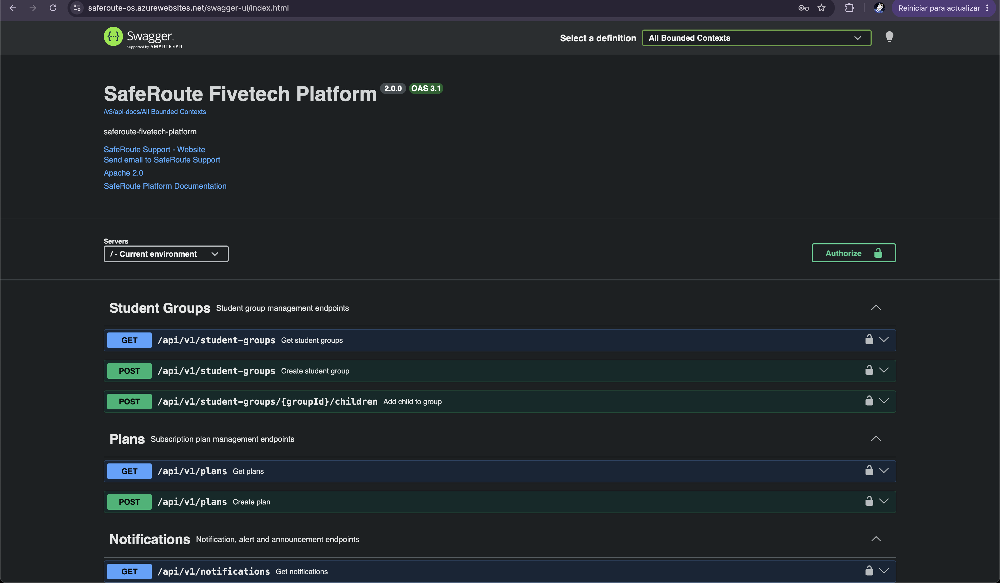

_Nota._ Captura de Swagger UI abierto desde la URL pública del backend desplegado: `https://saferoute-os.azurewebsites.net/swagger-ui/index.html`. Esta evidencia confirma que el RESTful API se encuentra disponible en Azure App Service.

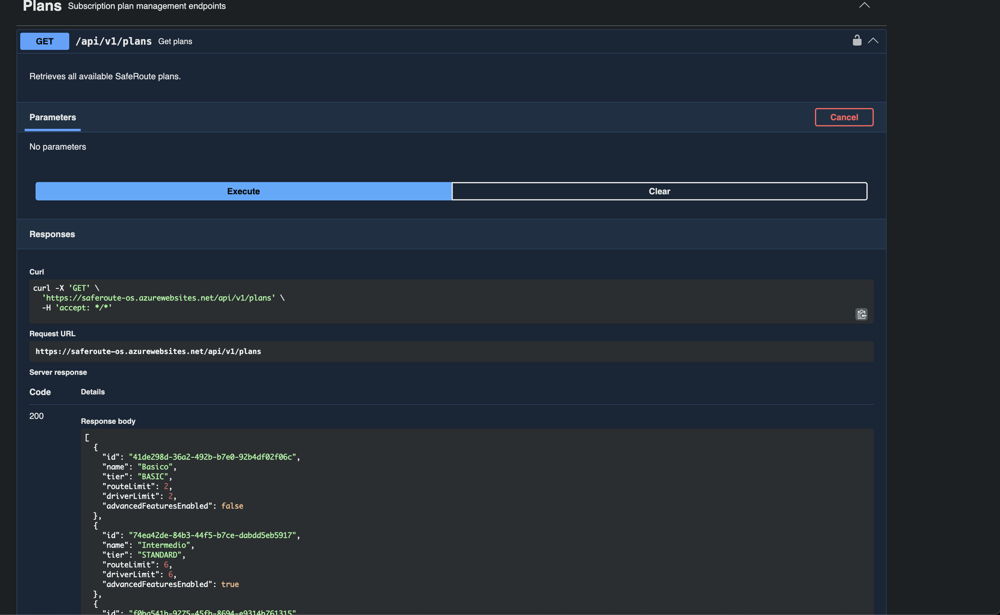

_Nota._ Captura de una petición GET ejecutada desde Swagger UI mostrando datos persistidos. Esta evidencia permite validar que el backend retorna información almacenada correctamente desde la base de datos.

**End-to-End Execution Validation**

Además de validar frontend y backend por separado, se comprobó el comportamiento integrado del sistema. Para ello, el equipo verificó que las acciones realizadas desde la Web Application generen solicitudes HTTP hacia el RESTful API real y que las respuestas del backend sean reflejadas correctamente en las vistas del frontend.

| Validation Scenario                | Expected Result                                                          | Status    |
| ---------------------------------- | ------------------------------------------------------------------------ | --------- |
| Acceso al frontend desplegado      | La Web Application carga correctamente desde Azure Static Web Apps.      | Validated |
| Acceso al backend desplegado       | Swagger UI carga correctamente desde Azure App Service.                  | Validated |
| Consulta de perfiles               | El frontend obtiene perfiles desde el RESTful API real.                  | Validated |
| Consulta de rutas                  | El frontend obtiene rutas y paradas desde el backend real.               | Validated |
| Consulta de vehículos              | El frontend obtiene vehículos desde los endpoints del backend.           | Validated |
| Consulta de viajes                 | El frontend obtiene información de viajes desde el bounded context Trip. | Validated |
| Consulta de notificaciones         | El frontend obtiene notificaciones desde el RESTful API.                 | Validated |
| Consulta de planes o suscripciones | El frontend obtiene información del bounded context Subscription.        | Validated |
| Eliminación de Mock API            | Las vistas principales ya no consumen JSON Server ni datos simulados.    | Validated |

#### 5.2.4.6. Services Documentation Evidence for Sprint Review

Durante el Sprint 4 se actualizó y validó la documentación de los servicios REST mediante Swagger UI. Esta documentación permitió comprobar los endpoints utilizados por la Web Application y verificar las operaciones principales del backend desplegado en Azure.

A diferencia de entregas anteriores, en este sprint la documentación de servicios corresponde al RESTful API real de SafeRoute y ya no al Mock API / JSON Server. Esto permitió validar los bounded contexts implementados, sus endpoints disponibles y los principales métodos HTTP requeridos para cubrir el alcance final del producto.

| Bounded Context                  | Endpoint Group                                                                                                                       | HTTP Methods             | Purpose                                                                                                                  |
| -------------------------------- | ------------------------------------------------------------------------------------------------------------------------------------ | ------------------------ | ------------------------------------------------------------------------------------------------------------------------ |
| Identity and Access Management   | `/api/v1/authentication`, `/api/v1/users`, `/api/v1/roles`                                                                           | GET, POST, PATCH         | Gestionar autenticación, registro, usuarios, credenciales iniciales, actualización de contraseña y roles.                |
| Subscription and Plan Management | `/api/v1/plans`, `/api/v1/subscriptions`, `/api/v1/payments`                                                                         | GET, POST, PUT, DELETE   | Gestionar planes, suscripciones, activación, upgrade, cancelación y pagos asociados.                                     |
| Stakeholder Management           | `/api/v1/profiles`, `/api/v1/parents`, `/api/v1/children`, `/api/v1/drivers`, `/api/v1/student-groups`                               | GET, POST, DELETE        | Gestionar perfiles, padres, hijos, conductores, grupos de estudiantes y relaciones padre-hijo o grupo-hijo.              |
| Fleet and Route Management       | `/api/v1/vehicles`, `/api/v1/routes`, `/api/v1/routes/{routeId}/stops`, `/api/v1/assignments`                                        | GET, POST, PUT, DELETE   | Gestionar vehículos, rutas, paradas y asignaciones operativas de conductores y estudiantes.                              |
| Trip Execution and Monitoring    | `/api/v1/trips`, `/api/v1/trips/{tripId}/attendances`, `/api/v1/trips/{tripId}/incidents`, `/api/v1/trips/{tripId}/location-updates` | GET, POST, PATCH, DELETE | Gestionar viajes, inicio, activación, cancelación, finalización, asistencia, incidencias y actualizaciones de ubicación. |
| Notifications                    | `/api/v1/notifications`, `/api/v1/notifications/alerts`, `/api/v1/notifications/announcements`, `/api/v1/notifications/retries`      | GET, POST                | Gestionar notificaciones, alertas, anuncios, despacho, entrega, fallos y reintentos.                                     |
| Organizations                    | `/api/v1/organizations`                                                                                                              | GET, POST, PUT           | Gestionar organizaciones relacionadas con la operación del servicio.                                                     |

**API Documentation URL**

- Swagger UI: https://saferoute-os.azurewebsites.net/swagger-ui/index.html

usuario: admin
contraseña: admin

**Main Endpoint Groups Available in Swagger UI**

| Module                    | Available Endpoints                                                                                                                                                                                                                                                                                                                                     |
| ------------------------- | ------------------------------------------------------------------------------------------------------------------------------------------------------------------------------------------------------------------------------------------------------------------------------------------------------------------------------------------------------- |
| Authentication            | `POST /api/v1/authentication/sign-up`, `POST /api/v1/authentication/sign-in`                                                                                                                                                                                                                                                                            |
| Users                     | `GET /api/v1/users`, `GET /api/v1/users/{userId}`, `POST /api/v1/users/{username}/initial-credentials`, `PATCH /api/v1/users/password`                                                                                                                                                                                                                  |
| Roles                     | `GET /api/v1/roles`                                                                                                                                                                                                                                                                                                                                     |
| Plans                     | `GET /api/v1/plans`, `POST /api/v1/plans`                                                                                                                                                                                                                                                                                                               |
| Subscriptions             | `GET /api/v1/subscriptions`, `POST /api/v1/subscriptions`, `PUT /api/v1/subscriptions/{subscriptionId}/plan`, `POST /api/v1/subscriptions/{subscriptionId}/activation`, `DELETE /api/v1/subscriptions/{subscriptionId}`                                                                                                                                 |
| Payments                  | `GET /api/v1/subscriptions/{subscriptionId}/payments`, `POST /api/v1/subscriptions/{subscriptionId}/payments`, `GET /api/v1/payments/{paymentId}`, `POST /api/v1/payments/{paymentId}/confirm`                                                                                                                                                          |
| Stakeholder Compatibility | `GET /api/v1/profiles`, `GET /api/v1/children`                                                                                                                                                                                                                                                                                                          |
| Parents                   | `GET /api/v1/parents`, `POST /api/v1/parents`, `POST /api/v1/parents/{parentId}/children`, `DELETE /api/v1/parents/{parentId}`, `DELETE /api/v1/parents/{parentId}/children/{childId}`                                                                                                                                                                  |
| Drivers                   | `GET /api/v1/drivers`, `POST /api/v1/drivers`, `DELETE /api/v1/drivers/{driverId}`                                                                                                                                                                                                                                                                      |
| Student Groups            | `GET /api/v1/student-groups`, `POST /api/v1/student-groups`, `POST /api/v1/student-groups/{groupId}/children`                                                                                                                                                                                                                                           |
| Organizations             | `GET /api/v1/organizations`, `POST /api/v1/organizations`, `GET /api/v1/organizations/{organizationId}`, `PUT /api/v1/organizations/{organizationId}`                                                                                                                                                                                                   |
| Vehicles                  | `GET /api/v1/vehicles`, `POST /api/v1/vehicles`, `GET /api/v1/vehicles/{vehicleId}`, `PUT /api/v1/vehicles/{vehicleId}`, `DELETE /api/v1/vehicles/{vehicleId}`                                                                                                                                                                                          |
| Routes                    | `GET /api/v1/routes`, `POST /api/v1/routes`, `GET /api/v1/routes/{id}`, `PUT /api/v1/routes/{id}`, `DELETE /api/v1/routes/{id}`, `GET /api/v1/routes/{routeId}/stops`, `POST /api/v1/routes/{routeId}/stops`, `PUT /api/v1/routes/{routeId}/stops`                                                                                                      |
| Assignments               | `GET /api/v1/assignments`, `POST /api/v1/assignments`                                                                                                                                                                                                                                                                                                   |
| Trips                     | `GET /api/v1/trips`, `POST /api/v1/trips`, `GET /api/v1/trips/{tripId}`, `DELETE /api/v1/trips/{tripId}`, `POST /api/v1/trips/{tripId}/activation`, `POST /api/v1/trips/{tripId}/cancellation`, `POST /api/v1/trips/{tripId}/completion`                                                                                                                |
| Attendances               | `GET /api/v1/trips/{tripId}/attendances`, `PATCH /api/v1/trips/{tripId}/attendances`                                                                                                                                                                                                                                                                    |
| Incidents                 | `GET /api/v1/trips/{tripId}/incidents`, `POST /api/v1/trips/{tripId}/incidents`                                                                                                                                                                                                                                                                         |
| Trip Locations            | `GET /api/v1/trips/{tripId}/location-updates`, `POST /api/v1/trips/{tripId}/location-updates`, `GET /api/v1/trips/{tripId}/location-updates/latest`                                                                                                                                                                                                     |
| Notifications             | `GET /api/v1/notifications`, `POST /api/v1/notifications`, `POST /api/v1/notifications/{notificationId}/dispatch`, `POST /api/v1/notifications/{notificationId}/delivery`, `POST /api/v1/notifications/{notificationId}/failure`, `POST /api/v1/notifications/retries`, `POST /api/v1/notifications/announcements`, `POST /api/v1/notifications/alerts` |

#### 5.2.4.7. Software Deployment Evidence for Sprint Review

Durante el Sprint 4 se realizó el despliegue final de los productos digitales de SafeRoute. El frontend fue publicado mediante Azure Static Web Apps y el backend mediante Azure App Service, permitiendo que ambos componentes funcionen de manera integrada en un entorno cloud.

La principal mejora técnica de este sprint fue la eliminación completa del Mock API / JSON Server. A partir de esta versión, la Web Application consume directamente los endpoints del RESTful API real desplegado en Azure, asegurando una integración más cercana al entorno final de operación.

| Component                | Technology / Platform      | Deployment URL                                                           | Status    |
| ------------------------ | -------------------------- | ------------------------------------------------------------------------ | --------- |
| Frontend Web Application | Azure Static Web Apps      | https://polite-hill-08013890f.7.azurestaticapps.net/iam/sign-in | Deployed  |
| Backend RESTful API      | Azure App Service          | https://saferoute-os.azurewebsites.net/swagger-ui/index.html             | Deployed  |
| Mock API / JSON Server   | Removed from final release | Not applicable                                                           | Removed   |
| API Documentation        | Swagger UI                 | https://saferoute-os.azurewebsites.net/swagger-ui/index.html             | Available |

**Deployment URLs**

- Frontend Web Application: https://polite-hill-08013890f.7.azurestaticapps.net/iam/sign-in
- Backend RESTful API / Swagger UI: https://saferoute-os.azurewebsites.net/swagger-ui/index.html

**Deployment Improvements**

| Previous Situation                                                    | Sprint 4 Final Situation                                                                            |
| --------------------------------------------------------------------- | --------------------------------------------------------------------------------------------------- |
| El frontend consumía datos desde Mock API / JSON Server.              | El frontend consume datos desde el RESTful API real desplegado en Azure.                            |
| El backend estaba en una etapa inicial de despliegue y documentación. | El backend final se encuentra publicado y documentado mediante Swagger UI.                          |
| Algunos bounded contexts estaban parcialmente integrados.             | Los bounded contexts principales fueron implementados e integrados en el flujo final.               |
| Las evidencias de despliegue eran parciales.                          | Se incluyeron URLs finales y evidencias visuales de frontend, backend y Swagger.                    |
| Algunas funcionalidades no contaban con evidencia completa.           | Se retiraron o ajustaron elementos no implementados para mantener coherencia con el producto final. |

#### 5.2.4.8. Team Collaboration Insights during Sprint

Durante el Sprint 4, el equipo mantuvo un flujo de trabajo colaborativo orientado al cierre del producto. Las actividades se organizaron considerando la integración final de módulos, revisión de despliegues, corrección de observaciones previas y documentación de evidencias.

El equipo aplicó GitFlow y Conventional Commits para mantener trazabilidad en el desarrollo. Las ramas feature fueron utilizadas para implementar o corregir funcionalidades específicas y posteriormente integrar los cambios en las ramas principales del proyecto. Asimismo, se actualizaron los repositorios correspondientes al informe, frontend, backend y landing page, asegurando que cada componente del producto final cuente con evidencia de colaboración y evolución.

| Repository                 | Collaboration Evidence                                                                                                                                                               |
| -------------------------- | ------------------------------------------------------------------------------------------------------------------------------------------------------------------------------------ |
| SafeRoute Report           | Actualización del informe final, corrección de observaciones AV2, inclusión de Sprint 4, evidencias finales, mejora continua y consolidación de documentación para la entrega final. |
| SafeRoute Frontend Web App | Integración con el RESTful API real, eliminación de servicios mock, ajuste de environments, validación de vistas desplegadas y conexión de módulos principales con backend.          |
| SafeRoute Backend API      | Consolidación de bounded contexts, implementación de endpoints RESTful, documentación Swagger y despliegue final en Azure App Service.                                               |
| Landing Page               | Validación de enlaces, revisión de CTA, corrección de URLs y verificación de coherencia visual y funcional con la Web Application desplegada.                                        |

**Repository Collaboration Evidence**

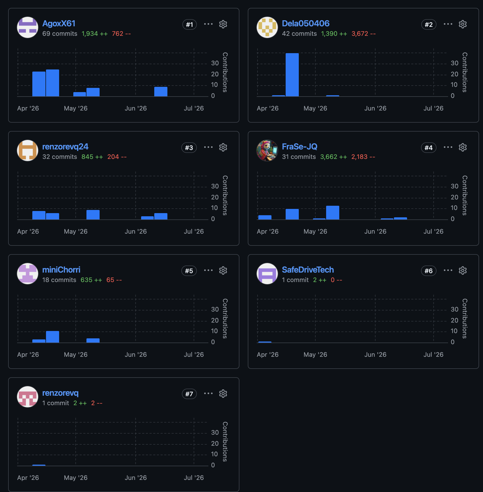

_Nota._ Captura de contributors o insights del repositorio del informe durante el Sprint 4. Esta evidencia muestra la participación del equipo en la actualización del documento final, incluyendo la corrección de observaciones AV2, la incorporación de Sprint 4 y la documentación de evidencias finales.

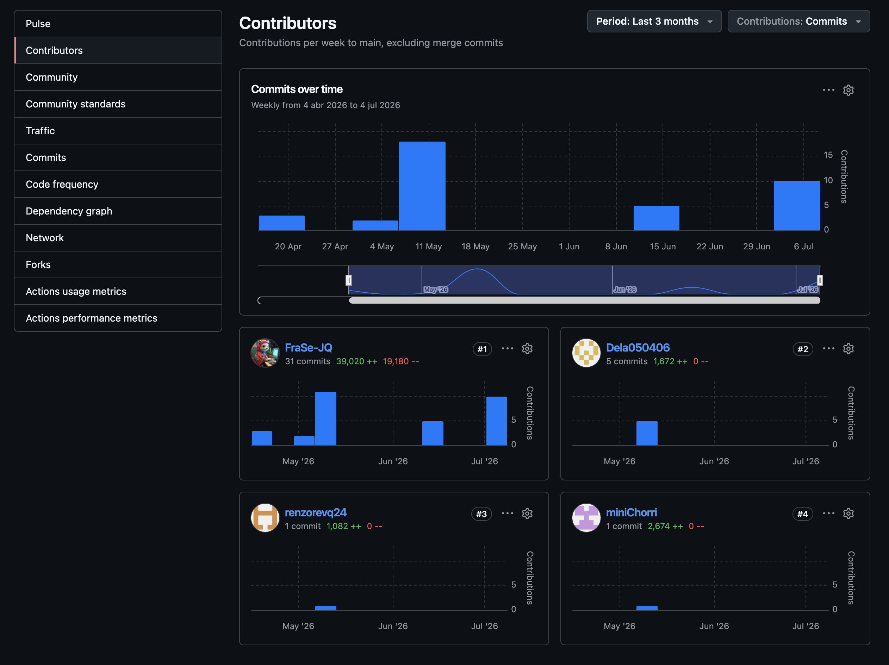

_Nota._ Captura de contributors, commits o insights del repositorio frontend durante el Sprint 4. Esta evidencia permite verificar la participación del equipo en la integración de la Web Application con el RESTful API real, la eliminación del Mock API y la validación de vistas desplegadas.


_Nota._ Captura de contributors, commits o insights del repositorio backend durante el Sprint 4. Esta evidencia permite comprobar el trabajo realizado en la consolidación de bounded contexts, controladores REST, documentación Swagger y despliegue final del backend.

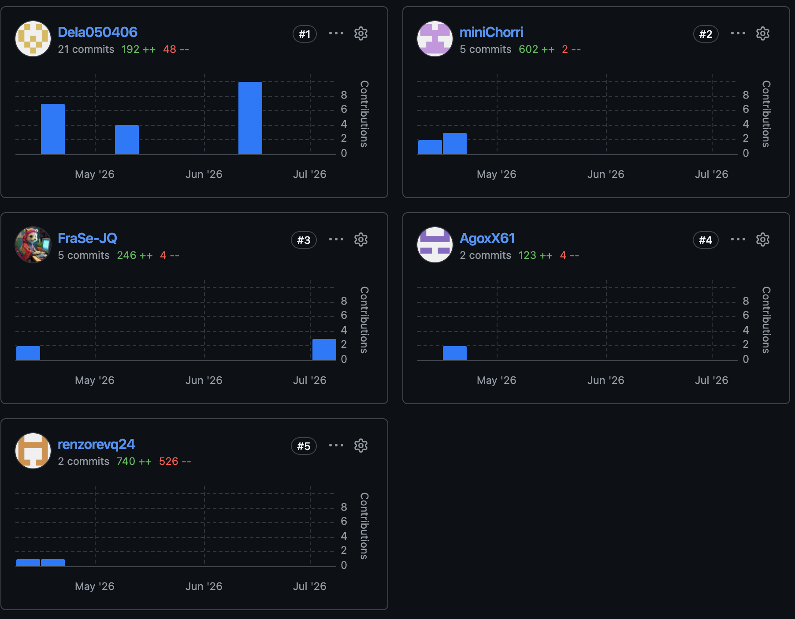

_Nota._ Captura de contributors, commits o insights del repositorio de la Landing Page durante el Sprint 4. Esta evidencia permite verificar la revisión de enlaces, CTA y coherencia con la Web Application desplegada.

**Conventional Commits Evidence**

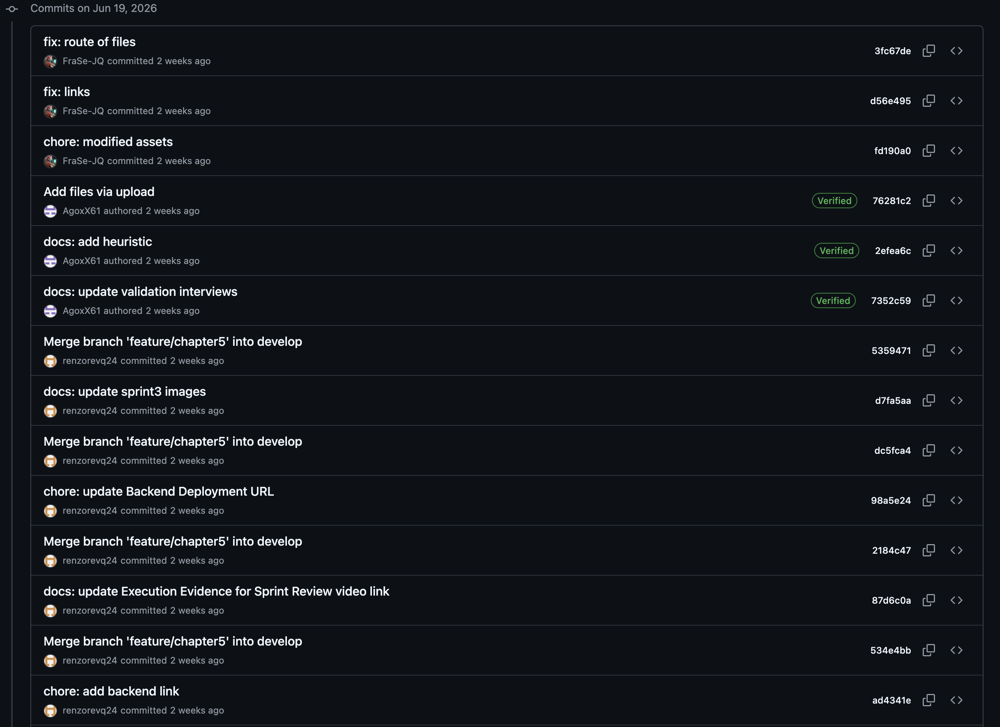

_Nota._ Captura del historial de commits donde se evidencia el uso de Conventional Commits, incluyendo prefijos como `feat`, `fix`, `docs`, `refactor` y `chore`. Esta evidencia permite demostrar trazabilidad y consistencia en el registro de cambios del proyecto.

**Sprint 4 Collaboration Summary**

| Collaboration Aspect     | Evidence Summary                                                                                                                                       |
| ------------------------ | ------------------------------------------------------------------------------------------------------------------------------------------------------ |
| GitFlow                  | Se utilizaron ramas feature para desarrollar, corregir e integrar funcionalidades antes de unirlas a las ramas principales.                            |
| Conventional Commits     | Se mantuvo una convención de mensajes de commit para diferenciar nuevas funcionalidades, correcciones, documentación, refactorización y configuración. |
| Report Collaboration     | Se actualizó el informe final con las secciones de Sprint 4, evidencias de despliegue, mejora continua y correcciones de AV2.                          |
| Frontend Collaboration   | Se integró el frontend con el backend real, se retiró el Mock API y se validaron las vistas desplegadas.                                               |
| Backend Collaboration    | Se completaron bounded contexts, endpoints RESTful y documentación Swagger.                                                                            |
| Deployment Collaboration | Se validaron los despliegues finales en Azure Static Web Apps y Azure App Service.                                                                     |
| Continuous Improvement   | Se corrigieron observaciones recibidas en AV2 y se alineó el informe con el producto final implementado.                                               |

**Repository URLs**

| Repository                 | URL                                          |
| -------------------------- | -------------------------------------------- |
| SafeRoute Report           | https://github.com/upc-pre-202610-1asi0729-11896-fivetech/saferoute-report  |
| SafeRoute Frontend Web App | https://github.com/upc-pre-202610-1asi0729-11896-fivetech/saferoute-webapp     |
| SafeRoute Backend API      | https://github.com/upc-pre-202610-1asi0729-11896-fivetech/saferoute-platform    |
| SafeRoute Landing Page     | https://github.com/upc-pre-202610-1asi0729-11896-fivetech/saferoute-website |

**Final Collaboration Reflection**

Durante este sprint, la colaboración del equipo se enfocó en cerrar el producto de forma integral. Cada integrante participó en la revisión de funcionalidades, integración técnica, corrección de observaciones y documentación de evidencias finales. La aplicación de GitFlow permitió mantener un flujo ordenado de trabajo, mientras que el uso de Conventional Commits facilitó la trazabilidad de los cambios realizados.

**Como resultado, el equipo logró consolidar una versión final de SafeRoute desplegada en Azure, integrada con un RESTful API real y documentada con evidencias suficientes para sustentar el cierre del proyecto.**

**Continuous Improvement from AV2 to Sprint 4**

Durante el Sprint 4 se corrigieron las observaciones recibidas en AV2 y se consolidó una versión final más coherente entre documentación, producto desplegado y evidencias de desarrollo. Las mejoras aplicadas se enfocaron en corregir aspectos formales del informe, fortalecer las evidencias de validación, actualizar los videos solicitados y completar la integración real entre frontend y backend.

| Observation from AV2                                                     | Improvement Applied in Sprint 4                                                                                                                                                        |
| ------------------------------------------------------------------------ | -------------------------------------------------------------------------------------------------------------------------------------------------------------------------------------- |
| Corregir nombre de equipo en la carátula.                                | Se actualizó la carátula del informe usando el nombre correcto del equipo: **FiveTech**.                                                                                               |
| Debe indicar “Período” y no “Ciclo” en la carátula.                      | Se reemplazó la etiqueta incorrecta por **Período 202610**.                                                                                                                            |
| Video de exposición debe ser actualizado.                                | Se actualizó el video de exposición para presentar la versión final del producto, el frontend desplegado, el backend desplegado y la eliminación del Mock API.                         |
| Las entrevistas de validación fueron guiadas en exceso.                  | Se reformuló la ejecución de validaciones para explicar el propósito de la sesión sin dirigir los clics ni condicionar las respuestas del usuario.                                     |
| Los hallazgos de validación necesitaban mayor detalle.                   | Se organizaron los hallazgos indicando sesión, descripción, heurística, severidad y alternativa de solución.                                                                           |
| About-the-Product Video estaba incompleto.                               | Se completó el video About-the-Product incorporando explicación del propósito, beneficios, principales funcionalidades, demostración del producto, branding y testimonios de usuarios. |
| Persistían errores de entregas anteriores.                               | Se revisaron y corrigieron observaciones relacionadas con nomenclatura, carátula, enlaces, despliegue, documentación y consistencia del informe.                                       |
| El frontend aún dependía parcialmente de servicios simulados.            | Se eliminó por completo el uso de Mock API / JSON Server y se integró el frontend con el RESTful API real desplegado.                                                                  |
| Se requería mayor evidencia de implementación backend.                   | Se documentó el backend mediante Swagger UI y se incluyeron evidencias de endpoints reales desplegados en Azure.                                                                       |
| Algunas funcionalidades planteadas no contaban con evidencia suficiente. | Se retiraron o ajustaron funcionalidades no implementadas para mantener coherencia entre Product Backlog, Sprint Backlog, producto final e informe.                                    |

**Final Sprint 4 Conclusion**

El Sprint 4 permitió completar la versión final de SafeRoute como una solución web desplegada e integrada con servicios RESTful reales. A nivel técnico, el equipo logró implementar e integrar los bounded contexts definidos para la arquitectura del sistema, reemplazando el uso del Mock API por una comunicación directa entre la Web Application y el backend desplegado.

A nivel de producto, se consolidaron los flujos principales para administradores, conductores y padres de familia, cubriendo la gestión de usuarios, perfiles, rutas, vehículos, alumnos, viajes, asistencias, incidencias, notificaciones y suscripciones. Además, se corrigieron las observaciones recibidas en AV2, fortaleciendo la documentación, las evidencias de validación, la presentación del producto y la comunicación oral y escrita del equipo.

Con este sprint, SafeRoute alcanza una versión final funcional y desplegada, alineada con el alcance del Product Backlog, los objetivos del curso y el ciclo de vida de desarrollo documentado en el informe.

### 5.3. Validation Interviews

Se presentan las entrevistas de validación realizadas para evaluar la experiencia propuesta en SafeRoute. A diferencia de las entrevistas iniciales de descubrimiento, estas sesiones no buscan identificar el problema desde cero, sino validar si la solución desarrollada responde adecuadamente a las necesidades de los segmentos objetivo.

El proceso de validación considera la interacción de los usuarios con el Landing Page y la Web Application. Durante las sesiones se observará si los participantes comprenden la propuesta de valor, si pueden completar tareas principales y si la experiencia resulta clara, confiable y fácil de usar.

#### 5.3.1. Diseño de Entrevistas

El diseño de entrevistas de validación define la estructura que seguirá el equipo para evaluar la experiencia de uso de SafeRoute con representantes de los segmentos objetivo. A diferencia de las entrevistas iniciales de descubrimiento, estas sesiones tienen como propósito validar la solución propuesta mediante la interacción directa de los usuarios con el Landing Page y la Web Application.

Para esta etapa, se consideran como segmentos objetivo principales a los conductores de transporte escolar y padres de familia, debido a que ambos representan los usuarios más críticos del servicio. El conductor ejecuta el trayecto escolar y registra los eventos operativos, mientras que el padre de familia monitorea la seguridad y estado del traslado de su hijo.

##### Objetivo de la validación

El objetivo principal de las entrevistas de validación es comprobar si los usuarios pueden comprender y utilizar correctamente las funcionalidades principales de SafeRoute, evaluando la claridad, utilidad, facilidad de uso y confianza generada por la solución.

Durante las sesiones se busca validar:

- Si el Landing Page comunica claramente la propuesta de valor de SafeRoute.
- Si los usuarios comprenden los beneficios principales del servicio.
- Si los conductores pueden ejecutar tareas críticas como iniciar viaje, controlar alumnos, reportar incidencias y actuar ante emergencias.
- Si los padres de familia pueden monitorear el viaje, recibir información relevante y confirmar el estado del traslado escolar.
- Si los textos, botones, pantallas y flujos resultan claros para los usuarios.
- Si la experiencia propuesta transmite seguridad, confianza y utilidad en un contexto real de transporte escolar.

##### Segmentos objetivo considerados

| Segmento objetivo | Descripción                                                                                                                                     | Propósito de validación                                                                                                 |
| ----------------- | ----------------------------------------------------------------------------------------------------------------------------------------------- | ----------------------------------------------------------------------------------------------------------------------- |
| **Driver**        | Conductor responsable de ejecutar trayectos escolares, iniciar rutas, registrar abordajes, reportar incidencias y finalizar viajes.             | Validar si el flujo operativo del conductor es claro, rápido y fácil de usar durante una jornada de transporte escolar. |
| **Parent**        | Padre de familia que necesita monitorear el traslado escolar de su hijo y recibir información sobre ubicación, abordaje, llegada e incidencias. | Validar si la plataforma reduce la incertidumbre y transmite confianza durante el viaje escolar.                        |

##### Artefactos a validar

Durante las entrevistas se validarán los siguientes artefactos del producto:

| Artefacto           | Descripción                                                                           | Elementos evaluados                                                                                   |
| ------------------- | ------------------------------------------------------------------------------------- | ----------------------------------------------------------------------------------------------------- |
| **Landing Page**    | Página pública de presentación de SafeRoute.                                          | Propuesta de valor, beneficios, funcionamiento general, planes y llamadas a la acción.                |
| **Web Application** | Aplicación web utilizada por los usuarios según su rol.                               | Login, dashboards, rutas, viaje activo, abordaje, monitoreo, notificaciones, incidencias e historial. |
| **User Flows**      | Diagramas previamente definidos en la sección de Web Applications User Flow Diagrams. | Acciones del usuario, happy path, unhappy paths y validación de tareas principales.                   |

##### Metodología de la sesión

Cada entrevista seguirá una dinámica guiada en la que el participante interactuará primero con el Landing Page y luego con los flujos correspondientes de la Web Application, según su segmento objetivo.

La sesión seguirá la siguiente estructura:

1. Presentación breve de SafeRoute.
2. Explicación del objetivo de la entrevista.
3. Aclaración de que se evalúa la solución, no al participante.
4. Exploración inicial del Landing Page.
5. Ejecución de tareas según el segmento objetivo.
6. Observación de dudas, errores, comentarios espontáneos y dificultades.
7. Aplicación de preguntas generales y específicas.
8. Registro de hallazgos para el posterior análisis y evaluación heurística.

##### User Flows considerados para la validación

Para las entrevistas de validación se seleccionaron seis User Flows previamente definidos en la sección 4.4.3. Web Applications User Flow Diagrams. Estos flujos fueron elegidos porque representan funcionalidades core de SafeRoute y permiten evaluar las tareas más importantes de los segmentos objetivo principales.

Durante cada sesión, el participante interactuará primero con el Landing Page para validar la comprensión general del producto. Posteriormente, realizará tareas dentro de la Web Application siguiendo los User Flows correspondientes a su segmento.

###### User Flows seleccionados para el segmento Driver

Los User Flows seleccionados para el segmento Driver cubren el ciclo operativo principal del conductor dentro de SafeRoute: inicio de viaje, control de alumnos, reporte de incidencias y respuesta ante situaciones críticas.

Se considerarán los siguientes User Flows:

- **User Flow 6:** Control claro de alumnos durante la ruta.
- **User Flow 8:** Comunicación de incidencia o avance durante el viaje.
- **User Flow 9:** Botón de pánico ante emergencia.

Estos flujos permiten validar si el conductor puede realizar acciones críticas de forma clara, rápida y segura.

###### User Flow 6: Control claro de alumnos durante la ruta

- **User goal:**
  Como conductor, quiero tener un control claro de los alumnos durante la ruta.

- **User Story asociada:**
  US11 - Como conductor, quiero registrar el abordaje de estudiantes, para confirmar asistencia durante la ruta.
  US14 - Como conductor, quiero finalizar la ruta, para concluir el servicio correctamente.

- **Web:**

<p align="center">

</p>

- **Descripción del flujo:**

**Happy path:**
El conductor inicia sesión en la plataforma y accede a su dashboard. Desde allí selecciona la ruta asignada para el día y revisa la lista de estudiantes y paradas correspondientes. Luego inicia el trayecto, activando el viaje dentro del sistema. Durante la ruta, registra el abordaje de los estudiantes y visualiza el estado actualizado de cada alumno. Finalmente, al completar el recorrido, selecciona la opción de finalización de ruta y el sistema confirma el cierre del trayecto.

**Unhappy path:**
Si el conductor intenta iniciar el trayecto sin tener una ruta asignada o sin información completa de estudiantes y paradas, el sistema muestra un mensaje de advertencia indicando que no es posible iniciar la ruta. Si intenta finalizar el trayecto con acciones pendientes, el sistema advierte que aún existen registros incompletos antes de cerrar el viaje.

###### User Flow 8: Comunicación de incidencia o avance durante el viaje

- **User goal:**
  Como conductor, quiero comunicar una incidencia o avance de la ruta durante el viaje.

- **User Story asociada:**
  US12 - Como conductor, quiero reportar incidencias, para informar retrasos o problemas durante la ruta.

- **Web:**

<p align="center">

</p>

- **Descripción del flujo:**

**Happy path:**
Durante una ruta activa, el conductor identifica un retraso, desvío, obstáculo u otro imprevisto. Desde la pantalla correspondiente accede al reporte de incidencias, selecciona una categoría y registra la información necesaria. Al enviar el reporte, el sistema confirma el registro de la incidencia y permite que la información sea comunicada a los usuarios correspondientes.

**Unhappy path:**
Si el conductor intenta enviar una incidencia sin completar los datos mínimos, el sistema resalta los campos faltantes y evita el envío hasta que la información sea corregida. Si ocurre un problema de conexión, el sistema debe mostrar un mensaje comprensible o conservar temporalmente la información para evitar pérdida de datos.

###### User Flow 9: Botón de pánico ante emergencia

- **User goal:**
  Como conductor, quiero una manera inmediata de informar una emergencia.

- **User Story asociada:**
  US13 - Como conductor, quiero activar un botón de pánico, para alertar situaciones críticas durante la ruta.

- **Web:**

<p align="center">

</p>

- **Descripción del flujo:**

**Happy path:**
Durante una ruta activa, el conductor identifica una situación de emergencia y activa el botón de pánico. El sistema solicita o ejecuta la confirmación de alerta crítica y registra el evento dentro del viaje. La alerta queda disponible para notificar a los usuarios correspondientes y para su posterior revisión.

**Unhappy path:**
Si el botón de pánico se activa accidentalmente o no se confirma correctamente, el sistema evita generar una alerta falsa y muestra una indicación clara para confirmar o cancelar la acción. Si existe un fallo de conexión, el sistema debe informar el estado del envío de la alerta para evitar incertidumbre durante una situación crítica.

###### User Flows seleccionados para el segmento Parent

Los User Flows seleccionados para el segmento Parent cubren las acciones principales de monitoreo y seguimiento del traslado escolar: visualización del viaje, gestión del perfil del usuario y confirmación del estado del estudiante.

Se considerarán los siguientes User Flows:

- **User Flow 10:** Rastreo en tiempo real del vehículo.
- **User Flow 11:** Gestión del perfil y configuración del padre.
- **User Flow 12:** Confirmación de llegada e historial de asistencia.

Estos flujos permiten validar si el padre de familia puede monitorear el traslado de su hijo, revisar información importante de su cuenta y confirmar el estado del servicio escolar sin depender de llamadas o mensajes constantes al conductor.

###### User Flow 10: Rastreo en tiempo real del vehículo

- **User goal:**
  Como padre de familia, quiero estar informado de la ubicación y situación en tiempo real del vehículo.

- **User Story asociada:**
  US18 - Como padre, quiero ver el vehículo en el mapa, para calcular la hora de llegada.

- **Web:**

<p align="center">

</p>

Descripción del flujo:

**Happy path:**
El padre inicia sesión en SafeRoute y accede al módulo de monitoreo del viaje activo de su hijo. El sistema muestra el mapa con la ubicación del vehículo y la información relevante del trayecto. El usuario puede revisar el estado del viaje y comprender la situación actual sin necesidad de contactar directamente al conductor.

**Unhappy path:**
Si no existe un viaje activo, el sistema muestra un mensaje indicando que no hay trayectos disponibles en ese momento. Si la ubicación del vehículo no puede cargarse por problemas de conexión o señal GPS, el sistema muestra un estado de error comprensible, evitando que el padre interprete la falta de información como una situación de riesgo.


###### User Flow 11: Gestión del perfil y configuración del padre

- **User goal:**  
  Como padre de familia, quiero acceder a mi perfil, para revisar mi información personal y configuración de cuenta dentro de la plataforma.

- **User Story asociada:**  
  Como padre de familia, quiero revisar mi perfil de usuario, para asegurarme de que mis datos personales y preferencias estén correctamente configurados.

- **Web:**

<p align="center">

</p>

- **Descripción del flujo:**

**Happy path:**  
El padre de familia inicia sesión en SafeRoute y accede a su dashboard. Desde el menú principal, selecciona la opción de perfil o configuración. El sistema muestra la información asociada a su cuenta, como datos personales, información de contacto, preferencias de notificación o configuración general. El usuario revisa la información disponible y confirma que los datos mostrados corresponden correctamente a su cuenta.

**Unhappy path:**  
Si el padre de familia no encuentra fácilmente la sección de perfil, puede necesitar explorar otras opciones del menú, generando una pequeña demora en la navegación. Si la información del perfil no carga correctamente, el sistema debe mostrar un mensaje claro indicando el problema y permitir volver al dashboard sin perder la sesión.

Este flujo permite validar que el usuario Parent pueda acceder a una sección personal dentro de la plataforma y revisar información asociada a su cuenta. Aunque no corresponde directamente al monitoreo del viaje, complementa la experiencia del padre de familia al darle control sobre su información y configuración dentro de SafeRoute.

###### User Flow 12: Confirmación de llegada e historial de asistencia

- **User goal:**
  Como padre de familia, quiero saber si mi hijo abordó el transporte y llegó correctamente.

- **User Story asociada:**
  US20 - Como padre, quiero saber si mi hijo llegó al colegio, para estar tranquilo.
  US22 - Como padre, quiero ver los días que mi hijo abordó, para control mensual.

- **Web:**

<p align="center">

</p>

- **Descripción del flujo:**

**Happy path:**
Cuando el conductor registra el abordaje del estudiante, el sistema actualiza el estado del alumno y permite que el padre visualice la confirmación correspondiente. Posteriormente, cuando el estudiante llega al destino, el sistema muestra la confirmación de llegada. Estos eventos quedan registrados en el historial de asistencia, donde el padre puede revisar fechas, horarios y estados del servicio.

**Unhappy path:**
Si el estudiante aún no ha abordado o el conductor no ha registrado la acción, el sistema muestra un estado pendiente de forma clara. Si el padre intenta revisar un periodo sin registros disponibles, el sistema muestra un estado vacío indicando que no existe historial para el rango seleccionado, sin generar errores ni información incompleta.

##### Justificación de selección de User Flows

Los seis User Flows seleccionados corresponden a funcionalidades críticas de SafeRoute y representan las tareas principales que serán evaluadas durante las entrevistas de validación.

En el caso del segmento Driver, los flujos seleccionados cubren la ejecución operativa del servicio: control de estudiantes, comunicación de incidencias y respuesta ante emergencias. En el caso del segmento Parent, los flujos seleccionados cubren la necesidad principal del usuario: monitorear el traslado, recibir alertas y confirmar que el estudiante llegó correctamente.

De esta manera, el proceso de validación se enfoca en los flujos más relevantes para comprobar si la solución responde a las necesidades identificadas en los segmentos objetivo.

##### Guion general de preguntas

Estas preguntas se utilizarán como guía base para las entrevistas de validación. El objetivo es mantener una sesión breve, clara y enfocada en la interacción del usuario con el Landing Page y la Web Application.

**Preguntas iniciales:**

1. ¿Has utilizado antes alguna aplicación para monitorear rutas, transporte o servicios escolares?
2. ¿Qué información esperarías encontrar primero en una plataforma de transporte escolar?
3. ¿Qué te generaría confianza al usar una solución como SafeRoute?

**Preguntas durante la interacción:**

1. ¿Qué crees que puedes hacer en esta pantalla?
2. ¿El botón o sección que buscas es fácil de identificar?
3. ¿Hay algún texto, icono o pantalla que te genere confusión?
4. ¿La información mostrada es suficiente para completar la tarea?

**Preguntas finales:**

1. ¿La plataforma te pareció fácil de usar?
2. ¿Qué parte te generó más dudas o dificultad?
3. ¿Qué mejorarías del Landing Page o de la Web Application?
4. ¿Usarías una plataforma como SafeRoute en un contexto real? ¿Por qué?

##### Preguntas específicas para el segmento Driver

Estas preguntas están orientadas a validar la experiencia del conductor durante los flujos de operación del trayecto escolar.

| Momento             | Pregunta                                                                                               |
| ------------------- | ------------------------------------------------------------------------------------------------------ |
| Antes de la tarea   | ¿Qué información necesitarías ver antes de iniciar una ruta escolar?                                   |
| Durante la tarea    | ¿El flujo para controlar alumnos durante la ruta te parece fácil de seguir?                            |
| Durante la tarea    | ¿El sistema te deja claro cuándo una acción, como abordaje o incidencia, fue registrada correctamente? |
| Durante la tarea    | ¿El reporte de incidencias o emergencia te parece suficientemente rápido y entendible?                 |
| Después de la tarea | ¿Qué cambiarías para que el flujo sea más seguro o práctico para un conductor?                         |

##### Preguntas específicas para el segmento Parent

Estas preguntas están orientadas a validar la experiencia del padre de familia durante el monitoreo del trayecto escolar.

| Momento             | Pregunta                                                                        |
| ------------------- | ------------------------------------------------------------------------------- |
| Antes de la tarea   | ¿Qué información te daría más tranquilidad durante el traslado de tu hijo?      |
| Durante la tarea    | ¿Te resulta fácil encontrar el viaje activo de tu hijo?                         |
| Durante la tarea    | ¿La ubicación del vehículo y el estado de abordaje son claros para ti?          |
| Durante la tarea    | ¿Las notificaciones y confirmaciones de llegada son suficientemente claras?     |
| Después de la tarea | ¿La información mostrada reduce tu necesidad de llamar o escribir al conductor? |

##### Métricas de observación

Durante las entrevistas se registrarán observaciones cualitativas y operativas para analizar la experiencia de usuario.

| Métrica                 | Descripción                                                                                                            |
| ----------------------- | ---------------------------------------------------------------------------------------------------------------------- |
| Éxito de tarea          | Indica si el participante logró completar la tarea asignada.                                                           |
| Dificultad percibida    | Nivel de dificultad expresado o evidenciado durante la interacción.                                                    |
| Errores de navegación   | Acciones incorrectas, retrocesos o momentos de confusión.                                                              |
| Tiempo aproximado       | Tiempo estimado para completar una tarea principal.                                                                    |
| Comentarios espontáneos | Opiniones, dudas o sugerencias expresadas por el usuario.                                                              |
| Nivel de confianza      | Percepción del usuario sobre seguridad, claridad y utilidad del sistema.                                               |
| Claridad del lenguaje   | Evalúa si los textos, etiquetas y botones son comprensibles.                                                           |
| Visibilidad del estado  | Evalúa si el sistema comunica adecuadamente cambios como abordaje registrado, incidencia enviada o llegada confirmada. |

#### 5.3.2. Registro de Entrevistas

Cada entrevista incluye los datos del participante, evidencia visual de la sesión, URL del video publicado en Microsoft Stream, timing de inicio, duración y un resumen descriptivo de las principales apreciaciones del entrevistado respecto a las tareas asignadas.

##### Primer segmento: Conductores de transporte escolar

Para el segmento Driver, las entrevistas se enfocan en validar la experiencia del conductor al interactuar con los flujos operativos principales de SafeRoute.

**User Flows evaluados:**

- **User Flow 6:** Control claro de alumnos durante la ruta.
- **User Flow 8:** Comunicación de incidencia o avance durante el viaje.
- **User Flow 9:** Botón de pánico ante emergencia.

**Tareas asignadas al entrevistado:**

- Explorar el Landing Page de SafeRoute.
- Identificar la propuesta de valor del servicio.
- Iniciar sesión como conductor.
- Revisar la ruta asignada.
- Controlar el estado de los estudiantes durante la ruta.
- Reportar una incidencia o avance del viaje.
- Identificar el uso del botón de pánico ante una emergencia.
- Comentar dudas, dificultades y sugerencias de mejora.

###### Entrevista de validación 1 - Driver

**Entrevistador:**
Fabio Vallejo

**Datos del entrevistado**

- **Nombre:** Andy
- **Apellidos:** Pillaca
- **Edad:** 28
- **Distrito:** San Miguel y Miraflores
- **Segmento:** Driver
- **URL del video:** https://1drv.ms/v/c/a3bda66c80e2095c/IQCkK7xkt2N7TbSCOXPbCJTqAXZRWtdYueZppMSIM3shK4c?e=usVO15
- **Timing de inicio:** 0:18
- **Timing de fin:** 6:55
- **Duración:** 6:36

<p align="center">

</p>

**Resumen descriptivo:**
Andy indicó que ha utilizado aplicaciones de mapas como Google Maps, pero no una plataforma especializada en movilidad escolar. Para él, una solución como SafeRoute debería mostrar desde el inicio la ruta asignada, lista de alumnos, horarios, puntos de recogida y estado del recorrido.

Durante la evaluación, consideró que la plataforma es fácil de usar y que el flujo para controlar alumnos durante la ruta es claro. Destacó como puntos positivos las confirmaciones visuales, los mensajes de éxito y la posibilidad de reportar incidencias de forma rápida. Además, señaló que usaría SafeRoute en un contexto real porque mejora el control de la ruta, la comunicación con los padres y el seguimiento seguro de los alumnos.

Como oportunidades de mejora, recomendó incluir botones más grandes para acciones críticas, acceso rápido a emergencias, menos pasos durante la operación y mayor información visual sobre los beneficios del sistema en el Landing Page.

###### Entrevista de validación 2 - Driver

###### User Flow 8: Comunicación de incidencia o avance durante el viaje

- **User goal:**  
  Como conductor, quiero comunicar una incidencia o avance de la ruta durante el viaje.

- **User Story asociada:**  
  US12 - Como conductor, quiero reportar incidencias, para informar retrasos o problemas durante la ruta.

- **Validación durante entrevista:**  
  Este flujo fue observado de forma complementaria durante la entrevista del segmento Driver, en la que el usuario navegó por pantallas relacionadas con viaje activo, alertas y acciones disponibles durante la ruta.

- **Descripción del flujo:**

**Happy path:**  
El conductor se encuentra dentro de un viaje activo y accede a las acciones disponibles durante la ruta. Ante un retraso, desvío, obstáculo o situación relevante, selecciona la opción de alerta o reporte correspondiente. El sistema muestra la sección de alertas/incidencias, permitiendo registrar o visualizar eventos asociados al viaje. Esta información permite mantener informado al sistema y facilita que padres o administradores conozcan el estado de la ruta.

**Unhappy path:**  
Si el conductor intenta reportar una incidencia sin información suficiente, el sistema debería evitar el envío incompleto y solicitar los datos necesarios. Si existe un problema de conexión o el reporte no puede enviarse correctamente, la plataforma debería mostrar un mensaje claro indicando que la acción no fue completada, evitando que el conductor crea que la incidencia fue comunicada cuando aún no fue registrada.

- **Observación para validación:**  
  Durante la entrevista, el usuario logró identificar secciones relacionadas con alertas y acciones del viaje, lo que permite validar preliminarmente que el sistema contempla mecanismos para comunicar eventos durante la ruta. Sin embargo, se recomienda realizar una validación posterior más específica del formulario o flujo completo de reporte de incidencias.

###### Entrevista de validación 3 - Driver

###### User Flow 9: Botón de pánico ante emergencia

- **User goal:**  
  Como conductor, quiero una manera inmediata de informar una emergencia.

- **User Story asociada:**  
  US13 - Como conductor, quiero activar un botón de pánico, para alertar situaciones críticas durante la ruta.

- **Validación durante entrevista:**  
  Este flujo fue observado de forma complementaria durante la entrevista del segmento Driver, debido a que en la pantalla de viaje activo se evidenció la presencia de una acción SOS o botón de emergencia dentro de las opciones disponibles para el conductor.

- **Descripción del flujo:**

**Happy path:**  
El conductor se encuentra ejecutando una ruta activa y visualiza el botón SOS dentro de las acciones principales del viaje. Ante una emergencia, selecciona dicha opción para activar una alerta crítica. El sistema debe registrar el evento de emergencia y comunicarlo a los usuarios correspondientes, como administradores o padres de familia, permitiendo una respuesta rápida ante una situación de riesgo.

**Unhappy path:**  
Si el conductor presiona el botón por error, el sistema debería solicitar una confirmación antes de enviar la alerta crítica. Si la alerta no puede enviarse por problemas de conexión, el sistema debería mostrar un estado claro del envío o intentar reenviar la alerta automáticamente. Esto es importante porque, en una emergencia, el usuario necesita saber si la alerta fue realmente registrada.

- **Observación para validación:**  
  Durante la entrevista, el botón SOS fue visible dentro del flujo de viaje activo, lo que permite validar que la funcionalidad está presente y ubicada en un contexto adecuado para el conductor. No obstante, se recomienda complementar esta validación con una prueba específica de activación, confirmación y visualización del estado de la alerta.

---

##### Segundo segmento: Padres de familia

Para el segmento **Parent**, las entrevistas se enfocan en validar la experiencia del padre de familia al monitorear el viaje escolar de su hijo y recibir información relevante durante el trayecto.

**User Flows evaluados:**

- **User Flow 10:** Rastreo en tiempo real del vehículo.
- **User Flow 11:** Gestión de perfil y configración del padre
- **User Flow 12:** Confirmación de llegada e historial de asistencia.

**Tareas asignadas al entrevistado:**

- Explorar el Landing Page de SafeRoute.
- Identificar la propuesta de valor del servicio.
- Iniciar sesión como padre de familia.
- Revisar el dashboard familiar.
- Ubicar el viaje activo del estudiante.
- Visualizar la ubicación del vehículo.
- Revisar el estado de abordaje o llegada.
- Interpretar las notificaciones automáticas.
- Revisar historial o confirmación del servicio.
- Comentar dudas, dificultades y sugerencias de mejora.

###### Entrevista de validación 1 - Parent

- **User Flow 10:** Rastreo en tiempo real del vehículo.

**Entrevistador:**
Nickolas Ramirez Ruiz

**Datos del entrevistado**

- **Nombre:** Maximo
- **Apellidos:** Quevedo Cordova
- **Edad:** 25 años
- **Distrito:** Callería, Pucallpa
- **Segmento:** Parent
- **URL del video:** https://1drv.ms/v/c/a3bda66c80e2095c/IQCkK7xkt2N7TbSCOXPbCJTqAXZRWtdYueZppMSIM3shK4c?e=usVO15
- **Timing de inicio:** 7:06
- **Duración:** 6:15
- **Fin de entrevista:** 13:21

<p align="center">

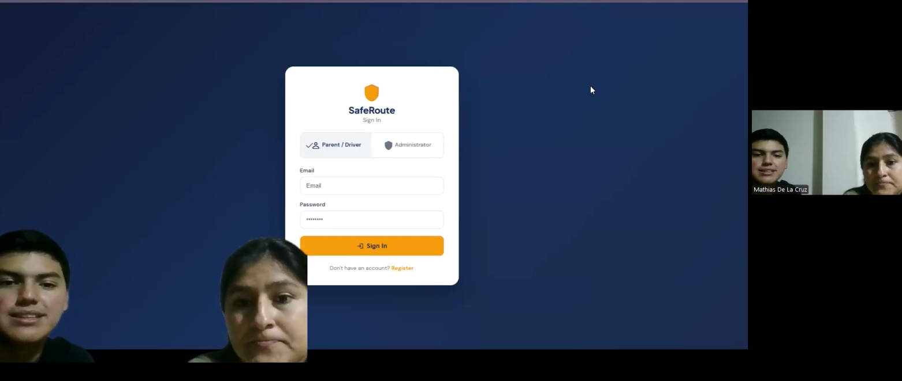

</p>

**Resumen descriptivo:**
En esta sesión de validación, Nickolas Ramirez y Maximo Quevedo exploraron a fondo la plataforma Safe Route,
concluyendo que su diseño intuitivo y sus funciones críticas como el monitoreo en tiempo real de unidades, la gestión multiactivo de estudiantes y
la alerta temprana ante incidencias de tráfico mediante una clara señalética cromática no solo garantizan una experiencia de usuario sumamente cómoda,
sino que establecen un estándar de seguridad y eficiencia que convenció plenamente al entrevistado para su adopción definitiva.

- **User Flow principal evaluado:** User Flow 10 - Rastreo en tiempo real del vehículo.
- **User Flows complementarios observados:** User Flow 11 - Recepción de notificaciones automáticas.

###### Entrevista de validación 2 - Parent

###### User Flow 11: Gestión del perfil y configuración del padre

* **User goal:**
  Como padre de familia, quiero acceder a mi perfil, para revisar mi información personal y configuración de cuenta dentro de la plataforma.

* **User Story asociada:**
  Como padre de familia, quiero revisar mi perfil de usuario, para asegurarme de que mis datos personales y preferencias estén correctamente configurados.

* **Validación durante entrevista:**
  Este flujo fue observado durante las entrevistas del segmento Parent, principalmente en la navegación donde se revisaron secciones como dashboard, seguimiento del bus, historial, alertas y perfil dentro de la Web Application. En este caso, el flujo permite validar que el padre de familia puede acceder a una sección personal y revisar información asociada a su cuenta.

* **Descripción del flujo:**

**Happy path:**
El padre de familia inicia sesión en SafeRoute y accede a su dashboard familiar. Desde el menú principal, selecciona la opción de perfil o configuración. El sistema muestra la información asociada a su cuenta, como datos personales, información de contacto, configuración general y preferencias disponibles dentro de la plataforma. El usuario revisa la información presentada y confirma que los datos corresponden correctamente a su perfil.

**Unhappy path:**
Si el padre de familia no encuentra fácilmente la sección de perfil, puede necesitar explorar otras opciones del menú, generando una pequeña demora en la navegación. Si la información del perfil no carga correctamente, el sistema debe mostrar un mensaje claro indicando el problema y permitir volver al dashboard sin perder la sesión. Si alguna opción de configuración no está disponible, la plataforma debe comunicarlo de forma comprensible para evitar confusión.

* **Observación para validación:**
  Durante las entrevistas Parent, se evidenció que la sección de perfil complementa la experiencia del padre de familia dentro de SafeRoute. Aunque el flujo principal del segmento está relacionado con el monitoreo del traslado escolar, el acceso al perfil permite que el usuario revise información de su cuenta y mantenga mayor control sobre su experiencia dentro de la plataforma.

* **Recomendación:**
  Se recomienda mantener la sección de perfil accesible desde el menú principal del usuario Parent y reforzar la claridad de sus opciones mediante etiquetas simples. También sería conveniente mostrar de forma ordenada la información personal, configuración de cuenta y preferencias disponibles, evitando que el usuario tenga que buscar en varias secciones para encontrar sus datos.


###### User Flow 11 - Gestión del perfil y configuración del padre

**Resumen descriptivo:**
Durante la sesión de validación, el/la entrevistado(a) interactuó con la Web Application de SafeRoute desde el rol de padre de familia. Primero accedió a la pantalla de inicio de sesión, donde se validó el ingreso a la plataforma y la identificación del usuario según su rol. Posteriormente, ingresó al dashboard familiar, desde donde pudo visualizar las opciones principales disponibles para el monitoreo y gestión de su cuenta.

Durante la navegación, el/la participante accedió a la sección de perfil, donde pudo revisar información asociada a su cuenta, datos personales y opciones de configuración disponibles dentro de la plataforma. Este flujo permitió validar el **User Flow 11: Gestión del perfil y configuración del padre**, ya que el usuario pudo identificar una sección personal dentro del sistema y revisar información relacionada con su cuenta.

Asimismo, la interacción permitió observar que el perfil complementa la experiencia del usuario Parent, ya que no solo se enfoca en el monitoreo del transporte escolar, sino también en brindar al padre de familia un espacio para consultar y gestionar información propia dentro de SafeRoute.
###### Entrevista de validación 3 - Parent

- **User Flow 12**
  **Entrevistador:**
  Mathias De La Cruz

**Datos del entrevistado**

- **Nombre:** Carla
- **Apellidos:** Peláez
- **Edad:** 38 años
- **Distrito:** Santiago de Surco, Lima
- **Segmento:** Parent
- **URL del video:** [https://1drv.ms/v/c/a3bda66c80e2095c/IQCkK7xkt2N7TbSCOXPbCJTqAXZRWtdYueZppMSIM3shK4c?e=usVO15]
- **Timing de inicio:** 13:27
- **Duración:** 06:31
- **Fin de entrevista:** 19:59

<p align="center">

</p>

**Resumen descriptivo:**
Durante la sesión de validación, Carla Peláez interactuó con la Web Application de SafeRoute desde el rol de padre de familia. Primero accedió a la pantalla de inicio de sesión, donde se validó el flujo de autenticación y la identificación del tipo de usuario. Posteriormente, ingresó al dashboard familiar, donde pudo visualizar las opciones principales relacionadas con el monitoreo del transporte escolar.

Durante la navegación, la entrevistada revisó el módulo de seguimiento del bus, donde se mostró la ubicación del vehículo en un mapa y una lista de estados asociados al recorrido. Este flujo permitió validar si el padre de familia puede identificar la ubicación del transporte y comprender el estado del trayecto sin necesidad de contactar directamente al conductor.

Asimismo, se revisó la sección de historial de asistencia, donde la participante pudo observar registros asociados a los viajes del estudiante. También se mostró el centro de alertas, orientado a la revisión de notificaciones o incidencias, y finalmente la sección de perfil, donde se visualizan datos personales, opciones de notificación y configuración de seguridad.

En general, la entrevista permitió validar que el flujo del segmento Parent cubre tareas importantes como iniciar sesión, revisar el estado del viaje, monitorear el bus, consultar asistencia, revisar alertas y acceder a la configuración del perfil. Las observaciones obtenidas servirán como insumo para identificar oportunidades de mejora en claridad de navegación, visibilidad del estado del sistema y confianza percibida durante el monitoreo del transporte escolar.

---
#### 5.3.3. Evaluaciones según heurísticas

En esta sección se presenta la evaluación de User Experience según heurísticas aplicada a SafeRoute, considerando criterios de usabilidad, arquitectura de información e inclusive design. Esta evaluación toma como referencia las sesiones de validación realizadas con usuarios de los segmentos objetivo.

Debido a que en esta primera versión se cuenta con una entrevista registrada del segmento Parent los hallazgos presentados corresponden a una evaluación preliminar de la experiencia del padre de familia dentro de la Web Application.

### UX Heuristics & Principles Evaluation

**Usability – Inclusive Design – Information Architecture**

| Campo          | Detalle                                |
| -------------- | -------------------------------------- |
| **Carrera**    | Ingeniería de Software                 |
| **Curso**      | Desarrollo de Aplicaciones Open Source |
| **Sección**    | 11896                                  |
| **Profesores** | Efraín Ricardo Bautiste Úbillus        |
| **Auditor**    | FiveTech                               |
| **Cliente(s)** | Carla Peláez                           |

**Site o App a evaluar**
SafeRoute Web Application

### Tareas a evaluar

El alcance de esta evaluación incluye la revisión de la usabilidad de las siguientes tareas realizadas por el segmento Parent:

1. Acceder a la plataforma mediante la pantalla de inicio de sesión.
2. Ingresar a la Web Application con rol de padre de familia.
3. Visualizar el dashboard familiar.
4. Consultar el seguimiento del bus escolar.
5. Revisar el historial de asistencia del estudiante.
6. Revisar alertas o notificaciones relacionadas al viaje.
7. Acceder a la sección de perfil y configuración del usuario.

No están incluidas en esta versión preliminar de la evaluación las siguientes tareas:

1. Inicio y ejecución de ruta desde el rol Driver.
2. Registro de abordaje por parte del conductor.
3. Reporte de incidencias desde el rol Driver.
4. Activación del botón de pánico.
5. Gestión administrativa de rutas, usuarios y vehículos.
6. Proceso de contratación o pago de planes.

### Escala de severidad

Los problemas serán puntuados tomando en cuenta la siguiente escala de severidad:

| Nivel | Descripción                                                                                                                                                                                |
| ----- | ------------------------------------------------------------------------------------------------------------------------------------------------------------------------------------------ |
| **1** | Problema superficial: puede ser fácilmente superado por el usuario o ocurre con muy poca frecuencia. No necesita ser arreglado a menos que exista disponibilidad de tiempo.                |
| **2** | Problema menor: puede ocurrir con mayor frecuencia o ser un poco más difícil de superar para el usuario. Se le debería asignar una prioridad baja para resolverlo en el siguiente release. |
| **3** | Problema mayor: ocurre frecuentemente o los usuarios no son capaces de resolverlo. Es importante corregirlo y asignarle prioridad alta.                                                    |
| **4** | Problema muy grave: error de alto impacto que impide al usuario continuar con el uso de la herramienta. Es imperativo corregirlo antes del lanzamiento.                                    |

### Tabla resumen

| #   | Problema                                                                                                                                                            | Escala de severidad | Heurística / Principio violado                                                                    |
| --- | ------------------------------------------------------------------------------------------------------------------------------------------------------------------- | ------------------: | ------------------------------------------------------------------------------------------------- |
| 1   | La opción de acceso agrupa los roles **Parent / Driver** en una sola selección, lo que puede generar ambigüedad para usuarios nuevos.                               |                   2 | Information Architecture: Labeling System / Usability: Correspondencia entre sistema y mundo real |
| 2   | El dashboard del padre podría priorizar con mayor claridad el estado del viaje activo del estudiante.                                                               |                   2 | Usability: Visibilidad del estado del sistema / Information Architecture: Is it findable?         |
| 3   | Algunas secciones como alertas, historial o seguimiento podrían necesitar mayor jerarquía visual para diferenciar información crítica de información secundaria.    |                   2 | Information Architecture: Is it understandable? / Usability: Diseño estético y minimalista        |
| 4   | Las notificaciones o alertas podrían mostrar con mayor claridad su nivel de prioridad o estado de lectura.                                                          |                   2 | Usability: Visibilidad del estado del sistema                                                     |
| 5   | El historial de asistencia podría requerir filtros o indicadores más visibles para facilitar la búsqueda de registros específicos.                                  |                   2 | Information Architecture: Is it findable? / Usability: Flexibilidad y eficiencia de uso           |
| 6   | Algunos elementos visuales podrían complementarse con textos más descriptivos para mejorar la comprensión de usuarios con distintos niveles de experiencia digital. |                   1 | Inclusive Design: Proporciona experiencias comparables                                            |

### Descripción de problemas

#### Problema #1: La opción de acceso agrupa los roles Parent / Driver

**Severidad:** 2
**Heurística violada:** Information Architecture - Labeling System / Usability - Correspondencia entre sistema y mundo real

**Problema:**
En la pantalla de inicio de sesión, la opción **Parent / Driver** aparece agrupada en una misma selección. Aunque esto puede simplificar la interfaz, también puede generar ambigüedad para usuarios nuevos, ya que un padre de familia podría no comprender inmediatamente si debe ingresar por esa opción o si existe una opción exclusiva para su rol.

Esta situación no impide el uso del sistema, pero puede generar una pequeña duda inicial durante el acceso, especialmente en usuarios con menor experiencia digital.

**Recomendación:**
Separar visualmente los accesos por rol o mejorar la etiqueta. Por ejemplo:

- Parent
- Driver
- Administrator

Otra alternativa sería mantener la agrupación, pero agregar un texto auxiliar como:
“Selecciona esta opción si eres padre de familia o conductor registrado”.

#### Problema #2: El dashboard del padre podría priorizar mejor el viaje activo

**Severidad:** 2
**Heurística violada:** Usability - Visibilidad del estado del sistema / Information Architecture - Is it findable?

**Problema:**
Durante la validación del flujo Parent, el dashboard familiar permite acceder a distintas secciones como seguimiento del bus, historial, alertas y perfil. Sin embargo, considerando que la necesidad principal del padre es conocer el estado actual del traslado de su hijo, el viaje activo debería destacarse de forma más evidente desde la pantalla principal.

Si esta información no se muestra con suficiente prioridad, el usuario podría tener que explorar más de una opción antes de encontrar el estado actual del viaje.

**Recomendación:**
Agregar una tarjeta principal en el dashboard que muestre de forma inmediata:

- Estado del viaje actual.
- Nombre del estudiante.
- Ubicación o última actualización del vehículo.
- Próxima acción relevante.
- Botón directo a “Track Bus” o “View Active Trip”.

#### Problema #3: Algunas secciones requieren mayor jerarquía visual

**Severidad:** 2
**Heurística violada:** Information Architecture - Is it understandable? / Usability - Diseño estético y minimalista

**Problema:**
Las secciones del flujo Parent presentan información útil, pero algunas pantallas podrían beneficiarse de una jerarquía visual más marcada para diferenciar información crítica de información secundaria. En un contexto de transporte escolar, datos como ubicación, estado de abordaje, llegada o alerta deberían resaltar más que opciones de consulta general.

Este problema no bloquea la navegación, pero puede afectar la rapidez con la que el usuario interpreta la información.

**Recomendación:**
Aplicar mayor jerarquía visual en los elementos críticos mediante:

- Tarjetas destacadas para estado actual del viaje.
- Etiquetas de estado visibles.
- Separación clara entre información principal y secundaria.
- Uso consistente de títulos, subtítulos e indicadores.

#### Problema #4: Las alertas podrían indicar mejor prioridad o estado de lectura

**Severidad:** 2
**Heurística violada:** Usability - Visibilidad del estado del sistema

**Problema:**
En la sección de alertas, el usuario puede revisar información relacionada con notificaciones del viaje. Sin embargo, sería conveniente que el sistema diferencie con mayor claridad el estado de cada alerta, por ejemplo, si es nueva, leída, informativa, importante o crítica.

Para un padre de familia, no todas las alertas tienen el mismo nivel de urgencia. Una alerta de llegada no tiene el mismo impacto que una incidencia o retraso.

**Recomendación:**
Agregar indicadores visuales y textuales para diferenciar tipos de alerta:

- Nueva
- Leída
- Informativa
- Importante
- Crítica

Además, se recomienda ordenar las alertas por prioridad y fecha, mostrando primero las más recientes o relevantes.

#### Problema #5: El historial de asistencia podría requerir filtros más visibles

**Severidad:** 2
**Heurística violada:** Information Architecture - Is it findable? / Usability - Flexibilidad y eficiencia de uso

**Problema:**
El historial de asistencia permite al padre revisar registros asociados al servicio de transporte escolar. Sin embargo, conforme aumente la cantidad de registros, el usuario podría necesitar mecanismos más claros para encontrar información específica.

Si no existen filtros visibles por fecha, estudiante, estado o tipo de evento, el usuario podría tardar más en encontrar el registro deseado.

**Recomendación:**
Incorporar filtros o controles de búsqueda como:

- Filtrar por estudiante.
- Filtrar por fecha o rango de fechas.
- Filtrar por estado: abordó, ausente, llegó, pendiente.
- Ordenar por fecha reciente.
- Mostrar resumen mensual de asistencia.

#### Problema #6: Algunos elementos visuales podrían complementarse con textos descriptivos

**Severidad:** 1
**Heurística violada:** Inclusive Design - Proporciona experiencias comparables

**Problema:**
Algunos elementos visuales de la interfaz, como íconos, estados o accesos rápidos, podrían requerir textos complementarios para asegurar que todos los usuarios comprendan su función. Esto es especialmente importante para padres de familia con menor experiencia digital o usuarios que dependen más de texto que de íconos.

El problema es superficial, pero mejorar esta claridad ayudaría a que la experiencia sea más inclusiva.

**Recomendación:**
Acompañar íconos o indicadores visuales con etiquetas textuales claras. También se recomienda asegurar que los botones y estados tengan nombres comprensibles, evitando depender únicamente de color o íconos.

### 5.4 Video About-the-Product.

**Resumen**

El video _About-the-Product_ presenta una demostración funcional de **SafeRoute** desde la perspectiva de un padre de familia, mostrando las principales características de la plataforma orientadas a mejorar la seguridad y el seguimiento del transporte escolar.

Durante la demostración se validan funcionalidades como el monitoreo en tiempo real de la ubicación del transporte, el registro de asistencia de los estudiantes, la gestión de alertas e incidentes durante los trayectos y la configuración de notificaciones personalizadas. Asimismo, se realiza una entrevista de validación con una usuaria perteneciente al segmento objetivo, quien comparte su percepción sobre la utilidad, confiabilidad y valor de la solución.

El video permite evidenciar cómo SafeRoute brinda mayor tranquilidad a los padres de familia al ofrecer información actualizada sobre los recorridos de sus hijos y mecanismos de comunicación ante posibles incidentes durante el servicio de transporte escolar.

**Video representativo**

<p align="center">
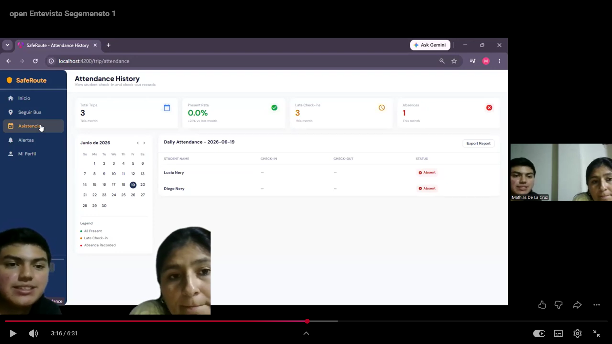
</p>

**URL del video**

**Microsoft Stream:**  
[https://upcedupe-my.sharepoint.com/:v:/g/personal/u202424059_upc_edu_pe/IQBgPiZfxrQkQo20Qt1RmgtMAUGqm41mdcDZIwqwOFZlv44?nav=eyJyZWZlcnJhbEluZm8iOnsicmVmZXJyYWxBcHAiOiJPbmVEcml2ZUZvckJ1c2luZXNzIiwicmVmZXJyYWxBcHBQbGF0Zm9ybSI6IldlYiIsInJlZmVycmFsTW9kZSI6InZpZXciLCJyZWZlcnJhbFZpZXciOiJNeUZpbGVzTGlua0NvcHkifX0&e=PDguva](https://upcedupe-my.sharepoint.com/:v:/g/personal/u202424059_upc_edu_pe/IQBgPiZfxrQkQo20Qt1RmgtMAUGqm41mdcDZIwqwOFZlv44?nav=eyJyZWZlcnJhbEluZm8iOnsicmVmZXJyYWxBcHAiOiJPbmVEcml2ZUZvckJ1c2luZXNzIiwicmVmZXJyYWxBcHBQbGF0Zm9ybSI6IldlYiIsInJlZmVycmFsTW9kZSI6InZpZXciLCJyZWZlcnJhbFZpZXciOiJNeUZpbGVzTGlua0NvcHkifX0&e=PDguva)

**YouTube:**  
[https://youtu.be/kPVYy3IxO2g](https://youtu.be/kPVYy3IxO2g)

**Duración:**  
00:06:31

**Pauta de secuencias de contenido**

| Tiempo de inicio | Sección                    | Descripción                                                                                                                      |
| ---------------- | -------------------------- | -------------------------------------------------------------------------------------------------------------------------------- |
| 00:00:00         | Introducción y validación  | Presentación de la entrevistada Carla Peláez y explicación del objetivo de la sesión de validación de SafeRoute.                 |
| 00:00:23         | Inicio de sesión           | Demostración del proceso de autenticación para un usuario con rol de Padre de Familia.                                           |
| 00:01:02         | Dashboard principal        | Visualización de métricas generales, hijos registrados, viajes, rutas asignadas y accesos rápidos a funcionalidades principales. |
| 00:01:45         | Navegación e idioma        | Presentación del menú lateral y de la funcionalidad de cambio de idioma entre español e inglés.                                  |
| 00:01:59         | Seguimiento del bus        | Demostración del monitoreo en tiempo real de la ubicación del transporte, conductor asignado, ruta y próximas paradas.           |
| 00:02:41         | Validación del seguimiento | Opinión de la usuaria sobre la utilidad de visualizar el recorrido y recibir información durante el trayecto.                    |
| 00:03:07         | Gestión de asistencia      | Presentación del historial de asistencia, viajes realizados y estado de recogida de los estudiantes.                             |
| 00:04:01         | Validación de asistencia   | Retroalimentación positiva sobre la posibilidad de consultar el historial de asistencia de los hijos.                            |
| 00:04:09         | Alertas e incidentes       | Demostración del módulo de alertas, reportes de incidentes y filtros por gravedad.                                               |
| 00:04:37         | Validación de alertas      | Comentarios de la usuaria sobre la importancia de recibir notificaciones ante incidentes o emergencias.                          |
| 00:05:01         | Perfil y notificaciones    | Visualización de la información del usuario, configuración de notificaciones y actualización de datos personales.                |
| 00:05:36         | Retroalimentación final    | Solicitud de comentarios generales sobre la experiencia de uso de la plataforma.                                                 |
| 00:05:45         | Testimonio del usuario     | La entrevistada destaca que la plataforma le brinda mayor seguridad y confianza respecto al transporte de sus hijos.             |
| 00:06:02         | Recomendaciones de mejora  | Sugerencia de incorporar un período de prueba para facilitar la adopción del servicio por nuevos usuarios.                       |
| 00:06:25         | Cierre                     | Finalización de la sesión de validación y agradecimiento a la participante.                                                      |

**Testimonio de validación**

Como parte de la validación del producto, Carla Peláez, representante del segmento de padres de familia, compartió el siguiente testimonio:

"A mí me ha gustado bastante porque con eso me sentiría segura durante la ruta que realizan mis hijos. Me parece bastante interesante y bastante confiable."

Además, sugirió incorporar un período de prueba para que los nuevos usuarios puedan familiarizarse con la plataforma antes de adquirir el servicio, aportando una oportunidad de mejora para futuras iteraciones del producto.

### Conclusiones

#### Conclusiones finales

Al finalizar el desarrollo de SafeRoute, el equipo pudo contrastar los elementos definidos durante el proceso Lean UX con los resultados obtenidos en las etapas de implementación y validación del producto. La comparación entre los **Problem Statements**, **Assumptions**, **Hypothesis Statements** y los hallazgos de validación permitió comprobar que la problemática identificada inicialmente se mantiene vigente y que la solución desarrollada responde de manera coherente a las necesidades de los segmentos objetivo.

En el **Problem Statement**, se identificó que el transporte escolar privado en el Perú opera de forma tradicional, con una alta dependencia de llamadas telefónicas, mensajes de WhatsApp y registros manuales. Esta situación genera incertidumbre en los padres de familia y carga operativa en los transportistas, quienes no cuentan con herramientas digitales especializadas para gestionar rutas, alumnos, incidencias y comunicación. Los resultados obtenidos durante el desarrollo y validación confirmaron esta problemática, ya que los usuarios valoraron especialmente la posibilidad de contar con mayor visibilidad del trayecto, trazabilidad de eventos y una comunicación más ordenada.

Respecto a los **Assumptions**, se planteó que los padres adoptarían la plataforma si esta les proporcionaba información clara y confiable sobre el traslado de sus hijos. Asimismo, se asumió que los transportistas utilizarían SafeRoute si la interfaz era sencilla y les permitía reducir la carga operativa durante el recorrido. Estas suposiciones fueron validadas durante las entrevistas y pruebas de uso, ya que los usuarios demostraron interés en funcionalidades como la visualización del estado del viaje, el registro de abordaje, las notificaciones y el reporte de incidencias. Sin embargo, también se identificó que la adopción dependerá de que la aplicación mantenga una experiencia simple, rápida y estable, especialmente para conductores que deben operar el sistema en contextos de alta presión.

En relación con las **Hypothesis Statements**, se planteó que los padres reducirían su incertidumbre mediante una vista del estado del trayecto, que los conductores gestionarían mejor el servicio mediante herramientas digitales simples y que los administradores centralizarían su operación mediante un panel único. La versión final implementada de SafeRoute permitió comprobar la viabilidad técnica de estas hipótesis, ya que se desarrollaron e integraron funcionalidades asociadas a perfiles, rutas, vehículos, estudiantes, viajes, asistencias, incidencias, notificaciones, planes y suscripciones. Además, la eliminación del Mock API y la integración directa con el RESTful API real permitió validar el comportamiento del producto en un entorno más cercano al uso real.

Los resultados de validación evidenciaron que SafeRoute aporta valor principalmente en tres aspectos: **visibilidad**, **organización** y **confianza**. Para los padres, la plataforma representa una forma de reducir la incertidumbre durante el traslado escolar. Para los conductores, permite ordenar la operación diaria mediante registros digitales y flujos estructurados. Para los administradores, facilita la centralización de información clave sobre usuarios, rutas, vehículos y servicios. Esto confirma que la propuesta de valor se encuentra alineada con los hallazgos del Needfinding y con las necesidades detectadas en los segmentos objetivo.

A nivel técnico, el proyecto permitió consolidar una solución web distribuida compuesta por una Landing Page, una Web Application y un Backend RESTful API. La versión final fue desplegada en entornos cloud, integrando el frontend con el backend real y eliminando la dependencia de servicios simulados. Esta evolución permitió demostrar que SafeRoute no solo fue diseñado como una propuesta conceptual, sino también implementado como una solución funcional con servicios documentados mediante Swagger/OpenAPI.

Finalmente, el proceso de mejora continua permitió corregir observaciones recibidas en entregas anteriores, especialmente en aspectos de documentación, despliegue, validación, comunicación oral y escrita, y coherencia entre artefactos. La versión final del informe y del producto refleja una mayor alineación entre el problema identificado, las hipótesis planteadas, el backlog desarrollado, la arquitectura implementada y los resultados obtenidos durante la validación.

**Comparación entre Lean UX y resultados obtenidos**

| Elemento Lean UX | Planteamiento inicial | Resultado obtenido | Conclusión |
|---|---|---|---|
| Problem Statement | Los padres no cuentan con visibilidad sobre el trayecto escolar y los transportistas gestionan su operación con herramientas informales. | La validación confirmó que la falta de información y trazabilidad genera preocupación en los padres y carga operativa en los conductores. | La problemática inicial fue validada y se mantiene como una necesidad real del mercado objetivo. |
| Assumption 1 | Los padres adoptarán la plataforma si reciben información clara y confiable sobre el trayecto de sus hijos. | Los usuarios valoraron funcionalidades como monitoreo, confirmación de llegada, alertas e información del estado del viaje. | La suposición fue validada parcialmente, ya que existe interés siempre que la experiencia sea simple y confiable. |
| Assumption 2 | Los transportistas adoptarán la plataforma si la interfaz operativa es rápida y no interfiere con la conducción. | Se priorizaron flujos como inicio de trayecto, marcación de abordaje, reporte de incidencias y finalización de ruta. | La suposición fue validada como criterio clave de diseño: la solución debe reducir carga operativa, no aumentarla. |
| Assumption 3 | Los administradores centralizarán la operación si cuentan con un panel para gestionar usuarios, rutas y recursos. | Se implementaron módulos para perfiles, padres, estudiantes, conductores, vehículos, rutas, asignaciones y suscripciones. | La suposición fue respaldada por la implementación final, ya que el sistema permite centralizar la información operativa. |
| Hypothesis 1 | Los padres reducirán su incertidumbre usando una vista del estado del trayecto. | Se implementaron funcionalidades de monitoreo, notificaciones y consulta del estado del servicio. | La hipótesis fue técnicamente viable y se validó como una funcionalidad de alto valor para el segmento padre. |
| Hypothesis 2 | Los conductores gestionarán el trayecto con menos errores mediante una interfaz para abordajes, paradas e incidencias. | Se desarrollaron servicios y vistas relacionadas con viajes, asistencias, incidencias y actualización de estados. | La hipótesis fue respaldada por la implementación, aunque requiere futuras pruebas con mayor cantidad de conductores reales. |
| Hypothesis 3 | Los administradores centralizarán la gestión mediante un panel único. | Se integraron bounded contexts relacionados con Stakeholder, Fleet, Trip, Subscription, IAM y Notifications. | La hipótesis fue validada desde el alcance funcional, ya que el sistema articula los módulos principales de la operación. |
| Hypothesis 4 | Los administradores percibirán valor en planes superiores si las funcionalidades reducen el tiempo de coordinación. | Se implementó el bounded context de Subscription and Plan Management para soportar planes y suscripciones. | La hipótesis quedó preparada para validación futura con métricas reales de adopción, conversión y upgrade. |

#### Recomendaciones

Se recomienda continuar validando SafeRoute con una mayor cantidad de usuarios representantes de los segmentos objetivo, especialmente conductores y padres de familia que utilicen servicios de transporte escolar de forma recurrente. Esto permitiría obtener métricas más precisas sobre adopción, facilidad de uso, reducción de incertidumbre y percepción de valor.

También se recomienda fortalecer las pruebas de uso en escenarios reales de operación, considerando condiciones como baja conectividad, tráfico, cambios de ruta, retrasos y necesidad de respuesta rápida ante incidencias. Estos escenarios son críticos para confirmar si la plataforma realmente reduce la carga operativa del conductor y mejora la experiencia del padre de familia.

A nivel técnico, se recomienda continuar mejorando la integración entre frontend y backend, reforzando validaciones, manejo de errores, seguridad, control de roles y rendimiento de los endpoints. Asimismo, sería conveniente incorporar pruebas automatizadas para asegurar la estabilidad de los servicios RESTful y facilitar la evolución futura del sistema.

Finalmente, se recomienda ampliar progresivamente las funcionalidades de monitoreo, analítica e historial operativo, ya que estos elementos pueden incrementar el valor percibido por administradores y transportistas. De esta manera, SafeRoute podría evolucionar hacia una solución más robusta para la digitalización del transporte escolar privado.


### Video About-the-Team

**Resumen**

El video _About-The-Team_ presenta el proceso de trabajo realizado por el equipo FiveTech durante el desarrollo de **SafeRoute**, una plataforma orientada a mejorar la seguridad y gestión del transporte escolar.

A lo largo del video, cada integrante describe su contribución al proyecto, abarcando actividades relacionadas con investigación de usuarios, diseño de experiencia de usuario, modelado del dominio, arquitectura de software, desarrollo frontend y backend, integración de componentes, despliegue en la nube y gestión del proyecto. Asimismo, los miembros reflexionan sobre las competencias técnicas y habilidades blandas fortalecidas durante el ciclo de desarrollo.

El video también resume la evolución del proyecto desde la identificación de necesidades de los usuarios y la definición del modelo de negocio, hasta la implementación y despliegue de la solución tecnológica en Microsoft Azure. Finalmente, se destacan los principales logros alcanzados por el equipo, especialmente en comunicación, trabajo colaborativo, organización y aplicación de buenas prácticas de ingeniería de software.

**Video representativo**

<p align="center">
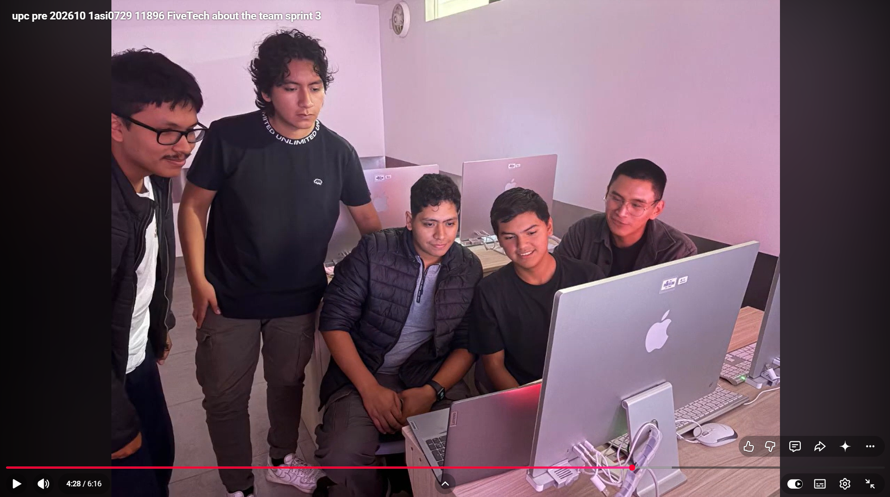
</p>

**URL del video**

**Microsoft Stream:**  
[https://upcedupe-my.sharepoint.com/:v:/g/personal/u20241d922_upc_edu_pe/IQCZwWlipjNpSqLLA2wT-EctASBmceGQ2qfX1KGNmDcVuCs?nav=eyJyZWZlcnJhbEluZm8iOnsicmVmZXJyYWxBcHAiOiJPbmVEcml2ZUZvckJ1c2luZXNzIiwicmVmZXJyYWxBcHBQbGF0Zm9ybSI6IldlYiIsInJlZmVycmFsTW9kZSI6InZpZXciLCJyZWZlcnJhbFZpZXciOiJNeUZpbGVzTGlua0NvcHkifX0&e=aJQ49c](https://upcedupe-my.sharepoint.com/:v:/g/personal/u20241d922_upc_edu_pe/IQCZwWlipjNpSqLLA2wT-EctASBmceGQ2qfX1KGNmDcVuCs?nav=eyJyZWZlcnJhbEluZm8iOnsicmVmZXJyYWxBcHAiOiJPbmVEcml2ZUZvckJ1c2luZXNzIiwicmVmZXJyYWxBcHBQbGF0Zm9ybSI6IldlYiIsInJlZmVycmFsTW9kZSI6InZpZXciLCJyZWZlcnJhbFZpZXciOiJNeUZpbGVzTGlua0NvcHkifX0&e=aJQ49c)

**YouTube:**  
[https://youtu.be/xuvvDfHfeaE](https://youtu.be/xuvvDfHfeaE)

**Pauta de secuencias de contenido**

| Tiempo de inicio | Sección                                       | Descripción                                                                                                                                                            |
| ---------------- | --------------------------------------------- | ---------------------------------------------------------------------------------------------------------------------------------------------------------------------- |
| 00:00:05         | Presentación de Matías de la Cruz             | Participación en Product Design, Information Architecture, User Flows, desarrollo de wireframes, mockups, frontend, backend y reflexión sobre competencias adquiridas. |
| 00:01:13         | Presentación de Renzo Revilla                 | Contribución en la implementación técnica, coordinación de sprints, desarrollo del Landing Page, Web Application e integración frontend-backend.                       |
| 00:02:06         | Presentación de Julio Franquerano             | Participación en arquitectura de software, diagramas C4 y de clases, desarrollo frontend con Angular, backend con Spring Boot y despliegue en Azure.                   |
| 00:02:57         | Presentación de José Zacarías Sortea Quintana | Participación en investigación de usuarios, UX, Event Storming, Design Level, backend y frontend, además de reflexión sobre el aprendizaje obtenido.                   |
| 00:04:06         | Resumen general del proyecto SafeRoute        | Descripción del proceso completo de desarrollo: investigación, modelado de negocio, requisitos, arquitectura, diseño UX/UI, implementación y despliegue.               |
| 00:05:27         | Logros y competencias alcanzadas              | Reflexión final sobre el fortalecimiento de habilidades de comunicación, documentación técnica, trabajo colaborativo y desarrollo profesional.                         |
| 00:06:00         | Cierre                                        | Conclusiones finales sobre SafeRoute y la experiencia adquirida por el equipo FiveTech.                                                                                |

## Service Terms & Conditions and Privacy Protection

SafeRoute es una plataforma web orientada a la gestión y monitoreo del transporte escolar, por lo que el tratamiento responsable de la información de los usuarios es un aspecto fundamental de la propuesta. Debido a que la solución involucra datos de padres de familia, conductores, estudiantes, rutas, asistencia y ubicación del vehículo, el equipo considera necesario comunicar los principales términos de uso del servicio y las medidas de protección de privacidad contempladas para el producto.

Esta sección presenta los lineamientos generales de **Service Terms & Conditions** y **Privacy Protection** definidos para SafeRoute. Su propósito es informar de manera clara cómo se espera que los usuarios utilicen la plataforma, qué responsabilidades asume cada rol y qué tipo de información debe ser protegida durante el uso del sistema.

### Service Terms & Conditions

Los términos y condiciones de SafeRoute establecen las reglas generales para el uso de la plataforma por parte de los usuarios registrados. El acceso a la Web Application implica que el usuario comprende el propósito del servicio y acepta utilizar la plataforma únicamente para fines relacionados con la gestión y monitoreo del transporte escolar.

SafeRoute está diseñada para apoyar la digitalización del servicio de movilidad escolar, permitiendo centralizar información de rutas, alumnos, conductores, asistencia, viajes y monitoreo. La plataforma no reemplaza las obligaciones legales, operativas o de seguridad que corresponden a los responsables reales del servicio de transporte escolar.

### User Roles and Responsibilities

SafeRoute considera tres roles principales dentro de la experiencia del usuario: **Administrator**, **Driver** y **Parent**. Cada rol tiene responsabilidades específicas para garantizar el uso correcto de la plataforma.

| Rol               | Responsabilidades principales                                                                                                                                                                                                                                                     |
| ----------------- | --------------------------------------------------------------------------------------------------------------------------------------------------------------------------------------------------------------------------------------------------------------------------------- |
| **Administrator** | Registrar y mantener actualizada la información de usuarios, conductores, estudiantes, vehículos y rutas. También es responsable de gestionar la suscripción del servicio y asegurar que los usuarios registrados correspondan a personas autorizadas.                            |
| **Driver**        | Utilizar la plataforma durante la operación del servicio escolar para revisar rutas asignadas, controlar alumnos, registrar abordajes y consultar información operativa del viaje. Debe usar la herramienta de forma responsable, evitando acciones que distraigan la conducción. |
| **Parent**        | Consultar la información del traslado escolar de su hijo, revisar el estado del viaje, historial de asistencia y datos de perfil. Debe mantener sus credenciales seguras y utilizar la información únicamente para fines relacionados con el servicio escolar.                    |

### Acceptable Use of the Platform

Los usuarios de SafeRoute deben utilizar la plataforma de forma ética, responsable y vinculada al propósito del servicio. No se permite el uso de la información para fines ajenos al monitoreo, gestión o coordinación del transporte escolar.

El usuario se compromete a:

* Usar la plataforma únicamente con credenciales autorizadas.
* No compartir información de estudiantes, padres o conductores con terceros no autorizados.
* No manipular, alterar o registrar información falsa dentro del sistema.
* No intentar acceder a cuentas, rutas o datos que no le corresponden.
* No usar la información de ubicación para fines distintos al monitoreo del servicio escolar.
* Cerrar sesión cuando utilice dispositivos compartidos.
* Reportar al administrador cualquier error, acceso indebido o comportamiento sospechoso dentro de la plataforma.

### Subscription and Service Access

SafeRoute contempla un modelo de servicio basado en planes de suscripción. La gestión de planes corresponde principalmente al rol **Administrator**, quien puede revisar el estado de la suscripción y acceder a las opciones disponibles según el alcance contratado.

El acceso a determinadas funcionalidades puede depender del plan activo. En caso una función no esté disponible para el usuario, la plataforma debe comunicarlo de forma clara, evitando generar confusión o expectativas incorrectas.

### Privacy Protection

La protección de la privacidad es un componente esencial de SafeRoute debido a que la plataforma gestiona información sensible relacionada con menores de edad, padres de familia, conductores y rutas escolares.

SafeRoute considera como principio general la recolección mínima de datos necesarios para cumplir con el propósito del servicio. La información registrada debe utilizarse exclusivamente para facilitar la gestión, monitoreo y trazabilidad del transporte escolar.


### Personal Data Collected

SafeRoute puede manejar los siguientes tipos de datos dentro de la plataforma:

| Tipo de dato             | Ejemplos                                                                                      | Finalidad                                                                              |
| ------------------------ | --------------------------------------------------------------------------------------------- | -------------------------------------------------------------------------------------- |
| **Datos de cuenta**      | Nombre, correo electrónico, rol de usuario, credenciales de acceso.                           | Permitir autenticación, identificación del usuario y control de acceso según rol.      |
| **Datos de estudiantes** | Nombre del estudiante, relación con el padre, estado de asistencia o abordaje.                | Permitir el monitoreo del traslado escolar y el control de asistencia durante la ruta. |
| **Datos de conductor**   | Nombre, rol, rutas asignadas, información operativa del viaje.                                | Gestionar la ejecución del servicio de transporte escolar.                             |
| **Datos de ruta**        | Paradas, horarios, estado del viaje, recorrido asignado.                                      | Facilitar la organización y seguimiento del trayecto escolar.                          |
| **Datos de ubicación**   | Posición del vehículo o referencia de seguimiento en mapa.                                    | Permitir que padres y administradores visualicen el estado del traslado escolar.       |
| **Datos técnicos**       | Información básica de sesión, navegador, idioma seleccionado o interacción con la plataforma. | Mejorar la seguridad, trazabilidad y funcionamiento del sistema.                       |


### Protection of Minors’ Data

SafeRoute reconoce que la información relacionada con estudiantes requiere un tratamiento especialmente cuidadoso. Por ello, la plataforma debe limitar la visualización de datos de menores únicamente a usuarios autorizados, como padres vinculados, conductores asignados y administradores responsables del servicio.

La información de estudiantes no debe mostrarse públicamente ni compartirse con usuarios que no formen parte del servicio autorizado. Asimismo, cualquier visualización de asistencia, abordaje, llegada o historial debe estar protegida mediante autenticación y control de acceso por rol.


### Location and GPS Data

El uso de información de ubicación tiene como finalidad principal brindar visibilidad sobre el estado del traslado escolar. Esta información permite que el padre de familia conozca el avance del viaje, la ubicación del vehículo o el estado general del recorrido.

SafeRoute debe utilizar los datos de ubicación únicamente dentro del contexto del servicio escolar. La ubicación no debe emplearse para fines comerciales externos, vigilancia no autorizada o seguimiento fuera del propósito de la ruta escolar.

Para proteger esta información, la plataforma debe considerar:

* Acceso restringido según rol.
* Visualización de ubicación solo durante viajes o rutas autorizadas.
* Uso de datos de ubicación con fines de monitoreo escolar.
* Comunicación clara al usuario sobre el propósito del seguimiento.
* Evitar exposición pública de rutas, paradas o ubicación del vehículo.


### Informed Consent

Debido a que SafeRoute involucra datos relacionados con estudiantes menores de edad, el uso de la plataforma debe considerar el consentimiento informado del padre, madre, apoderado o responsable autorizado.

El consentimiento informado implica que el usuario comprende:

* Qué información será registrada.
* Para qué será utilizada.
* Quiénes podrán visualizarla.
* Qué beneficios ofrece la plataforma.
* Qué limitaciones tiene el servicio.
* Cómo puede solicitar corrección o actualización de sus datos.


### Cookies and Local Storage Policy

SafeRoute utiliza cookies, almacenamiento local (**Local Storage**) y tecnologías similares en el Landing Page y la Web Application para mejorar la experiencia del usuario, recordar preferencias básicas y permitir el funcionamiento técnico de la sesión.

A diferencia de las cookies tradicionales, la plataforma utiliza principalmente el almacenamiento local del navegador del usuario para mantener la persistencia de la sesión de forma eficiente dentro de la Web Application.

Estas tecnologías se utilizan específicamente para:

* **Gestión de sesión:** almacenar de forma local el token de autenticación (`saferoute.token`) y los datos de perfil básicos del usuario (`saferoute.user`) tras iniciar sesión, permitiendo el acceso a los paneles correspondientes sin requerir credenciales en cada interacción.
* **Preferencias del usuario:** recordar configuraciones personalizadas del sistema, como la selección de idioma (`saferoute-language`).
* **Optimización de experiencia:** facilitar una navegación más fluida dentro del Landing Page y la Web Application, reduciendo la repetición de configuraciones básicas.
* **Soporte técnico de seguridad:** apoyar el control de sesión y el acceso a secciones protegidas según el rol del usuario.

Los datos almacenados localmente deben utilizarse únicamente para el funcionamiento de la plataforma. Al cerrar sesión, la aplicación debe eliminar o invalidar la información de sesión almacenada localmente para evitar accesos no autorizados desde dispositivos compartidos.

En caso de integrar herramientas de análisis o servicios externos de terceros que utilicen cookies de seguimiento, SafeRoute lo comunicará claramente al usuario, permitiéndole conocer el propósito de dichas tecnologías y gestionar sus consentimientos según corresponda.


### Third-Party Services

SafeRoute puede integrarse con servicios externos necesarios para su funcionamiento, como servicios de mapas, servicios de despliegue en la nube, autenticación, almacenamiento, documentación de API o herramientas de video utilizadas para evidencias académicas.

El uso de servicios de terceros debe estar alineado con el propósito de la solución. En caso estos servicios procesen información técnica o datos vinculados a la operación de la plataforma, se debe procurar que su uso respete criterios de seguridad, privacidad y confiabilidad.

Ejemplos de servicios de terceros considerados en el proyecto:

* Servicios de hosting o despliegue cloud para Landing Page, Web Application y Backend.
* Servicios de mapas o visualización de rutas.
* Herramientas de documentación de API como Swagger/OpenAPI.
* Repositorios de control de versiones para trazabilidad del desarrollo.
* Plataformas de video utilizadas para evidencias de validación o exposición académica.


### Information Security Measures

Para proteger la información gestionada por SafeRoute, se consideran las siguientes medidas de seguridad:

* Autenticación de usuarios mediante credenciales.
* Control de acceso basado en roles.
* Separación de permisos para Administrator, Driver y Parent.
* Uso de HTTPS en entornos desplegados.
* Protección de endpoints del backend.
* Validación de datos enviados por el usuario.
* Gestión segura de credenciales y variables de entorno.
* Eliminación o invalidación de datos de sesión al cerrar sesión.
* Documentación de servicios mediante Swagger/OpenAPI.
* Uso de repositorios versionados para mantener trazabilidad de cambios.
* Restricción de acceso a información sensible según el rol del usuario.


### User Rights and Data Management

Los usuarios de SafeRoute deben poder solicitar la revisión, corrección o actualización de sus datos personales cuando detecten información incorrecta dentro de la plataforma. Asimismo, el administrador del servicio debe mantener actualizada la información de estudiantes, conductores, rutas y usuarios registrados.

En futuras iteraciones, SafeRoute podrá incorporar mecanismos más avanzados para que los usuarios gestionen sus preferencias de privacidad, revisen permisos asociados a su cuenta o soliciten la eliminación de información que ya no sea necesaria para la prestación del servicio.

### Privacy by Design Considerations

SafeRoute aplica el principio de privacidad desde el diseño, considerando que la experiencia del usuario debe ser clara, segura y comprensible desde las primeras etapas del producto.

Las decisiones de diseño deben procurar que:

* El usuario comprenda qué información está visualizando.
* La información sensible no se muestre fuera del contexto necesario.
* Las pantallas eviten exponer datos innecesarios.
* Las etiquetas y mensajes sean claros para usuarios con distintos niveles de experiencia digital.
* La plataforma brinde confianza a padres, conductores y administradores.
* La información de menores sea tratada con especial cuidado.
* El almacenamiento local sea utilizado solo para datos necesarios de sesión y preferencias.

### Communication of Privacy and Terms Information

SafeRoute comunica los lineamientos de **Service Terms & Conditions**, **Privacy Protection** y **Cookies and Local Storage Policy** dentro del informe del proyecto como parte de la documentación formal de la propuesta.

En la versión actual del producto, estos lineamientos se presentan a nivel documental para explicar el tratamiento de datos personales, datos de menores, ubicación, roles de usuario y almacenamiento local del navegador. Esta información permite evidenciar que la solución considera aspectos de privacidad y uso responsable de la plataforma.

Como mejora futura, se recomienda incorporar accesos visibles a **Terms & Conditions**, **Privacy Policy** y **Cookies and Local Storage Policy** dentro del Landing Page, preferentemente en el footer o en una sección informativa cercana al llamado a la acción. Esto permitiría que visitantes, padres, conductores y administradores puedan revisar las condiciones generales del servicio antes de registrarse o iniciar sesión.
### Summary

La inclusión de Service Terms & Conditions y Privacy Protection fortalece la comunicación de SafeRoute como una plataforma web responsable, especialmente porque el producto trabaja con información relacionada con transporte escolar, menores de edad, ubicación del vehículo y datos de usuarios registrados.

Estos lineamientos permiten comunicar de forma clara cómo se espera que los usuarios utilicen la plataforma, qué responsabilidades tiene cada rol, qué tecnologías se utilizan para la sesión del usuario y qué medidas se consideran para proteger la privacidad dentro del ecosistema digital de SafeRoute.


## Bibliografía

- Autoridad de Transporte Urbano para Lima y Callao. (2024). _Cifra de movilidades escolares autorizadas disminuyó en 25% en un año_. El Comercio. Recuperado el 9 de abril de 2026, de https://elcomercio.pe/lima/cifra-de-movilidades-escolares-autorizadas-disminuyo-en-25-en-un-ano-a-que-se-debe-esta-reduccion-informe-movilidad-escolar-noticia/

- Ministerio de Educación. (2023). _Resultados del Censo Educativo 2022_. ESCALE. Recuperado el 9 de abril de 2026, de https://escale.minedu.gob.pe/documents/10156/9345030/PPT_Censo_Educativo_2023_final.pdf

- Superintendencia de Transporte Terrestre de Personas, Carga y Mercancías. (2024). _Sutran (MTC) sensibilizó a más de 47 000 escolares sobre seguridad vial_. Gob.pe. Recuperado el 9 de abril de 2026, de https://www.gob.pe/institucion/sutran/noticias/1255228-sutran-mtc-sensibilizo-a-mas-de-47-000-escolares-sobre-seguridad-vial-en-lo-que-va-del-2025

## Anexos

#### A. Despliegues y Servicios API

- **Web Application (Frontend):** [https://polite-hill-08013890f.7.azurestaticapps.net/iam/sign-in](https://polite-hill-08013890f.7.azurestaticapps.net/iam/sign-in)

- Usuario Administrador:
 usuario: admin@saferoute.pe
 contraseña: admin123

- Usuario Pariente:
  usario: parent@saferoute.pe
  contraseña: parent123

- Usuario Conductor:
  usuario: driver@saferoute.pe
  contraseña: driver123

- **Landing Page:** [https://upc-pre-202610-1asi0729-11896-fivetech.github.io/saferoute-website/](https://upc-pre-202610-1asi0729-11896-fivetech.github.io/saferoute-website/)

- **Backend Platform (Backend):** [https://saferoute-os.azurewebsites.net/swagger-ui/index.html](https://saferoute-os.azurewebsites.net/swagger-ui/index.html)

- Datos de acceso para el swagger
  usuario: admin
  contraseña: admin

#### B. Repositorios de GitHub (Organización FiveTech)

- **Organización Principal:** [https://github.com/upc-pre-202610-1asi0729-11896-fivetech](https://github.com/upc-pre-202610-1asi0729-11896-fivetech)
- **Informe del Proyecto:** [https://github.com/upc-pre-202610-1asi0729-11896-fivetech/saferoute-report](https://github.com/upc-pre-202610-1asi0729-11896-fivetech/saferoute-report)
- **Landing Page Source:** [https://github.com/upc-pre-202610-1asi0729-11896-fivetech/saferoute-website](https://github.com/upc-pre-202610-1asi0729-11896-fivetech/saferoute-website)
- **Web Application Source:** [https://github.com/upc-pre-202610-1asi0729-11896-fivetech/saferoute-webapp](https://github.com/upc-pre-202610-1asi0729-11896-fivetech/saferoute-webapp)
- **Backend Platform Source:** [https://github.com/upc-pre-202610-1asi0729-11896-fivetech/saferoute-platform](https://github.com/upc-pre-202610-1asi0729-11896-fivetech/saferoute-platform)

#### C. Diseño y Prototipado

- **Big Picture Event Storming (Miro):** [https://miro.com/welcomeonboard/Q0xsbTlRVkpDQmlwdWJLUHl6dVBWSHQ4NnJQTVVCSUpTUWwzZHBncHAzM0taZWJDYngzTFYrQmdyY1crZS9mWWJ2K0NOTzlHbzd2V3BPdDB4SnpVR2owTTNCZkpZeDBCYWM1ZndITktNNjVhNWYvc1JESUkzenhtRE51ODV1cXdzVXVvMm53MW9OWFg5bkJoVXZxdFhRPT0hdjE=?share_link_id=806628004318](https://miro.com/welcomeonboard/Q0xsbTlRVkpDQmlwdWJLUHl6dVBWSHQ4NnJQTVVCSUpTUWwzZHBncHAzM0taZWJDYngzTFYrQmdyY1crZS9mWWJ2K0NOTzlHbzd2V3BPdDB4SnpVR2owTTNCZkpZeDBCYWM1ZndITktNNjVhNWYvc1JESUkzenhtRE51ODV1cXdzVXVvMm53MW9OWFg5bkJoVXZxdFhRPT0hdjE=?share_link_id=806628004318)
- **Prototipo Web App (Mobile):** [https://upcedupe-my.sharepoint.com/:v:/g/personal/u202424059_upc_edu_pe/IQCDqzq68kRMRogrt6F6iHPZAZkNB9gRKAXanMCpVvneuY0?nav=eyJyZWZlcnJhbEluZm8iOnsicmVmZXJyYWxBcHAiOiJPbmVEcml2ZUZvckJ1c2luZXNzIiwicmVmZXJyYWxBcHBQbGF0Zm9ybSI6IldlYiIsInJlZmVycmFsTW9kZSI6InZpZXciLCJyZWZlcnJhbFZpZXciOiJNeUZpbGVzTGlua0NvcHkifX0&e=hMciwr](https://upcedupe-my.sharepoint.com/:v:/g/personal/u202424059_upc_edu_pe/IQCDqzq68kRMRogrt6F6iHPZAZkNB9gRKAXanMCpVvneuY0?nav=eyJyZWZlcnJhbEluZm8iOnsicmVmZXJyYWxBcHAiOiJPbmVEcml2ZUZvckJ1c2luZXNzIiwicmVmZXJyYWxBcHBQbGF0Zm9ybSI6IldlYiIsInJlZmVycmFsTW9kZSI6InZpZXciLCJyZWZlcnJhbFZpZXciOiJNeUZpbGVzTGlua0NvcHkifX0&e=hMciwr)
- **Prototipo Web App (Desktop):** [https://upcedupe-my.sharepoint.com/:v:/g/personal/u202424059_upc_edu_pe/IQDD8jX45qD1TLdrlv1viH8AAe4MI-VfTCxWpwzvXAHEW78?nav=eyJyZWZlcnJhbEluZm8iOnsicmVmZXJyYWxBcHAiOiJPbmVEcml2ZUZvckJ1c2luZXNzIiwicmVmZXJyYWxBcHBQbGF0Zm9ybSI6IldlYiIsInJlZmVycmFsTW9kZSI6InZpZXciLCJyZWZlcnJhbFZpZXciOiJNeUZpbGVzTGlua0NvcHkifX0&e=AMYnCI](https://upcedupe-my.sharepoint.com/:v:/g/personal/u202424059_upc_edu_pe/IQDD8jX45qD1TLdrlv1viH8AAe4MI-VfTCxWpwzvXAHEW78?nav=eyJyZWZlcnJhbEluZm8iOnsicmVmZXJyYWxBcHAiOiJPbmVEcml2ZUZvckJ1c2luZXNzIiwicmVmZXJyYWxBcHBQbGF0Zm9ybSI6IldlYiIsInJlZmVycmFsTW9kZSI6InZpZXciLCJyZWZlcnJhbFZpZXciOiJNeUZpbGVzTGlua0NvcHkifX0&e=AMYnCI)

#### D. Entrevistas y Evidencias

- **Entrevistas de Segmentos:** [https://1drv.ms/v/c/f647ccc757f760c7/IQBpmAWWCOusSLuP0uLD_z7NAe5clO5HVvyL8gi5oJuddj8?e=9qIP9h](https://1drv.ms/v/c/f647ccc757f760c7/IQBpmAWWCOusSLuP0uLD_z7NAe5clO5HVvyL8gi5oJuddj8?e=9qIP9h)
